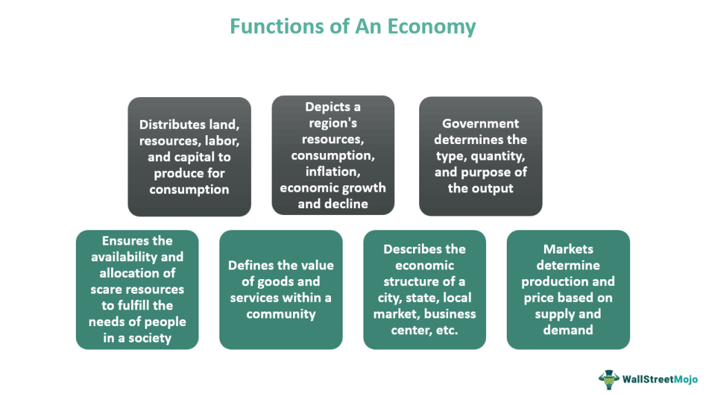

In today's rapidly evolving technological landscape, data-driven insights have become crucial in shaping industries and guiding decision-makers. The Economist Intelligence Unit (EIU) has emerged as a cornerstone in economic forecasting and advisory services, offering unparalleled support to entrepreneurs, financiers, and government officials aiming to make well-informed decisions. Founded in 1946, the EIU is recognized for its comprehensive economic and political analyses, which have become indispensable tools for entities worldwide seeking to navigate complex global markets.

The value of EIU's work lies in its ability to synthesize vast amounts of information into actionable insights that reveal economic and political trends. By doing so, the EIU enables stakeholders to anticipate changes, assess opportunities and risks, and ultimately make strategic decisions. This article investigates EIU's critical role in economic analysis and its interaction with algorithmic trading. As financial markets increasingly leverage advanced technologies, the integration of EIU's insights with algorithmic trading models is set to redefine the competitive dynamics of market forecasting and investment strategies.



## Table of Contents

## Understanding the Economist Intelligence Unit (EIU)

The Economist Intelligence Unit (EIU) is recognized for its extensive country, industry, and risk analyses, serving as a crucial resource to global businesses and policymakers since its inception in 1946. Established as the independent research division of the London-based Economist Group, the EIU offers a blend of both free and subscription-based reports, ensuring broad accessibility to its impactful analyses.

The EIU's primary strength lies in its comprehensive approach to economic forecasting and analysis. With a broad network of analysts and country specialists, the EIU provides detailed insights that are essential for understanding diverse market dynamics, regulatory landscapes, and macroeconomic trends. This global presence enables the EIU to offer finely-tuned assessments addressing both global shifts and localized nuances.

The organization employs a variety of methodologies to deliver its insights. Utilizing quantitative analyses and qualitative evaluations, the EIU examines and interprets political, social, and economic factors to forecast trends and assess risks. This multifaceted approach ensures users can access nuanced information that reflects the complexities of international markets.

By leveraging its extensive database and expert evaluations, the EIU aids businesses and governments in making informed decisions about market entry, investment opportunities, and strategic planning. Its reports serve as valuable guidance for understanding potential risks and rewards in unfamiliar markets, ultimately contributing to more informed and strategic global engagements.

## The Scope of EIU's Economic Analysis

The Economist Intelligence Unit (EIU) provides comprehensive economic analysis and forecasts for more than 205 countries, integrating an understanding of political, economic, and social trends. Their services are integral to global businesses and governments facing the challenges of rapidly changing economic environments.

EIU utilizes proprietary methodologies and advanced data modeling techniques to project future economic scenarios. These methodologies involve the application of econometric models, scenario planning, and comprehensive data analyses to produce reliable and accurate forecasts. Data modeling by EIU is a crucial element, empowering clients with insights into macroeconomic patterns and long-term market predictions. For example, econometric models are refined to capture complex interactions between various economic indicators, providing stakeholders with a solid basis for strategic planning. 

In terms of location benchmarking, EIU's assessments of geopolitical and socio-economic conditions are critical for market entry and investment decisions. Location benchmarking involves the comparison of potential market locations against a set of criteria relevant to a company's strategic goals. This process helps investors to identify opportunities and risks associated with distinct regions or countries. By leveraging tailored analyses that take into account regulatory environments, infrastructure quality, and labor market conditions, EIU aids clients in making informed decisions about where to invest or expand business operations.

Thus, EIU’s economic analysis offers a holistic perspective necessary for navigating the complex global economic landscape, catering to the multifaceted needs of its diverse clientele. With a strong emphasis on the intersection of qualitative and quantitative research, EIU's expert insights into economic conditions and trends remain indispensable for informed decision-making in a volatile world.

## Algorithmic Trading and EIU Economic Forecasts

Algorithmic trading has transformed the financial markets, using rigorous data analysis and complex algorithmic strategies to execute trades at speeds and frequencies that far exceed human capability. At the core of successful [algorithmic trading](/wiki/algorithmic-trading) is the quality and precision of the data that informs these strategies. The Economist Intelligence Unit (EIU) offers crucial economic analyses, providing the comprehensive data set that is immensely beneficial to algorithmic traders.

The EIU's economic analyses are distinguished by their depth and accuracy, offering predictive insights that help shape and hone trading algorithms. Through detailed forecasts and an understanding of macroeconomic and geopolitical developments, EIU provides algorithmic traders with the nuanced information needed to anticipate market movements. This is achieved through EIU's proprietary methodologies, which include data modeling and scenario analysis of over 205 countries. Such forecasts consider political, economic, and social trends, allowing traders to develop algorithms that can incorporate these variables into their trading logic.

Incorporating EIU's economic data into algorithmic trading systems can strengthen the predictive capabilities of trading algorithms. For instance, quantitative traders can use historical economic data and forecasts from the EIU as input variables in [machine learning](/wiki/machine-learning) models to predict future price movements. A simple linear regression model, a foundational approach in algorithmic trading, can illustrate how EIU data might be utilized:

```python
import numpy as np
from sklearn.linear_model import LinearRegression

# Example data: GDP growth rate as an independent variable and stock returns as a dependent variable
gdp_growth = np.array([[2.5], [3.0], [2.7], [3.2]])  # Hypothetical GDP growth rates
stock_returns = np.array([5, 7, 6, 8])  # Hypothetical stock returns

# Linear regression model
model = LinearRegression()
model.fit(gdp_growth, stock_returns)

# Predicting future stock returns based on anticipated GDP growth
predicted_returns = model.predict(np.array([[3.1]]))  # Forecasted GDP growth
print(predicted_returns)
```

Furthermore, the intersection of EIU's analytical insights and algorithmic trading signifies a growing synergy between conventional economic analyses and cutting-edge financial technologies. The comprehensive economic models provided by the EIU enable algorithmic traders to simulate various market conditions, further refining their strategies to handle market complexities. By integrating EIU insights, traders can enhance both the strategic edge and robustness of their algorithmic systems.

This symbiotic relationship highlights not just the dependence on EIU’s high-quality insights but also the potential for algorithmic trading to adapt dynamically to evolving market scenarios forecasted by the EIU. As the landscape of algorithmic trading evolves, this integration is expected to continue proving invaluable, fostering more sophisticated trading approaches and contributing to market efficiency and [liquidity](/wiki/liquidity-risk-premium).

## Benefits and Risks of Integrating EIU Data in Algo Trading

Integrating the Economist Intelligence Unit's (EIU) data into algorithmic trading platforms offers numerous benefits, including enhanced predictive accuracy and improved risk management. EIU's comprehensive economic analyses provide traders with data-driven insights crucial for developing robust trading strategies. The integration of these insights enables traders to capitalize on market trends and make informed decisions based on predictive models informed by EIU's extensive data sets.

One significant advantage of leveraging EIU's analytics is the potential for enhanced predictive accuracy. EIU’s detailed forecasts, covering political, economic, and social trends across over 205 countries, provide an enriched data landscape for algorithmic systems. By processing these forecasts, trading algorithms can generate more reliable predictions, enhancing decision-making processes. Algorithms can use statistical methods, such as regression analysis and machine learning techniques, to uncover patterns and correlations within the data, thereby refining trading models and strategies.

However, it is essential to acknowledge the inherent risks associated with relying on EIU data, primarily due to market [volatility](/wiki/volatility-trading-strategies) and unpredictable geopolitical events. While EIU provides valuable forecasts, the dynamic nature of global markets often presents challenges that exceed the scope of any predictive model. For instance, traders must be vigilant about black swan events, such as sudden political upheavals or economic crises, which can disrupt markets unexpectedly. Algorithmic models should be designed to accommodate such anomalies and minimize their impact on trading outcomes.

Furthermore, consistent application of EIU insights is crucial for developing robust algorithmic trading strategies. This requires continuous evaluation and adaptation of algorithms to ensure they remain effective under evolving market conditions. Traders should regularly update their models with the latest EIU data, employing a feedback loop to refine their strategies based on real-time market performance. This practice not only mitigates risks but also enhances the resilience and adaptability of the trading system.

In conclusion, while integrating EIU's data into algorithmic trading offers significant advantages, traders must exercise caution and maintain a proactive approach to risk management. By balancing the insights provided by EIU with an awareness of potential market uncertainties, traders can optimize their use of algorithmic systems and enhance their competitive edge in the complex environment of modern financial markets.

## Conclusion: The Synergistic Future

The collaboration between the Economist Intelligence Unit (EIU) and algorithmic trading systems is redefining the landscape of financial markets. This partnership leverages the EIU's robust economic data and analytics with advanced algorithmic trading technologies, maximizing the potential for accurate and real-time decision-making. As economic conditions become more dynamic and complex, integrating these two methodologies offers a strategic advantage.

Traditional economic analysis, as provided by the EIU, brings depth and historical perspective to market behaviors and trends. Combined with the rapid processing speed and precision of algorithmic trading systems, this creates a dynamic framework where data-driven strategies can be continuously refined. The ability to synthesize vast amounts of data into actionable trading strategies in near real-time can offer significant competitive advantages.

However, blending traditional economic insights with algorithmic capabilities is not without its challenges. The volatility of global markets, coupled with unpredictable geopolitical events, requires a system that is both adaptable and resilient. Traders and investors must maintain a rigorous evaluation process to ensure that trading algorithms can effectively interpret EIU's data within the evolving economic backdrop.

Opportunities abound as this synergy develops. Investors and traders equipped with these integrated systems can potentially enhance predictive accuracy and improve risk management. The convergence of these fields is likely to usher in a new era where market participants can navigate complexities with increased confidence and foresight. As the collaboration between the EIU and algorithmic trading continues to evolve, it promises a new level of sophistication and efficacy in market forecasting and execution.

This synthesis of traditional and advanced technologies presents a formidable toolset for tackling the challenges of the global economy. By harnessing these synergistic capabilities, market participants are better positioned to capitalize on emerging opportunities and mitigate risks in an increasingly interconnected world.

## References & Further Reading

[1]: Schober, B., & Myrseth, H. (2021). ["The Rise of Algorithmic Trading in Financial Markets: A Comprehensive Survey."](https://www.researchgate.net/publication/370658548_Trading_on_Autopilot_The_Rise_of_Algorithmic_Trading) arXiv.

[2]: Freund, Y., & Schapire, R. E. (1997). ["A Decision-Theoretic Generalization of On-Line Learning and an Application to Boosting."](https://www.sciencedirect.com/science/article/pii/S002200009791504X) Journal of Computer and System Sciences, 55(1), 119-139.

[3]: ["The Economist Intelligence Unit: Global Livability Index"](https://www.eiu.com/n/campaigns/global-liveability-index-2024/) by The Economist Intelligence Unit

[4]: Lopez de Prado, M. (2018). ["Advances in Financial Machine Learning."](https://www.amazon.com/Advances-Financial-Machine-Learning-Marcos/dp/1119482089) John Wiley & Sons.

[5]: Chan, E. P. (2009). ["Quantitative Trading: How to Build Your Own Algorithmic Trading Business."](https://github.com/ftvision/quant_trading_echan_book) John Wiley & Sons.