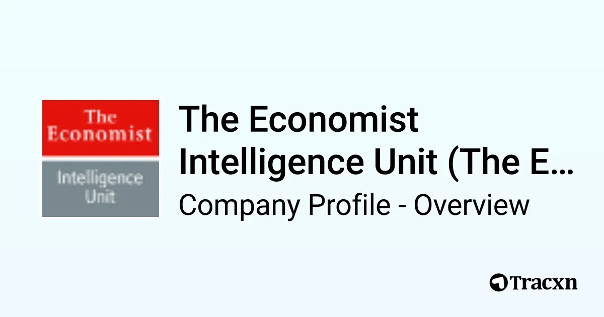

## Table of Contents

## What is the Economist Intelligence Unit (EIU)?

The Economist Intelligence Unit (EIU) is a part of The Economist Group, a British company known for its weekly newspaper, The Economist. The EIU provides research, analysis, and data on different countries and industries. It helps businesses, governments, and other organizations make smart decisions by giving them information about the world economy, politics, and more.

The EIU is famous for its reports and forecasts. They make predictions about how economies will grow, how politics will change, and what risks businesses might face. They also publish special reports, like the Democracy Index, which looks at how democratic countries are. Many people trust the EIU because it uses a lot of data and expert knowledge to help understand what might happen in the future.

## When was the Economist Intelligence Unit founded?

The Economist Intelligence Unit was started in 1946. It began as a way to give businesses and governments useful information about what was happening around the world. At that time, many countries were still recovering from World War II, and people needed good data to make plans for the future.

Over the years, the EIU has grown a lot. It now covers more than 200 countries and helps people understand things like how economies are doing, what risks businesses might face, and even how democratic countries are. The EIU is trusted because it uses a lot of data and expert knowledge to make its reports and predictions.

## Who owns the Economist Intelligence Unit?

The Economist Intelligence Unit is owned by The Economist Group. This is a company from the United Kingdom, and it is famous for its weekly newspaper called The Economist. The Economist Group started the EIU in 1946 to help businesses and governments understand what was happening around the world.

The Economist Group is a big company with many parts. Besides the EIU and The Economist newspaper, it also owns other businesses that provide information and data. The EIU is important to The Economist Group because it helps many people make smart decisions by giving them detailed reports and forecasts about different countries and industries.

## What are the main services provided by the EIU?

The Economist Intelligence Unit (EIU) offers several main services to help businesses, governments, and other organizations make smart decisions. One of their key services is providing detailed reports and forecasts about the world economy, politics, and industries. These reports help people understand how economies are doing, what might happen in the future, and what risks they might face. The EIU uses a lot of data and expert knowledge to make these reports, so people trust them to be accurate and helpful.

Another important service from the EIU is their special indexes and rankings. For example, they publish the Democracy Index, which looks at how democratic different countries are. They also have the Global Liveability Index, which ranks cities based on how good it is to live there. These indexes help people see how countries and cities compare to each other in different ways. The EIU also offers custom research and consulting services, where they can create special reports and analysis for specific needs of their clients.

## How does the EIU gather its data?

The Economist Intelligence Unit (EIU) gathers its data from many different places to make sure it is accurate and helpful. They use official [statistics](/wiki/bayesian-statistics) from governments and international organizations, like the World Bank and the United Nations. They also look at data from companies, industry reports, and financial markets. This helps them understand what is happening in different countries and industries around the world.

Besides official data, the EIU also talks to experts and people who know a lot about specific topics. They might interview economists, business leaders, or government officials to get their opinions and insights. This helps the EIU add more depth to their reports and forecasts. By combining all these different sources of information, the EIU can provide detailed and trustworthy analysis for their clients.

## What types of reports does the EIU produce?

The Economist Intelligence Unit (EIU) makes many kinds of reports to help people understand the world. They have country reports that look at how economies are doing in different countries. These reports talk about things like how fast the economy is growing, what risks businesses might face, and what the government is doing. They also have industry reports that focus on specific sectors, like technology or energy. These reports help people see what is happening in those industries and what might happen next.

The EIU also makes special indexes and rankings. One famous one is the Democracy Index, which checks how democratic different countries are. Another is the Global Liveability Index, which ranks cities based on how nice it is to live there. These indexes help people compare countries and cities in different ways. Besides these, the EIU offers custom research and consulting services. This means they can make special reports for clients who need information about something specific.

All these reports and indexes use a lot of data from different places. The EIU looks at official statistics, talks to experts, and uses information from companies and financial markets. This helps them make reports that are detailed and trusted by many people.

## How can businesses and governments use EIU data?

Businesses and governments can use EIU data to make smart decisions. For businesses, EIU reports help them understand how economies are doing in different countries. This can tell them where it might be good to start a new store or factory. The reports also talk about risks, like if a country might have political problems or if there could be a big change in the economy. By knowing these things, businesses can plan better and avoid problems. They can also use EIU's industry reports to see what is happening in their own sector, like technology or energy, and make plans based on that.

Governments can use EIU data to help make policies and plan for the future. The EIU's country reports give them a lot of information about their own economy and other countries too. This can help them decide on things like trade deals or how to help their economy grow. The EIU's special indexes, like the Democracy Index, can also show governments how they are doing compared to other countries. This can help them see where they need to improve or what they are doing well. By using all this data, governments can make better choices that help their people and their country.

## What is the EIU's Country Risk Service?

The EIU's Country Risk Service helps businesses and governments understand the risks they might face in different countries. It looks at things like how stable the government is, if there might be problems with paying back loans, and how safe it is to do business there. This service uses a lot of data and expert opinions to make sure the information is accurate and helpful. Businesses can use this service to decide if it is safe to start a new project or invest money in a certain country.

The Country Risk Service gives a clear picture of what risks are out there. It tells you about political risks, like if there might be a change in government or if there could be protests. It also talks about economic risks, like if the country might have trouble paying its debts or if the economy might shrink. By understanding these risks, businesses and governments can plan better and avoid problems. This service is very important because it helps people make smart choices about where to invest their time and money.

## How does the EIU forecast economic trends?

The Economist Intelligence Unit (EIU) forecasts economic trends by looking at a lot of different information. They use data from governments, international groups like the World Bank, and companies. They also talk to experts like economists and business leaders to get their opinions. By putting all this information together, the EIU can see patterns and make predictions about what might happen in the future. They look at things like how fast an economy is growing, what the government is doing, and what risks there might be.

The EIU uses special methods to make their forecasts. They use computer models that take in a lot of data and then guess what might happen next. These models help them see how different things, like changes in government or big events in the world, might affect the economy. By using these models and their expert knowledge, the EIU can make detailed reports that help businesses and governments plan for the future. People trust the EIU's forecasts because they are based on a lot of careful research and analysis.

## What role does the EIU play in global economic analysis?

The Economist Intelligence Unit (EIU) is very important in global economic analysis. It helps people understand what is happening in different countries and industries around the world. The EIU makes detailed reports and forecasts that tell businesses and governments about economic growth, risks, and what might happen in the future. They use a lot of data from different places, like government statistics and expert opinions, to make sure their information is accurate and helpful. This makes the EIU a trusted source for many people who need to make big decisions.

The EIU also makes special indexes, like the Democracy Index and the Global Liveability Index, which help compare countries and cities in different ways. These indexes give a clear picture of how democratic a country is or how good it is to live in a city. By providing all this information, the EIU helps businesses decide where to invest their money and helps governments make better policies. The EIU's work is important because it helps people all over the world understand the economy and make smart choices.

## How does the EIU's methodology ensure the accuracy of its predictions?

The Economist Intelligence Unit (EIU) makes sure its predictions are accurate by using a lot of different information. They look at data from governments, international organizations like the World Bank, and companies. They also talk to experts like economists and business leaders to get their opinions. By putting all this information together, the EIU can see patterns and make guesses about what might happen in the future. They look at things like how fast an economy is growing, what the government is doing, and what risks there might be. This careful research helps make their predictions more reliable.

The EIU also uses special computer models to help with their predictions. These models take in a lot of data and then guess what might happen next. They help the EIU see how different things, like changes in government or big events in the world, might affect the economy. By using these models and their expert knowledge, the EIU can make detailed reports that help businesses and governments plan for the future. People trust the EIU's predictions because they are based on a lot of careful research and analysis.

## What are some criticisms or limitations of the EIU's analyses?

Some people say the EIU's analyses might not always be perfect. One big problem is that they use a lot of data and expert opinions, but sometimes this data can be wrong or old. Also, experts can have different ideas about what might happen in the future. This means the EIU's predictions might not always be right. Another thing is that the EIU is based in the UK and might see the world more from a Western point of view. This can make their reports less useful for people in other parts of the world who might have different needs and ways of looking at things.

Another criticism is that the EIU's reports can be expensive. This means not everyone can use them, especially smaller businesses or people in poorer countries. Also, the EIU's special indexes, like the Democracy Index, can be hard to understand because they use a lot of different factors to make their rankings. Some people think these indexes might not show the whole picture of what is happening in a country or city. Even though the EIU tries to be accurate and helpful, these limitations can make their analyses less useful for some people.

## References & Further Reading

[1]: Schober, B., & Myrseth, H. (2021). ["The Rise of Algorithmic Trading in Financial Markets: A Comprehensive Survey."](https://www.researchgate.net/publication/370658548_Trading_on_Autopilot_The_Rise_of_Algorithmic_Trading) arXiv.

[2]: Freund, Y., & Schapire, R. E. (1997). ["A Decision-Theoretic Generalization of On-Line Learning and an Application to Boosting."](https://www.sciencedirect.com/science/article/pii/S002200009791504X) Journal of Computer and System Sciences, 55(1), 119-139.

[3]: ["The Economist Intelligence Unit: Global Livability Index"](https://www.eiu.com/n/campaigns/global-liveability-index-2024/) by The Economist Intelligence Unit

[4]: Lopez de Prado, M. (2018). ["Advances in Financial Machine Learning."](https://www.amazon.com/Advances-Financial-Machine-Learning-Marcos/dp/1119482089) John Wiley & Sons.

[5]: Chan, E. P. (2009). ["Quantitative Trading: How to Build Your Own Algorithmic Trading Business."](https://github.com/ftvision/quant_trading_echan_book) John Wiley & Sons.