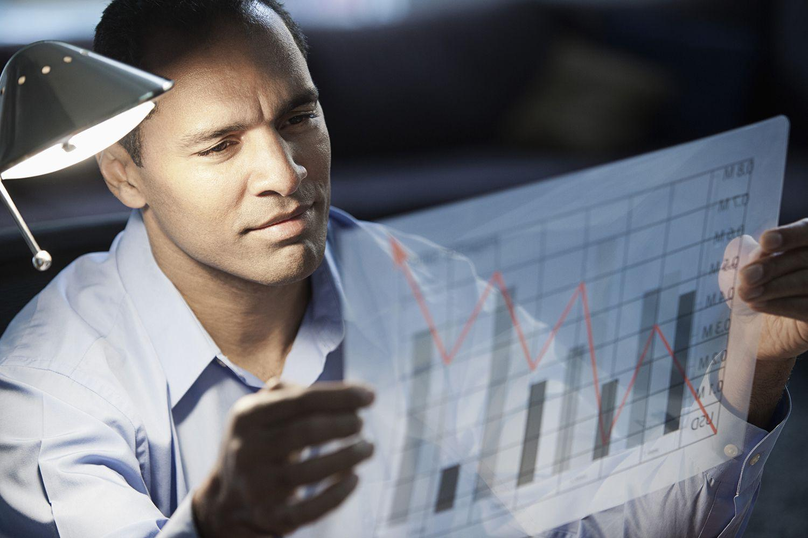

The global economy is a multifaceted and interconnected system, characterized by a wide array of influences that stem from domestic and international sources. These influences span geopolitical events, technological advancements, trade policies, and financial innovations, which collectively shape the economic landscape. In navigating this complex environment, economists hold a critical position. They analyze trends, assess economic health, and develop models that provide valuable insights into potential future scenarios. Economists serve not only as academicians but also as advisors to businesses and policymakers, aiding them in making informed decisions that promote economic stability and growth.

Recently, a technological phenomenon that has markedly changed the face of financial markets is algorithmic trading, often referred to as algo trading. This approach leverages computer algorithms to automate trading decisions, allowing for rapid execution and strategic exploitation of market opportunities. Algo trading has grown to become a significant force within global financial markets due to its ability to process large datasets swiftly and execute trades at a speed unattainable by human traders.

In exploring the impact of algorithmic trading, it is imperative to consider its economic influence, the facilitatory role of economists, and the broader ramifications on the financial ecosystem. By examining these components, we can attain a better understanding of the dynamic and ever-evolving nature of global economics. The integration of algorithmic trading into the financial domain not only fosters innovation but also necessitates adaptive responses from economic theorists, practitioners, and regulators to harness its potential while mitigating associated risks.

## Table of Contents

## The Economic Influence of Algorithmic Trading

Algorithmic trading, often referred to as algo trading, has significantly reshaped how financial markets function. By employing complex algorithms and high-speed computational resources, traders can execute large volumes of trades with unprecedented speed, precision, and efficiency. This transformative approach has brought about several economic benefits, primarily through increased market liquidity and reduced transaction costs, which serve to benefit both individual and institutional investors.

The provision of liquidity is one of the critical advantages of algorithmic trading. Liquidity refers to the ease with which assets can be bought or sold in the market without causing significant price changes. With algorithmic trading, the ability to execute trades at high velocities allows for more continuous and immediate matching of buy and sell orders. This increased turnover promotes a more liquid environment, enabling market participants to transact more efficiently and at lower costs. The reduction in transaction costs is attributed to the minimized bid-ask spreads—the difference between the buying and selling price—which is a direct result of high liquidity and rapid trade execution.

Despite these advantages, algorithmic trading also introduces potential risks, notably market manipulation and flash crashes. Market manipulation can occur when market players use their technological prowess to create artificial price movements, misleading other investors. Flash crashes, on the other hand, are sudden, severe drops in security prices, driven by rapid and automated trading reactions that can trigger a cascade of algorithm-driven sell orders. An example of this was the May 6, 2010, flash crash, where the Dow Jones Industrial Average experienced a precipitous drop over a matter of minutes, only to recover shortly after.

The impact of [algorithmic trading](/wiki/algorithmic-trading) extends beyond individual transactions, influencing market dynamics and the broader economy. The practice has altered price discovery processes—how asset prices are set based on supply and demand dynamics. With algorithms executing trades far faster than any human trader, markets have become more efficient in adjusting to new information. However, the role of human traders and the intuitive insights they provide are diminishing, raising concerns about the potential for over-reliance on automated systems.

The debate persists regarding whether algorithmic trading stabilizes or destabilizes financial markets. Proponents argue that increased [liquidity](/wiki/liquidity-risk-premium) and efficiency contribute to market stability, while critics point to instances of [volatility](/wiki/volatility-trading-strategies) caused by mechanical trading frenzies. Moreover, the complexity of these algorithms can obscure intentions, making it challenging for regulators to monitor and mitigate potentially harmful trading behaviors.

Ultimately, algorithmic trading's economic influence is multifaceted, providing substantial benefits while also posing significant risks. As financial markets continue to evolve, understanding and managing these dynamics will be crucial for stakeholders aiming to balance innovation with stability.

## The Role of Economists in Financial Markets

Economists hold a pivotal position in financial markets, offering insights into market trends, consumer behavior, and macroeconomic patterns that inform decision-making for policymakers, businesses, and investors. Their analytical capabilities enable them to interpret complex datasets and identify patterns that guide economic decisions and strategic planning. In financial markets, their expertise is not only valuable for understanding existing dynamics but also critical for navigating potential challenges and opportunities.

Economists contribute significantly to the design and refinement of trading algorithms, ensuring these models accurately reflect economic theories and real-world conditions. Trading algorithms are mathematical models that automate trading decisions based on predefined criteria. Economists integrate economic indicators, statistical methods, and financial theories to craft these algorithms, enhancing their robustness and alignment with market realities. For example, they may incorporate variables such as interest rates, inflation data, and GDP growth rates into predictive models to optimize trading strategies.

With the increasing prevalence of algorithmic trading, economists must adapt traditional models and expectations. Traditional economic models often emphasize human decision-making processes; however, the automation of trading through algorithms necessitates a reevaluation of these models. Economists need to consider the speed and scale at which algorithms operate, as well as their impact on market liquidity and volatility.

Economists also influence the development of algorithms by integrating behavioral economics and psychological insights into models. This involves recognizing that markets are influenced not only by rational factors but also by irrational behaviors, which can be more easily modeled and predicted through sophisticated algorithms. Hence, economists work alongside data scientists and computer programmers to create algorithms that account for both rational and irrational elements of market behavior.

Algorithmic trading strategies often rely on a combination of quantitative analysis and economic theory. Economists play a vital role by providing the theoretical foundation on which algorithms are constructed. For instance, the Efficient Market Hypothesis (EMH), which posits that asset prices fully reflect all available information, forms a basis for developing strategies that capitalize on market inefficiencies. Economists contribute by refining these concepts to better suit the fast-paced, machine-driven trading environment.

Through continuous research and collaboration with technology specialists, economists help to innovate new strategies in algorithmic trading. This collaboration fosters a dynamic environment where economic theories are continuously tested and validated in real-time market scenarios. By keeping abreast with technological advancements and market developments, economists ensure that their contributions to algorithmic trading remain relevant and impactful. 

In summary, economists are integral to the operation and advancement of financial markets. Their insights and analyses support critical decision-making processes, while their role in algorithmic trading fosters the development of sophisticated trading strategies that align with economic realities. As algorithmic trading continues to reshape financial markets, the role of economists will evolve, requiring ongoing adaptation and innovation to meet new challenges and opportunities.

## Impact of Algorithmic Trading on Economic Theory

Algorithmic trading has brought a paradigm shift in economic theory, particularly challenging conventional notions of market efficiency and human behavior. Traditional economic models, such as the Efficient Market Hypothesis (EMH), posit that asset prices reflect all available information, ensuring that markets are efficient. However, the advent of algorithmic trading introduces complexities that question the robustness of such models.

**Market Efficiency and Price Discovery**

Algorithmic trading has enhanced the speed and [volume](/wiki/volume-trading-strategy) of transactions, significantly affecting market efficiency and price discovery mechanisms. The algorithms used are capable of processing and analyzing vast quantities of data, identifying patterns, and executing trades in milliseconds. This high-frequency trading challenges the traditional view of market efficiency by arguably leading to an information deluge where price signals might become distorted. Issues such as over-trading and latency [arbitrage](/wiki/arbitrage) can introduce inefficiencies, suggesting that new models might be necessary to account for these factors.

For instance, consider a simplified model of price adjustments typically represented by the equation:

$$
P_{t+1} = P_t + \alpha (I_t - P_t) + \epsilon_t
$$

Where:
- $P_{t+1}$ is the asset price at time $t+1$
- $I_t$ is the information set available at time $t$
- $\alpha$ is the speed of adjustment
- $\epsilon_t$ is a random error term

In the context of algorithmic trading, this model can be modified to include terms that represent the tactical actions of algorithms, potentially affecting $\alpha$ and introducing a new set of information dynamics.

**Redefining Economic Theories**

As technology advances, economists are increasingly incorporating advanced computational and data science techniques into theoretical models. Machine learning algorithms, for instance, provide insights into behavioral patterns not previously considered. These tools help refine classical models by offering enhanced predictive capabilities that take into account non-linear patterns and interactions unforeseen by human analysts.

**New Theoretical Frameworks**

The rise of algorithmic trading necessitates the development of novel frameworks which fuse computational techniques with economic theory. These frameworks address the stochastic and dynamic nature of markets dominated by algorithmic traders. By integrating [machine learning](/wiki/machine-learning), game theory, and network analysis, economists are crafting comprehensive models to better understand and predict market behaviors under the influence of automated trading systems.

**Conclusion**

In summary, algorithmic trading is pushing the boundaries of traditional economic theories, prompting a reassessment of concepts such as market efficiency and human behavior within financial systems. Economists are innovating by adopting advanced computational methods and introducing new theoretical perspectives to better grasp the complexities introduced by algorithmic trading. This evolving landscape of economic theory underscores the need for continuous adaptation and research to ensure robust and applicable models in a rapidly changing market environment.

## Challenges and Opportunities in Economic Policy

Algorithmic trading, defined as the use of computer algorithms to automate trading strategies, poses both challenges and opportunities for economic policy. The rapid technological advancements inherent in algorithmic trading necessitate a nuanced approach to regulation, balancing the need for robust oversight with the potential benefits of innovation. 

### Challenges for Economic Policy

A primary challenge for regulators is ensuring market fairness and transparency. Algorithmic trading can lead to market manipulation tactics, such as spoofing, where misleading buy or sell orders are placed to influence market dynamics without the intent of execution. Addressing this requires developing sophisticated monitoring tools that can detect such patterns and enforce regulations in real-time.

Moreover, algorithmic trading introduces the risk of flash crashes—sudden, deep, and drastic price declines in a market. These events can destabilize financial systems and erode investor confidence. Traditional regulatory frameworks often struggle to keep pace with the technological speed and complexity of algorithmic transactions. Consequently, regulators must enhance their technological and analytical capabilities to mitigate these risks effectively.

### Opportunities for Economic Policy

Despite these challenges, algorithmic trading offers opportunities to improve market efficiency. By facilitating more precise pricing and greater liquidity, algorithmic trading can reduce transaction costs for all market participants. Policymakers can harness these benefits by promoting transparency and competition among trading platforms, ensuring a fair playing ground where innovation thrives without compromising market integrity.

Additionally, informed regulation can reduce systemic risks. The implementation of circuit breakers, for example, can prevent extreme volatility by temporarily halting trading during significant price falls. Such mechanisms protect against automated trading systems that might exacerbate downward spirals during financial turmoil.

### Policy Recommendations

To respond effectively to the rise of algorithmic trading, several policy adaptations are necessary:

1. **Enhanced Surveillance and Reporting**: Regulators should leverage advanced analytics and machine learning models to monitor and analyze high-frequency trading data. This technology can help in identifying abusive trading patterns swiftly.

2. **Collaboration with Technologists**: Close partnerships between regulatory bodies and technology firms can foster environments where innovation leads to beneficial outcomes. For instance, adopting blockchain technology for trade verification could enhance transparency and reduce manipulation.

3. **Adaptive Regulatory Frameworks**: Creating regulations that are flexible and can evolve with technological changes is crucial. Sandbox environments may offer safe spaces for testing new trading algorithms and their impacts on market fairness, allowing policymakers to understand potential risks before full integration.

4. **International Cooperation**: Given the global nature of financial markets, international regulatory cooperation ensures cohesive policies across borders. This synchronization helps prevent regulatory arbitrage, where firms exploit lenient regulations in different jurisdictions.

### Conclusion

The challenges and opportunities presented by algorithmic trading require a sophisticated and forward-thinking regulatory approach. By adopting adaptive regulatory frameworks that integrate technological advancements, policymakers can ensure the stability and efficiency of financial markets. Through balanced oversight, algorithmic trading's potential benefits can be harnessed to foster economic growth while mitigating associated risks. The evolving economic landscape demands that regulators, economists, and technologists collaborate closely to safeguard and enhance the integrity of global markets.

## Conclusion

The interplay between economic influence, the role of economists, and algorithmic trading continues to shape modern financial ecosystems. As global financial markets become increasingly sophisticated, the integration of algorithmic trading has both challenged and enhanced traditional economic models. This symbiosis necessitates a deeper understanding of various market forces and the adaptation of strategies by stakeholders to bolster market stability and foster economic growth.

Understanding these intertwined elements is crucial for stakeholders, including policymakers, investors, and economists. A nuanced comprehension allows for the development of robust strategies that not only aim for optimal financial returns but also ensure the stability and sustainability of economic systems. Algorithmic trading, with its capacity for rapid decision-making and execution, highlights the necessity for strategies that account for both human and machine-driven market activities.

Despite the challenges posed by algorithmic trading—such as risks of market manipulation and the potential for systemic disruptions—the potential benefits of integrating advanced technologies into financial markets are significant. These benefits include improved liquidity, reduced transaction costs, and the possibility of eliminating inefficiencies in market operations. As a result, the appropriate application of technology can lead to more efficient market functioning and better outcomes for all participants.

Continued research and adaptive policymaking are key to responsibly leveraging the advancements inherent in algorithmic trading. Policymakers must ensure that regulations are sufficiently robust to protect market integrity while simultaneously not inhibiting beneficial innovations. This requires a delicate balance, grounded in constant evaluation of existing regulations and a willingness to embrace new models of market governance.

As the economic landscape evolves, staying informed and prepared for changes will be essential for all market participants. Adaptability and foresight will remain crucial as emerging trends and technologies continue to redefine the financial sector. Ultimately, this ongoing evolution represents both an opportunity and a challenge to cultivate a resilient economic framework that thrives amid rapid technological advancements.

## References & Further Reading

[1]: Bergstra, J., Bardenet, R., Bengio, Y., & Kégl, B. (2011). ["Algorithms for Hyper-Parameter Optimization."](https://papers.nips.cc/paper/4443-algorithms-for-hyper-parameter-optimization) Advances in Neural Information Processing Systems 24.

[2]: ["Advances in Financial Machine Learning"](https://www.amazon.com/Advances-Financial-Machine-Learning-Marcos/dp/1119482089) by Marcos Lopez de Prado

[3]: ["Evidence-Based Technical Analysis: Applying the Scientific Method and Statistical Inference to Trading Signals"](https://www.amazon.com/Evidence-Based-Technical-Analysis-Scientific-Statistical/dp/0470008741) by David Aronson

[4]: ["Machine Learning for Algorithmic Trading"](https://github.com/stefan-jansen/machine-learning-for-trading) by Stefan Jansen

[5]: ["Quantitative Trading: How to Build Your Own Algorithmic Trading Business"](https://books.google.com/books/about/Quantitative_Trading.html?id=j70yEAAAQBAJ) by Ernest P. Chan