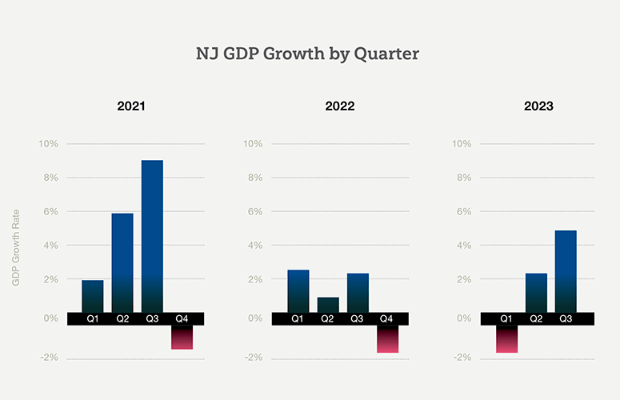

## Table of Contents

## What are the primary industries contributing to New Jersey's economy?

New Jersey's economy is supported by many different industries. The biggest one is pharmaceuticals and life sciences. Many big companies like Johnson & Johnson and Merck have their headquarters in New Jersey. These companies make medicines and other health products that help people all over the world. New Jersey is called the "Medicine Chest of the World" because of this.

Another important industry in New Jersey is finance and insurance. Many people in New Jersey work in banks, insurance companies, and other financial services. Cities like Jersey City and Newark are home to many of these businesses. This industry helps the economy by creating jobs and bringing money into the state.

Tourism and hospitality also play a big role in New Jersey's economy. The state has many popular places to visit, like the Jersey Shore and Atlantic City. People come from all over to enjoy the beaches, casinos, and other attractions. This brings in a lot of money and helps support many local businesses.

## How has New Jersey's GDP grown over the past decade?

Over the past ten years, New Jersey's GDP has grown steadily. From 2013 to 2023, the state's economy has seen an overall increase in its GDP. In 2013, New Jersey's GDP was about $550 billion. By 2023, it had grown to around $700 billion. This growth shows that the state's economy has been doing well, even though there have been some ups and downs along the way.

One big reason for this growth is the strong performance of industries like pharmaceuticals, finance, and tourism. These sectors have helped drive the economy forward. However, there was a dip in 2020 due to the COVID-19 pandemic, which affected many businesses and led to a temporary decrease in GDP. But since then, New Jersey has bounced back and continued to grow. This shows that the state's economy is resilient and able to recover from challenges.

## What role does the pharmaceutical industry play in New Jersey's economy?

The pharmaceutical industry is a big part of New Jersey's economy. It is one of the main reasons why New Jersey is called the "Medicine Chest of the World." Many large pharmaceutical companies like Johnson & Johnson and Merck have their headquarters in New Jersey. These companies make a lot of medicines and health products that help people all over the world. The industry creates many jobs and brings a lot of money into the state. This helps the economy grow and supports many other businesses in New Jersey.

The pharmaceutical industry also helps other parts of New Jersey's economy. For example, it creates jobs in areas like research, manufacturing, and distribution. These jobs help people earn money, which they can then spend on things like food, housing, and entertainment. This spending helps other businesses in the state. Also, the industry attracts many smart people to New Jersey, which helps make the state a leader in science and technology. Overall, the pharmaceutical industry is very important for New Jersey's economy and helps make the state a great place to live and work.

## How significant is the tourism industry to New Jersey's economic output?

The tourism industry is very important for New Jersey's economy. It brings in a lot of money every year. People come from all over to visit places like the Jersey Shore and Atlantic City. They spend money on hotels, restaurants, and attractions, which helps many local businesses. In 2022, tourism in New Jersey generated about $45 billion. This money helps create jobs and supports the state's economy.

Tourism also helps other parts of New Jersey's economy. When tourists visit, they spend money that helps businesses like shops and restaurants. This spending creates jobs and helps the economy grow. For example, people working in hotels, at the beach, or in casinos all benefit from tourism. Overall, tourism is a big part of what makes New Jersey's economy strong and healthy.

## What are the major exports from New Jersey and how do they impact the state's economy?

New Jersey's major exports include pharmaceuticals, chemicals, and machinery. These products are made by big companies in the state and sent all over the world. The pharmaceutical industry is especially important because New Jersey is known as the "Medicine Chest of the World." Companies like Johnson & Johnson and Merck make a lot of medicines that help people everywhere. When these products are exported, it brings a lot of money into New Jersey.

Exporting these goods is good for New Jersey's economy because it creates jobs and brings in money. When companies export their products, they need workers to make, package, and ship them. This means more jobs for people in New Jersey. The money from exports also helps the state's economy grow. It can be used to improve schools, roads, and other things that make New Jersey a nice place to live. Overall, exports are a big part of what makes New Jersey's economy strong.

## How does New Jersey's economy compare to other states in the U.S. in terms of GDP per capita?

New Jersey's economy is doing pretty well when you look at GDP per capita compared to other states in the U.S. GDP per capita means how much money the state makes divided by the number of people living there. In 2022, New Jersey had a GDP per capita of around $70,000. This is higher than the national average, which was about $63,000. So, New Jersey is doing better than many other states in terms of how much money each person is making.

Some states have higher GDP per capita than New Jersey. For example, states like Massachusetts and New York have even higher numbers because they have big cities with a lot of businesses. But New Jersey still does very well. It's in the top ten states for GDP per capita. This shows that the economy in New Jersey is strong, and people there are making more money than in many other parts of the country.

## What economic policies has New Jersey implemented to foster industry growth?

New Jersey has put in place several economic policies to help industries grow. One big policy is giving tax breaks to businesses. This means that companies can pay less in taxes if they move to New Jersey or expand there. These tax breaks are meant to attract big companies, like those in the pharmaceutical and tech industries, to come and create jobs. Another policy is investing in education and training programs. The state wants to make sure people have the skills they need to work in growing industries. By doing this, New Jersey can have a workforce that is ready to help businesses succeed.

The state also focuses on improving infrastructure to help industries grow. This includes building better roads, bridges, and public transportation systems. Good infrastructure makes it easier for businesses to move their products and for workers to get to their jobs. New Jersey also works on making the process of starting a business easier. They have programs to help new businesses get off the ground and grow. All these policies together help make New Jersey a good place for industries to thrive and create more jobs for people.

## How have technological advancements influenced the leading industries in New Jersey?

Technological advancements have had a big impact on the leading industries in New Jersey, especially in the pharmaceutical sector. New technology has made it easier and faster for companies to do research and develop new medicines. They can now use computers to test new drugs before they even start making them. This saves a lot of time and money. Also, new technology helps with making medicines. Machines can now do a lot of the work that people used to do, which makes the process quicker and less expensive. This has helped New Jersey's pharmaceutical industry stay strong and grow.

In the finance and insurance industry, technology has also made a big difference. Many banks and insurance companies now use computers and the internet to do their work. This means they can serve more customers and do it faster. People can now do things like check their bank accounts or buy insurance online, which is much easier than going to a bank or an office. This has helped the finance and insurance industry in New Jersey grow because they can reach more people and do more business. Overall, technology has helped make these leading industries in New Jersey stronger and more successful.

## What are the current trends in employment within New Jersey's key sectors?

In New Jersey, the pharmaceutical and life sciences sector is seeing steady job growth. Many big companies like Johnson & Johnson and Merck are always looking for more people to work in research, manufacturing, and other areas. The use of new technology is making these jobs more important, as companies need skilled workers to keep up with the latest advancements. This sector is a big part of why New Jersey's economy is doing well, and it continues to create good jobs for people.

The finance and insurance industry in New Jersey is also growing, but it's changing a lot because of technology. More jobs are being created in areas like data analysis and cybersecurity, as banks and insurance companies need people who can work with computers and the internet. At the same time, some traditional jobs are going away because machines can do them now. Overall, this industry is still a big source of jobs, but the kinds of jobs are different from what they used to be.

Tourism and hospitality in New Jersey are bouncing back after the challenges of the COVID-19 pandemic. More people are visiting places like the Jersey Shore and Atlantic City, which means more jobs in hotels, restaurants, and other tourist spots. The industry is also using technology to improve the visitor experience, like online booking systems and digital marketing. This helps create new kinds of jobs in areas like digital marketing and customer service.

## How does New Jersey's infrastructure support its economic activities?

New Jersey's infrastructure plays a big role in helping its economy grow. The state has a lot of highways, bridges, and tunnels that make it easy for people and goods to move around. For example, the New Jersey Turnpike and the Garden State Parkway are important roads that connect different parts of the state and help businesses get their products to customers quickly. Also, New Jersey has one of the busiest ports in the country, the Port of New York and New Jersey. This port helps companies export their goods all over the world, which brings a lot of money into the state.

Public transportation is another important part of New Jersey's infrastructure. The state has a good system of trains and buses that help people get to work easily. This is especially important for big cities like Newark and Jersey City, where many people work in finance, insurance, and other industries. Good public transportation means that workers can get to their jobs without spending a lot of time stuck in traffic. This helps businesses run smoothly and keeps the economy strong. Overall, New Jersey's infrastructure makes it easier for businesses to operate and for people to work, which helps the state's economy grow.

## What challenges does New Jersey face in maintaining and growing its GDP?

New Jersey faces several challenges in keeping its GDP growing. One big challenge is the cost of living. New Jersey is one of the most expensive places to live in the United States. High housing costs and taxes can make it hard for businesses to attract and keep workers. If people can't afford to live in New Jersey, they might move to other states where it's cheaper. This can hurt the economy because businesses need good workers to grow and make money.

Another challenge is the need to keep up with new technology. Industries like pharmaceuticals and finance are always changing, and they need the latest technology to stay competitive. This means New Jersey has to invest a lot of money in things like research and development, and in training people to use new technology. If the state doesn't keep up, these important industries might move to other places where they can get the technology and workers they need. This would be bad for New Jersey's economy because these industries bring in a lot of money and create a lot of jobs.

## How do demographic changes in New Jersey affect its economic landscape?

Demographic changes in New Jersey have a big impact on its economy. The state is becoming more diverse, with more people from different backgrounds moving in. This means there are more workers from different cultures and with different skills. This diversity can help businesses grow because they can hire people who understand different markets and customers. For example, a company might be able to sell more products if it has workers who speak different languages and understand different cultures. But it also means that businesses need to be ready to work with a more diverse group of people, which can be a challenge if they're not used to it.

Another big demographic change in New Jersey is that the population is getting older. More people are retiring, which means there are fewer young workers to take their places. This can be a problem for the economy because businesses need young workers to keep growing. Older people might also need more healthcare and other services, which can cost a lot of money. But it can also be good for the economy because it creates jobs in areas like healthcare and services for older people. Overall, these demographic changes mean that New Jersey's economy has to adapt to new challenges and opportunities.

## References & Further Reading

[1]: Saxenian, A. (1994). ["Regional Advantage: Culture and Competition in Silicon Valley and Route 128."](https://www.jstor.org/stable/j.ctvjnrsqh) Harvard University Press.

[2]: Hollingsworth, J. R. (2000). ["Doing Institutional Analysis: Implications for the Study of Innovations."](https://www.jstor.org/stable/pdf/4177365.pdf) Review of International Political Economy, 7(4), 595-644.

[3]: Segerstrom, P. S. (1991). ["Innovation, Imitation, and Economic Growth."](https://www.jstor.org/stable/2937781) Journal of Political Economy, 99(4), 807-827.

[4]: ["Economic Geography: A Contemporary Introduction"](https://www.amazon.com/Economic-Geography-A-Contemporary-Introduction/dp/1119389550) by Neil Coe, Philip Kelly, and Henry W. C. Yeung

[5]: ["Algorithmic Trading and DMA: An Introduction to Direct Access Trading Strategies"](https://www.amazon.com/Algorithmic-Trading-DMA-introduction-strategies/dp/0956399207) by Barry Johnson

[6]: ["High-Frequency Trading: A Practical Guide to Algorithmic Strategies and Trading Systems"](https://www.ahmetbeyefendi.com/wp-content/uploads/2020/07/High-Frequency-Trading-Irene-Aldridge.pdf) by Irene Aldridge

[7]: ["Pharmaceutical and Medical Device Innovations"](https://www.coursera.org/learn/pharma-medical-device-innovations) by Vijay Kumar

[8]: ["Global Pharmaceuticals: Ethics, Markets, Practices"](https://www.jstor.org/stable/j.ctv11cw7qd) edited by Adriana Petryna, Andrew Lakoff, and Arthur Kleinman