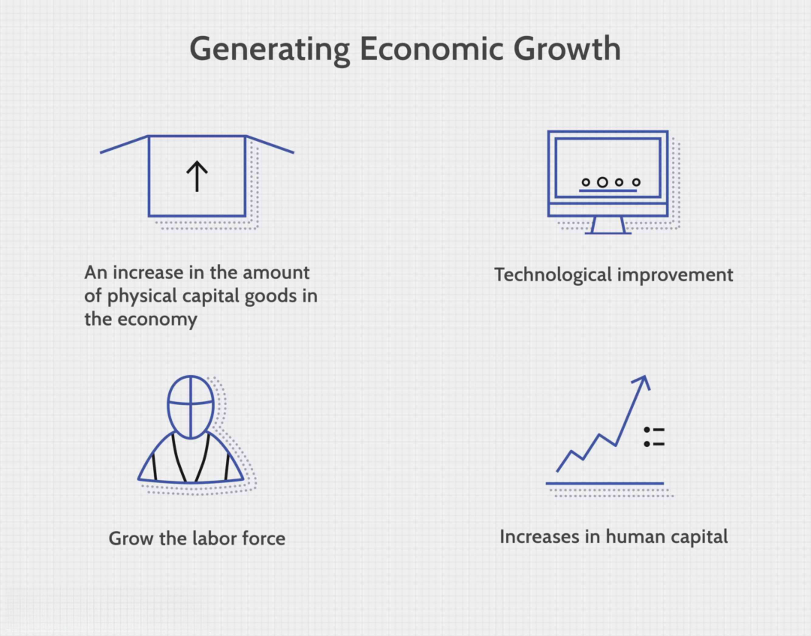

New Jersey plays a prominent role in the U.S. economy, holding the position of the ninth-largest GDP among all states. This economic strength is a result of its varied industrial base, which encompasses key sectors such as pharmaceuticals, finance, manufacturing, technology, and logistics. Pharmaceuticals, in particular, are a standout sector, with the presence of major companies like Johnson & Johnson and Merck & Co. driving innovation and growth. The state's financial services sector also significantly contributes to its GDP, with its proximity to New York City enhancing its attractiveness to financial firms. Algorithmic trading has emerged as a transformative force within this sector, providing a technological edge that bolsters competitiveness in securities and commodities markets.

In the manufacturing and logistics realms, New Jersey capitalizes on its strategic location and infrastructure, which positions it as a crucial transportation and distribution hub. This feature attracts a myriad of industries that rely on robust supply chain networks. Furthermore, the technology sector in New Jersey continues to be a critical component of its economic framework despite facing challenges, fueling job creation and economic development.

By examining these diverse factors, we gain comprehensive insights into the mechanics of New Jersey's GDP growth and its economic sustainability. This understanding not only highlights the current strengths of the state's economy but also points to potential future trends and opportunities.

## Table of Contents

## Overview of New Jersey's Economy

New Jersey ranks as one of the wealthiest states in the United States, characterized by a high median household income that underscores its economic prosperity. This affluence is bolstered by its strategic geographical position near New York City, offering proximity to the financial and commercial hub, thus attracting diverse industries that benefit from an accessible, skilled workforce and advanced infrastructure.

In 2023, New Jersey's economy demonstrated its vibrancy by contributing approximately $663.9 billion to the U.S. GDP. This significant contribution underscores the robust nature of its multifaceted economic sectors. The state's economy is supported by a plethora of industries, with major inputs from pharmaceuticals, financial services, technology, manufacturing, and logistics. Each of these sectors brings unique strengths and resources, thereby enhancing the state's economic profile.

The GDP growth in New Jersey is fueled by its advanced industrial sector capabilities and its commitment to fostering an environment conducive to business and innovation. Accessibility to a dense consumer market, coupled with logistical advantages, enhances the state's economic competitiveness. Moreover, New Jersey's commitment to continual investments in infrastructure, such as transportation and technology, lays a strong foundation for sustained economic growth. These efforts ensure the state remains a preferred locale for industries aiming for strategic advantages in scale and efficiency. Such economic dynamics categorize New Jersey as not just a participant but a leader in the national economy, driving key trends and benchmarking economic advancement.

## Pharmaceuticals and Life Sciences

New Jersey's pharmaceutical industry stands as a pillar of innovation and expertise, [earning](/wiki/earning-announcement) global recognition for its contributions to health sciences. The state serves as a base for several major pharmaceutical companies, notably Johnson & Johnson and Merck & Co., which play a crucial role in the state's economic growth. From 2015 to 2020, the pharmaceutical and life sciences sector in New Jersey expanded by approximately 19.9%, reflecting its robust development and capacity for innovation.

The presence of these major corporations is supported by a rich ecosystem of teaching hospitals, research institutions, and clinical trials. Institutions such as Rutgers University and Princeton University are integral to this ecosystem, offering cutting-edge research that bolsters the pharmaceutical sector. These entities collaborate closely with industry leaders, fostering innovation through partnerships and research initiatives.

In addition, New Jersey hosts a concentration of clinical trial sites, contributing to the rapid advancement of medical research and development. The state's strategic location, combined with its highly educated workforce, enhances its attractiveness for life sciences endeavors. This synergy between academia, industry, and clinical research creates a dynamic environment that propels the pharmaceutical industry forward.

Moreover, the state's commitment to supporting the life sciences is evident through policy initiatives and economic incentives designed to attract and retain leading companies. Tax incentives and grants are often provided to encourage research and development activities, further nurturing the sector's growth.

Overall, New Jersey's pharmaceutical industry is a testament to the state's capacity for innovation and its strategic importance within the global life sciences community. The industry's continued expansion is critical to New Jersey's economic health, providing employment opportunities and driving technological advancements in health care.

## Financial Services and Algorithmic Trading

The financial services sector stands as a crucial pillar of New Jersey's economic structure, significantly contributing to its Gross Domestic Product (GDP). New Jersey's strategic proximity to New York City, the financial capital of the world, combined with its high-density population, positions it as an attractive location for financial firms. This geographical advantage not only provides access to a vast pool of skilled professionals but also offers connectivity to global financial markets, enhancing the state's appeal among businesses seeking a competitive edge.

Algorithmic trading, a transformative force within the finance industry, has further solidified New Jersey's prominence in this sector. Algorithmic trading involves the use of complex algorithms to automate trading processes, allowing for faster and more efficient transactions in securities and commodities markets. This method leverages mathematical models and statistical analyses to execute trades at optimal times, minimizing human intervention and maximizing returns within fractions of a second.

The technological infrastructure essential for [algorithmic trading](/wiki/algorithmic-trading)—high-speed connectivity, state-of-the-art data centers, and proximity to financial exchanges—are readily available in New Jersey. Many financial firms capitalize on the state's robust internet infrastructure and low-latency communication lines to gain an advantage in high-frequency trading ([HFT](/wiki/high-frequency-trading-strategies)), an advanced subset of algorithmic trading characterized by rapid trade execution.

Moreover, the presence of leading financial institutions and technology companies in New Jersey fosters a collaborative environment for innovation in trading algorithms. These developments provide local firms with the tools necessary to execute complex trading strategies efficiently, enhancing competitiveness in the global market. As of recent years, the adoption of [machine learning](/wiki/machine-learning) models and [artificial intelligence](/wiki/ai-artificial-intelligence) in developing trading algorithms has further propelled advancements in this field.

Looking towards the future, algorithmic trading is expected to expand within New Jersey with the continued integration of cutting-edge technologies such as quantum computing and big data analytics. These innovations hold the potential to revolutionize trading strategies, offering new levels of precision and adaptability. The ongoing evolution in algorithmic trading underscores its significance in maintaining New Jersey's status as a financial powerhouse, ensuring sustained economic growth and prosperity in the state's financial services sector.

## Technology and Innovation

New Jersey has consistently showcased its status as a center for technological innovation, maintaining a resilient tech sector despite facing numerous challenges. The state's strategic geographic positioning near major markets such as New York City, combined with its robust infrastructure, contributes significantly to its capacity to attract and retain tech enterprises. 

Key facets of the technology sector in New Jersey include computer systems design and related services, which play a crucial role in state employment. According to the U.S. Bureau of Labor Statistics, sectors like computer systems design have been instrumental in providing high-skilled job opportunities, aiding in reducing statewide unemployment rates. This industry also fosters a collaborative environment that encourages the exchange of ideas and the nurturing of tech startups.

Additionally, New Jersey's commitment to research and development, backed by top-tier academic institutions such as Princeton University and the New Jersey Institute of Technology, provides a steady stream of innovations. The state's favorable policies towards patent development and technology transfer further enhance the potential for economic growth through the tech sector. These policies support technology firms in product development and commercialization, thus boosting the state's competitive edge.

Moreover, the presence of incubators and tech parks facilitates the growth of startups, providing them with resources such as funding opportunities, mentoring, and networking spaces necessary for success. Initiatives like the Princeton Plasma Physics Laboratory and the Rutgers EcoComplex foster public-private partnerships that are essential for technological advancements and commercialization initiatives.

Amidst evolving national trends, New Jersey's tech sector is witnessing an increasing inclination towards emerging fields such as artificial intelligence, blockchain technology, and cybersecurity. These emerging technologies are reshaping traditional sectors, creating new business models that are aligned with digital transformation trends globally. The alignment of educational programs with these technology trends ensures a workforce ready to meet future demands, further stimulating the state's economic prosperity.

In summary, New Jersey's technology and innovation sector remains a crucial cog in its economic machinery, offering substantial employment opportunities and spurring economic progress. By leveraging its strategic advantages and continuing to nurture a culture of innovation and entrepreneurship, the state positions itself to harness and propel ongoing technological shifts for sustained economic growth.

## Manufacturing and Logistics

Manufacturing and logistics have long been integral to New Jersey's economic framework, contributing significantly to the state's GDP. Historically, New Jersey has been a stronghold for manufacturing, given its advantageous location, skilled labor force, and access to raw materials. As of recent evaluations, the manufacturing sector contributes approximately $54 billion to the state's GDP, underscoring its ongoing importance. The sector benefits from the state's robust infrastructure and strategic location near major urban centers, facilitating the efficient flow of goods and resources.

The logistics industry in New Jersey further enhances the state's economic profile. Its strategic positioning as a corridor between major Northeast markets, combined with access to key ports, airports, and intermodal rail systems, makes it a transportation hub of national significance. In 2020, the logistics sector contributed over $62.5 billion to the state GDP, reflecting the foundational role it plays in supporting both state and regional commerce.

New Jersey's Port Authority exemplifies the state's logistical strengths. The Port of New York and New Jersey, ranked third in the United States by container [volume](/wiki/volume-trading-strategy), acts as a critical node for international trade. This port handles a substantial volume of import and export activities, engaging with global markets and driving economic growth. The port's efficiency is crucial for maintaining New Jersey's competitive edge in logistics, underscored by substantial investments in infrastructure enhancements to accommodate growing trade volumes.

Furthermore, the state's logistics potential is augmented by its proximity to a dense consumer base and sophisticated supply chain technologies. Warehousing, distribution centers, and value-added services are extensively employed, supporting an integrated logistics network that promotes economic efficiency and resilience.

In conclusion, manufacturing and logistics remain vital to New Jersey's economic vitality, with each sector contributing significantly to GDP. The state's historical strengths in these industries, coupled with continuous innovations and infrastructural advancements, ensure New Jersey's positions as a pivotal player in both national and international economic landscapes.

## Conclusion

New Jersey's economic performance is a testament to the strength and diversity of its key industries: pharmaceuticals, finance, technology, manufacturing, and logistics. These sectors collectively form the backbone of the state’s economy, each contributing substantially to its gross domestic product (GDP) growth. The pharmaceutical industry, for example, capitalizes on New Jersey's renowned research and development capabilities, driving significant innovation and production. Meanwhile, the finance sector benefits from proximity to New York City, with algorithmic trading providing a competitive edge in financial markets.

The technology sector remains a pivotal part of the state's strategy, supporting economic growth through job creation and technological advancements. Additionally, manufacturing and logistics play a crucial role in bolstering New Jersey's economic output, taking advantage of the state’s strategic geographic location and excellent transportation network.

Looking ahead, New Jersey's economic prospects are promising, largely due to potential strategic investments in infrastructure and technology. Such investments are likely to enhance the capacity and efficiency of existing industries while also paving the way for new opportunities. Understanding the interplay and growth potential of these sectors allows stakeholders to anticipate and prepare for future trends and opportunities within this dynamic economic environment. As industries continue to evolve, maintaining focus on innovation and infrastructure will be vital to sustaining New Jersey's economic prosperity.

## References & Further Reading

[1]: Saxenian, A. (1994). ["Regional Advantage: Culture and Competition in Silicon Valley and Route 128."](https://www.jstor.org/stable/j.ctvjnrsqh) Harvard University Press.

[2]: Hollingsworth, J. R. (2000). ["Doing Institutional Analysis: Implications for the Study of Innovations."](https://www.jstor.org/stable/pdf/4177365.pdf) Review of International Political Economy, 7(4), 595-644.

[3]: Segerstrom, P. S. (1991). ["Innovation, Imitation, and Economic Growth."](https://www.jstor.org/stable/2937781) Journal of Political Economy, 99(4), 807-827.

[4]: ["Economic Geography: A Contemporary Introduction"](https://www.amazon.com/Economic-Geography-A-Contemporary-Introduction/dp/1119389550) by Neil Coe, Philip Kelly, and Henry W. C. Yeung

[5]: ["Algorithmic Trading and DMA: An Introduction to Direct Access Trading Strategies"](https://www.amazon.com/Algorithmic-Trading-DMA-introduction-strategies/dp/0956399207) by Barry Johnson

[6]: ["High-Frequency Trading: A Practical Guide to Algorithmic Strategies and Trading Systems"](https://www.ahmetbeyefendi.com/wp-content/uploads/2020/07/High-Frequency-Trading-Irene-Aldridge.pdf) by Irene Aldridge

[7]: ["Pharmaceutical and Medical Device Innovations"](https://www.coursera.org/learn/pharma-medical-device-innovations) by Vijay Kumar

[8]: ["Global Pharmaceuticals: Ethics, Markets, Practices"](https://www.jstor.org/stable/j.ctv11cw7qd) edited by Adriana Petryna, Andrew Lakoff, and Arthur Kleinman