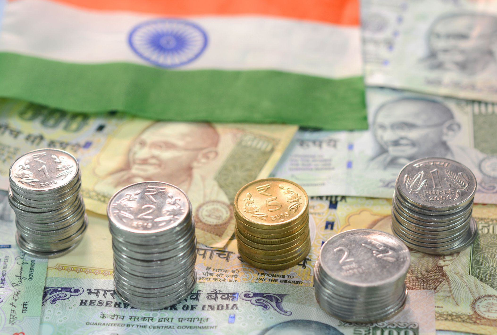

India's economy has experienced substantial and rapid growth, solidifying its position as one of the most dynamic markets globally. Boasting a diverse economic landscape, India's growth is propelled by several key sectors, each contributing uniquely to the country's financial expansion. These sectors include agriculture, industry, and services, with the latter, particularly Information Technology (IT), playing a pivotal role in India's economic strides.

Understanding the sources of revenue and the financial system's infrastructure is crucial for grasping the full scope of India's economic fabric. The financial mechanisms in India underpin the economic activities across various sectors, facilitating sustainable growth and development. A robust financial system ensures efficient allocation of resources and supports technological advancements that further accelerate economic progress.

The role of technology in the Indian financial ecosystem cannot be overstated. Innovations such as algorithmic trading (algo trading) are becoming increasingly vital in enhancing the efficiency of financial operations. Algo trading utilizes complex algorithms to automate trading decisions, which can result in faster and potentially more profitable trades. This technology is revolutionizing the financial markets in India by improving liquidity, reducing transaction costs, and enabling market participants to execute trades rapidly and with precision. 

As India continues its trajectory towards greater economic heights, the integration of technology like algo trading within its financial system illustrates the nation's commitment to embracing modern solutions for old challenges. This amalgamation of technology and finance not only fosters immediate economic growth but also positions India advantageously in the competitive global economic landscape.

## Table of Contents

## Historical Development of India's Economy

India's economic history since its independence in 1947 is marked by a significant transformation from a command economy to a mixed economic system. Initially, India's economy was heavily influenced by socialist policies, characterized by a strong central government control over crucial sectors. The focus was on self-sufficiency and heavy reliance on the public sector, with limited scope for private entrepreneurship. This approach intended to protect nascent industries from international competition, aiming to build a robust industrial base and reduce poverty.

However, the inefficiencies of a command economy became apparent over the decades, characterized by sluggish growth rates and excessive bureaucratic controls. By the late 1980s, India faced a severe balance of payments crisis along with rising fiscal deficits and inflation, necessitating urgent reforms.

In 1991, India initiated major economic liberalization policies to transition towards a market-based economy. The government undertook measures such as de-licensing industries, reducing import tariffs, deregulating markets, and encouraging foreign direct investment (FDI). These reforms dismantled many aspects of the planned economy, paving the way for increased private sector activity and globalization of the Indian economy.

The liberalization policies catalyzed rapid growth in the private sector and expanded international trade. Industries such as information technology, automotive, telecommunications, and pharmaceuticals witnessed substantial growth. India's exports diversified across various sectors, contributing to its integration into the global economy. Consequently, India's share in global trade increased significantly, supported by a competitive advantage in sectors like software services.

Today, India ranks among the world's largest economies, with a nominal GDP that places it as a significant player on the global stage. Its economic ascent is marked by substantial contributions from the service sector, a burgeoning middle class, and increased foreign investments. Despite these successes, India continues to grapple with challenges such as income inequality, infrastructural deficits, and the need for ongoing policy reforms to sustain and enhance its economic growth trajectory.

## Key Revenue Sources in India

India's economic structure is characterized by a diverse array of revenue sources, each contributing to the country's gross domestic product (GDP) in distinctive ways. Historically, agriculture played a pivotal role as the primary revenue source. However, over the years, its contribution to GDP has lessened significantly as other sectors have grown in prominence.

### The Role of Agriculture

During the initial decades following India's independence, agriculture was the backbone of the Indian economy, contributing around 50% to the GDP. Today, its contribution has decreased significantly, accounting for approximately 15-17% of the GDP. This shift is attributed to the growth and expansion of other sectors as well as increased industrialization and urbanization. Despite its reduced share in GDP, agriculture continues to be a crucial sector, providing livelihood to over half of the Indian population. The sector is a critical source of raw materials and plays an essential role in ensuring food security and economic stability in rural regions.

### Industrial Production

Industrial production in India is another significant contributor to the economy, covering a wide range of sectors including petrochemicals, pharmaceuticals, and automotive. India's petrochemical industry is a vital part of its manufacturing sector, providing essential inputs for various other industries, such as textiles and agriculture. The pharmaceutical industry, often referred to as the "pharmacy of the world," is one of the largest globally, exporting drugs and active pharmaceutical ingredients to numerous countries. The automotive industry also stands out as a major economic driver, with India being one of the largest manufacturers of vehicles, ranging from two-wheelers to heavy commercial vehicles.

### The Service Sector

The service sector has emerged as the most significant contributor to India's GDP, accounting for over 50% of the total. This sector encompasses a myriad of industries, with Information Technology (IT) and business process outsourcing (BPO) at the forefront. India's IT sector is renowned for its large pool of skilled professionals, which has helped the country become a preferred destination for IT services and solutions worldwide. Major cities like Bengaluru, Hyderabad, and Pune are known as global tech hubs. The BPO industry has similarly capitalized on a skilled and English-speaking workforce to cater to various international markets, making India a critical player in the global outsourcing landscape.

India's revenue sources are indicative of an economy that is increasingly balancing traditional sectors with modern industries and services. While agriculture remains important, the rise of industrial production and the dominant service sector underscore a shift towards a more diversified and resilient economic framework.

## The Role of the Service Sector and IT

The service sector has emerged as a pivotal element of India's economic growth, significantly contributing to GDP and employment. Within this sector, information technology (IT) and business process outsourcing (BPO) have driven substantial transformation, both at the international and domestic levels.

### Growth of Information Technology and Business Process Outsourcing

India's IT and BPO industries have experienced exponential growth since the late 20th century. The liberalization policies of the 1990s, combined with advancements in technology and communication, facilitated the expansion of these sectors. India has positioned itself as a global leader in IT services, thanks to its cost-effective solutions and high-quality service delivery. The industry has grown to offer services including software development, IT consultancy, support services, and remote infrastructure management. 

The BPO sector complements the IT industry by providing back-office and customer-related services for businesses worldwide. This segment includes areas such as customer support, data entry, human resources, finance, and accounting services. The ability of Indian firms to offer efficient, scalable solutions has made the country a preferred destination for outsourcing.

### Key International and Domestic Players in India's IT Landscape

Several major companies have become integral to India's IT landscape. International technology giants like IBM, Microsoft, and Accenture have established a strong presence in India, leveraging the country's skilled workforce and cost advantages. Domestically, Indian firms such as Tata Consultancy Services (TCS), Infosys, Wipro, and HCL Technologies have secured significant market shares both within India and abroad.

These companies have built robust portfolios encompassing a wide range of IT services and products, facilitating digital transformation for clients across different industries. This expansion has been supported by strategic alliances, mergers, and acquisitions, further extending their global reach.

### The Effect of a Large Skilled and Educated Workforce on Sector Growth

The success of India's IT and BPO sectors is largely attributed to its large and skilled workforce. India produces a substantial number of graduates in science, technology, engineering, and mathematics (STEM) fields annually, creating a substantial pool of talent ready to enter the IT sector. 

Educational institutions, including the Indian Institutes of Technology (IITs) and Indian Institutes of Management (IIMs), have played a crucial role in nurturing a workforce capable of adapting to the rapid technological changes demanded by the IT industry. Moreover, the emphasis on English language proficiency in Indian education has enabled seamless communication with international clients, enhancing India's appeal as a global IT and BPO hub.

The interplay of policy liberalization, a skilled workforce, and strategic industry practices has enabled India's service sector, particularly IT and BPO, to flourish. This growth continues to propel the country's economy forward, positioning India as a formidable participant in the global market.

## The Financial System of India

India's financial system is a complex and dynamic entity, playing a critical role in the country's economic development. At its core is the Reserve Bank of India (RBI), which serves as the central bank, responsible for overseeing monetary policies and ensuring financial stability. Founded in 1935, the RBI's key functions include regulating money supply, managing foreign exchange, and supervising the banking sector. It also formulates monetary policy with goals of controlling inflation, promoting economic growth, and ensuring currency stability.

**Monetary Policies and Financial Stability**

The RBI uses various instruments to control money supply and interest rates, including the repo rate, reverse repo rate, Cash Reserve Ratio (CRR), and Statutory Liquidity Ratio (SLR). The repo rate, the rate at which the RBI lends to commercial banks, is a crucial tool for managing [liquidity](/wiki/liquidity-risk-premium) and inflation. For example, a reduction in the repo rate typically makes borrowing cheaper for businesses and individuals, potentially stimulating economic growth. Conversely, an increase may be used to curb inflation by making loans more expensive and thus slowing down economic activity.

The RBI also employs open market operations, buying and selling government securities to manage liquidity. These actions are essential for maintaining financial stability, which is crucial for fostering investor confidence and supporting economic progress.

**Role of Banks and Financial Institutions**

Indian banks and other financial institutions are pivotal in revenue generation and economic activity. India's banking sector comprises public sector banks, private sector banks, foreign banks, and cooperative banks. Public sector banks account for a significant portion of the industry's assets.

Banks in India serve as financial intermediaries, mobilizing savings from households and channeling them into investments. They provide credit for various sectors, including agriculture, industry, and services, which in turn drive economic growth. For instance, through priority sector lending, banks direct credit to sectors deemed critical for economic development but underserved by traditional lenders.

Non-banking financial companies (NBFCs) also play a substantial role, providing financial services like loans and asset management, especially in the informal sector where traditional banks may have limited reach. The diversity of financial institutions ensures a wide range of services are available, contributing to the economy's resilience and adaptability.

Overall, India's financial system, with the RBI at its helm, is a vital component in the country's economic framework, managing monetary policy to promote stability and leveraging banking and non-banking institutions to drive growth and revenue.

## Rise of Algo Trading in India

Algorithmic trading, commonly referred to as algo trading, involves using computer algorithms to execute trading orders at high speeds, taking advantage of complex mathematical models and software. These algorithms are designed to execute strategies at speeds and frequencies that are impossible for a human trader.

In India, algo trading has seen significant growth over the past decade, facilitated by advancements in technology and the increasing accessibility of sophisticated trading tools. As of recent years, it is estimated that [algorithmic trading](/wiki/algorithmic-trading) accounts for around 50% of the total trading [volume](/wiki/volume-trading-strategy) on Indian stock exchanges, marking a notable increase from previous years. This surge in adoption can be attributed to several factors, including the expansion of high-frequency trading operations, enhanced market infrastructure, and the increased participation of institutional investors.

The impact of algorithmic trading on Indian markets is multifaceted. On one hand, it has improved market liquidity and efficiency by enabling faster trade executions and tighter bid-ask spreads. On the other hand, it has also introduced new challenges, such as increased market [volatility](/wiki/volatility-trading-strategies) and the potential for systemic risks. The rapid execution of trades can lead to significant price swings, which may result in flash crashes or other market anomalies. These challenges underscore the importance of effective risk management strategies and robust regulatory frameworks to mitigate potential adverse effects.

From an ethical standpoint, algo trading raises several considerations, particularly concerning market fairness and transparency. There is a concern that high-frequency traders, often possessing more advanced technology and quicker access to market data, may have an unfair advantage over retail investors. This disparity in access can lead to a perception of unfairness and erode investor confidence in the market.

In response to these concerns, Indian regulatory authorities, notably the Securities and Exchange Board of India (SEBI), have implemented various measures to ensure the integrity of the markets. These include mandatory risk checks, such as volatility controls and order-to-trade ratios, to prevent market manipulation and ensure that automated systems do not destabilize the markets. Additionally, SEBI has established a framework for the approval and monitoring of algorithmic trading systems to ensure compliance with regulatory requirements.

Overall, while algo trading has significantly transformed the landscape of Indian financial markets, its continued growth and integration will require careful management to balance the benefits of increased efficiency and liquidity against the risks associated with market volatility and systemic disruptions.

## Impact of Global Trade Partnerships

India has emerged as a significant player in global trade, with several key partnerships that drive its economic growth and stability. The country’s largest trading partners include the United States, China, the United Arab Emirates, Saudi Arabia, and the European Union. These partnerships have shaped India's export and import sectors, significantly impacting its economic trajectory.

### Key Export and Import Sectors

India’s export portfolio is diverse, with key sectors including petroleum products, precious stones, textiles, pharmaceuticals, and machinery. One of the standout sectors is information technology and business process outsourcing, which continues to grow. In terms of imports, India primarily brings in [crude oil](/wiki/crude-oil), gold, electronic goods, and machinery. The reliance on crude oil imports stems from the country's vast energy needs, which underscores the importance of participating in global energy markets.

### Effects on Economic Growth and Stability

The impact of global trade on India's economic growth is profound. India's exports contribute approximately 20% to its GDP, showcasing the heavy reliance on international markets to sustain economic [momentum](/wiki/momentum). Factors such as foreign exchange earnings from exports help in balancing trade deficits and stabilizing the Indian rupee. 

Trade with countries like the US and the European Union also facilitates the inflow of foreign direct investment, which is crucial for infrastructural and technological enhancements. However, trade dynamics can pose challenges, such as when geopolitical tensions or trade wars cause fluctuations in demand and supply chains, impacting revenue predictability.

### Future Prospects and Challenges

Looking forward, India’s trade relations offer both prospects and challenges. The country is poised to expand its economic ties through initiatives such as the proposed India-EU Free Trade Agreement and strategic partnerships in the Indo-Pacific region. These efforts aim to diversify trade, reduce dependency on a select few partners, and mitigate geopolitical risks.

However, India's trade aspirations face hurdles, including tariff barriers, trade protectionism from major economies, and logistical challenges within its domestic infrastructure. Moreover, global shifts towards sustainable and green technologies necessitate an adaptation within India’s export strategies to remain competitive.

The rise of regional trade agreements and India's proactive participation in international forums underscore its commitment to enhancing global trade partnerships. For sustainable growth, India must navigate these challenges by implementing policy reforms that address tariff barriers, improve infrastructure, and leverage its demographic advantage in scaling digital innovations. These strategies will not only pave the way for increased economic stability but also solidify India’s standing as a formidable force in global trade.

## Challenges and Opportunities

India's economic growth trajectory presents both significant challenges and burgeoning opportunities. One major challenge is addressing the inefficiencies in infrastructure and industrial production. The country's infrastructure has historically struggled with inadequate transport networks, poor logistics, and energy shortages, which hinder industrial efficiency and increase production costs. This inefficiency is reflected in India's Logistics Performance Index (LPI), which, despite improvements, still indicates room for significant enhancement.

Investing in robust infrastructure is pivotal for sustaining economic growth. Enhanced transport networks, reliable power supply, and efficient logistics systems can significantly reduce the cost of doing business and improve competitiveness. The Indian government's initiatives, such as the "Make in India" campaign, aim to address these deficiencies by attracting foreign and domestic investment to modernize infrastructure and boost manufacturing capabilities.

Opportunities abound in digital innovation and technology adoption. As digital technologies continue to reshape economies globally, India stands at the forefront of leveraging these advancements. With a burgeoning young population and increasing internet penetration, digital innovation can drive new business models and increase productivity across sectors. Technologies such as [artificial intelligence](/wiki/ai-artificial-intelligence) (AI), blockchain, and the Internet of Things (IoT) offer distinct opportunities for enhancing operational efficiency and creating new revenue streams.

Furthermore, the advancement in financial technologies, including the proliferation of mobile banking and digital payment systems, has already begun transforming the financial ecosystem, promoting financial inclusion and economic participation. The government's push for a digital economy through initiatives like "Digital India" aims to harness these opportunities by fostering an ecosystem conducive to technological growth.

Policy reforms are essential to sustaining this trajectory of growth and addressing structural challenges. Streamlining regulatory frameworks, enhancing ease of doing business, and ensuring transparency and accountability are crucial reforms that can create a more conducive environment for domestic and international investors. The introduction of the Goods and Services Tax (GST) in 2017 is one such reform aimed at creating a unified national market and simplifying the tax structure.

Additionally, strengthening intellectual property rights and developing a skilled workforce through education and training can sustain technological advancements and innovation. Skill development initiatives, such as Skill India, focus on upgrading the workforce capacity to meet the demands of a rapidly evolving economy.

In conclusion, while challenges persist in infrastructure inefficiencies and industrial production, opportunities in digital innovation and responsive policy reforms offer significant potential for advancing India's economic growth. Addressing these challenges while capitalizing on opportunities requires a concerted effort from the government, industry stakeholders, and the population at large.

## Conclusion

India has firmly established itself as a significant player on the global economic stage, driven by a dynamic combination of traditional sectors and cutting-edge technological advancements. As one of the world's largest economies, India's growth is the result of a complex and interconnected system of agriculture, industry, and an increasingly dominant service sector. Each of these sectors, along with a robust financial infrastructure, contributes to the overall economic landscape.

The evolution of India's economy is a testament to the nation's ability to adapt to changing global paradigms. The diverse range of revenue sources, from agriculture, with its decreasing but still substantial role, to the expansive service sector led by information technology and business process outsourcing, illustrates the multifaceted nature of India's economic framework. The country's financial system, anchored by the Reserve Bank of India and supplemented by numerous banks and financial institutions, underpins this growth by ensuring monetary stability and facilitating revenue generation through various channels.

Looking to the future, India's economic trajectory appears promising. The rise of technology, particularly algorithmic trading, along with the country's engagement in global trade partnerships, positions India to further capitalize on existing and emerging opportunities. However, the journey is not without challenges. Addressing infrastructural inefficiencies and fostering industrial production remain critical to sustaining growth. Simultaneously, embracing digital innovation and implementing policy reforms will be necessary to harness the full potential of India's economic capabilities.

In summary, India's economy stands as a testament to its strategic adaptability and sectoral synergy. With its diverse economic sectors and evolving financial systems, India is poised to navigate global economic currents with resilience and foresight, continuing its ascent as a formidable global economic power.

## References & Further Reading

[1]: Gupta, P., & Fernando, D. (2020). ["Algorithmic Trading in India: An Insight."](https://journals.sagepub.com/doi/abs/10.1177/0972063420921260) National Stock Exchange of India Research.

[2]: Ghosh, D. (2019). ["The History and Impact of India's Economic Liberalization Policies."](https://journals.sagepub.com/doi/10.1177/04866134241232492) Economic and Political Weekly.

[3]: Bansal, R. (2017). ["Digital India – An IT Revolution to Economic Growth."](https://link.springer.com/chapter/10.1007/978-3-658-43014-6_19) NITI Aayog.

[4]: Reserve Bank of India. (2023). ["Monetary Policy Report – March 2023."](https://www.rbi.org.in/Scripts/PublicationsView.aspx?id=22050) Reserve Bank of India.

[5]: Securities and Exchange Board of India. (2022). ["Algorithmic Trading: Framework and Regulations in India."](https://www.indiatoday.in/business/story/sebi-algorithm-stock-market-trade-regulation-proposal-check-details-1886408-2021-12-10) SEBI Publications.

[6]: Krueger, A., & Burggraf, T. (2019). ["India's Trade Dynamics: An Analysis of Bilateral Trade Partnerships."](https://papers.ssrn.com/sol3/papers.cfm?abstract_id=3235190) International Monetary Fund Working Paper.