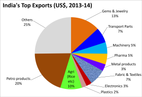

## Table of Contents

## What are the primary sources of revenue for the Indian government?

The Indian government gets its money from many places. The biggest source of revenue is taxes. There are two main types of taxes: direct taxes, like income tax that people and companies pay, and indirect taxes, like the Goods and Services Tax (GST) that is added to the price of things we buy. Another important source of money for the government is from selling things it owns, like shares in companies or natural resources like oil and gas.

Apart from taxes and selling assets, the government also earns money from other sources. One of these is through dividends, which are payments it gets from the companies it partly owns. The government also gets money from fees and fines, like charges for using public services or penalties for breaking rules. Lastly, the government borrows money by selling bonds, which it promises to pay back with interest over time. All these sources together help the government run the country and provide services to its people.

## How does taxation contribute to India's revenue?

Taxation is a big part of how the Indian government gets its money. The main types of taxes are direct taxes and indirect taxes. Direct taxes are things like income tax, which people and companies pay from their earnings. This means if you have a job or run a business, you pay a part of your income to the government. Indirect taxes include the Goods and Services Tax (GST), which is added to the price of things we buy, like food, clothes, and electronics. So, every time we buy something, we're helping the government collect money through these taxes.

These taxes are very important because they make up a large part of the government's total income. In simple terms, the more people earn and the more they spend, the more tax money the government gets. This money is used to pay for things like schools, hospitals, roads, and other services that everyone in the country uses. Without taxes, the government wouldn't have enough money to run the country properly. So, taxes are a key way the government keeps things going and helps the people of India.

## What is the Goods and Services Tax (GST) and its impact on India's economy?

The Goods and Services Tax (GST) is a tax that the Indian government introduced in 2017. It replaced many different taxes that were there before, like excise duty and service tax, and made them into one single tax. GST is added to the price of almost everything we buy, from food to clothes to services like haircuts. There are different rates of GST, depending on what you're buying. Some things, like basic food items, have a lower rate, while luxury items have a higher rate.

GST has had a big impact on India's economy. One good thing is that it has made doing business easier because there's now just one tax to deal with instead of many. This has helped businesses save time and money. But there have been challenges too. At first, many small businesses found it hard to understand and follow the new rules, and some people felt that the prices of things went up. Over time, though, as people and businesses got used to GST, it has helped the government collect more tax money and make the economy run more smoothly.

## How significant is the role of customs duties in India's revenue?

Customs duties are taxes that the Indian government puts on things that come into the country from other places. These duties are important because they help the government earn money. When someone brings in goods, like electronics or clothes, they have to pay a customs duty. This money goes to the government and adds to its total income. Customs duties are not as big a part of the government's money as income tax or GST, but they still play a key role.

The money from customs duties helps the government in many ways. It can use this money to pay for public services like schools and hospitals. Customs duties also help protect local businesses by making foreign goods more expensive, which can encourage people to buy things made in India. Overall, while customs duties might not be the biggest source of revenue, they are still very important for the government's budget and for supporting the country's economy.

## What are non-tax revenues and how do they contribute to India's economy?

Non-tax revenues are the money the Indian government gets from sources other than taxes. This includes things like fees for using public services, fines for breaking rules, and money from selling things the government owns, like shares in companies or natural resources like oil and gas. The government also earns non-tax revenue through dividends, which are payments it gets from the companies it partly owns.

These non-tax revenues are important for India's economy because they help the government have more money to spend on things like schools, hospitals, and roads. They also help the government run smoothly without relying only on taxes. By getting money from different places, the government can better plan its budget and make sure it has enough funds to provide services to the people of India.

## How does the Indian government utilize revenue from state-owned enterprises?

The Indian government gets money from state-owned enterprises in different ways. One way is by selling shares in these companies to the public. When the government sells these shares, it gets money that it can use for other things. Another way is through dividends, which are like profits that the companies pay back to the government because it owns part of them. These dividends add to the government's money and help it run the country.

The money from state-owned enterprises is very important for the government. It uses this money to pay for things like building schools and hospitals, fixing roads, and running other public services that everyone uses. By using the money from these enterprises, the government can make sure it has enough funds to help its people and keep the country running smoothly. So, state-owned enterprises play a big role in helping the government do its job.

## What is the contribution of the agricultural sector to India's revenue?

The agricultural sector in India plays a big role in the country's revenue. Farmers grow crops like wheat, rice, and vegetables, and they also raise animals for milk, meat, and other products. When these things are sold, they bring in money not just for the farmers but also for the government. The government gets money from taxes on the sale of these agricultural products. Also, when India exports these goods to other countries, it earns foreign money, which adds to the country's overall revenue.

Apart from direct sales and exports, the agricultural sector helps the economy in other ways. It creates jobs for many people, not just farmers but also people who work in related businesses like food processing and transportation. This means more people are [earning](/wiki/earning-announcement) money and paying taxes, which helps the government. The government also gets money from selling fertilizers and other farming supplies, and it can use this money to support other areas of the economy. So, the agricultural sector is very important for India's revenue and for keeping the economy strong.

## How do foreign investments influence India's revenue streams?

Foreign investments help India's revenue in a big way. When companies from other countries put money into India, they start businesses or buy shares in Indian companies. This brings in money that the government can tax. Also, these foreign companies often hire people in India, which means more people are earning money and paying taxes. So, foreign investments help the government get more money through taxes on businesses and the people who work for them.

Foreign investments also help India's economy grow. When foreign companies invest in India, they often build factories or offices, which means they spend money on things like buildings and equipment. This spending helps other businesses in India, like construction and manufacturing, to grow too. As these businesses grow, they pay more taxes and create more jobs, which adds to the government's revenue. So, foreign investments not only bring in money directly but also help the whole economy to do better, leading to more revenue for the government.

## What are the challenges faced by India in revenue collection?

Collecting money can be hard for the Indian government. One big problem is that a lot of people and businesses do not pay their taxes properly. This is called tax evasion, and it means the government does not get all the money it should. Also, many small businesses and people in rural areas might not know how to pay taxes correctly, or they might not have the right tools or information to do it. This makes it hard for the government to collect all the taxes it needs.

Another challenge is that the rules for taxes can be complicated. Sometimes, the laws change, and it can be tough for everyone to keep up. This can lead to mistakes and confusion, which makes collecting taxes even harder. The government also has to deal with different states having different rules, which can make things messy. Overall, making sure everyone pays the right amount of taxes is a big job for the Indian government.

## How has digitalization affected revenue collection in India?

Digitalization has made a big difference in how the Indian government collects money. With computers and the internet, it's easier for people to pay their taxes online. This means less waiting in lines and less paperwork. The government has made apps and websites where people can quickly pay their taxes from home. This has helped the government get more money because it's easier for people to pay on time. Also, digital tools help the government keep track of who is paying taxes and who is not, which makes it harder for people to avoid paying.

But digitalization has its challenges too. Not everyone in India has a computer or knows how to use the internet. This can make it hard for some people, especially those in rural areas, to pay their taxes online. The government has to make sure that everyone can use these new digital tools. Also, with more things happening online, there's a bigger risk of hackers trying to steal money or information. So, the government needs to keep its digital systems safe. Overall, while digitalization has helped a lot, there are still some things the government needs to work on to make it work for everyone.

## What reforms have been implemented to improve revenue efficiency in India?

The Indian government has made several changes to make collecting money easier and more efficient. One big change was introducing the Goods and Services Tax (GST) in 2017. Before GST, there were many different taxes, which made things confusing for businesses. Now, with GST, there's just one tax, which makes it simpler for everyone. The government also uses computers and the internet more to help people pay taxes easily from home. This has helped the government get more money because it's easier for people to pay on time.

Another important change is the use of technology to keep track of who is paying taxes. The government has made apps and websites that help them see if people are paying the right amount of taxes. This makes it harder for people to avoid paying taxes. But the government still faces challenges, like making sure everyone can use these new digital tools, especially people in rural areas who might not have computers or know how to use the internet. Overall, these reforms have helped the government collect more money and make the process smoother for everyone.

## How does India's fiscal policy align with its revenue generation strategies?

India's fiscal policy is all about how the government manages its money, including how it spends and how it collects money. The main goal of the fiscal policy is to keep the economy stable and growing. To do this, the government uses different ways to bring in money, like taxes and non-tax sources. For example, they collect income tax from people and businesses, and GST on things we buy. They also get money from selling things they own, like shares in companies, and from fees and fines. All these methods help the government have enough money to run the country and provide services like schools and hospitals.

The government also tries to make sure its revenue strategies match its spending plans. If the government wants to spend more on building roads or helping farmers, it needs to find ways to get more money. Sometimes, they might change tax rates or make new rules to collect more money. But they also have to be careful not to make taxes too high, because that might make it harder for people and businesses to spend and invest. So, the government always tries to balance its need for money with keeping the economy strong. This way, their fiscal policy and revenue generation strategies work together to help India grow and stay stable.

## References & Further Reading

[1]: Gupta, P., & Fernando, D. (2020). ["Algorithmic Trading in India: An Insight."](https://journals.sagepub.com/doi/abs/10.1177/0972063420921260) National Stock Exchange of India Research.

[2]: Ghosh, D. (2019). ["The History and Impact of India's Economic Liberalization Policies."](https://journals.sagepub.com/doi/10.1177/04866134241232492) Economic and Political Weekly.

[3]: Bansal, R. (2017). ["Digital India – An IT Revolution to Economic Growth."](https://link.springer.com/chapter/10.1007/978-3-658-43014-6_19) NITI Aayog.

[4]: Reserve Bank of India. (2023). ["Monetary Policy Report – March 2023."](https://www.rbi.org.in/Scripts/PublicationsView.aspx?id=22050) Reserve Bank of India.

[5]: Securities and Exchange Board of India. (2022). ["Algorithmic Trading: Framework and Regulations in India."](https://www.indiatoday.in/business/story/sebi-algorithm-stock-market-trade-regulation-proposal-check-details-1886408-2021-12-10) SEBI Publications.

[6]: Krueger, A., & Burggraf, T. (2019). ["India's Trade Dynamics: An Analysis of Bilateral Trade Partnerships."](https://papers.ssrn.com/sol3/papers.cfm?abstract_id=3235190) International Monetary Fund Working Paper.