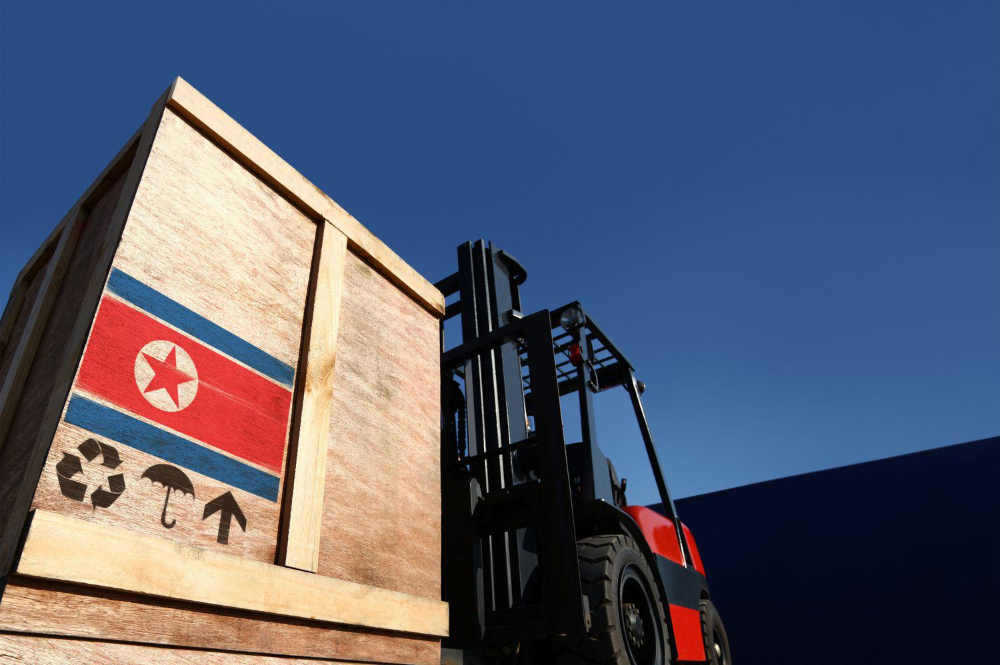

## Table of Contents

## What is the basic structure of North Korea's economy?

North Korea's economy is mostly controlled by the government. The government decides what to produce, how much to produce, and who gets the products. This type of economy is called a command economy. North Korea has many state-owned factories and farms. The government also controls the prices of goods and services.

Despite the government's control, there is a small informal market in North Korea. People sometimes trade goods and services among themselves without the government's permission. This is called the black market. It exists because the government cannot provide everything people need. Some people also earn money from small private businesses, but these are limited and often illegal.

North Korea faces many economic challenges. The country has been isolated from the rest of the world because of its political situation. This makes it hard for North Korea to trade with other countries. The economy also suffers from natural disasters, like floods, which can destroy crops and homes. Because of these problems, many people in North Korea live in poverty.

## How does the North Korean government control its economy?

The North Korean government controls its economy by making all the important decisions. They decide what goods to make, how much to make, and who gets them. This is called a command economy. The government owns most of the factories and farms. They also set the prices for everything people buy and sell. If someone wants to start a business, they need the government's permission, and it's hard to get.

Even though the government has a lot of control, some people still find ways to trade goods and services without permission. This is called the black market. It happens because the government can't provide everything people need. Some people also start small private businesses, but these are often illegal and can get them in trouble. The government tries to stop these activities, but they still happen because people need to survive.

## What are the main industries in North Korea?

North Korea's main industries are mining, manufacturing, and agriculture. Mining is important because North Korea has a lot of minerals like coal, iron, and zinc. These minerals are used to make things like steel, which is used in construction and manufacturing. Manufacturing in North Korea includes making military equipment, textiles, and some machinery. The government controls these factories and decides what to make.

Agriculture is also a big part of North Korea's economy. Many people in North Korea work on farms. They grow rice, corn, and potatoes. The government tells farmers what to grow and how much to grow. Sometimes, there are not enough crops because of bad weather or floods, which makes it hard for people to have enough food. The government tries to help by giving people food, but it's still a big problem.

## What is the role of agriculture in North Korea's economy?

Agriculture is very important in North Korea's economy. Many people in North Korea work on farms. They grow crops like rice, corn, and potatoes. The government decides what farmers should grow and how much. This is because the government controls the economy and wants to make sure there is enough food for everyone.

However, farming in North Korea faces many challenges. Bad weather and floods can destroy crops, which makes it hard to grow enough food. When there isn't enough food, people can go hungry. The government tries to help by giving out food, but it's still a big problem. Agriculture is not just about feeding people; it's also important for the country's economy because it provides jobs and helps keep the country running.

## How does North Korea's economy compare to other countries in the region?

North Korea's economy is different from other countries in the region like South Korea, Japan, and China. North Korea has a command economy, which means the government controls everything. Other countries in the region have more open economies where businesses and people have more freedom to make their own choices. Because of this, countries like South Korea and Japan have much stronger economies with more technology and trade.

North Korea faces many challenges that other countries in the region do not. It is isolated from the rest of the world because of its political situation, which makes it hard to trade and get help from other countries. This isolation leads to less money and fewer resources coming into the country. As a result, many people in North Korea live in poverty, while countries like South Korea and China have been able to grow and improve the lives of their people over time.

## What are the major economic challenges facing North Korea?

North Korea faces many big problems with its economy. One major problem is that the country is very isolated. Because of its political situation, North Korea does not trade much with other countries. This means they do not get much money or help from the outside world. Without trade, it is hard for North Korea to get the things they need, like food and medicine.

Another big challenge is natural disasters. North Korea often has floods and bad weather that can destroy crops and homes. When crops are destroyed, there is not enough food for everyone. This leads to hunger and poverty. The government tries to help by giving out food, but it is not always enough. These problems make it very hard for North Korea to have a strong economy.

## How has international sanctions affected North Korea's economy?

International sanctions have made North Korea's economy even harder to manage. Many countries have put sanctions on North Korea because of its nuclear weapons program. These sanctions stop North Korea from trading with other countries. They cannot sell things like coal and textiles, which are important for their economy. They also cannot buy things they need, like food and medicine. This makes life very hard for people in North Korea because they do not have enough of what they need.

Because of the sanctions, North Korea has less money coming into the country. This makes it difficult for the government to take care of its people. The economy is struggling, and many people live in poverty. The government tries to find ways around the sanctions, but it is not easy. The sanctions have made it very hard for North Korea to grow and improve its economy.

## What is the impact of North Korea's nuclear program on its economy?

North Korea's nuclear program has made its economy worse. Many countries do not like North Korea having nuclear weapons, so they put sanctions on the country. These sanctions stop North Korea from trading with other countries. They cannot sell things like coal and textiles, which are important for their economy. They also cannot buy things they need, like food and medicine. This makes life very hard for people in North Korea because they do not have enough of what they need.

Because of the sanctions, North Korea has less money coming into the country. This makes it difficult for the government to take care of its people. The economy is struggling, and many people live in poverty. The government spends a lot of money on the nuclear program instead of on things that could help the economy grow, like farming and factories. The nuclear program has made it very hard for North Korea to improve its economy and the lives of its people.

## How does North Korea engage in international trade despite sanctions?

North Korea finds ways to trade with other countries even though there are sanctions. They do this by using other countries to help them. For example, they might send their goods to China or Russia first, and then those countries sell the goods to other places. This way, it is harder for other countries to know that the goods are from North Korea. They also use ships that turn off their tracking systems so no one knows where they are going. This helps them move goods without being caught.

Another way North Korea trades is by dealing in things that are hard to track. They sell things like cyber services and illegal drugs. These things do not leave a clear trail, so it is harder for other countries to stop them. North Korea also works with some companies and banks that are willing to break the rules. These companies help North Korea move money around the world. Even though it is hard, North Korea keeps finding ways to trade and get what they need.

## What are the recent economic reforms implemented by North Korea?

North Korea has tried to make some changes to its economy in recent years. One big change is allowing some private businesses to start. These businesses are usually small, like restaurants or shops. The government still controls most things, but they let people earn a little money on their own. This helps because the government cannot give everyone what they need. Another change is that North Korea has tried to make their factories and farms work better. They want to make more things and grow more food so people have more to eat and use.

Even with these changes, North Korea still faces big problems. The government keeps tight control over the economy, which makes it hard for these small businesses to grow. Also, the country is still isolated because of the sanctions. This means they cannot trade as much as they want. The government is trying to find ways around the sanctions, but it is not easy. These reforms are small steps, but they show that North Korea is trying to do something to make life better for its people.

## How does the informal economy function in North Korea?

The informal economy in North Korea is made up of people trading goods and services without the government's permission. It happens because the government cannot give everyone what they need. People trade things like food, clothes, and even small electronics. They do this in secret markets called "jangmadang." These markets are important because they help people get things they cannot buy from the government stores. The government does not like these markets and tries to stop them, but they keep happening because people need them to survive.

The informal economy also includes small private businesses that are often illegal. Some people start small shops or restaurants to earn money. They have to be careful because if the government finds out, they could get in trouble. But these businesses help people make a living when the government jobs do not pay enough. The informal economy is a big part of life in North Korea. It helps people get by, even though it is risky and not allowed by the government.

## What are the future economic prospects for North Korea?

The future of North Korea's economy is hard to predict. It depends a lot on whether they can improve their relationships with other countries. If North Korea can start trading more with the world, they could get more money and resources. This could help them grow their economy and give their people better lives. But right now, because of the nuclear program and the sanctions, it is very hard for them to trade. If they keep the nuclear program, the sanctions might stay, and the economy will stay weak.

Another thing that could help North Korea's economy in the future is if they keep making small changes to how they do things. For example, letting more private businesses start could help. These businesses can create jobs and help people earn more money. Also, if they can make their farms and factories work better, they might be able to grow more food and make more things. But the government still controls a lot, so these changes need to be big enough to make a real difference. If North Korea can find a way to balance their control with letting the economy grow, they might have a better future.

## References & Further Reading

[1]: Albert, E. (2021). ["North Korea’s Military Capabilities."](https://www.cfr.org/backgrounder/north-korea-nuclear-weapons-missile-tests-military-capabilities) Council on Foreign Relations.

[2]: Frank, R. (2016). ["North Korea: The Paranoid Peninsula - A Modern History."](https://books.google.com/books/about/North_Korea.html?id=mdyJS5iD9wYC) Zed Books.

[3]: Haggard, S., & Noland, M. (2010). ["Witness to Transformation: Refugee Insights into North Korea."](https://www.jstor.org/stable/pdf/23266873.pdf) Peterson Institute for International Economics.

[4]: Kim, S. S. (2012). ["North Korea in Transition: Politics, Economy, and Society."](https://www.jstor.org/stable/pdf/43590799.pdf) Rowman & Littlefield Publishers.

[5]: Lee, J. W. (2014). ["The Political Economy of North Korea: Historical Background and Present Situation."](https://www.oxfordbibliographies.com/abstract/document/obo-9780199756223/obo-9780199756223-0109.xml) Asian Perspective, 38(2).

[6]: ["North Korean Economy Watch"](http://www.nkeconwatch.com/) - A blog and information service providing updates and analysis on the North Korean economy.

[7]: Stirling, S. (2020). ["Defectors' Accounts of North Korea: Market Activities in a Socialist Country."](https://beyondparallel.csis.org/markets-private-economy-capitalism-north-korea/) Business History.