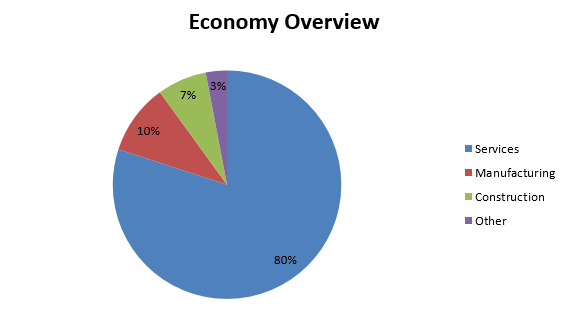

## Table of Contents

## What is the basic structure of the UK economy?

The UK economy is made up of different parts that work together. These parts include businesses, people who work, and the government. Businesses make things or provide services, like cars or haircuts. People work at these businesses and get paid. The government helps by making rules and collecting taxes to pay for things like schools and hospitals.

Another important part of the UK economy is trade. The UK buys and sells things with other countries. For example, the UK might sell cars to other countries and buy food from them. This trade helps the economy grow. The UK also has a big financial sector, which means lots of people work in banks and insurance companies. These jobs help the economy too.

Overall, the UK economy is a mix of different activities. It includes making and selling things, providing services, and trading with other countries. The government plays a big role in making sure everything runs smoothly.

## How does the UK's GDP compare to other countries?

The UK has one of the biggest economies in the world. In terms of GDP, which is the total value of all goods and services produced in a country, the UK usually ranks around sixth or seventh globally. Countries like the United States, China, Japan, Germany, and India often have larger GDPs than the UK. However, when you look at GDP per person, which shows how wealthy people are on average, the UK does better. It usually ranks around tenth in the world, showing that UK citizens are relatively well-off compared to many other countries.

Comparing the UK's economy to its neighbors in Europe, it is one of the biggest. Germany has the largest economy in Europe, followed by France and Italy. The UK's GDP is usually a bit smaller than Germany's but bigger than France's and Italy's. This means the UK plays a big role in the European economy. Even though the UK left the European Union, it still trades a lot with European countries, which helps its economy grow.

## What are the main industries driving the UK economy?

The UK economy is driven by several key industries. One of the biggest is the services sector, which includes things like finance, insurance, and business services. London is a major global financial center, with lots of banks and insurance companies. These businesses bring in a lot of money and create many jobs. Another important part of the services sector is tourism. People from all over the world visit the UK to see places like London, Edinburgh, and the countryside, which helps the economy grow.

Another major industry in the UK is manufacturing. This includes making things like cars, airplanes, and medicines. The UK is known for its car industry, with big companies like Nissan and Jaguar Land Rover having factories there. The pharmaceutical industry is also very important, with the UK being home to many big drug companies that make medicines sold around the world. These industries not only create jobs but also help the UK earn money from exports.

The UK also has a strong technology sector. This includes companies that work on software, digital services, and new technologies like [artificial intelligence](/wiki/ai-artificial-intelligence). Cities like London, Manchester, and Cambridge are becoming known for their tech scenes. This industry is growing fast and is seen as a big part of the UK's future economy. Together, these industries help make the UK a strong and diverse economy.

## What role does the service sector play in the UK's economy?

The service sector is a big part of the UK's economy. It includes things like finance, insurance, and business services. London is a famous place for these kinds of jobs. Many big banks and insurance companies are there. These businesses help the UK make a lot of money and give jobs to many people. Another part of the service sector is tourism. People from all over the world come to see places like London, Edinburgh, and the countryside. This brings in money and helps the economy grow.

The service sector is really important because it makes up a large part of the UK's total economic activity. It is bigger than manufacturing or farming. When people work in services, they help other businesses run smoothly. For example, accountants help companies with their money, and lawyers help with legal stuff. This makes the whole economy work better. Also, the service sector is growing, which means more jobs and more money for the UK.

## How has Brexit affected the UK economy?

Brexit, which means the UK leaving the European Union, has had a big impact on the UK's economy. One of the main changes is in trade. Before Brexit, it was easy for the UK to buy and sell things with other European countries. Now, there are more rules and sometimes extra costs, which can make things harder for UK businesses. This has made some businesses think about moving to other countries in Europe, and it has also made some goods more expensive for people in the UK.

Another way Brexit has affected the economy is through jobs and workers. Before Brexit, it was easy for people from other European countries to come to the UK to work. Now, it's harder, and fewer people are coming. This has made it tougher for some businesses to find the workers they need. At the same time, some people in the UK are happy because they think there are more jobs for them. But overall, it has made things a bit more complicated for businesses and the economy.

Overall, Brexit has brought both challenges and changes to the UK economy. It has made trade more complicated and affected the workforce. While some people see benefits, like more control over their own country's rules, others worry about the costs and difficulties it has brought. The long-term effects are still being figured out, but it's clear that Brexit has had a big impact on how the UK's economy works.

## What is the current unemployment rate in the UK?

The current unemployment rate in the UK is around 4.3% as of early 2023. This means that out of every 100 people who want to work, about 4 or 5 of them are not able to find a job. This rate is quite low compared to many other countries and shows that most people who want to work in the UK are able to find jobs.

Even though the unemployment rate is low, there are still some challenges. Some parts of the UK have higher unemployment than others, and certain groups of people, like young people and those without a lot of education, might find it harder to get jobs. The government and businesses are working on ways to help these groups find work and to keep the overall unemployment rate low.

## How does the UK government manage its fiscal policy?

The UK government manages its fiscal policy by deciding how much money to spend and how much to collect in taxes. They make a budget every year that says how much money they will spend on things like schools, hospitals, and roads, and how much they will get from taxes like income tax and sales tax. If the government spends more money than it collects, it has a budget deficit, and it might need to borrow money. If it collects more than it spends, it has a budget surplus. The government tries to balance these to keep the economy stable and help it grow.

Sometimes, the government uses fiscal policy to help the economy when it's not doing well. For example, if a lot of people are out of work, the government might spend more money on projects that create jobs, or it might lower taxes so people have more money to spend. This can help the economy get better. But if the economy is growing too fast and prices are going up a lot, the government might do the opposite. It might spend less or raise taxes to slow things down and keep prices from going up too much. This way, the government tries to keep the economy healthy and balanced.

## What are the key economic challenges facing the UK?

One big challenge for the UK economy is the effect of Brexit. Since leaving the European Union, the UK has had to deal with new trade rules and costs. This makes it harder for UK businesses to sell their goods to Europe and for European businesses to sell to the UK. Some businesses have moved to other countries in Europe, and some goods have become more expensive. This can slow down the economy and make it harder for people to find jobs. The government is working on new trade deals with other countries to help, but it's a big challenge.

Another challenge is the cost of living. Prices for things like food, energy, and housing have been going up. This makes it harder for people to afford what they need. When people have less money to spend, it can slow down the economy because businesses don't sell as much. The government tries to help by giving money to people who need it and by trying to keep prices from going up too fast. But it's a tricky problem that needs a lot of work to solve.

Lastly, the UK is dealing with changes in the job market. Some jobs are disappearing because of new technology, like robots and computers doing work that people used to do. At the same time, there are new jobs in areas like technology and green energy. The government is trying to help people learn new skills so they can get these new jobs. But it's hard to make sure everyone can find good work, especially when some parts of the country have fewer jobs than others. This is another big challenge the UK economy faces.

## How has the UK's trade balance evolved in recent years?

In recent years, the UK's trade balance has been showing a deficit, which means the country imports more goods and services than it exports. This has been a trend for a while, but the size of the deficit changes. After Brexit, the trade balance got worse because new rules made it harder and more expensive to trade with Europe. The UK still buys a lot of things from Europe, like cars and food, but selling to Europe has become trickier. This has made the trade deficit bigger.

However, the UK has been trying to make new trade deals with countries outside of Europe to help balance things out. For example, the UK has made deals with countries like Japan and Australia. These deals help the UK sell more things to these countries, which can help reduce the trade deficit. But it takes time for these new deals to make a big difference, so the trade balance is still a challenge for the UK economy.

## What impact does monetary policy have on the UK economy?

Monetary policy in the UK is managed by the Bank of England. They control things like interest rates, which is the cost of borrowing money. When the Bank of England changes interest rates, it affects the whole economy. If they lower interest rates, borrowing money becomes cheaper. This can help businesses grow and people buy things like houses or cars. It can make the economy grow faster. But if the economy is growing too fast and prices are going up a lot, the Bank might raise interest rates. This makes borrowing more expensive, which can slow down the economy and help keep prices from going up too much.

The Bank of England also uses other tools, like buying and selling government bonds. This is called quantitative easing. When they buy bonds, they put more money into the economy, which can help it grow. When they sell bonds, they take money out, which can slow things down. These actions help the Bank of England keep the economy stable. They try to balance growth and inflation, which is when prices go up over time. By using these tools, the Bank of England helps make sure the UK economy stays healthy and works well for everyone.

## How do regional economic disparities affect the UK's overall economic performance?

Regional economic disparities in the UK mean that some parts of the country are doing better than others. Places like London and the South East have lots of jobs and businesses, and people there earn more money. But in other places, like the North of England and parts of Wales, it's harder to find good jobs, and people don't earn as much. This difference can slow down the whole UK economy because not everyone is doing well. When some areas are struggling, it can make it harder for the whole country to grow and be successful.

The government tries to help by giving money to areas that need it more. They build new roads, schools, and hospitals in these places to help them grow. But fixing these problems takes a long time, and it's hard to make sure everyone in the UK has the same chances. If the government can help these struggling areas do better, it can make the whole UK economy stronger. But until then, these regional differences will keep affecting how well the country does overall.

## What are the future economic projections for the UK according to leading economic forecasts?

Leading economic forecasts suggest that the UK's economy will grow in the coming years, but there are challenges ahead. The Office for Budget Responsibility (OBR) and other organizations predict that the UK's GDP will increase by about 1-2% each year. This growth is expected to come from more people working and businesses investing in new projects. However, the forecasts also show that inflation, which is when prices go up, will stay high for a while. This could make things more expensive for people and slow down the economy if it's not managed well.

Another important point from the forecasts is that the UK's trade with other countries will continue to change because of Brexit. The government is working on new trade deals, but it will take time for these to help the economy. The forecasts also say that the UK needs to invest more in things like technology and green energy to keep growing. If the country can do this, it could help create new jobs and make the economy stronger. But if it doesn't, the UK might fall behind other countries that are investing more in these areas.

## References & Further Reading

[1]: Murphy, A. E. (1993). ["John Maynard Keynes: Keynesianism into the Twenty-first Century."](https://books.google.com/books/about/John_Maynard_Keynes.html?id=X1G6AAAAIAAJ) Edward Elgar Publishing.

[2]: Pojarliev, M., & Levich, R. M. (2010). ["A New Look at Currency Investing Strategies."](https://papers.ssrn.com/sol3/papers.cfm?abstract_id=2571391) Journal of Portfolio Management.

[3]: Bank of England. (2019). ["Financial Stability Report."](https://www.bankofengland.co.uk/-/media/boe/files/financial-stability-report/2019/december-2019.pdf)

[4]: Lintner, J. (1965). ["The Valuation of Risk Assets and the Selection of Risky Investments in Stock Portfolios and Capital Budgets."](https://www.semanticscholar.org/paper/The-Valuation-of-Risk-Assets-and-the-Selection-of-A-Lintner/9135ebcc232d41bedff0f17ac6b22ace1dcffdd5) Review of Economics and Statistics.

[5]: Office for National Statistics (2023). ["UK Economic Accounts."](https://www.ons.gov.uk/economy/nationalaccounts/uksectoraccounts/datasets/ukeconomicaccounts)

[6]: PwC. (2018). ["The Future of Financial Services in the UK After Brexit."](https://ifamagazine.com/brexit-revisited-the-outlook-for-financial-services-four-years-later/)

[7]: Financial Conduct Authority (FCA). (2022). ["Algorithmic Trading Compliance in the UK."](https://www.fca.org.uk/publications/multi-firm-reviews/algorithmic-trading-compliance-wholesale-markets)

[8]: Esposito, A., & Rigotti, L. (2017). ["Market Manipulation and Regulation in Financial Modelling."](https://onlinelibrary.wiley.com/doi/abs/10.1002/tie.21764) Computational Economics.

[9]: Woodford, A. (2003). ["Interest and Prices: Foundations of a Theory of Monetary Policy."](https://www.jstor.org/stable/j.ctv30pnvmf) Princeton University Press.