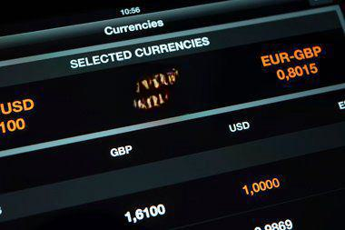

São Tomé and Príncipe, an island nation situated off the west coast of Central Africa, adopts the dobra, abbreviated as STD, as its official currency. This small island country has experienced a range of economic challenges and opportunities over the years, stemming from its reliance on agricultural production and the emergence of new industries. Historically, the economy of São Tomé and Príncipe has been largely dependent on a few key agricultural commodities, with cocoa beans serving as a primary export. However, the nation is increasingly looking toward diversification and modernization to bolster economic stability and growth.

This article examines the integral role that the dobra plays in the economy of São Tomé and Príncipe, its interactions within global markets, and highlights the potential of algorithmic trading using this currency. The dobra not only facilitates domestic trade but also interacts with international currencies and markets. As the world becomes increasingly interconnected, digital innovations, such as algorithmic trading, offer compelling opportunities to transform São Tomé and Príncipe's financial landscape. Algorithmic trading employs automated platforms that execute financial trades based on pre-defined rules with minimal human intervention, promising increased efficiency and market liquidity.



By exploring the intricate economic backdrop of São Tomé and Príncipe and the possibilities introduced by algorithmic trading, we gain valuable insights into how technological advancements might reshape this unique financial setting. Addressing the existing economic and infrastructural challenges will be crucial for São Tomé and Príncipe to capitalize on these emerging opportunities. The forthcoming sections will provide a detailed overview of the dobra, analyze the economic dynamics of the nation, and explore how algorithmic trading could play a transformative role in shaping the future economic prospects of São Tomé and Príncipe. Understanding these elements is vital for recognizing both the challenges faced and the potential pathways for growth and innovation in this island nation.

## Table of Contents

## Understanding the São Tomé and Príncipe Dobra (STD)

The dobra, abbreviated as STD in the foreign exchange market and locally represented as Db, is the official currency of São Tomé and Príncipe. This currency is pivotal to the nation's financial system and is issued by the Banco Central de São Tomé e Príncipe. Since its inception in 1977, replacing the escudo, the dobra has navigated through various economic phases, significantly influenced by inflationary pressures and policy adjustments aimed at stabilizing the economy.

One of the critical aspects of the dobra is its peg to the euro, which was formalized in 2010. This peg aims to stabilize the dobra's value against major international currencies, thereby reducing volatility in exchange rates and instilling greater confidence in the currency among international traders and investors. The peg is set at a rate of 1 EUR = 24,500 STD, which helps to moderate the impact of global currency fluctuations on São Tomé and Príncipe's economy.

The denominations of the dobra have evolved over time, reflecting its inflationary history. Currently, the banknotes in circulation range from Db 5,000 to Db 100,000. These large denominations underscore the inflationary challenges the nation has faced, necessitating higher numerical values of currency to maintain purchasing power.

Overall, the dobra remains an essential element in the economic landscape of São Tomé and Príncipe, bridging the gap between its historical economic challenges and the pursuit of financial stability.

## Economy of São Tomé and Príncipe

São Tomé and Príncipe, a small island nation off the west coast of Central Africa, has historically relied on cocoa bean production as the backbone of its economy. However, this dependency on agriculture also brings vulnerabilities, particularly from weather-induced fluctuations and global market shifts. Cocoa production has been susceptible to changes in climate patterns, resulting in inconsistent yields over the years.

In response to these challenges, São Tomé and Príncipe have diversified their agricultural base to include other exportable commodities such as coffee and palm oil. These sectors, while growing, have not yet reached the economic significance that cocoa once held. More recently, there has been a concentrated effort to develop the tourism industry. Leveraging its natural beauty and biodiversity, the country aims to attract more international visitors, thus providing an alternative revenue stream that could help stabilize its economy.

The country has seen modest GDP growth over the years, yet this growth has been marked by significant fluctuations. These variations are largely due to external economic dependencies. Given its limited domestic production capabilities and reliance on imports for many goods and services, São Tomé and Príncipe's economy is vulnerable to changes in international markets. Consequently, maintaining a stable currency becomes imperative to shield the economy from these external shocks.

Another potential economic opportunity lies in oil exploration in the Gulf of Guinea. This region is known for its hydrocarbon prospects, and successful exploration could significantly boost foreign investments and enhance the nation's economic output. However, this venture comes with its own set of challenges, including environmental concerns and the need for substantial capital investment.

In summary, while São Tomé and Príncipe's economy has traditionally been centered around agriculture, particularly cocoa, ongoing efforts in economic diversification and new sectors like tourism and potential oil exploration offer avenues for future growth. These developments, coupled with a stable currency and strategic external partnerships, are crucial for the nation's continued economic advancement.

## Algorithmic Trading with the Dobra

Algorithmic trading, commonly referred to as 'algo trading,' involves the use of computer algorithms to execute trading orders with minimal human intervention. This technology has significantly impacted financial markets worldwide by enabling faster and more efficient trading solutions.

Algo trading relies on pre-programmed instructions to execute trades. These instructions might include timing, price, or any other mathematical model. For example, consider a simple moving average crossover strategy that buys an asset when a shorter-term moving average crosses above a longer-term moving average. This kind of strategy can be implemented with the following Python code:

```python
def moving_average(data, window):
    return data.rolling(window=window).mean()

short_window = 40
long_window = 100

signals['short_mavg'] = moving_average(signals['price'], short_window)
signals['long_mavg'] = moving_average(signals['price'], long_window)

signals['signal'] = 0.0
signals['signal'][short_window:] = np.where(signals['short_mavg'][short_window:] > signals['long_mavg'][short_window:], 1.0, 0.0)
signals['positions'] = signals['signal'].diff()
```

The dobra, the official currency of São Tomé and Príncipe, presents unique opportunities for [algorithmic trading](/wiki/algorithmic-trading) due to several factors. The currency's niche status could potentially allow for the development of bespoke trading strategies that exploit specific features of the dobra market. This could include low [liquidity](/wiki/liquidity-risk-premium) or specific [volatility](/wiki/volatility-trading-strategies) patterns that are not present in more widely traded currencies.

Implementing algorithmic trading in São Tomé and Príncipe could significantly improve market efficiencies. By automating trading, markets can become more liquid, reducing the bid-ask spread and potentially lowering transaction costs. Additionally, algorithmic trading can provide better price discovery and more consistent market conditions, which can be beneficial for both local and international investors.

However, to effectively integrate algorithmic trading with the dobra, it is crucial to comprehend São Tomé and Príncipe's financial regulations and market conditions. The regulatory framework must support algorithmic trading by ensuring sufficient oversight to prevent market manipulation and ensure fair trading practices. Moreover, the state of technological infrastructure in São Tomé and Príncipe will play a pivotal role in determining how effectively algorithmic trading can be deployed.

In conclusion, while the adoption of algorithmic trading offers significant potential benefits for the dobra, leveraging this technology requires careful consideration of both market conditions and regulatory environments. By addressing these aspects, São Tomé and Príncipe can harness the advantages of digital trading innovations to bolster its financial system.

## Potential Challenges and Opportunities

While algorithmic trading offers numerous benefits, implementing it in São Tomé and Príncipe presents specific challenges tied to technological infrastructure and regulatory frameworks. The effective exploitation of algorithmic trading systems requires a solid digital foundation, including advanced communication networks, reliable power supply, and data processing capabilities. As of now, the country's technological infrastructure may not fully support the intricate requirements of algorithmic trading platforms. 

Enhancing digital capabilities is essential for São Tomé and Príncipe to fully benefit from algorithm-based trading. This process involves investing in high-speed internet connectivity, developing robust cybersecurity measures, and ensuring access to adequate computing resources. By addressing these infrastructural needs, the nation could embrace a more automated and efficient trading environment.

Opportunities abound in leveraging technology to increase transparency and market participation. Algorithmic trading systems can provide real-time data analytics and foster greater market efficiency, enabling traders and investors to make informed decisions quickly. These systems can help reduce market manipulation and provide a fairer trading ground for all participants. Embracing transparency is crucial, as it builds trust among local and international investors.

Strategic partnerships and investments in digital infrastructure represent potential avenues to harness the economic potential of algorithmic trading. Partnerships with tech firms, financial institutions, and international donors could lead to technology transfers, knowledge sharing, and capital investments. Such collaborations could accelerate the adoption of digital trading platforms, driving economic growth.

A forward-thinking approach can position São Tomé and Príncipe for economic growth in an increasingly digital world. By proactively addressing infrastructural and regulatory needs, the nation can lay a foundation for the successful integration of algorithmic trading. This involves not only technological upgrades but also revisiting existing financial regulations to accommodate new trading methodologies.

In conclusion, while challenges exist in adopting algorithmic trading, they are not insurmountable. Embracing digital advancements and fostering an environment of innovation and collaboration can transform São Tomé and Príncipe's economic landscape, positioning the country as a competitive player in the global financial arena.

## Conclusion

The dobra, as the official currency of São Tomé and Príncipe, is central to addressing the economic challenges and harnessing the opportunities within this island nation. The currency's stability, primarily through its peg to the euro, provides a foundation for macroeconomic balance, essential for both domestic confidence and international trade relations.

Exploring algorithmic trading presents new possibilities for economic efficiency and investment influx. This modern trading method aligns with the global movement towards digital finance, offering the potential to elevate São Tomé and Príncipe's financial system to a more competitive and sophisticated level. Algorithmic trading can enhance market efficiencies, offer liquidity, and facilitate broader market participation, which is crucial for expanding the economic landscape of a small economy like São Tomé and Príncipe. However, realizing these benefits requires overcoming infrastructural and regulatory challenges. Enhancing digital infrastructure and establishing a supportive regulatory framework are pivotal steps toward exploiting the benefits of algorithmic trading fully. Addressing these barriers not only supports the adaptive capacity of the nation's economic framework but also provides resilience in the face of global market dynamics.

Looking forward, the path for São Tomé and Príncipe is one defined by both challenges and transformative opportunities. Economic development can be significantly accelerated by embracing digital innovations like algorithmic trading. Strategic policy interventions and investments in technological infrastructure are crucial for making this transition successful. Encouraging further research on integrating modern trading technologies could unlock untapped potentials, aiding the nation's pursuit of sustainable economic growth and resilience in the global economy. The impetus now lies in crafting a forward-thinking approach, ensuring that São Tomé and Príncipe not only keeps pace with but actively shapes its path in the evolving digital financial landscape.

## References & Further Reading

[1]: Bergstra, J., Bardenet, R., Bengio, Y., & Kégl, B. (2011). ["Algorithms for Hyper-Parameter Optimization."](https://dl.acm.org/doi/10.5555/2986459.2986743) Advances in Neural Information Processing Systems 24.

[2]: ["Advances in Financial Machine Learning"](https://www.amazon.com/Advances-Financial-Machine-Learning-Marcos/dp/1119482089) by Marcos Lopez de Prado

[3]: ["Evidence-Based Technical Analysis: Applying the Scientific Method and Statistical Inference to Trading Signals"](https://www.amazon.com/Evidence-Based-Technical-Analysis-Scientific-Statistical/dp/0470008741) by David Aronson

[4]: ["Machine Learning for Algorithmic Trading"](https://github.com/stefan-jansen/machine-learning-for-trading) by Stefan Jansen

[5]: ["Quantitative Trading: How to Build Your Own Algorithmic Trading Business"](https://www.amazon.com/Quantitative-Trading-Build-Algorithmic-Business/dp/1119800064) by Ernest P. Chan