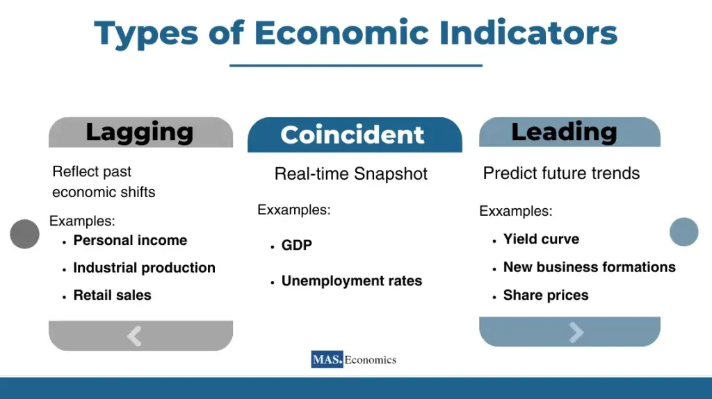

## Table of Contents

## What is an economy?

An economy is like a big system where people make, buy, and sell things. It includes everything from the food we eat to the cars we drive. People work to make these things, and they get paid money. They use that money to buy things they need or want. Businesses play a big role too. They make products and services, and they try to make a profit.

Sometimes, the economy can be good, and sometimes it can be bad. When it's good, lots of people have jobs, and they can buy more things. This makes businesses happy because they sell more. But when the economy is bad, it's harder for people to find jobs, and they might not have enough money to buy things. This can make businesses struggle. Governments often try to help by making rules and spending money to keep the economy strong.

## What are the main types of economies?

There are a few main types of economies that countries can have. The first type is a traditional economy. In a traditional economy, people do things the way their ancestors did. They might farm or fish, and they trade with each other. There isn't much change, and people stick to old ways of doing things.

Another type is a market economy. In a market economy, businesses and people decide what to make and buy. The government doesn't control things as much. Prices go up and down based on what people want and how much there is. This can make the economy grow fast, but it can also lead to big differences between rich and poor people.

The third type is a command economy. In a command economy, the government decides what to make, how much to make, and how much things should cost. The idea is to make sure everyone has what they need, but it can be hard for the government to know exactly what people want. Some countries mix these types and have a mixed economy, where both the government and the market play a role.

## How does a traditional economy differ from a market economy?

In a traditional economy, people do things the way they've always done them. They might farm, fish, or hunt, just like their parents and grandparents did. People in a traditional economy often trade goods with each other instead of using money. The way they live doesn't change much over time, and they stick to the customs and traditions of their community. This type of economy is usually found in small, rural areas where people don't have a lot of contact with the outside world.

In a market economy, things are very different. Here, businesses and people decide what to make and what to buy. The government doesn't tell them what to do. Prices go up and down based on how much people want something and how much of it there is. If a lot of people want something, the price goes up. If not many people want it, the price goes down. This can make the economy grow quickly, but it can also mean that some people get very rich while others stay poor. Market economies are common in big cities and countries that are connected to the global market.

## What is a command economy and where is it commonly found?

A command economy is a type of economy where the government makes all the big decisions. They decide what things should be made, how much should be made, and how much things should cost. The idea is to make sure everyone has what they need, like food, homes, and jobs. But sometimes, the government might not know exactly what people want, so it can be hard to keep everyone happy.

Command economies are often found in countries with strong central governments, like Cuba and North Korea. In these places, the government controls most of the businesses and tells people what jobs they should do. This can make things more equal, but it can also mean that people don't have as much freedom to choose what they want to do or buy.

## What are economic indicators and why are they important?

Economic indicators are like signs that tell us how well an economy is doing. They are numbers or data that show things like how many people have jobs, how much money people are spending, and how fast prices are going up. These indicators help us understand if the economy is growing or shrinking. Some common economic indicators are unemployment rates, inflation rates, and gross domestic product (GDP).

These indicators are important because they help people make decisions. For example, if the unemployment rate is low, it means more people have jobs, and that's good for the economy. Businesses might decide to make more things because people have money to spend. Governments also use these indicators to decide if they need to do something to help the economy. If the economy is doing badly, the government might spend more money or change rules to try to make it better. By keeping an eye on economic indicators, we can get a better idea of what might happen next in the economy.

## Can you explain Gross Domestic Product (GDP) and its significance?

Gross Domestic Product, or GDP, is the total value of all the goods and services made in a country in a year. It's like adding up everything that people buy, from food and clothes to cars and haircuts. If a country's GDP is going up, it usually means the economy is doing well. More things are being made and sold, and people have jobs and money to spend.

GDP is important because it gives us a big picture of how the economy is doing. Governments, businesses, and people all look at GDP to make decisions. If GDP is growing, it might mean it's a good time to start a new business or buy a house. But if GDP is going down, it could mean the economy is in trouble, and people might need to be careful with their money. By watching GDP, we can see if the economy is getting better or worse and plan for the future.

## What is inflation and how is it measured?

Inflation is when the prices of things we buy, like food and clothes, go up over time. It means that the same amount of money can buy less stuff than it used to. For example, if a candy bar cost $1 last year and now it costs $1.10, that's inflation. It happens because the cost of making things can go up, or because more people want to buy things than there are things to buy.

Inflation is measured using something called the Consumer Price Index, or CPI. The CPI looks at the prices of a bunch of different things that people usually buy, like groceries, gas, and rent. People who study the economy track these prices every month and see how much they've gone up or down. If the CPI goes up, it means there's inflation. Governments and businesses watch the CPI closely because it helps them understand how the economy is doing and make plans for the future.

## How do unemployment rates affect an economy?

Unemployment rates show how many people in a country don't have jobs and are looking for work. When the unemployment rate is high, it means a lot of people are out of work. This can be bad for the economy because people who don't have jobs don't have money to spend on things like food, clothes, and fun stuff. When people spend less, businesses make less money, and they might have to let more people go, which can make the unemployment rate go even higher.

On the other hand, when the unemployment rate is low, it means more people have jobs and are earning money. This is good for the economy because people with jobs can buy more things. When people spend more, businesses make more money and might hire more people, which can help keep the unemployment rate low. Governments often try to keep unemployment rates low by creating jobs or helping businesses grow, because a low unemployment rate usually means a stronger economy.

## What role do interest rates play in economic health?

Interest rates are like the price you pay for borrowing money, or the reward you get for saving it. When interest rates are low, it's cheaper for people and businesses to borrow money. They might take out loans to buy houses, start new businesses, or buy things they need. This can help the economy grow because more people are spending and investing. But if interest rates stay too low for too long, it can lead to too much borrowing and spending, which might cause prices to go up too fast, a situation called inflation.

On the other hand, when interest rates are high, borrowing money costs more. This can slow down the economy because people and businesses might not want to take out loans. They might spend less and save more instead. High interest rates can help control inflation by making people spend less, but if they're too high, it can make the economy slow down too much. Governments and central banks often change interest rates to keep the economy balanced, trying to avoid both too much inflation and too much slowdown.

## How do consumer confidence indexes reflect economic conditions?

Consumer confidence indexes tell us how people feel about the economy. They are like surveys where people say if they think things are going well or if they're worried about the future. If people feel good about the economy, they might spend more money on things they want, like new clothes or a vacation. This can help the economy grow because businesses sell more stuff and might hire more people.

On the other hand, if people are not feeling confident, they might hold onto their money and spend less. They might worry about losing their jobs or not having enough money later. When people spend less, it can slow down the economy because businesses don't sell as much and might have to let people go. So, consumer confidence indexes are important because they show us how people's feelings can affect the economy.

## What advanced indicators should economists monitor to predict economic trends?

Economists should keep an eye on something called the yield curve to predict economic trends. The yield curve shows the difference between the interest rates on short-term loans and long-term loans. When the yield curve is steep, it means long-term rates are much higher than short-term rates, which often means the economy is growing. But if the yield curve gets flat or even turns upside down, with short-term rates higher than long-term rates, it can be a warning sign that a recession might be coming. Watching the yield curve helps economists guess what might happen next in the economy.

Another important thing to watch is the Purchasing Managers' Index (PMI). The PMI is a number that shows how businesses are doing in the manufacturing and service sectors. If the PMI is above 50, it means these sectors are growing, which is good for the economy. But if it's below 50, it means they're shrinking, which could mean trouble ahead. By looking at the PMI, economists can get a sense of whether the economy is getting stronger or weaker. These advanced indicators help economists make better predictions about where the economy is headed.

## How do international trade balances impact national economies?

International trade balances show if a country is selling more things to other countries than it's buying, or if it's buying more than it's selling. When a country sells more than it buys, it has a trade surplus. This can be good because it means more money is coming into the country. People and businesses might have more money to spend and invest, which can help the economy grow. But if a country is buying more than it's selling, it has a trade deficit. This means money is going out of the country, and it might make the economy weaker if it goes on for a long time.

Trade balances can also affect things like jobs and prices. If a country has a trade surplus, it might mean more jobs for people who make things to sell to other countries. But if there's a trade deficit, it could mean fewer jobs in those industries because the country is buying more from other places. Trade balances can also change the value of a country's money. If a country has a big trade surplus, its money might become more valuable, making things from that country more expensive for other countries to buy. On the other hand, a trade deficit might make a country's money less valuable, which could make things cheaper for other countries but more expensive for people at home.

## What are the key economic indicators?

Economic indicators are critical for assessing the overall health and direction of an economy. They provide quantitative data that can be used by analysts, policymakers, and investors to understand economic trends, make decisions, and formulate strategies. The most widely watched indicators include Gross Domestic Product (GDP), unemployment rates, inflation, and the balance of trade. Each of these indicators offers unique insights into various facets of economic performance.

**Gross Domestic Product (GDP):** 

GDP is the total monetary or market value of all finished goods and services produced within a country's borders in a specific time period. It is a comprehensive measure of a nation’s overall economic activity and serves as an indicator of its economic health. GDP can be measured using three primary approaches: production (or output), income, and expenditure methods. The formula for GDP using the expenditure approach is:

$$
\text{GDP} = C + I + G + (X - M)
$$

where:
- $C$ represents consumption,
- $I$ stands for investment,
- $G$ denotes government spending,
- $X$ is exports, and
- $M$ is imports.

**Unemployment Rates:**

The unemployment rate is the percentage of the labor force that is jobless and actively seeking employment. It is a key indicator of labor market performance and economic strength. High unemployment rates can signal economic troubles, while low rates typically indicate economic prosperity. The unemployment rate is calculated as follows:

$$
\text{Unemployment Rate} = \left( \frac{\text{Number of Unemployed Persons}}{\text{Labor Force}} \right) \times 100
$$

**Inflation:**

Inflation measures the rate at which the general level of prices for goods and services rises, eroding purchasing power. It is commonly assessed using the Consumer Price Index (CPI) or the Producer Price Index (PPI). Persistent inflation can signify an overheating economy, while deflation or too-low inflation can indicate weak demand. Central banks often target an inflation rate as part of their monetary policy.

**Balance of Trade:**

The balance of trade is the difference between the value of a country's exports and imports over a specified period. It is a major component of a country's current account and an indicator of international trade balance. A trade surplus occurs when exports exceed imports, signaling a positive balance, whereas a trade deficit indicates imports outweigh exports. The balance of trade can affect a nation’s currency value and economic policies.

Each of these indicators is interrelated and can influence or reflect changes in another, making them essential instruments for understanding and navigating the economic landscape. Comprehensive analysis of these indicators helps in drawing meaningful conclusions about economic prospects and potential policy adjustments.

## References & Further Reading

[1]: Bergstra, J., Bardenet, R., Bengio, Y., & Kégl, B. (2011). ["Algorithms for Hyper-Parameter Optimization."](https://papers.nips.cc/paper/4443-algorithms-for-hyper-parameter-optimization) Advances in Neural Information Processing Systems 24.

[2]: ["Advances in Financial Machine Learning"](https://www.amazon.com/Advances-Financial-Machine-Learning-Marcos/dp/1119482089) by Marcos Lopez de Prado

[3]: ["Evidence-Based Technical Analysis: Applying the Scientific Method and Statistical Inference to Trading Signals"](https://www.amazon.com/Evidence-Based-Technical-Analysis-Scientific-Statistical/dp/0470008741) by David Aronson

[4]: ["Machine Learning for Algorithmic Trading"](https://github.com/PacktPublishing/Machine-Learning-for-Algorithmic-Trading-Second-Edition) by Stefan Jansen

[5]: ["Quantitative Trading: How to Build Your Own Algorithmic Trading Business"](https://books.google.com/books/about/Quantitative_Trading.html?id=j70yEAAAQBAJ) by Ernest P. Chan