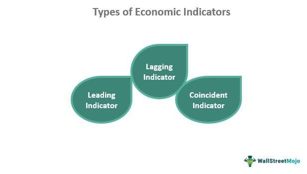

The global economy is a complex network of interrelated systems that play a crucial role in resource allocation. This interconnectedness impacts financial markets, influencing trade, investment, and strategy formation across geographies. Understanding the nuances of various economic structures, their indicators, and implications in trading is essential for financial professionals and investors alike.

There are different types of economies, each with unique characteristics. Market-based economies, such as the United States, thrive on the dynamics of supply and demand, allowing resources to be allocated based on consumer preferences and business innovations. Command-based economies, in contrast, rely heavily on government interventions and planning to direct economic activity, often found in countries with centralized planning systems. Mixed economies exhibit traits of both systems, balancing the efficiency of markets with the equity considerations of state intervention.



Economic indicators serve as vital tools to assess the health and trajectory of an economy. Key indicators include Gross Domestic Product (GDP), influencing decisions by indicating economic growth or contraction; unemployment rates, shedding light on labor market conditions; inflation rates, which affect purchasing power and monetary policy; and the balance of trade, impacting currency valuation and international economic relations.

In finance, the role of these economic indicators extends to algorithmic trading, where computers execute trades based on predefined criteria. By analyzing these indicators, algorithms can respond swiftly to market changes, making trading decisions devoid of human bias or emotion. An understanding of how economic factors influence trading strategies enables traders to predict trends, manage risks, and optimize returns effectively.

This comprehensive examination of economies and their indicators offers insights into how economic factors influence trading strategies, thereby underscoring the importance of continuous monitoring and analysis to retain a competitive advantage in the global trading landscape.

## Table of Contents

## Types of Economies

Economies around the globe are categorized into distinct types based on how their economic systems function and the role of government versus market forces. These classifications help in understanding how resources are allocated, how goods and services are produced, and how economic activities are managed.

Market-based economies are primarily driven by the forces of supply and demand with minimal government intervention. In such systems, prices are determined by the interaction of individuals and firms in free markets. The United States is often cited as a prime example where economic decisions are guided by the decentralized activities of buyers and sellers. Here, the invisible hand, a term popularized by economist Adam Smith, delineates how personal interest furthers economic benefits and efficiency.

In contrast, command-based economies are characterized by significant government control where decisions about what to produce, how much to produce, and for whom to produce are made by a centralized authority. These economies can swiftly mobilize resources on a large scale. However, they often struggle with inefficiencies and lack of innovation due to the absence of competition and profit incentives. Historical examples include the former Soviet Union and modern-day North Korea, where the government plays a dominant role in economic activities.

Mixed economies blend elements of both market and command economies, combining freedom and regulation to correct market failures and achieve social welfare goals. These systems feature private enterprise alongside government intervention to address issues such as environmental protection, social security, and monopolistic practices. For instance, countries like Canada and France exhibit mixed economic traits where healthcare and education are often provided by the state, while other sectors operate in a competitive market environment.

Each economic system offers distinct advantages and challenges, impacting the economic policies and development strategies adopted by nations. Understanding the typology of economies provides insight into global economic dynamics and the varied approaches to addressing economic challenges.

## Key Economic Indicators

Economic indicators are critical for assessing the overall health and direction of an economy. They provide quantitative data that can be used by analysts, policymakers, and investors to understand economic trends, make decisions, and formulate strategies. The most widely watched indicators include Gross Domestic Product (GDP), unemployment rates, inflation, and the balance of trade. Each of these indicators offers unique insights into various facets of economic performance.

**Gross Domestic Product (GDP):** 

GDP is the total monetary or market value of all finished goods and services produced within a country's borders in a specific time period. It is a comprehensive measure of a nation’s overall economic activity and serves as an indicator of its economic health. GDP can be measured using three primary approaches: production (or output), income, and expenditure methods. The formula for GDP using the expenditure approach is:

$$
\text{GDP} = C + I + G + (X - M)
$$

where:
- $C$ represents consumption,
- $I$ stands for investment,
- $G$ denotes government spending,
- $X$ is exports, and
- $M$ is imports.

**Unemployment Rates:**

The unemployment rate is the percentage of the labor force that is jobless and actively seeking employment. It is a key indicator of labor market performance and economic strength. High unemployment rates can signal economic troubles, while low rates typically indicate economic prosperity. The unemployment rate is calculated as follows:

$$
\text{Unemployment Rate} = \left( \frac{\text{Number of Unemployed Persons}}{\text{Labor Force}} \right) \times 100
$$

**Inflation:**

Inflation measures the rate at which the general level of prices for goods and services rises, eroding purchasing power. It is commonly assessed using the Consumer Price Index (CPI) or the Producer Price Index (PPI). Persistent inflation can signify an overheating economy, while deflation or too-low inflation can indicate weak demand. Central banks often target an inflation rate as part of their monetary policy.

**Balance of Trade:**

The balance of trade is the difference between the value of a country's exports and imports over a specified period. It is a major component of a country's current account and an indicator of international trade balance. A trade surplus occurs when exports exceed imports, signaling a positive balance, whereas a trade deficit indicates imports outweigh exports. The balance of trade can affect a nation’s currency value and economic policies.

Each of these indicators is interrelated and can influence or reflect changes in another, making them essential instruments for understanding and navigating the economic landscape. Comprehensive analysis of these indicators helps in drawing meaningful conclusions about economic prospects and potential policy adjustments.

## The Role of Economic Indicators in Trading

Economic indicators are essential in shaping market sentiment and influencing investor behavior. These metrics act as signals to traders, providing insights that are critical for strategy development and market trend prediction. Economic indicators are diverse, ranging from gross domestic product (GDP) figures, which reveal the economy's overall health and size, to unemployment rates, inflation, consumer price indexes, and trade balances.

Traders pay close attention to these indicators because they inform on the economic environment in which businesses operate. For instance, a favorable GDP report suggests economic expansion, often leading to boosted investor confidence. Such a report signals that businesses are likely performing well, potentially increasing their revenues and profits, thereby making their stocks more attractive to investors. This, in turn, can lead to increased investment activity and drive stock market indices upwards as capital flows into equity markets.

In practice, traders interpret these economic signals to anticipate market movements. A strong GDP growth figure might prompt traders to shift their portfolios towards equities, expecting that the economic upturn will support better corporate earnings and stock performance. Conversely, disappointing GDP growth could result in a more defensive investment strategy, with traders perhaps reallocating assets into bonds or other safe-haven investments to preserve capital.

Furthermore, economic indicators offer predictive power over specific sectors within the markets. If data points to rising unemployment rates, traders might become wary of consumer-focused sectors that heavily rely on discretionary spending, impacting movement in retail stocks. Alternatively, an uptick in inflation may have traders adjusting their expectations around [interest rate](/wiki/interest-rate-trading-strategies) changes, typically overseen by central banks, which directly impacts currency valuations and bond prices.

Therefore, integrating economic indicator analysis into trading strategies is indispensable. This involves continuously monitoring the release of these indicators and swiftly responding to the ripples they create across the financial markets. Using mathematical models, traders and analysts can quantify the probable impacts of each indicator on various asset classes, enhancing their decision-making precision and exploiting the subsequent market reactions for profit. This underscores the profound influence of economic indicators on the agitated ebb and flow of modern trading environments.

## Algorithmic Trading and Economic Indicators

Algorithmic trading represents a paradigm shift in the approach to financial markets, where computer algorithms execute trades based on pre-determined criteria, such as economic indicators. This method of trading is characterized by its speed, precision, and removal of human emotions, which can often cloud judgement.

Economic indicators, such as Gross Domestic Product (GDP), unemployment rates, and inflation, provide valuable insights into market conditions and are therefore integral to the development of automated trading strategies. These indicators are incorporated into algorithms to make informed decisions about the timing and nature of trades. For instance, a spike in GDP could prompt algorithms to initiate buy orders in anticipation of a positive market reaction.

To effectively utilize economic indicators in [algorithmic trading](/wiki/algorithmic-trading), algorithms must be designed to parse large volumes of economic data and identify relevant trends and patterns. Python, a popular programming language in the finance sector, is frequently used for this purpose. Below is an example of how one might use Python to incorporate economic data into a trading algorithm:

```python
import pandas as pd
from sklearn.linear_model import LinearRegression

# Sample data loading
economic_data = pd.read_csv('economic_indicators.csv')
price_data = pd.read_csv('asset_prices.csv')

# Feature selection
features = economic_data[['GDP_growth', 'unemployment_rate', 'inflation_rate']]
target = price_data['price_change']

# Train a simple linear regression model
model = LinearRegression()
model.fit(features, target)

# Use the model to predict future price changes based on new economic data
new_economic_data = pd.DataFrame({
    'GDP_growth': [3.0],
    'unemployment_rate': [5.2],
    'inflation_rate': [2.1]
})

predicted_change = model.predict(new_economic_data)
print(f"Predicted price change: {predicted_change[0]}")
```

This example demonstrates the use of economic indicators as inputs in a [machine learning](/wiki/machine-learning) model to predict asset price movements. Such predictions are then used to guide trading decisions, demonstrating the power and efficiency of algorithmic trading systems.

Incorporating economic data into these algorithms requires not only programming skill and knowledge of financial markets but also an understanding of data processing techniques to handle incomplete or noisy data. Further, the automated nature of algorithmic trading allows for the continuous monitoring of economic releases, ensuring that reactions are timely and consistent with pre-defined trading strategies.

Successful algorithmic trading relies on the accurate analysis and application of economic indicators, transforming economic insights into actionable trading strategies that can adapt to changing market conditions.

## Case Studies of Economic Indicators in Algorithmic Trading

Several examples illustrate how economic indicators impact trading strategies in algorithmic trading:

One notable case study involves the application of unemployment data in forecasting stock price movements. Unemployment rates are a crucial economic indicator reflecting the health of an economy. In algorithmic trading, unemployment data can be used to predict stock market trends. For instance, a lower unemployment rate generally indicates a robust economy, leading to higher consumer spending and potentially boosting stock prices. By incorporating unemployment data into trading algorithms, traders can adjust their portfolios to capitalize on shifts in market conditions. For example, Python's `pandas` library facilitates the analysis of historical unemployment data, which can be integrated into algorithms to identify correlations with stock market indices.

```python
import pandas as pd

# Load unemployment data
unemployment_df = pd.read_csv('unemployment_data.csv')

# Simple moving average of unemployment rate
unemployment_df['SMA_Unemployment'] = unemployment_df['UnemploymentRate'].rolling(window=3).mean()

# Analyze correlation with stock index
correlation_matrix = unemployment_df.corr()
print(correlation_matrix['StockIndex'])
```

Another case study examines how inflation rates influence [forex](/wiki/forex-system) trading algorithms. Inflation rates directly affect currency value and purchasing power, making them significant for forex traders. An increase in inflation rates might lead to the depreciation of a currency, whereas lower inflation can strengthen it. Algorithmic trading systems use inflation data to forecast currency movements and adjust trading positions accordingly. Forex algorithms often employ econometric models to analyze inflation data, adapting strategies to hedge against inflationary risks.

For instance, an algorithm can implement an autoregressive integrated moving average (ARIMA) model to predict future inflation rates and their impact on currency values:

```python
from statsmodels.tsa.arima.model import ARIMA

# Inflation data
inflation_data = [2.1, 2.3, 2.5, 2.6, 2.4, 2.7, 2.9]  # Example inflation rates

# ARIMA model
model = ARIMA(inflation_data, order=(5, 1, 0))
model_fit = model.fit()

# Predict future inflation rates
forecast = model_fit.forecast(steps=5)
print(forecast)
```

These case studies underscore the importance of integrating economic indicators into algorithmic trading strategies. By leveraging algorithms to analyze unemployment and inflation data, traders enhance their decision-making processes, anticipating market changes and optimizing trading outcomes.

## Challenges and Considerations

Economic data presents several challenges for algorithmic traders due to its inherent [volatility](/wiki/volatility-trading-strategies) and frequent revisions. The unpredictability of economic [statistics](/wiki/bayesian-statistics) can lead to significant changes in market sentiment and abrupt price movements. For example, if unemployment data is revised post-release, it can alter traders' perceptions and potentially invalidate algorithms designed on preliminary figures. Such scenarios underline the necessity for traders to adapt swiftly to changes in order to manage risk effectively.

Robust risk management practices are crucial for mitigating potential losses resulting from unexpected economic shifts. Implementing stop-loss orders, which automatically sell assets when they drop to a predetermined price, is a fundamental tactic to limit losses. Similarly, employing trailing stops allows traders to secure gains while still protecting against adverse market movements by automatically adjusting the stop price based on an asset's price fluctuations.

Diversification is another key strategy to reduce risk exposure. By spreading investments across a variety of asset classes, sectors, or regions, traders can minimize potential losses that might occur if a particular segment is negatively affected by economic volatility.

Moreover, algorithmic traders must incorporate real-time data analysis to ensure their models remain relevant and responsive to current market conditions. Python, with libraries such as pandas for data manipulation and scikit-learn for predictive analytics, is an ideal tool to handle this requirement. The following Python code snippet demonstrates a simple moving average crossover strategy, adjusted for economic data inputs:

```python
import pandas as pd
import numpy as np

# Load economic and price data
price_data = pd.read_csv('price_data.csv')
economic_data = pd.read_csv('economic_data.csv')

# Calculate moving averages
price_data['SMA_20'] = price_data['Close'].rolling(window=20).mean()
price_data['SMA_50'] = price_data['Close'].rolling(window=50).mean()

# Factor in economic data
price_data = price_data.merge(economic_data, on='Date')
price_data['Adjusted_Close'] = price_data['Close'] * price_data['Economic_Indicator']

# Generate buy/sell signals
price_data['Signal'] = np.where(price_data['SMA_20'] > price_data['SMA_50'], 1, 0)
price_data['Position'] = price_data['Signal'].diff()

# Implement risk management
price_data['Stop_Loss'] = price_data['Adjusted_Close'] * 0.9  # Example stop-loss threshold
```

The necessity for continuous monitoring cannot be overstressed as economic landscapes shift rapidly. Algorithmic models must be frequently backtested against historical data to verify their effectiveness and recalibrated as necessary to adjust to the latest economic indicators. Risk management, diversification, and continuous algorithm calibration are essential practices to navigate the complexities of trading in volatile economic environments efficiently.

## Conclusion

Economic indicators significantly influence both traditional and algorithmic trading strategies. These indicators, such as GDP, inflation rates, and unemployment figures, provide crucial insights into market conditions and economic health. They enable traders to anticipate market trends, adjust their strategies, and make informed decisions.

For successful trading, understanding how these indicators interact with market dynamics is vital. For instance, a robust GDP growth figure might signal a bullish market trend, encouraging investment and influencing stock prices positively. Conversely, rising unemployment rates might lead to bearish sentiment, affecting market [liquidity](/wiki/liquidity-risk-premium) and investor behavior. These indicators serve as signals that traders can use to optimize entry and [exit](/wiki/exit-strategy) points in various markets.

Moreover, the continuous monitoring and analysis of economic data allow traders to maintain a competitive edge. With the rapid dissemination of data, traders need to be agile, adapting quickly to changes. Algorithmic trading, in particular, relies on real-time data analysis to execute trades rapidly and efficiently. By leveraging algorithms that incorporate economic indicators, traders can reduce the emotional biases inherent in manual trading, making objective decisions based on quantitative data.

Incorporating economic indicators into trading algorithms requires both technical expertise and an in-depth understanding of economic principles. Successful algorithmic trading strategies often combine technical analysis with economic fundamentals, ensuring a comprehensive approach to market analysis.

In conclusion, economic indicators are indispensable tools in both traditional and algorithmic trading. The strategic use of these indicators can significantly enhance trading outcomes, leading to more informed and successful investment strategies. Maintaining a vigilant approach to economic data helps traders navigate the complexities of financial markets, fostering sustainability and growth in their trading endeavors.

## References & Further Reading

[1]: Bergstra, J., Bardenet, R., Bengio, Y., & Kégl, B. (2011). ["Algorithms for Hyper-Parameter Optimization."](https://papers.nips.cc/paper/4443-algorithms-for-hyper-parameter-optimization) Advances in Neural Information Processing Systems 24.

[2]: ["Advances in Financial Machine Learning"](https://www.amazon.com/Advances-Financial-Machine-Learning-Marcos/dp/1119482089) by Marcos Lopez de Prado

[3]: ["Evidence-Based Technical Analysis: Applying the Scientific Method and Statistical Inference to Trading Signals"](https://www.amazon.com/Evidence-Based-Technical-Analysis-Scientific-Statistical/dp/0470008741) by David Aronson

[4]: ["Machine Learning for Algorithmic Trading"](https://github.com/PacktPublishing/Machine-Learning-for-Algorithmic-Trading-Second-Edition) by Stefan Jansen

[5]: ["Quantitative Trading: How to Build Your Own Algorithmic Trading Business"](https://books.google.com/books/about/Quantitative_Trading.html?id=j70yEAAAQBAJ) by Ernest P. Chan