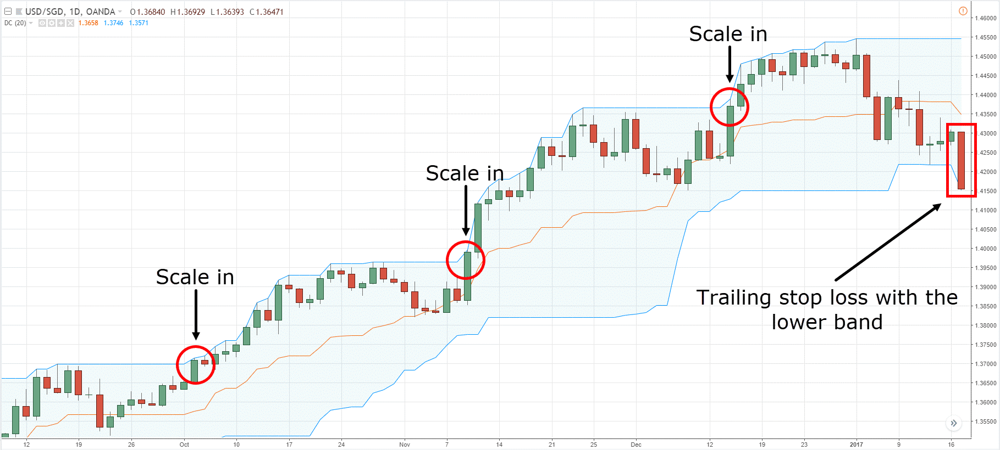

## Table of Contents

## Who is Ed Seykota and why is he significant in the trading world?

Ed Seykota is a famous trader and a pioneer in the world of systematic trading. He was born in 1946 and started his career in the 1970s. Seykota is known for developing one of the first successful computer trading systems. He used computers to find patterns in the market and make trades based on those patterns. This was a big deal because, at the time, most trading was done by people, not computers.

Seykota is also important because he shared his knowledge and helped others learn about trading. He was featured in the book "Market Wizards" by Jack D. Schwager, where he talked about his methods and philosophy. Seykota believes in following trends and letting your profits run. He also teaches that managing your emotions is key to being a successful trader. Many traders today still use the ideas and strategies that Seykota developed and shared.

## What are the basic principles of Ed Seykota's trading strategies?

Ed Seykota's trading strategies are based on a few key ideas. One of the main principles is trend following. This means he looks for patterns in the market and follows them. If the market is going up, he buys, and if it's going down, he sells. He believes that trends can last a long time, so it's important to stay with them and not get out too early. Another important idea is to let your profits run. This means that when a trade is going well, you should keep it going and not sell too soon. Seykota says that the big money is made by holding on to winning trades.

Another principle Seykota follows is risk management. He knows that not every trade will be a winner, so he makes sure to limit his losses. He does this by setting stop-loss orders, which automatically sell a stock if it drops to a certain price. This helps him protect his money. Seykota also believes in keeping things simple. He uses clear and simple rules for his trading system, which makes it easier to follow and understand. By sticking to these basic principles, Seykota has been able to achieve great success in trading.

## How does Ed Seykota define and use trend following in his trading?

Ed Seykota uses [trend following](/wiki/trend-following) to make money in trading. He looks at the market to see if prices are going up or down over time. If he sees that prices are going up, he buys. If he sees that prices are going down, he sells. He believes that trends can last a long time, so it's important to keep following them. He doesn't try to guess when the trend will end. Instead, he stays with it until it clearly changes direction.

Seykota's way of trend following is simple but effective. He uses a computer to help him see the trends in the market. The computer looks at past prices and helps him decide when to buy or sell. He also makes sure to let his profits grow. When a trade is going well, he keeps it going and doesn't sell too soon. This way, he can make more money from the winning trades. By following these simple rules, Seykota has been very successful in trading.

## What role does risk management play in Seykota's trading approach?

Risk management is very important in Ed Seykota's trading approach. He knows that not every trade will be a winner, so he works hard to limit his losses. Seykota uses stop-loss orders to help with this. A stop-loss order automatically sells a stock if its price drops to a certain level. This helps him avoid losing too much money on a single trade. By using stop-loss orders, Seykota can protect his money and stay in the game for the long run.

Another part of Seykota's risk management is keeping his trading simple. He uses clear and easy-to-follow rules for his trading system. This makes it easier for him to stick to his plan and not get confused or emotional. Seykota believes that managing your emotions is just as important as managing your money. By staying calm and sticking to his simple rules, he can make better decisions and avoid big mistakes. This careful approach to risk management helps Seykota achieve success in trading.

## Can you explain the concept of 'systems thinking' as applied by Ed Seykota?

Ed Seykota uses systems thinking to understand and trade the markets. Systems thinking means looking at how all the parts of a system work together, not just focusing on one thing. For Seykota, this means seeing the market as a whole system, where everything is connected. He uses computers to help him see these connections and find patterns in the market. By understanding how different parts of the market affect each other, Seykota can make better trading decisions.

Seykota also applies systems thinking to his own trading strategies. He creates simple rules for his trading system and follows them carefully. This helps him manage risk and stay disciplined. He believes that the market is like a system that can be understood and predicted, as long as you look at it the right way. By using systems thinking, Seykota can stay calm and make smart choices, even when the market is changing fast.

## How does Seykota incorporate psychological aspects into his trading?

Ed Seykota knows that trading is not just about numbers and charts; it's also about understanding your own mind. He believes that managing your emotions is just as important as managing your money. Seykota says that many traders lose money because they let their feelings get in the way. When the market goes down, they might panic and sell too soon. When it goes up, they might get too excited and take big risks. Seykota teaches that staying calm and following a clear plan can help you avoid these mistakes.

To help with this, Seykota uses simple rules for his trading system. By sticking to these rules, he can keep his emotions in check. He also believes in learning from your mistakes and not repeating them. Seykota says that if you can control your feelings and stick to your plan, you'll be a better trader. This way of thinking has helped him be successful in trading for many years.

## What are some specific tools or indicators that Ed Seykota uses in his trading?

Ed Seykota uses a few key tools and indicators to help him trade. One of the main tools he uses is a computer program to analyze market data. This program helps him find trends and patterns in the market. He looks at moving averages, which are lines that show the average price of a stock over a certain time. If the price is above the moving average, it might be a good time to buy. If it's below, it might be a time to sell.

Another important tool for Seykota is the stop-loss order. This is a way to limit his losses by setting a price at which his computer will automatically sell a stock if it drops too much. This helps him protect his money and stay in the game for the long run. Seykota also pays attention to the overall market trend. He doesn't use a lot of different indicators, but he sticks to the ones that work well for him and help him follow his simple trading rules.

## How does Ed Seykota approach the development and testing of trading systems?

Ed Seykota believes in keeping things simple when he develops and tests trading systems. He starts by coming up with clear and easy rules for his system. These rules are based on what he sees in the market and the trends he wants to follow. He uses a computer to help him see these trends and patterns. The computer looks at past prices and helps him decide when to buy or sell. Seykota makes sure the rules are easy to follow so he can stick to them and not get confused or emotional.

Once he has his rules, Seykota tests his system by using old market data. This is called [backtesting](/wiki/backtesting). He pretends to trade with the old data to see if his system would have made money. He looks at how well the system does over a long time, not just a short time. This helps him see if the system is really good or if it just got lucky. If the system does well in the backtesting, Seykota will start using it for real trading. But he keeps watching it and makes changes if he needs to, always trying to make it better.

## What are some common mistakes that traders make, according to Ed Seykota, and how can they be avoided?

Ed Seykota says that many traders make mistakes because they let their feelings get in the way. They might panic and sell their stocks too soon when the market goes down, or they might get too excited and take big risks when the market goes up. Seykota believes that traders should stay calm and stick to their trading plan. By following clear and simple rules, traders can avoid making decisions based on their emotions. He also says that traders often try to guess when the market will change direction, but this is hard to do and can lead to losses. Instead, Seykota suggests following the trend and letting your profits grow until the trend clearly changes.

Another common mistake Seykota points out is not managing risk well. Some traders don't use stop-loss orders, which can help limit their losses. Seykota thinks it's important to set these orders so that you don't lose too much money on one trade. He also warns against using too many different indicators and tools, which can make trading confusing. Instead, he suggests using a few simple tools and sticking to them. By keeping things simple and managing risk carefully, traders can avoid these common mistakes and do better in the market.

## How has Ed Seykota's trading strategy evolved over the years?

Ed Seykota's trading strategy has changed a bit over the years, but he still sticks to the main ideas that made him successful. He started out in the 1970s using one of the first computer trading systems. Back then, he used the computer to find trends in the market and follow them. He believed in keeping things simple and using clear rules for his trading system. Over time, he has kept using computers to help him trade, but he has also learned more about how to manage his emotions and stick to his plan. Even as the market and technology have changed, Seykota still follows the same basic ideas of trend following, letting profits run, and managing risk.

One big change in Seykota's strategy is how he teaches others about trading. He used to keep his methods to himself, but after being featured in the book "Market Wizards," he started sharing his knowledge more. He now helps other traders learn about trend following and risk management. Seykota also talks a lot about the importance of psychology in trading. He believes that managing your feelings is just as important as managing your money. Even though he shares more now, he still keeps his trading system simple and effective. By sticking to these principles, Seykota has been able to adapt to the changing market and stay successful.

## Can you discuss any case studies or examples where Ed Seykota's strategies were particularly successful?

One famous example of Ed Seykota's success is his trading in the soybean market in the 1970s. Seykota used his computer trading system to spot a trend in soybean prices. He saw that the prices were going up, so he bought soybeans and held onto them. Even when the prices went down a bit, he didn't panic. He followed his simple rules and kept his trades going. In the end, the soybean prices kept going up, and Seykota made a lot of money. This shows how his strategy of trend following and letting profits run can work well.

Another example is how Seykota helped other traders. He taught a group of traders his methods, and they used his system to trade in the futures market. They followed the trends and managed their risks carefully, just like Seykota. Over time, this group of traders made a lot of money. This shows that Seykota's strategies can be successful for other people too, not just for him. By keeping things simple and sticking to his plan, Seykota and his students were able to do well in the market.

## What advanced techniques does Ed Seykota use to optimize his trading performance?

Ed Seykota uses advanced techniques to make his trading better. One of these is backtesting. He uses old market data to see how his trading system would have done in the past. This helps him find out if his system is good or if it just got lucky. Seykota also keeps changing his system to make it better. He looks at how it's doing and makes small changes to the rules if he needs to. This way, he can keep up with the market as it changes.

Another technique Seykota uses is keeping his emotions in check. He knows that feelings can make traders do silly things, like selling too soon or taking big risks. So, he sticks to his simple rules and doesn't let his feelings get in the way. By staying calm and following his plan, Seykota can make better decisions and avoid big mistakes. This helps him trade well over a long time.

## References & Further Reading

[1]: Schwager, J. D. (2006). ["The New Market Wizards: Conversations with America's Top Traders."](https://www.amazon.com/New-Market-Wizards-Conversations-Americas/dp/0887306675) Wiley.

[2]: Seykota, E. T. (1992). ["Govopoly in the 39th Day."](https://www.edseykota.com/conversion/home/home.php) New Adam Publishers.

[3]: Luca, J. A. (2016). ["Technical Analysis and Algorithmic Trading."](https://onlinelibrary.wiley.com/doi/pdf/10.1002/9781119201823.ch6) Packt Publishing.

[4]: Kaufman, P. J. (2013). ["Trading Systems and Methods."](https://onlinelibrary.wiley.com/doi/book/10.1002/9781119202561) Wiley.

[5]: Murphy, J. J. (1999). ["Technical Analysis of the Financial Markets: A Comprehensive Guide to Trading Methods and Applications."](https://www.amazon.com/Technical-Analysis-Financial-Markets-Comprehensive/dp/0735200661) New York Institute of Finance.