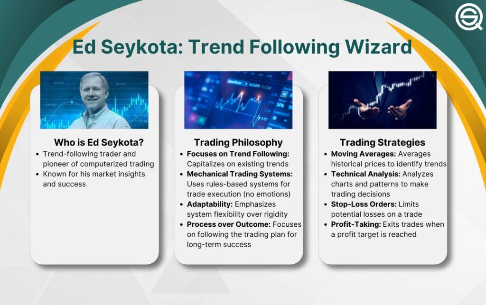

Ed Seykota is recognized as a leading figure in algorithmic trading, often regarded as a pioneer in the development of computerized trading systems. His groundbreaking work in the field has established a framework for modern trading strategies that rely heavily on technology and data analytics. This article examines Seykota's career trajectory, highlighting how his innovative approach to market analysis and risk management transformed a modest investment into substantial wealth. Notably, he turned an initial $5,000 investment into $15 million over the span of 12 years, a feat that underscores his proficiency in understanding market dynamics and disciplined trading.

Seykota's influence extends beyond mere numbers; his philosophies significantly impact trading psychology. He emphasizes emotional discipline as a core component of successful trading, advocating for a mindset that prioritizes rational decision-making over impulsive reactions. By exploring the principles that guided his strategies, such as trend following and systematic risk management, this article will illuminate Seykota's enduring impact on the trading industry. His contributions provide invaluable lessons for traders, illustrating how technology and psychology can converge to yield successful investment strategies. Through his work, Seykota has left a lasting legacy that continues to shape the methodologies of contemporary financial markets.



## Table of Contents

## Who is Ed Seykota?

Ed Seykota is a renowned figure in trading, known for his pioneering contributions to the development of algorithmic trading systems. Born in the Netherlands and raised in the United States, Seykota holds a degree in electrical engineering from the Massachusetts Institute of Technology (MIT), a background that significantly influenced his approach to trading. Utilizing his technical expertise, Seykota revolutionized technical analysis, moving beyond traditional methods prevalent during his early career.

Seykota's recognition grew substantially following his feature in Jack Schwager's acclaimed book series, "Market Wizards," which highlighted some of the most successful traders in the world. This exposure cemented his reputation as an innovator in the trading community.

Embarking on his trading career in the 1970s, Seykota was among the first to develop commercial trading systems, a groundbreaking advancement for the time. His strategic focus was trend following, a method where traders adopt long or short positions by identifying the direction and strength of market trends. This approach emphasizes capitalizing on market momentum, rather than attempting to predict market movements.

Seykota is particularly celebrated for an extraordinary achievement: transforming an initial investment of $5,000 into $15 million over a span of 12 years. This feat underscored the efficacy of his trend-following strategies and risk management techniques, showcasing the potential of systematic trading. The success of Seykota's methods has inspired subsequent generations of traders and continues to influence contemporary trading practices.

## The Evolution of Algo Trading

Ed Seykota's pioneering efforts in [algorithmic trading](/wiki/algorithmic-trading) have significantly contributed to the evolution of systematic trading strategies. Initially, his methods relied heavily on moving averages, a technical indicator used to identify market trends by smoothing out price data over a specified period. These moving averages formed the basis of his rules-based trading systems which were among the first to be tested on early computer systems in the 1970s. By automating these systems, Seykota could consistently apply his trading principles without being swayed by market emotions.

The core of Seykota's success lay in his systematic trend-following strategies. This approach involves identifying and capitalizing on strong market trends, holding positions during favorable trends, and exiting them when the trend begins to reverse. This methodology is underpinned by disciplined risk management, particularly through the practice of cutting losses quickly while allowing successful trades to run their [course](/wiki/best-algorithmic-trading-courses), thus maximizing potential profits.

Seykota underscored the significance of emotional discipline in making trading decisions. By adhering to a systematic approach, he minimized the influence of emotions, such as fear and greed, which often lead to irrational trading decisions. This emphasis on emotional discipline was a crucial aspect in transitioning from intuitive, discretionary trading methods to more structured, data-driven techniques. Algorithms provide a way to mitigate human emotional biases, allowing traders to adhere strictly to pre-defined strategies, thus helping in consistent performance over time.

Moreover, by focusing on quantitative methods, Seykota set the stage for other traders and technologists to further develop and refine algorithmic trading systems. His work demonstrated the effectiveness of computational resources in enhancing trading efficiencies and risk management, influencing the broader shift towards algorithmic processes that we observe in today's financial markets. This transition from purely intuitive methods to systematic data-driven techniques underlines the substantial impact of Ed Seykota's contributions to modern trading practices.

## Key Trading Principles

Ed Seykota's trading philosophy is anchored in [trend following](/wiki/trend-following) and effective risk management, two components critical to his long-term success in financial markets. His approach to trading begins with capital preservation, and he famously emphasized the importance of cutting losses swiftly to protect the trading account from significant drawdowns. Seykota's principle of "letting your winners run" complements his focus on minimizing losses. By allowing profitable trades to continue their course, he ensured that the gains would outweigh the occasional losses, thereby promoting a favorable risk-reward ratio.

A key aspect of Seykota's methodology is adherence to systematic rules, which served to minimize emotional biases that often plague decision-making in trading. By following a set of predetermined trading rules, Seykota could maintain objectivity and consistency in executing trades. This systematic approach helps traders stick to their strategy, avoiding the pitfalls of emotional reactions during market [volatility](/wiki/volatility-trading-strategies).

Understanding market dynamics was crucial for Seykota, as it allowed him to identify prevailing trends and make informed trading decisions. He employed technical indicators, such as moving averages and other [momentum](/wiki/momentum)-based tools, to evaluate market trends and determine entry and [exit](/wiki/exit-strategy) points. These indicators serve as mathematical or statistical calculations based on historical price, [volume](/wiki/volume-trading-strategy), or open interest information. By using these tools, Seykota could quantify market behavior and reduce the subjective nature of trading. 

The application of such technical analysis techniques aligns well with Seykota's trend-following philosophy as they provide a structured framework for identifying and capitalizing on market trends. For instance, a basic moving average crossover strategy involves buying when a short-term moving average crosses above a long-term moving average, signaling a potential upward trend, and selling when the opposite occurs.

In the context of algorithmic trading, these strategies can be coded into trading systems using programming languages like Python. Here is a simple example of how a moving average crossover strategy might be implemented:

```python
import pandas as pd

# Load market data
data = pd.read_csv('market_data.csv')
data['Short_MA'] = data['Close'].rolling(window=5).mean()
data['Long_MA'] = data['Close'].rolling(window=20).mean()

# Generating trading signals
data['Signal'] = 0
data['Signal'][data['Short_MA'] > data['Long_MA']] = 1
data['Signal'][data['Short_MA'] <= data['Long_MA']] = -1

# Define positions
data['Position'] = data['Signal'].shift(1)
```

This code lays the foundation for a systematic, trend-following algorithm, illustrating how Seykota's principles can be operationalized in contemporary trading environments. The strategic focus on risk management, trend identification, and emotional discipline remains integral to successful trading and investment strategies even today.

## Ed Seykota's Influence on Contemporary Trading

Ed Seykota's influence on contemporary trading is profound, as he was one of the first to demonstrate the viability and effectiveness of automated trading systems. His methods have served as a blueprint for modern traders, with his innovative use of technology shaping the landscape of trading.

Seykota's pioneering efforts in developing automated trading systems inspired future generations of traders. By integrating computer-based systems into his trading strategy, he underscored the potential for automation to enhance trading performance. His insights into trading psychology and market behavior highlighted the critical importance of understanding and managing emotions in the decision-making process. This emphasis on psychological insights was instrumental in guiding traders to develop disciplined and systematic approaches, minimizing the influence of emotional biases.

Seykota's legacy is particularly evident in the widespread adoption of algorithmic systems in contemporary trading. His work laid a foundational framework for the creation of sophisticated algorithms that analyze market trends and execute trades efficiently. These systems employ complex mathematical models and statistical techniques to identify profitable opportunities and manage risk effectively.

Traders today continue to explore Seykota's techniques as they seek sustainable investment strategies. The principles he championed, such as trend following and systematic rule-based trading, remain integral to many algorithmic trading models used in financial markets globally. His influence is seen in the continued integration of data analytics and computer science into trading, encouraging a more scientific and methodical approach to market analysis.

Overall, Seykota's contributions have not only shaped the tools and methods used by traders but also fostered a transformative mindset that prioritizes emotional discipline, risk management, and innovative technology in the pursuit of trading success. His impact endures as traders and institutions alike build upon his pioneering work to navigate the complexities of today's financial markets.

## Conclusion

Ed Seykota remains a pivotal figure in the history of trading strategies, merging technological innovation with market acumen. His groundbreaking work in developing the first computerized trading systems has influenced the methods of countless traders and continues to impact the world of finance. Seykota's emphasis on discipline, particularly in risk management and data-driven decisions, has become a guiding principle for modern traders who seek to navigate the complexities of financial markets effectively.

Seykota’s legacy in trend following and algorithmic trading systems is firmly established in financial history. By prioritizing systematic approaches and minimizing emotional biases, he demonstrated the efficacy of merging automated strategies with disciplined trading practices. His methods, combining mathematical analysis with strategic foresight, underpin many of today’s trading systems.

As the landscape of trading evolves, Seykota's principles serve as a foundational guide for traders worldwide. The proliferation of algorithmic trading owes much to his early innovations, which showcased the advantages of automated decision-making processes. Traders continually draw inspiration from his techniques, adapting them to newer, more volatile markets while maintaining the core concepts of trend following and risk management.

Embodying the spirit of innovation, Seykota's journey showcases the power of integrating technical prowess with trading. His career exemplifies the ability to transform theoretical insights into practical applications, emphasizing that successful trading goes beyond mere instinct. By uniting these elements, Seykota's contributions continue to resonate within the trading community, offering enduring strategies for sustainable investment.

## References & Further Reading

[1]: Schwager, J. D. (2006). ["The New Market Wizards: Conversations with America's Top Traders."](https://www.amazon.com/New-Market-Wizards-Conversations-Americas/dp/0887306675) Wiley.

[2]: Seykota, E. T. (1992). ["Govopoly in the 39th Day."](https://www.edseykota.com/conversion/home/home.php) New Adam Publishers.

[3]: Luca, J. A. (2016). ["Technical Analysis and Algorithmic Trading."](https://onlinelibrary.wiley.com/doi/pdf/10.1002/9781119201823.ch6) Packt Publishing.

[4]: Kaufman, P. J. (2013). ["Trading Systems and Methods."](https://onlinelibrary.wiley.com/doi/book/10.1002/9781119202561) Wiley.

[5]: Murphy, J. J. (1999). ["Technical Analysis of the Financial Markets: A Comprehensive Guide to Trading Methods and Applications."](https://www.amazon.com/Technical-Analysis-Financial-Markets-Comprehensive/dp/0735200661) New York Institute of Finance.