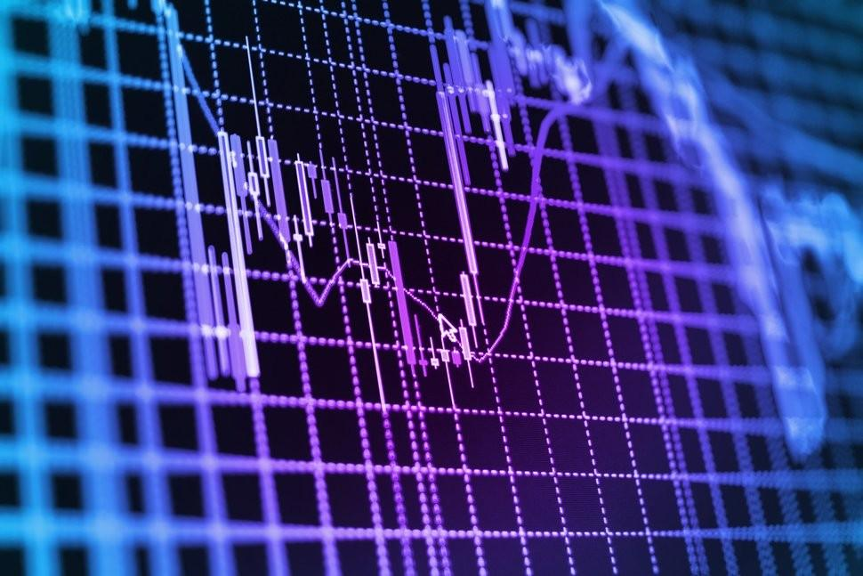

## Table of Contents

## What is Edgehog Trading?

Edgehog Trading is a way of trading in financial markets where people use special tools and methods to find the best times to buy and sell. These tools help traders see patterns and trends in the market that others might miss. By using these patterns, traders can make smarter choices about when to trade, hoping to make more money.

The main idea behind Edgehog Trading is to have an edge over other traders. This means using technology and smart strategies to be better at predicting what will happen in the market. Traders who use Edgehog Trading often look at a lot of data and use computer programs to help them make decisions. This can make trading more successful, but it also needs a lot of learning and practice.

## How does Edgehog Trading differ from traditional trading methods?

Edgehog Trading is different from traditional trading because it uses special tools and technology to find the best times to buy and sell. In traditional trading, people often rely on basic charts and their own experience to make decisions. But with Edgehog Trading, traders use computer programs and a lot of data to spot patterns that are hard to see with just the human eye. This helps them make smarter choices about when to trade.

Another big difference is that Edgehog Trading aims to give traders an edge over others. This means they try to be better at predicting what will happen in the market by using technology and smart strategies. Traditional trading might not use as many advanced tools, so it can be harder to find these special patterns. Edgehog Trading requires a lot of learning and practice, but it can lead to more successful trades if done right.

## What are the basic principles of Edgehog Trading?

Edgehog Trading is all about using special tools and technology to find the best times to buy and sell in the financial markets. The main idea is to have an edge over other traders by using computer programs and a lot of data to spot patterns that are hard to see with just the human eye. This helps traders make smarter choices about when to trade, which can lead to better results.

The basic principle of Edgehog Trading is to use these patterns and trends to predict what will happen in the market. Traders look at a lot of information and use technology to help them make decisions. This way of trading needs a lot of learning and practice, but it can make trading more successful if done right.

## What tools and platforms are commonly used in Edgehog Trading?

In Edgehog Trading, people use special computer programs and platforms to help them trade better. These tools can look at a lot of data quickly and find patterns that are hard to see. Some popular tools include trading software like MetaTrader 4 and 5, which let traders use special programs called Expert Advisors to make trades automatically. Another tool is TradingView, which is great for looking at charts and sharing ideas with other traders.

There are also platforms like NinjaTrader and Thinkorswim that offer advanced tools for analyzing the market. These platforms can help traders see trends and make decisions based on a lot of information. Many traders also use special computer programs called algorithms to help them trade. These algorithms can look at data and make trades without the trader having to do everything by hand.

## How can a beginner start with Edgehog Trading?

If you're a beginner wanting to start with Edgehog Trading, the first thing you should do is learn the basics of trading. This means understanding how the financial markets work and what affects prices. You can find a lot of free resources online, like videos and articles, that can help you learn. Once you have a good grasp of the basics, start looking into the tools and platforms used in Edgehog Trading, like MetaTrader and TradingView. These tools can help you analyze the market and spot patterns that are hard to see with just your eyes.

Next, practice using these tools with a demo account. Most trading platforms offer demo accounts where you can trade with pretend money. This is a safe way to get used to the tools and practice your trading strategies without risking real money. As you get more comfortable, you can start learning about more advanced strategies and algorithms used in Edgehog Trading. Remember, it takes time and practice to get good at this, so be patient and keep learning.

## What are the risks associated with Edgehog Trading?

Edgehog Trading can be risky because it uses a lot of technology and data to make decisions. If the computer programs or algorithms you use are not set up right, they might make bad trades. This can lead to losing money. Also, the market can change quickly, and if your tools don't keep up, you might miss out on good chances to trade or make the wrong moves.

Another risk is that Edgehog Trading needs a lot of learning and practice. If you're new to trading, it can be hard to understand all the tools and strategies. You might make mistakes because you don't know enough yet. It's important to start slow and use demo accounts to practice before you use real money. This way, you can learn without losing money while you get better at trading.

## How can one develop a successful Edgehog Trading strategy?

To develop a successful Edgehog Trading strategy, start by learning the basics of trading and how the financial markets work. Spend time understanding what affects prices and how to read charts. Once you have a good grasp of these basics, dive into the tools and platforms used in Edgehog Trading, like MetaTrader and TradingView. These tools can help you analyze the market and spot patterns that are hard to see with just your eyes. Practice using these tools with a demo account, where you can trade with pretend money. This way, you can try out different strategies and see what works best without risking real money.

As you get more comfortable with the tools, start learning about more advanced strategies and algorithms used in Edgehog Trading. These can help you make better predictions about the market. It's important to keep testing and refining your strategy. Look at your past trades to see what worked and what didn't, and adjust your approach based on what you learn. Remember, developing a successful strategy takes time and practice, so be patient and keep learning. With dedication and the right approach, you can improve your chances of success in Edgehog Trading.

## What are some common mistakes to avoid in Edgehog Trading?

One common mistake in Edgehog Trading is relying too much on the tools and not understanding the basics of trading. It's easy to think that the computer programs will do all the work, but if you don't know how the markets work, you might make bad trades. Always take time to learn about the markets and how to read charts before you start using fancy tools. Another mistake is not testing your strategies enough. It's important to use a demo account to practice and see what works before you use real money. If you jump in too fast, you might lose money because your strategy isn't good enough yet.

Another big mistake is not keeping up with changes in the market. The financial markets can change quickly, and if your tools and strategies don't keep up, you might miss good chances to trade or make the wrong moves. Always keep learning and updating your strategies. Also, be careful not to overtrade. It can be tempting to make a lot of trades, especially when you're using tools that make it easy, but this can lead to big losses. Stick to your plan and only make trades when your strategy says it's a good time.

## How does market analysis play a role in Edgehog Trading?

Market analysis is really important in Edgehog Trading. It helps traders understand what's happening in the markets and find good times to buy and sell. In Edgehog Trading, traders use special tools and computer programs to look at a lot of data quickly. These tools help them spot patterns and trends that are hard to see with just their eyes. By doing this kind of analysis, traders can make smarter choices about when to trade, which can lead to better results.

The key to using market analysis well in Edgehog Trading is to keep learning and updating your strategies. The markets can change fast, so it's important to keep your tools and knowledge up to date. This way, you can stay ahead of other traders and make better predictions about what will happen next. By combining good market analysis with the right tools, Edgehog Trading can help you find an edge in the markets and trade more successfully.

## What advanced techniques can be used to enhance Edgehog Trading performance?

To enhance Edgehog Trading performance, you can use advanced techniques like machine learning and artificial intelligence. These tools can look at a lot of data and find patterns that are hard to see. By using machine learning, you can teach your computer programs to get better at predicting what will happen in the market. This can help you make smarter trades and improve your chances of making money. Another advanced technique is using backtesting, where you test your trading strategies on past market data. This helps you see how well your strategy would have worked in the past, so you can make it better before you use it with real money.

Another way to boost your Edgehog Trading performance is by using more complex algorithms. These algorithms can do things like high-frequency trading, where they make a lot of trades very quickly to take advantage of small changes in the market. You can also use sentiment analysis, which looks at news and social media to see how people feel about certain stocks or markets. This can give you an edge by helping you understand what might happen next. Remember, using these advanced techniques takes a lot of learning and practice, but they can help you trade better if you use them the right way.

## How do regulatory environments affect Edgehog Trading?

Regulatory environments can have a big impact on Edgehog Trading. Different countries have different rules about what traders can and can't do. For example, some places might limit how much you can trade or what tools you can use. This means that if you want to use advanced techniques like high-frequency trading, you need to make sure it's allowed where you live. If the rules change, you might have to change your trading strategies to follow them, which can be hard and might affect how well you do.

Also, regulators keep an eye on the markets to make sure everyone is playing fair. If you're using special tools and algorithms in Edgehog Trading, you need to be careful not to break any rules. Breaking the rules can lead to big fines or even being banned from trading. So, it's important to keep up with the latest regulations and make sure your trading practices are always in line with them. This way, you can avoid trouble and keep trading successfully.

## What future trends are expected in the field of Edgehog Trading?

In the future, Edgehog Trading is expected to become even more advanced with the help of new technology. One big trend will be the use of artificial intelligence (AI) and machine learning. These tools can look at a lot of data very quickly and find patterns that are hard for people to see. This means traders can make even better predictions about what will happen in the market. Another trend is the use of more powerful computers and algorithms that can make trades very fast. This can help traders take advantage of small changes in the market and make more money.

Another important trend in Edgehog Trading will be the focus on making trading easier and more accessible for everyone. More user-friendly platforms and tools will be developed so that even beginners can use them. This means more people might start trading using Edgehog methods. Also, as regulations change, traders will need to keep up with new rules to make sure they are trading legally. Keeping up with these changes will be important for staying successful in Edgehog Trading.

## What strategies are employed by Edgehog Trading?

Edgehog Trading employs a combination of sophisticated strategies aimed at maximizing returns while effectively minimizing risks. These strategies are optimized through advanced technology and data analytics, providing significant leverage in the competitive field of algorithmic trading.

### Trend Following

Trend following is a strategy that capitalizes on the [momentum](/wiki/momentum) of market trends to make profitable trades. It involves identifying and following the direction of market movements, either upward or downward. Edgehog Trading utilizes algorithms that can detect these trends in real-time, allowing for swift reaction to changing market conditions. The use of moving averages, such as simple moving average (SMA) and exponential moving average (EMA), is common in identifying trend changes. The mathematical representation for EMA can be defined as:

$$
\text{EMA}_t = \alpha \times \text{Price}_t + (1 - \alpha) \times \text{EMA}_{t-1}
$$

Where $\alpha$ is the smoothing [factor](/wiki/factor-investing).

### Market Making

Market making involves providing [liquidity](/wiki/liquidity-risk-premium) to the market by continuously quoting buy and sell prices. Edgehog Trading's automated systems ensure narrow bid-ask spreads, allowing for frequent trading with smaller margins, which cumulatively leads to significant profits over time. The algorithm continuously evaluates market conditions to ensure optimal pricing strategies.

### Arbitrage Strategies

Arbitrage takes advantage of price discrepancies in different markets or financial instruments. Edgehog Trading employs [statistical arbitrage](/wiki/statistical-arbitrage) and pairs trading to exploit these inefficiencies. Statistical arbitrage uses complex mathematical models to identify pairs of correlated assets, executing trades when these correlations deviate from historical norms. This approach reduces risk and increases the likelihood of profit by relying on mathematical probability rather than market speculation.

### Risk Management Techniques

Risk management is an integral part of Edgehog Trading's framework, ensuring that potential losses are minimized. The company utilizes a variety of methods, including value-at-risk (VaR) calculations, stop-loss orders, and diversification across asset classes. The VaR metric helps in assessing the potential loss at a specific confidence level over a defined period, which is crucial for maintaining financial stability.

### Backtesting and Optimization

Before deployment, all strategies undergo rigorous [backtesting](/wiki/backtesting) using historical data to evaluate their performance. This process helps in refining algorithms by optimizing parameters to improve accuracy and reliability. By using Python-based libraries such as pandas and [backtrader](/wiki/backtrader), Edgehog Trading simulates past market scenarios to identify potential weaknesses and areas for enhancement.

```python
import backtrader as bt

class MomentumStrategy(bt.SignalStrategy):
    def __init__(self):
        self.signal_add(bt.SIGNAL_LONG, self.data.close > self.data.sma)

cerebro = bt.Cerebro()
cerebro.addstrategy(MomentumStrategy)
cerebro.run()
```

### Examples of Strategy Success

Edgehog Trading's strategies have been demonstrated through various case studies. For instance, during a period of high market [volatility](/wiki/volatility-trading-strategies), the company's trend-following algorithms successfully identified emerging trends, allowing the execution of profitable positioning before trends became mainstream. Similarly, its market-making operations provided substantial returns by consistently offering competitive pricing, ensuring a constant flow of trades and revenue.

By integrating these strategies, Edgehog Trading sets a high standard in the field of algorithmic trading, offering robust solutions for traders seeking to optimize their market performance.

## References & Further Reading

[1]: ["Advances in Financial Machine Learning"](https://www.amazon.com/Advances-Financial-Machine-Learning-Marcos/dp/1119482089) by Marcos Lopez de Prado

[2]: ["Machine Learning for Algorithmic Trading"](https://www.amazon.com/Machine-Learning-Algorithmic-Trading-alternative/dp/1839217715) by Stefan Jansen

[3]: ["Quantitative Trading: How to Build Your Own Algorithmic Trading Business"](https://www.amazon.com/Quantitative-Trading-Build-Algorithmic-Business/dp/1119800064) by Ernest P. Chan

[4]: Bouchaud, J.-P., & Potters, M. (2003). ["Theory of Financial Risk and Derivative Pricing: From Statistical Physics to Risk Management."](https://www.cambridge.org/core/books/theory-of-financial-risk-and-derivative-pricing/5BBBA04CE72ED9E5E7C1C028D9A94FCB) Cambridge University Press.

[5]: Aldridge, I. (2013). ["High-Frequency Trading: A Practical Guide to Algorithmic Strategies and Trading Systems."](https://www.amazon.com/High-Frequency-Trading-Practical-Algorithmic-Strategies/dp/1118343506) Wiley Trading.