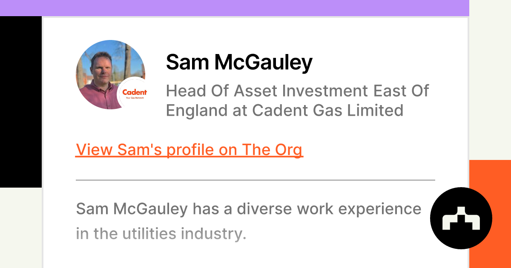

## Table of Contents

## What is Edgestream Partners?

Edgestream Partners is a company that helps people invest their money. They focus on using computers and technology to make smart choices about where to put money so it can grow. They work with big groups like pension funds and foundations to help them manage their investments.

The company was started by people who used to work at big investment firms. They wanted to use new technology to do things differently and help their clients make more money. Edgestream Partners believes that by using data and computers, they can find better ways to invest than traditional methods.

## When was Edgestream Partners founded?

Edgestream Partners was founded in 2012. That's when a group of people who used to work at big investment firms decided to start their own company. They wanted to do things differently by using new technology to help people invest their money.

The company focuses on using computers and data to make smart choices about where to put money so it can grow. They work with big groups like pension funds and foundations to help them manage their investments. Edgestream Partners believes that by using technology, they can find better ways to invest than the old methods.

## Who are the founders of Edgestream Partners?

Edgestroom Partners was started by a group of people who used to work at big investment firms. The main founders are Edric Solo and Bart Grenier. They wanted to create a new way to help people invest their money using computers and technology.

Edric and Bart believed that old ways of investing were not as good as they could be. They thought that by using data and computers, they could find better ways to make money grow. That's why they started Edgestream Partners in 2012.

The company works with big groups like pension funds and foundations. They help these groups manage their investments so their money can grow. Edgestream Partners uses technology to make smart choices about where to put the money.

## What is the primary focus of Edgestream Partners?

Edgestream Partners focuses on helping people invest their money using computers and technology. They work with big groups like pension funds and foundations to manage their investments. The company believes that by using data and computers, they can find better ways to invest than traditional methods.

The company was started in 2012 by Edric Solo and Bart Grenier, who used to work at big investment firms. They wanted to do things differently and use new technology to help their clients make more money. Edgestream Partners uses technology to make smart choices about where to put money so it can grow.

## What types of investment strategies does Edgestream Partners employ?

Edgestream Partners uses different ways to help people invest their money. They focus on using computers and data to make smart choices. One way they do this is by looking at a lot of information to find patterns and trends. This helps them decide where to put money so it can grow. They also use technology to change their investments quickly if things in the market change.

Another thing Edgestream Partners does is called "quantitative investing." This means they use math and numbers to make decisions about where to invest. They believe this can help them find good opportunities that others might miss. They also mix different types of investments together to spread out the risk. This way, if one investment does not do well, others might still grow.

Edgestream Partners works with big groups like pension funds and foundations. They help these groups manage their money in a smart way. By using computers and data, they try to make the best choices possible. This helps their clients' money grow over time.

## How does Edgestream Partners utilize technology in its investment approach?

Edgestream Partners uses computers and technology to make smart choices about where to put money. They look at a lot of information to find patterns and trends. This helps them decide where to invest so their clients' money can grow. They also use technology to change their investments quickly if things in the market change. This means they can react fast to new information and adjust their strategies.

Another way Edgestream Partners uses technology is through something called "quantitative investing." This means they use math and numbers to make decisions about where to invest. They believe this can help them find good opportunities that others might miss. By using computers to do these calculations, they can make better choices and help their clients' money grow over time.

## What are some notable achievements or milestones of Edgestream Partners?

Edgestream Partners has grown a lot since it started in 2012. One big thing they did was to help manage a lot of money for big groups like pension funds and foundations. They used their computers and technology to make smart choices about where to put this money. This helped their clients' money grow over time.

Another important milestone for Edgestream Partners was when they started using something called "quantitative investing." This means they use math and numbers to make decisions about where to invest. By using computers to do these calculations, they were able to find good opportunities that others might miss. This helped them do well and show that their way of investing works.

## Who are the key clients or partners of Edgestream Partners?

Edgestream Partners works with big groups like pension funds and foundations. These are the main clients they help. Pension funds are where people put money to get money when they stop working. Foundations are groups that use money to help do good things in the world. Edgestream Partners helps these groups manage their money so it can grow over time.

The company uses computers and technology to make smart choices about where to put the money. They look at a lot of information to find patterns and trends. This helps them decide where to invest so their clients' money can grow. They also use technology to change their investments quickly if things in the market change. This way, they can react fast to new information and adjust their strategies to keep the money growing.

## How has Edgestream Partners performed financially in recent years?

Edgestream Partners has been doing well in recent years. They have helped their clients' money grow by using computers and technology to make smart choices about where to invest. The company works with big groups like pension funds and foundations, and they have been successful in managing their money. This has helped Edgestream Partners build a good reputation in the investment world.

One reason for their good performance is their use of something called "quantitative investing." This means they use math and numbers to make decisions about where to put money. By using computers to do these calculations, they can find good opportunities that others might miss. This has helped them do well and show that their way of investing works. Overall, Edgestream Partners has been successful in helping their clients' money grow over time.

## What are the future plans or upcoming projects for Edgestream Partners?

Edgestream Partners is always looking for new ways to help their clients' money grow. They plan to keep using computers and technology to make smart choices about where to invest. They want to find even better ways to use data and numbers to make decisions. This means they will keep working on their quantitative investing methods to find new opportunities that others might miss.

In the future, Edgestream Partners also wants to work with more big groups like pension funds and foundations. They hope to help more people manage their money in a smart way. By using their technology to react quickly to changes in the market, they can keep their clients' money growing. They believe that by sticking to their plan and using new technology, they can keep doing well and help more people.

## How does Edgestream Partners contribute to the financial industry's innovation?

Edgestream Partners helps make the financial world better by using computers and technology in new ways. They look at a lot of information to find patterns and trends that others might miss. This helps them make smart choices about where to invest money so it can grow. They use something called "quantitative investing," which means they use math and numbers to make decisions. By doing this, they can find good opportunities and help their clients' money grow over time.

The company also changes their investments quickly if things in the market change. This means they can react fast to new information and adjust their strategies. This way, they can keep their clients' money growing even when the market is changing. By using technology to do things differently, Edgestream Partners shows other companies new ways to invest. This helps the whole financial industry find better ways to help people manage their money.

## What are the expert opinions on the investment philosophy of Edgestream Partners?

Experts think that Edgestream Partners has a smart way of investing. They use computers and technology to look at a lot of information and find patterns. This helps them make good choices about where to put money so it can grow. Experts like that Edgestream Partners uses something called "quantitative investing," which means they use math and numbers to make decisions. This can help them find good opportunities that other people might miss. They believe this way of investing can help their clients' money grow over time.

Some experts also like how Edgestream Partners can change their investments quickly if things in the market change. This means they can react fast to new information and adjust their strategies. This way, they can keep their clients' money growing even when the market is changing. Overall, experts think that Edgestream Partners' use of technology and data helps them do well in the investment world. They see it as a good example of how new technology can make investing better.

## References & Further Reading

[1]: ["Advances in Financial Machine Learning"](https://www.amazon.com/Advances-Financial-Machine-Learning-Marcos/dp/1119482089) by Marcos Lopez de Prado

[2]: ["Machine Learning for Algorithmic Trading"](https://github.com/stefan-jansen/machine-learning-for-trading) by Stefan Jansen

[3]: ["Quantitative Trading: How to Build Your Own Algorithmic Trading Business"](https://www.amazon.com/Quantitative-Trading-Build-Algorithmic-Business/dp/1119800064) by Ernest P. Chan

[4]: Cliff, D. (2010). ["Was the Crash of 2008 Caused by Large Traders Trading in High Frequency?"](https://pdfs.semanticscholar.org/f9f6/8601d785e8fb6c63fa456022654e6b8f24aa.pdf) ArXiv.

[5]: Bishop, C. M. (2006). ["Pattern Recognition and Machine Learning"](https://link.springer.com/book/9780387310732) Springer.

[6]: ["High-Frequency Trading: A Practical Guide to Algorithmic Strategies and Trading Systems"](https://www.ahmetbeyefendi.com/wp-content/uploads/2020/07/High-Frequency-Trading-Irene-Aldridge.pdf) by Irene Aldridge

[7]: Domingos, P. (2015). ["The Master Algorithm: How the Quest for the Ultimate Learning Machine Will Remake Our World"](https://psycnet.apa.org/record/2015-43168-000) Basic Books.