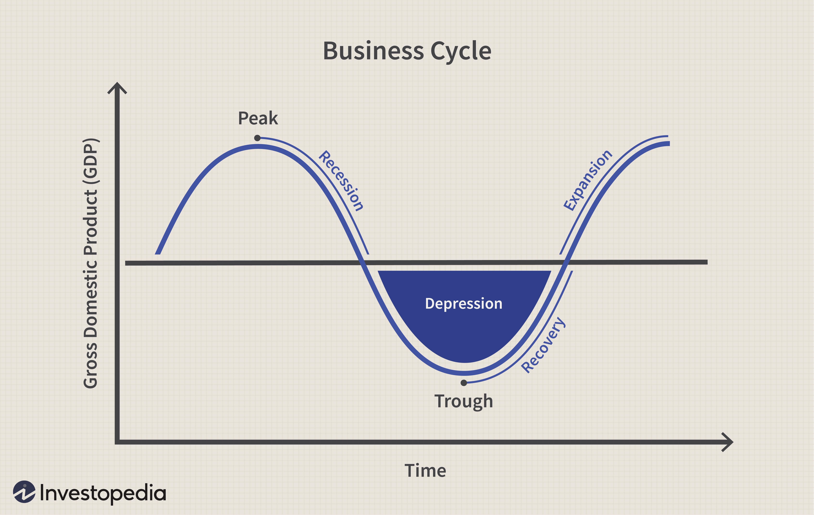

The Edgeworth Price Cycle is a pivotal concept in economic theory that explicates the cyclical nature of price adjustments observed in certain markets, predominantly those involving commodified goods. This cycle is characterized by repetitive sequences of price reductions followed by gradual increases, a pattern that is particularly prevalent in industries where products are easily substitutable and consumer price sensitivity is high.

Francis Ysidro Edgeworth, a prominent economist in the late 19th and early 20th centuries, initially introduced the concept of fluctuating price sequences as part of his broader examination of competitive market dynamics. Edgeworth's insights laid the groundwork for understanding how firms strategically adjust prices in response to competitors' actions, often leading to cyclical pricing patterns. The work of Edgeworth was later expanded significantly by economists Eric Maskin and Jean Tirole in the late 20th century. Their contributions offered a formalized analysis of price cycles within the framework of dynamic oligopolies, examining how firms' interdependent decisions can lead to periodic shifts in pricing strategies.



This article endeavors to dissect the nuances and phases of the Edgeworth Price Cycle. It traces its historical development and evaluates its relevance in contemporary economic settings, particularly highlighting its implications for algorithmic trading. As financial markets evolve, understanding such price cycles becomes essential for developing algorithmic strategies that anticipate market shifts, allowing traders to optimize entry and exit points effectively. This intersection of classical economic theory and modern technology underscores the enduring significance of the Edgeworth Price Cycle in both academic research and practical financial applications.

## Table of Contents

## Understanding the Edgeworth Price Cycle

The Edgeworth Price Cycle fundamentally represents the repetitive and strategic adjustments in pricing adopted by firms within competitive markets. This cycle is a direct consequence of the interaction between firms, where each company attempts to capture a larger market share through aggressive pricing strategies. These strategies result in cyclical price fluctuations, typically characterized by initial price cuts, followed by price stabilization and subsequent increases, before another round of price cuts commences.

At the heart of this cycle is the concept of aggressive price competition. Firms initially reduce their prices to attract a more significant portion of highly price-sensitive consumers. This sensibility is most evident in markets such as retail gasoline, where consumers frequently make purchasing decisions based on price differences of a few cents per gallon or liter. This behavior is prevalent in North America, Australia, and Europe, where gasoline markets often exhibit classic Edgeworth cycles.

As prices decline, profit margins tend to shrink, sometimes hitting a threshold where prices approach the firms' marginal costs. At this point, further price reductions become unsustainable for the competing firms. Despite the unsustainable nature of continual price cuts, firms may temporarily endure reduced or negative profit margins to prevent losing market share to competitors.

Once prices reach this floor, a phase of relative price stability or slight price increases occurs as firms attempt to recoup lost profits. However, this stability is often short-lived, as the cyclical nature of the Edgeworth Price Cycle resumes when firms once again endeavor to undercut each other to increase their market presence. 

Understanding this cycle aids stakeholders in predicting the ebb and flow of pricing within competitive markets. It highlights the delicate balance firms must maintain between gaining customer advantage through lower prices and the long-term viability of their pricing strategies. The intricate dance of pricing adjustments underscores the inherent tension in markets with substantial consumer price sensitivity and continual competitive pressure.

## Phases of the Edgeworth Price Cycle

The Edgeworth Price Cycle is characterized by distinct phases that contribute to the cyclical nature of pricing strategies within competitive markets. The cycle typically consists of three main stages: initial price cuts, subsequent price increases, and a further round of price cuts.

In the initial phase, often described as a "war of attrition," firms engage in aggressive price reductions. The primary goal during this stage is to capture a larger market share by attracting more price-sensitive customers. As prices decrease, the market begins to experience heightened competitive pressure. Companies continue to lower prices until they approach marginal costs. At this point, any additional price cuts become unsustainable, as they could lead to negative profitability.

The next phase involves a temporary stabilization or increase in prices. This occurs as firms recognize the limitations of continual price reductions and seek to restore profitability. By slightly increasing prices, companies can maintain market equilibrium temporarily, while still offering relative value to consumers compared to the lowest prices previously set. This is often a strategic move to recover lost margins while observing competitors' actions.

In the final stage, the cycle restarts with another round of price reductions. As firms aim to recover or expand their market share, they once again initiate price cuts. This stage marks the recurrence of the Edgeworth Price Cycle, as the pressures of competitive dynamics continue to drive businesses to adjust pricing strategies in response to rivals' actions and market demand.

Understanding these phases is vital for businesses operating in markets with pronounced price sensitivity, allowing them to strategically navigate the complexities of cyclical pricing and competitive behavior.

## Theoretical Foundations and Economic History

Francis Ysidro Edgeworth was a pivotal figure in the development of economic theories related to market dynamics in the late 19th century. He introduced the idea of competitive cyclic pricing behaviors, which later became known as the Edgeworth Price Cycle. This concept describes a dynamic and often asymmetric cycle of price adjustments driven by competitive interactions among firms within a market, particularly oligopolistic ones. Edgeworth hypothesized that firms engaged in repeated undercutting of prices in a bid to gain market share, leading to cyclical price changes.

The theoretical underpinning of Edgeworth's ideas gained more robust formalization through the work of Eric Maskin and Jean Tirole in 1988. Their research significantly advanced the understanding of dynamic oligopoly and price competition, with a particular emphasis on the conditions under which these cycles manifest. Maskin and Tirole built upon Edgeworth's initial insights to develop a structured framework that explained how and why firms engage in price wars that lead to temporary periods of low prices, followed by significant hikes.

Their work used game theory to model the strategic interactions between firms, showing how these interactions can result in cyclic pricing patterns. The Edgeworth Price Cycle highlights the importance of kinked demand curves and introduces the concept of mixed strategies in pricing decisions. The kinked demand curve suggests that firms may face different elasticities for price increases versus price decreases, often making these cycles asymmetric.

The implications of these theories are vast, impacting various market behaviors and price dynamics. For instance, they provide insights into how markets with few players (typically oligopolies) can exhibit non-linear and cyclic pricing strategies that deviate from those predicted by standard models of perfect competition. This contribution has enriched economic literature by offering a more nuanced understanding of price [volatility](/wiki/volatility-trading-strategies) and the strategic considerations underlying firm behaviors in competitive markets.

Overall, the cycle theory not only echoes the strategic price setting observed in real-world markets, such as the gasoline industry, but also underpins significant areas of economic research, including studies on tacit collusion and competitive equilibria.

## Implications for Algorithmic Trading

In [algorithmic trading](/wiki/algorithmic-trading), understanding the mechanisms behind price cycles, such as the Edgeworth Price Cycle, is essential for developing effective trading strategies that capitalize on price variability. The Edgeworth Price Cycle, characterized by its predictable phases of price cuts and increases, offers algorithmic traders an opportunity to anticipate market movements and optimize their trading performance.

Algorithmic traders rely on mathematical models and algorithms to analyze market data and automate trading decisions. By incorporating the predictable phases of the Edgeworth Price Cycle into their models, traders can improve their timing for entering and exiting trades. For example, during the initial phase of price cuts, traders might choose to short positions, anticipating further declines. Conversely, during the stabilization or price increase phase, traders might adopt long positions to benefit from rising prices.

Implementing an algorithm that adjusts trading strategies in real-time based on observed price patterns can yield significant advantages in volatile markets. The ability to swiftly react to price changes involves not only recognizing the stage of the cycle but also adapting the trading model to forecast subsequent movements accurately. A practical approach could involve [machine learning](/wiki/machine-learning) algorithms trained to recognize cycle patterns and predict their duration and intensity.

Below is a conceptual Python code snippet illustrating how an algorithm might be structured to respond to the Edgeworth Price Cycle:

```python
import numpy as np

def detect_cycle_phase(prices):
    # Calculate the moving average to smooth out the price data
    moving_average = np.convolve(prices, np.ones(5)/5, mode='valid')

    # Calculate the trend by differentiating the moving average
    trend = np.diff(moving_average)

    # Determine the phase of the cycle based on the trend
    if trend[-1] < -threshold:
        return "Price Cut"
    elif trend[-1] > threshold:
        return "Price Increase"
    else:
        return "Stabilization"

def trading_strategy(prices, threshold=0.005):
    position = None
    for price in prices:
        phase = detect_cycle_phase(prices)

        if phase == "Price Cut" and position != "Short":
            # Short the asset
            position = "Short"
            print("Entering short position")

        elif phase == "Price Increase" and position != "Long":
            # Go long on the asset
            position = "Long"
            print("Entering long position")

        elif phase == "Stabilization":
            # Exit all positions
            position = None
            print("Exiting positions")

# Sample usage with price data
price_data = np.array([10, 9.5, 9, 9.2, 9.8, 10.4, 10.6])
trading_strategy(price_data)
```

This algorithm uses a simple moving average to smooth price data, then calculates the trend to discern the cycle phase, adjusting positions accordingly. Real-world applications would require more sophisticated analytics, considering factors such as [volume](/wiki/volume-trading-strategy) indicators and broader market sentiments.

Successfully applying insights from the Edgeworth Price Cycle allows algorithmic traders to enhance their risk management and operational efficiency, ultimately leading to better-informed trading decisions and improved profitability. As markets continue to evolve, incorporating advanced cycle detection and adaptive response mechanisms will remain a cornerstone for maintaining a competitive edge.

## Conclusion

The Edgeworth Price Cycle remains a vital concept in understanding economic behavior in competitive markets. Its implications are far-reaching, affecting various domains, from the formulation of commodity pricing strategies to the development of sophisticated algorithms that drive modern financial markets. At its heart, the Edgeworth Price Cycle illustrates how cyclical price patterns emerge from aggressive competitive strategies among firms, offering insight into market dynamics that are characterized by fluctuating price levels.

Understanding these cycles enables economists and traders to anticipate shifts in market trends, allowing for the development of more effective economic models and trading strategies. For instance, in markets where price sensitivity among consumers is high, such as the gasoline market, recognizing these patterns can be pivotal in predicting pricing movements. This knowledge proves essential not only for static economic analysis but also for informing dynamic decision-making processes in the fast-paced world of algorithmic trading.

Algorithmic traders, in particular, benefit from insights into the Edgeworth Price Cycle, as it assists in designing algorithms capable of adapting to price variabilities. By incorporating cycle recognition into their strategies, traders can make informed decisions about optimal entry and [exit](/wiki/exit-strategy) points, thus enhancing their competitive advantage. Additionally, as the financial markets continue to evolve, integrating such economic insights with computational approaches ensures that trading strategies remain robust against market volatility.

Therefore, the ongoing study of the Edgeworth Price Cycle is crucial. It not only enriches the understanding of market behaviors but also aids in the creation of economic theories and trading applications that are relevant to current and future market conditions. This continuous exploration and adaptation enable economists and traders alike to stay ahead in increasingly sophisticated and competitive markets.

## References

- Maskin, E., & Tirole, J. (1988). A Theory of Dynamic Oligopoly, II: Price Competition, Kinked Demand Curves, and Edgeworth Cycles. Econometrica, 56(3), 571-599.

- Fernando, J. (2023). Edgeworth Price Cycle: Meaning, Stages, History. Investopedia. Retrieved from https://www.investopedia.com/terms/e/edgeworth-price-cycle.asp

- Wang, Z. (2012). (Mixed) Strategy in Oligopoly Pricing: Evidence from Gasoline Price Cycles. Journal of Political Economy, 120(1), 512-540.

- Tappata, M. (2009). Rockets and feathers: Understanding asymmetric pricing. The RAND Journal of Economics, 40(3), 673-687.

## References & Further Reading

[1]: Maskin, E., & Tirole, J. (1988). ["A Theory of Dynamic Oligopoly, II: Price Competition, Kinked Demand Curves, and Edgeworth Cycles."](https://www.jstor.org/stable/1911701) Econometrica, 56(3), 571-599.

[2]: Fernando, J. (2023). ["Edgeworth Price Cycle: Meaning, Stages, History."](https://www.investopedia.com/terms/e/edgeworth-price-cycle.asp) Investopedia.

[3]: Wang, Z. (2012). ["(Mixed) Strategy in Oligopoly Pricing: Evidence from Gasoline Price Cycles."](https://www.jstor.org/stable/10.1086/649801) Journal of Political Economy, 120(1), 512-540.

[4]: Tappata, M. (2009). ["Rockets and feathers: Understanding asymmetric pricing."](https://onlinelibrary.wiley.com/doi/full/10.1111/j.1756-2171.2009.00084.x) The RAND Journal of Economics, 40(3), 673-687.