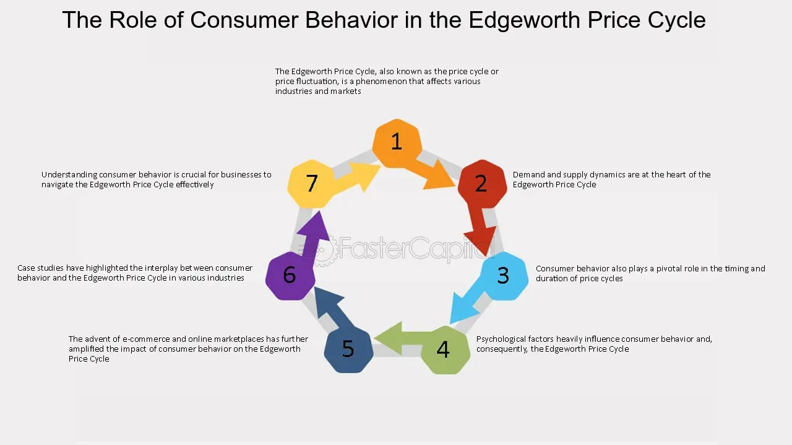

## Table of Contents

## What is the Edgeworth Price Cycle?

The Edgeworth Price Cycle is a pattern in how gas prices go up and down over time. It was named after an economist named Francis Edgeworth. In this cycle, gas prices start low and then slowly go up until they reach a peak. After hitting the peak, the prices drop quickly and then start the cycle all over again. This pattern happens because gas stations compete with each other. When one station raises its prices, others follow to keep up. But when prices get too high, one station will lower its price to attract more customers, and then others have to lower their prices too.

This cycle can be seen in many places around the world, especially where there are a lot of gas stations close to each other. People who study the economy find it interesting because it shows how businesses react to each other's prices. For people who drive cars, understanding the Edgeworth Price Cycle can help them save money by buying gas when prices are low. But it can also be frustrating because it's hard to predict exactly when prices will go up or down.

## Who developed the concept of the Edgeworth Price Cycle?

The concept of the Edgeworth Price Cycle was developed by economist Francis Edgeworth. He was a smart person who thought a lot about how businesses set their prices. Edgeworth noticed that sometimes prices go up and down in a pattern, especially with things like gas. He came up with the idea that this happens because companies are always trying to do better than each other.

Edgeworth's idea is important because it helps us understand why prices change the way they do. When gas stations see each other's prices, they might raise their own prices to make more money. But if prices get too high, one station might lower its price to get more customers, and then others have to lower their prices too. This back-and-forth creates the cycle that Edgeworth talked about.

## What are the main stages of the Edgeworth Price Cycle?

The Edgeworth Price Cycle has a few main stages that happen over and over. First, prices start low. This is when gas stations are trying to attract customers by offering cheaper gas. As more people start buying gas at these low prices, other gas stations see this and decide to raise their prices a little bit. They do this slowly, one after the other, trying to make more money while still keeping customers.

After a while, the prices keep going up until they reach a high point. This is the peak of the cycle. When prices are really high, one gas station might decide to suddenly drop its prices to get more customers. When this happens, other gas stations have to lower their prices too, or they will lose business. This quick drop in prices starts the cycle all over again, going back to the low prices at the beginning.

## How does the Edgeworth Price Cycle affect consumer behavior?

The Edgeworth Price Cycle can make people change how they buy gas. When people see that gas prices are going up slowly, they might wait to fill up their tanks. They hope that if they wait, the prices might go down again. But if prices keep going up and get really high, people might rush to buy gas because they don't want to pay even more later. This rush can happen right before prices drop suddenly.

When prices do drop quickly, people feel happy because they can save money. They might fill up their tanks more than usual, knowing that prices will start going up again soon. This behavior of waiting, rushing, and then filling up a lot can make the cycle even stronger. People's choices about when to buy gas are a big part of why the Edgeworth Price Cycle keeps happening.

## Can you explain the economic theory behind the Edgeworth Price Cycle?

The Edgeworth Price Cycle is based on the idea of how businesses compete with each other. When gas stations are close to each other, they always watch what the other stations are doing. If one station raises its prices a little bit, the others might do the same because they don't want to lose money. This slow increase in prices happens because each station wants to make more money without scaring away too many customers. But as prices keep going up, one station might decide to suddenly lower its prices to attract more people. When this happens, the other stations have to lower their prices too, or they will lose all their customers.

This back-and-forth between raising and lowering prices creates the cycle. It's all about trying to find the best price that makes the most money. Economists call this "price competition." The cycle keeps going because gas stations are always trying to do better than each other. It's like a game where they keep changing their prices to stay ahead. This pattern can be seen in many places where businesses sell things that people need often, like gas.

## What industries are most affected by the Edgeworth Price Cycle?

The industry that is most affected by the Edgeworth Price Cycle is the gasoline or fuel industry. Gas stations are always watching each other's prices. When one station raises its prices, others follow to make more money. But if prices get too high, one station might lower its prices to get more customers, and then others have to lower their prices too. This cycle of prices going up and down happens a lot because people need gas all the time, and gas stations are always trying to do better than each other.

Other industries that can be affected by the Edgeworth Price Cycle include those where businesses sell things that people buy often, like groceries or household items. In these industries, stores might change their prices to compete with each other. If one store lowers the price of milk or bread, other stores might do the same to keep their customers. This can create a cycle of prices going up and down, just like with gas stations. But it's not as common or as clear as it is in the fuel industry.

## How does the Edgeworth Price Cycle differ from other pricing cycles?

The Edgeworth Price Cycle is different from other pricing cycles because it focuses on how businesses compete with each other. In the Edgeworth cycle, prices start low and slowly go up until they reach a high point. Then, one business might suddenly lower its prices, causing others to do the same. This cycle happens a lot in the gas industry because gas stations are always watching each other's prices. They try to make more money by raising prices but also need to keep customers by lowering prices when needed.

Other pricing cycles might not follow this exact pattern. For example, seasonal pricing cycles happen because of the time of year. Stores might raise prices during holidays when more people are buying things, and lower them during slower times. Another type of pricing cycle is the business cycle, which can affect prices based on the overall economy. When the economy is doing well, prices might go up, and when it's not doing well, prices might go down. Unlike the Edgeworth cycle, these cycles are influenced more by time or the economy than by direct competition between businesses.

## What are some real-world examples of the Edgeworth Price Cycle?

In Australia, the Edgeworth Price Cycle is very clear in the gas industry. In cities like Melbourne and Sydney, gas prices go up and down in a pattern that happens every few weeks. When one gas station raises its prices, others follow slowly. But when prices get too high, one station might suddenly lower its prices to get more customers. Then, all the other stations have to lower their prices too. This cycle happens because gas stations are always watching each other and trying to make more money without losing too many customers.

In the United States, you can see the Edgeworth Price Cycle in some places too. For example, in cities where gas stations are close together, like in parts of California, prices go up slowly and then drop quickly. People who drive a lot might notice this cycle and try to buy gas when prices are low. This behavior can make the cycle even stronger because gas stations know that people will rush to buy gas when prices drop. So, they keep playing this pricing game to stay ahead of each other.

## How has the Edgeworth Price Cycle evolved over time?

The Edgeworth Price Cycle has changed a bit over time, especially with new technology. In the past, gas stations would change their prices by hand, and it took time for people to notice and for other stations to react. Now, with electronic price signs, gas stations can change their prices quickly and easily. They can also use computers to watch other stations' prices and decide when to raise or lower their own prices. This makes the cycle happen faster and more often than before.

Even though the cycle happens more quickly now, the basic idea is still the same. Gas stations still watch each other and try to make more money without losing too many customers. But with more data and technology, they can be smarter about when to change their prices. This means the cycle can be more predictable in some ways, but it can also be more confusing for people trying to save money on gas. Overall, the Edgeworth Price Cycle keeps happening because gas stations are always competing with each other, but the way they compete has gotten more high-tech.

## What are the criticisms of the Edgeworth Price Cycle model?

Some people think the Edgeworth Price Cycle model is too simple. They say it doesn't think about other things that can change prices, like the cost of oil or big world events. For example, if there's a problem with oil coming from another country, gas prices might go up no matter what gas stations do. The model also doesn't always work the same in every place. In some cities, gas stations might not follow the cycle as clearly because they have different ways of competing or because they're far apart.

Another criticism is that the model can be hard to use in real life. People who study the economy say it's tough to predict exactly when prices will go up or down. This makes it hard for people to save money on gas because they can't always know when to buy. Also, some think the model doesn't think about how people act. If everyone knows about the cycle, they might change when they buy gas, which can make the cycle different from what the model says.

## How can businesses strategize around the Edgeworth Price Cycle?

Businesses can use the Edgeworth Price Cycle to their advantage by watching what their competitors are doing. If a gas station sees that other stations are slowly raising their prices, they might decide to wait a bit before raising their own prices. This can help them keep more customers because their prices will be lower for a little longer. But when prices get really high, the gas station might choose to be the first one to lower prices. This can attract a lot of customers quickly, and other stations will have to lower their prices too or lose business. By being smart about when to raise or lower prices, a business can make more money and stay ahead of others.

Another way businesses can strategize around the Edgeworth Price Cycle is by using technology. With computers and electronic signs, they can change prices faster and keep track of what other businesses are doing. This helps them react quickly to changes in the market. They can also use data to predict when prices might go up or down. By understanding the cycle better, businesses can plan their pricing strategies to make the most money. This might mean raising prices slowly to make more profit or lowering them at the right time to get more customers.

## What future research directions are suggested for the Edgeworth Price Cycle?

Future research on the Edgeworth Price Cycle could look at how technology changes the cycle. With electronic signs and computers, gas stations can change prices very quickly. Researchers might want to study how this affects the speed and pattern of the cycle. They could also look at how people use apps and websites to find the cheapest gas. This might change how gas stations set their prices and make the cycle different from what we see now.

Another direction for research is to see how the Edgeworth Price Cycle works in different places around the world. The cycle might happen differently in cities compared to small towns, or in countries with different rules about gas prices. Researchers could study how things like the cost of oil, taxes, and government rules affect the cycle. Understanding these differences can help us see how the cycle might change in the future and how businesses can plan better.

Researchers might also want to look at how people's behavior affects the Edgeworth Price Cycle. If more people know about the cycle, they might change when they buy gas to save money. This could make the cycle stronger or weaker. Studying how people react to price changes can help businesses make better decisions about when to raise or lower their prices. It can also help us understand how the cycle might change as more people learn about it.

## References & Further Reading

[1]: Maskin, E., & Tirole, J. (1988). ["A Theory of Dynamic Oligopoly, II: Price Competition, Kinked Demand Curves, and Edgeworth Cycles."](https://www.jstor.org/stable/1911701) Econometrica, 56(3), 571-599.

[2]: Fernando, J. (2023). ["Edgeworth Price Cycle: Meaning, Stages, History."](https://www.investopedia.com/terms/e/edgeworth-price-cycle.asp) Investopedia.

[3]: Wang, Z. (2012). ["(Mixed) Strategy in Oligopoly Pricing: Evidence from Gasoline Price Cycles."](https://www.jstor.org/stable/10.1086/649801) Journal of Political Economy, 120(1), 512-540.

[4]: Tappata, M. (2009). ["Rockets and feathers: Understanding asymmetric pricing."](https://onlinelibrary.wiley.com/doi/full/10.1111/j.1756-2171.2009.00084.x) The RAND Journal of Economics, 40(3), 673-687.