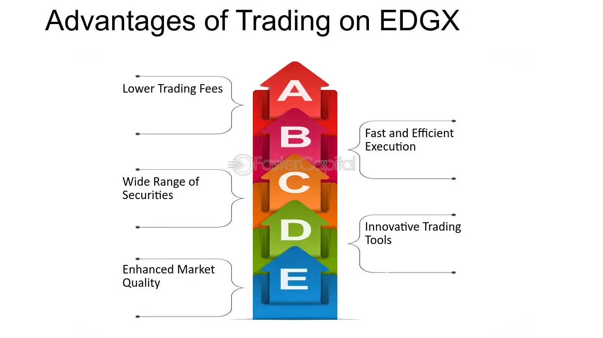

In today's fast-paced financial markets, technology is pivotal in enabling and optimizing trading activities. The advent of algorithmic trading, commonly referred to as algo trading, marks a significant advancement in modern trading practices. Utilizing sophisticated computer algorithms, this method automates trading processes, enhancing speed and accuracy in executing trades across various stock exchanges. Among these platforms, the EDGX Exchange stands out as a prominent venue facilitating algorithmic trading, offering robust infrastructure and connectivity to market participants.

Algorithmic trading has effectively become integral to achieving market efficiency by improving liquidity and minimizing trading costs. It allows traders to break large orders into smaller, manageable pieces, thereby mitigating market impact and slippage. As such, algo trading is highly favored by institutional investors seeking efficient market access and execution. The importance of these algorithms extends beyond just order execution; they also aid in advanced data analysis and predictive trading strategies.

The focus of this article is to explore financial markets with particular attention to the EDGX Exchange. We aim to outline the critical role of algorithmic trading in enhancing the efficiency of these markets, providing insights into the technological advancements and strategies employed. This examination highlights the synergy between technology and trading practices, underscoring the continuous evolution towards more dynamic and efficient financial ecosystems.

## Table of Contents

## Understanding Financial Markets

Financial markets serve as crucial platforms where the buying and selling of financial securities, derivatives, commodities, and other financial instruments occur. These markets facilitate the efficient allocation of resources and capital, thereby playing a foundational role in economic development. The primary functions of financial markets include price discovery, liquidity provision, and risk management.

Price discovery refers to the process through which markets determine the price of assets based on supply and demand dynamics. It is the mechanism through which new information is absorbed into the price of a security, reflecting its true value at any given time. Liquidity provision ensures that market participants can transact quickly and at minimal cost, which is essential for the seamless exchange of assets. High liquidity reduces the cost of trading as well as the risk associated with holding an asset.

Risk management in financial markets involves the use of various financial instruments to hedge against potential losses. This is particularly vital for institutions or individuals wanting to protect themselves from adverse price movements in assets. Derivatives, such as options and futures, are commonly used for this purpose.

Financial markets are diverse and can be broadly segmented into various categories. The stock market enables the trading of shares of publicly listed companies, providing companies with capital and investors with a stake in the company. The bond market involves the buying and selling of debt securities, allowing entities to raise funds for projects and operations while offering investors fixed income.

Commodity markets facilitate the trading of raw or primary products such as oil, gold, and agricultural products. These markets are critical for price setting of commodities that can impact global economies. Finally, foreign exchange markets enable the trading of currencies, which is essential for international trade and investment.

Each segment of the financial market operates under specific regulations and frameworks to ensure transparency, fairness, and efficiency. Regulatory bodies such as the Securities and Exchange Commission (SEC) in the U.S. play a pivotal role in maintaining the integrity of these markets through stringent rules and oversight. The complexity and interconnection of these segments highlight the need for advanced technology and robust algorithms to manage transactions effectively, indicating the growing importance of [algorithmic trading](/wiki/algorithmic-trading) within these markets.

## What is the EDGX Exchange?

The EDGX Exchange is a prominent U.S. equities exchange that operates under the umbrella of CBOE U.S. Equities. It is part of a network of equity exchanges, which includes BZX, BYX, and EDGA. These exchanges collectively provide significant pools of [liquidity](/wiki/liquidity-risk-premium) to the financial markets, ensuring efficient and effective trading processes.

Initially, EDGX was created and launched by Direct Edge LLC, one of the most innovative stock exchange operators at the time. Direct Edge was known for its focus on technology and customer service, setting new standards in trading efficiency and market functionality. In 2014, Direct Edge merged with Bats Global Markets, a move that brought together two major players in the exchange sphere and enhanced the capabilities of EDGX through advanced trading technologies and expanded market reach.

Subsequently, Bats Global Markets, including EDGX and its sister exchanges, was acquired by CBOE Global Markets in 2017. This acquisition has further solidified EDGX's position as a key player in the U.S. equity markets. CBOE's robust infrastructure and technological prowess have allowed EDGX to offer high-speed trading, diverse order types, and comprehensive market data services to its users.

The integration within CBOE has enabled EDGX to maintain a competitive edge by continuously developing and implementing cutting-edge technology solutions that cater to the needs of various market participants. This focus on technological advancement has cemented EDGX's role in providing substantial liquidity, which is crucial for both institutional and retail traders seeking efficient market access.

## The Role of Algorithmic Trading

Algorithmic trading employs sophisticated computer algorithms to automate the process of trading decisions and order execution. This technology ensures rapid and precise transactions, which are crucial in today's fast-paced markets. By using complex mathematical models and strategies, algorithmic trading facilitates high-frequency trading, characterized by its ability to execute orders at extremely high speeds, often in fractions of a second. 

Institutional investors predominantly utilize algorithmic trading due to its capacity to handle large volumes of orders without significantly impacting the market. This is achieved by breaking down these large orders into smaller pieces, a technique known as order fragmentation. For instance, if an institution needs to purchase a substantial [volume](/wiki/volume-trading-strategy) of shares, placing a single large order could lead to noticeable price changes, a phenomenon known as market impact. By executing these trades in smaller batches, the algorithm reduces such impacts, thereby optimizing the order execution process. 

On exchanges like EDGX, algorithmic trading plays a significant role in enhancing market operations. Its algorithms are often designed to provide liquidity, which is essential for maintaining active and efficient markets. Liquidity provision involves placing both buy and sell orders into the market, which helps in minimizing the bid-ask spread—the difference between the buying and selling prices of an asset. This spread is a key determinant of a market's liquidity, with tighter spreads indicating higher liquidity levels.

In summary, algorithmic trading is integral to modern financial markets for its ability to execute trades swiftly and accurately, manage large order volumes with reduced market impact, and facilitate liquidity provision on trading platforms such as the EDGX exchange. This technological advancement not only improves the execution quality but also contributes to the overall efficiency and stability of financial markets.

## EDGX and Algo Trading Integration

EDGX provides a robust framework for algorithmic trading, supported by its sophisticated technology and liquidity management. Its advanced infrastructure facilitates Direct Market Access (DMA), a critical feature that allows traders to bypass brokers and integrate algorithms directly with the exchange platform. This direct interaction enables rapid order execution and strategy implementation, making EDGX an ideal environment for algorithmic trading.

Traders on EDGX benefit from real-time market data feeds that provide critical information for decision-making. These data feeds offer insight into market dynamics with minimal latency, a crucial aspect for high-frequency trading strategies where time is of the essence. The exchange's commitment to low-latency data transmission ensures algorithms operate with high efficiency and precision.

Moreover, EDGX supports a variety of advanced order types that traders can utilize to optimize their trading strategies. These include hidden orders, midpoint peg orders, and reserve orders, which allow algorithms to execute trades that meet specific criteria beyond simple buy or sell instructions. Such flexibility in order execution enhances the ability of algorithms to adapt to market conditions and achieve desired trading outcomes.

The technological infrastructure of EDGX also supports the seamless integration of complex trading algorithms. This capability is key for implementing sophisticated trading strategies that require real-time analysis and adjustment based on fluctuating market variables. By leveraging the comprehensive set of tools and resources provided by EDGX, traders can execute strategies that capitalize on market inefficiencies and optimize their positions.

Overall, the integration of algorithmic trading with the EDGX platform underscores its commitment to providing a high-performance trading environment. By combining DMA, real-time data feeds, and advanced order types, EDGX supports the execution of efficient and effective trading strategies, contributing to the overall efficiency and liquidity of the financial markets.

## Benefits and Challenges of Algo Trading on EDGX

Algorithmic trading on the EDGX Exchange offers several advantages, primarily due to the platform's advanced technological capabilities. One of the main benefits is increased trading speed. Algorithms are capable of processing vast amounts of data and executing orders in fractions of a second, significantly faster than human traders. This speed allows for quick reaction to market changes, potentially taking advantage of short-lived opportunities.

Another advantage is enhanced accuracy. Algorithms can consistently execute trades based on predefined criteria, reducing the likelihood of human errors. This precision is particularly valuable when executing large volumes of trades, as it ensures adherence to specified strategies and minimizes slippage, which occurs when there is a difference between the expected price of a trade and the actual price.

Cost reduction is also a significant benefit of algo trading on EDGX. By automating trades, firms can minimize transaction costs and overhead expenses associated with manual trading operations. Algorithms can execute trades at optimal times and prices, leveraging strategies that aim to minimize market impact and transaction fees.

EDGX supports algo trading by providing robust tools and risk management strategies crucial for handling the inherent risks of high-speed trading environments. These tools include real-time monitoring systems and advanced order types that help traders optimize their strategies. Risk management features allow for pre-trade and post-trade analytics, which are essential for maintaining the integrity and stability of trading operations.

Despite these benefits, certain challenges are associated with the reliance on algorithmic trading. The potential for market manipulation is one such challenge, as algorithms can be employed to execute deceptive practices such as spoofing—where orders are placed with the intent to cancel before execution, creating a false appearance of market demand. This necessitates stringent regulatory frameworks to deter such activities and safeguard market integrity.

Flash crashes represent another significant challenge. These are extreme market events characterized by rapid, deep, and volatile price changes over a very short time period, often exacerbated by high-frequency trading algorithms. Such occurrences highlight the need for precise oversight and the implementation of circuit breakers or other protective measures to stabilize markets during turbulent periods.

In conclusion, while algorithmic trading on EDGX offers numerous efficiencies and cost-saving opportunities, it also presents challenges that must be managed through comprehensive regulation and technological controls to ensure a fair and stable trading environment.

## The Future of Algo Trading and Financial Markets

As technology continues to advance, the landscape of algorithmic trading is poised for significant transformation. The integration of [artificial intelligence](/wiki/ai-artificial-intelligence) (AI) and [machine learning](/wiki/machine-learning) (ML) in trading algorithms holds great promise for enhancing predictive analysis and making more informed trading decisions. These technologies enable the analysis of vast datasets to identify patterns and trends that were previously inaccessible, providing traders with a competitive edge in decision-making processes.

AI and ML can enhance the accuracy of trading models by learning from historical data and adapting to new information in real-time. This adaptive learning capability allows for more precise predictions of market movements. The use of neural networks, for example, has been shown to improve pattern recognition in complex datasets. Python libraries such as TensorFlow and PyTorch are frequently employed to develop and train these [neural network](/wiki/neural-network) models for trading applications.

Moreover, the integration of AI-driven models into trading systems promises more dynamic and responsive trading strategies. Algorithmic trading strategies, traditionally based on quantitative indicators, can now incorporate qualitative insights derived from AI analytics. For instance, sentiment analysis through natural language processing (NLP) of financial news and social media can impact trading algorithms' decisions, offering a more comprehensive market view beyond historical price and volume data.

As a key player in the financial markets, EDGX, part of CBOE Global Markets, is positioned to remain a leader in adopting and facilitating these technological advancements. Its state-of-the-art infrastructure is designed to accommodate high-frequency trading and handle complex algorithmic strategies. EDGX's continuous innovation in providing direct market access and advanced order types ensures that it supports the sophisticated needs of algorithmic traders.

Looking to the future, advancements in technology are expected to further enhance the capabilities of trading algorithms, potentially enabling even faster and more efficient trading. This evolution is likely to bring about increased market liquidity and efficiency, which are critical in maintaining stability and confidence in financial markets. Ultimately, the synergy between advanced technologies and robust trading platforms like EDGX will drive the ongoing optimization of algorithmic trading, adapting to the ever-changing dynamics of global financial markets.

## Conclusion

Algorithmic trading and exchanges like EDGX form the backbone of contemporary financial markets, offering unprecedented speed and precision in transactions. As these trading systems evolve, their influence becomes more profound, emphasizing the need for investors and traders to integrate technological advancements with market dynamics comprehensively. This understanding enables participants to leverage the benefits of algo trading rigorously, ensuring informed decision-making and optimal execution of trades. 

As algorithmic trading strategies advance, they promise to usher in an era of heightened market robustness, efficiency, and liquidity. The intelligent application of technology, driven by developments in artificial intelligence and machine learning, is pivotal in shaping the future of financial markets. These advancements allow for improved predictive analysis, enabling traders to anticipate market movements with greater accuracy and efficiency. The EDGX exchange, driven by continuous innovations within the CBOE Global Markets ecosystem, is positioned to lead in providing cutting-edge solutions, ensuring dynamic and efficient exchanges that meet the growing demands of liquidity and precision in trading.

## References & Further Reading

[1]: Bergstra, J., Bardenet, R., Bengio, Y., & Kégl, B. (2011). ["Algorithms for Hyper-Parameter Optimization."](https://dl.acm.org/doi/10.5555/2986459.2986743) Advances in Neural Information Processing Systems 24.

[2]: ["Advances in Financial Machine Learning"](https://www.amazon.com/Advances-Financial-Machine-Learning-Marcos/dp/1119482089) by Marcos Lopez de Prado

[3]: ["Evidence-Based Technical Analysis: Applying the Scientific Method and Statistical Inference to Trading Signals"](https://www.amazon.com/Evidence-Based-Technical-Analysis-Scientific-Statistical/dp/0470008741) by David Aronson

[4]: ["Machine Learning for Algorithmic Trading"](https://github.com/stefan-jansen/machine-learning-for-trading) by Stefan Jansen

[5]: ["Quantitative Trading: How to Build Your Own Algorithmic Trading Business"](https://www.amazon.com/Quantitative-Trading-Build-Algorithmic-Business/dp/1119800064) by Ernest P. Chan