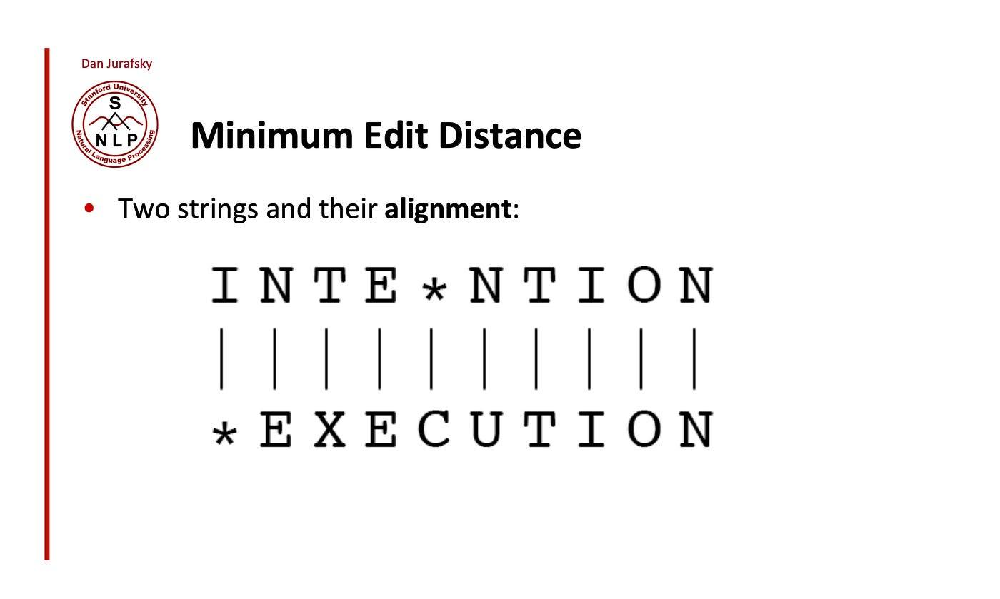

## Table of Contents

## What is Edit Distance in the context of machine learning?

Edit Distance, also known as Levenshtein Distance, is a way to measure how different two strings are from each other. It counts the minimum number of single-character edits (like insertions, deletions, or substitutions) needed to change one string into another. For example, to change "cat" into "cut", you only need to substitute the 'a' with a 'u', so the edit distance is 1. This concept is very useful in machine learning, especially in tasks like spell checking, speech recognition, and DNA sequence analysis, where comparing strings is important.

In machine learning, edit distance can be used to train models that need to understand and process text or sequences. For instance, in natural language processing, a model might use edit distance to suggest corrections for misspelled words by finding the word in its dictionary that has the smallest edit distance from the misspelled word. The formula to calculate the edit distance between two strings, say 's' and 't', can be expressed as $$d(s, t)$$, where $$d(s, t)$$ represents the minimum number of operations required to transform 's' into 't'. This measure helps algorithms make smarter decisions by quantifying how similar or different two pieces of text are.

## How does Edit Distance relate to string similarity?

Edit Distance is a way to measure how similar two strings are by counting the smallest number of changes needed to turn one string into another. These changes can be adding a letter, removing a letter, or swapping one letter for another. The smaller the edit distance between two strings, the more similar they are. For example, if you want to change "cat" to "cut", you only need to swap the 'a' for a 'u', so the edit distance is 1. This means "cat" and "cut" are quite similar.

In simple terms, if the edit distance is small, the strings are very similar, and if it's large, they are less similar. This idea is used a lot in computers to check how close words or sentences are to each other. For example, when you type a word wrong, your computer might suggest the right word by finding the word in its list that has the smallest edit distance from your mistake. The formula to calculate the edit distance between two strings, say 's' and 't', can be written as $$d(s, t)$$, where $$d(s, t)$$ is the minimum number of changes needed to make 's' the same as 't'.

## What are the common applications of Edit Distance in machine learning?

Edit Distance is really useful in machine learning for things like spell checking. When you type a word wrong, your computer can use Edit Distance to find the correct word by seeing which word in its list needs the least changes to match what you typed. For example, if you type "recieve", the computer might suggest "receive" because it only needs one change (removing the extra 'e'). This helps make sure what you write is correct and easy to understand.

Another big use of Edit Distance is in speech recognition. When you talk to your phone or a smart speaker, it turns your words into text. Sometimes, it might hear "I like to eat" as "I like to eat" or "I like to eat", but Edit Distance can help figure out which one is more likely by seeing how many changes are needed to go from what it heard to what it thinks you said. This makes the speech recognition better and more accurate.

Edit Distance also helps in DNA sequence analysis. Scientists use it to compare different DNA strands to see how similar they are. If two DNA sequences have a small Edit Distance, it means they are closely related. This is important for understanding genetics and how different organisms are related to each other. The formula to calculate the Edit Distance between two strings, say 's' and 't', can be written as $$d(s, t)$$, where $$d(s, t)$$ is the minimum number of changes needed to make 's' the same as 't'.

## Can you explain the Levenshtein Distance algorithm?

The Levenshtein Distance algorithm is a way to figure out how different two words or strings are by counting the smallest number of changes needed to turn one string into another. These changes can be adding a letter, removing a letter, or swapping one letter for another. For example, to change "cat" into "cut", you only need to swap the 'a' for a 'u', so the Levenshtein Distance is 1. The algorithm works by creating a table where each cell represents the distance between parts of the two strings. You fill in this table step by step, comparing letters and figuring out the best way to make the strings match.

Here's how you can write the Levenshtein Distance algorithm in Python:

```python
def levenshtein_distance(s, t):
    m, n = len(s), len(t)
    dp = [[0] * (n + 1) for _ in range(m + 1)]

    for i in range(m + 1):
        dp[i][0] = i
    for j in range(n + 1):
        dp[0][j] = j

    for i in range(1, m + 1):
        for j in range(1, n + 1):
            if s[i-1] == t[j-1]:
                dp[i][j] = dp[i-1][j-1]
            else:
                dp[i][j] = 1 + min(dp[i-1][j], dp[i][j-1], dp[i-1][j-1])

    return dp[m][n]
```

The formula to calculate the Levenshtein Distance between two strings, say 's' and 't', can be written as $$d(s, t)$$, where $$d(s, t)$$ is the minimum number of changes needed to make 's' the same as 't'. This method is very useful in things like spell checking, speech recognition, and even comparing DNA sequences. By understanding how to use this algorithm, you can make computers smarter at figuring out how similar or different two pieces of text are.

## How is Edit Distance calculated between two strings?

Edit Distance, also known as Levenshtein Distance, is a way to figure out how different two strings are by counting the smallest number of changes needed to turn one string into another. These changes can be adding a letter, removing a letter, or swapping one letter for another. For example, to change "cat" into "cut", you only need to swap the 'a' for a 'u', so the Edit Distance is 1. The formula to calculate the Edit Distance between two strings, say 's' and 't', can be written as $$d(s, t)$$, where $$d(s, t)$$ is the minimum number of changes needed to make 's' the same as 't'.

To calculate the Edit Distance, you can use a method called dynamic programming. This involves creating a table where each cell represents the distance between parts of the two strings. You fill in this table step by step, comparing letters and figuring out the best way to make the strings match. Here's how you can write the Edit Distance algorithm in Python:

```python
def edit_distance(s, t):
    m, n = len(s), len(t)
    dp = [[0] * (n + 1) for _ in range(m + 1)]

    for i in range(m + 1):
        dp[i][0] = i
    for j in range(n + 1):
        dp[0][j] = j

    for i in range(1, m + 1):
        for j in range(1, n + 1):
            if s[i-1] == t[j-1]:
                dp[i][j] = dp[i-1][j-1]
            else:
                dp[i][j] = 1 + min(dp[i-1][j], dp[i][j-1], dp[i-1][j-1])

    return dp[m][n]
```

## What is the difference between Levenshtein Distance and Hamming Distance?

Levenshtein Distance and Hamming Distance are both ways to measure how different two strings are, but they work a bit differently. Levenshtein Distance counts the smallest number of changes needed to turn one string into another. These changes can be adding a letter, removing a letter, or swapping one letter for another. For example, to change "cat" into "cut", you only need to swap the 'a' for a 'u', so the Levenshtein Distance is 1. The formula to calculate the Levenshtein Distance between two strings, say 's' and 't', can be written as $$d(s, t)$$, where $$d(s, t)$$ is the minimum number of changes needed to make 's' the same as 't'.

Hamming Distance, on the other hand, only counts the number of positions where the strings are different, but it only works if the strings are the same length. For example, if you compare "cat" and "cut", the Hamming Distance is 1 because they differ in one position (the second letter). But if you try to compare "cat" and "cats", you can't use Hamming Distance because they are different lengths. So, Levenshtein Distance is more flexible because it can handle strings of different lengths, while Hamming Distance is simpler but only works for strings of the same length.

## How can Edit Distance be used in natural language processing?

Edit Distance is really useful in natural language processing (NLP) for tasks like spell checking. When you type a word wrong, a computer program can use Edit Distance to find the correct word by seeing which word in its list needs the least changes to match what you typed. For example, if you type "recieve", the program might suggest "receive" because it only needs one change (removing the extra 'e'). This helps make sure what you write is correct and easy to understand. The formula to calculate the Edit Distance between two strings, say 's' and 't', can be written as $$d(s, t)$$, where $$d(s, t)$$ is the minimum number of changes needed to make 's' the same as 't'.

Edit Distance is also used in NLP for tasks like text normalization and machine translation. In text normalization, it helps convert different forms of words into a standard form, making it easier for computers to understand and process text. For example, it can help recognize that "color" and "colour" are the same word. In machine translation, Edit Distance can be used to compare the output of a translation model with a reference translation to see how good the translation is. By measuring how many changes are needed to make the translated text match the reference, we can improve the translation algorithms.

## What are the computational complexities of different Edit Distance algorithms?

The basic algorithm for calculating Edit Distance, also known as Levenshtein Distance, uses dynamic programming. This method creates a table where each cell represents the distance between parts of the two strings. The time and space complexity of this algorithm is $$O(m \times n)$$, where $$m$$ and $$n$$ are the lengths of the two strings being compared. This means that as the strings get longer, the time it takes to calculate the Edit Distance grows quickly. The space complexity is also $$O(m \times n)$$ because the algorithm needs to store the entire table in memory.

There are ways to make the Edit Distance calculation faster and use less memory. One way is to use a space-efficient version of the dynamic programming algorithm, which only keeps track of the current and previous rows of the table. This reduces the space complexity to $$O(\min(m, n))$$, but the time complexity stays the same at $$O(m \times n)$$. Another approach is to use an approximation algorithm, like the one by Ukkonen, which can calculate the Edit Distance faster in some cases, with a time complexity of $$O(m \times k)$$, where $$k$$ is the Edit Distance itself. However, these methods might not always give the exact Edit Distance, but they can be very useful when you need a quick estimate.

## How can Edit Distance be optimized for large datasets?

When you need to calculate Edit Distance for very large datasets, the basic algorithm can take a long time because it checks every pair of strings. To make it faster, you can use a technique called "banding" or "Hirschberg's algorithm". Banding reduces the number of cells in the dynamic programming table that need to be filled by focusing only on the cells near the main diagonal, where the Edit Distance is likely to be found. This can make the time complexity better, but it still depends on how different the strings are. Another way is to use parallel computing, where you split the work across many computers or processors to calculate the distances at the same time. This can make the process much faster, especially if you have a lot of data.

Another approach to optimize Edit Distance for large datasets is to use approximation algorithms. One example is Ukkonen's algorithm, which can calculate the Edit Distance faster in some cases. The time complexity of Ukkonen's algorithm is $$O(m \times k)$$, where $$m$$ is the length of the longer string and $$k$$ is the Edit Distance itself. This can be much faster than the basic algorithm if the strings are not very different. You can also use indexing techniques, like building a suffix tree or using a trie, to quickly find similar strings in a large dataset without calculating the full Edit Distance for every pair. These methods can help you find the most similar strings first and then focus on calculating the Edit Distance for those pairs.

## What are some advanced techniques for improving Edit Distance calculations?

One advanced technique for improving Edit Distance calculations is using a method called "banding". Banding focuses on the cells near the main diagonal of the dynamic programming table, where the Edit Distance is most likely to be found. This reduces the number of cells that need to be filled, making the calculation faster. For example, if you know the strings are not very different, you can set a band around the diagonal and only calculate the Edit Distance within that band. This can make the time complexity better, especially for large strings. The formula to calculate the Edit Distance between two strings, say 's' and 't', can be written as $$d(s, t)$$, where $$d(s, t)$$ is the minimum number of changes needed to make 's' the same as 't'.

Another technique is to use parallel computing. This means splitting the work of calculating Edit Distance across many computers or processors at the same time. This can make the process much faster, especially if you have a lot of data. For example, you can divide a large dataset into smaller parts and calculate the Edit Distance for each part on a different processor. This way, you can get results much quicker than if you did it all on one computer. Using parallel computing can be very helpful when you need to compare many strings quickly.

## How does Edit Distance contribute to machine learning model performance?

Edit Distance helps make machine learning models better by giving them a way to measure how similar or different two pieces of text are. For example, in spell checking, a model can use Edit Distance to find the correct word by seeing which word in its list needs the least changes to match what you typed. This makes the model more accurate and helpful. The formula to calculate the Edit Distance between two strings, say 's' and 't', can be written as $$d(s, t)$$, where $$d(s, t)$$ is the minimum number of changes needed to make 's' the same as 't'. By using this measure, the model can make smarter decisions and improve its performance in tasks like text correction and understanding.

In other areas like speech recognition and DNA sequence analysis, Edit Distance also plays a big role. In speech recognition, the model can use Edit Distance to compare what it heard with what it thinks you said, helping it choose the most likely words. This makes the speech recognition more accurate. In DNA sequence analysis, Edit Distance helps scientists compare different DNA strands to see how similar they are. If two DNA sequences have a small Edit Distance, it means they are closely related. This is important for understanding genetics and how different organisms are related to each other. By using Edit Distance, machine learning models can work better and give more accurate results in these fields.

## What are the current research trends and future directions for Edit Distance in machine learning?

Current research in Edit Distance within machine learning is focusing on making calculations faster and more accurate, especially for big datasets. One trend is developing new algorithms that can quickly estimate Edit Distance without checking every pair of strings. For example, researchers are working on approximation algorithms like Ukkonen's algorithm, which can calculate the Edit Distance faster in some cases. The time complexity of Ukkonen's algorithm is $$O(m \times k)$$, where $$m$$ is the length of the longer string and $$k$$ is the Edit Distance itself. This can be much faster than the basic algorithm if the strings are not very different. Another trend is using parallel computing to split the work across many computers or processors, making the process much quicker. These methods help machine learning models work better with large amounts of text data.

Future directions for Edit Distance in machine learning include integrating it with other techniques to improve model performance. Researchers are exploring how Edit Distance can be combined with deep learning models to enhance tasks like natural language processing and speech recognition. For instance, Edit Distance can be used to train models that need to understand and process text or sequences by providing a measure of how similar or different two pieces of text are. This can help models make smarter decisions and improve their accuracy. Additionally, there is interest in applying Edit Distance to new areas like bioinformatics and cybersecurity, where comparing sequences is important. By continuing to refine and expand the use of Edit Distance, researchers aim to make machine learning models more effective and versatile in handling various types of data.