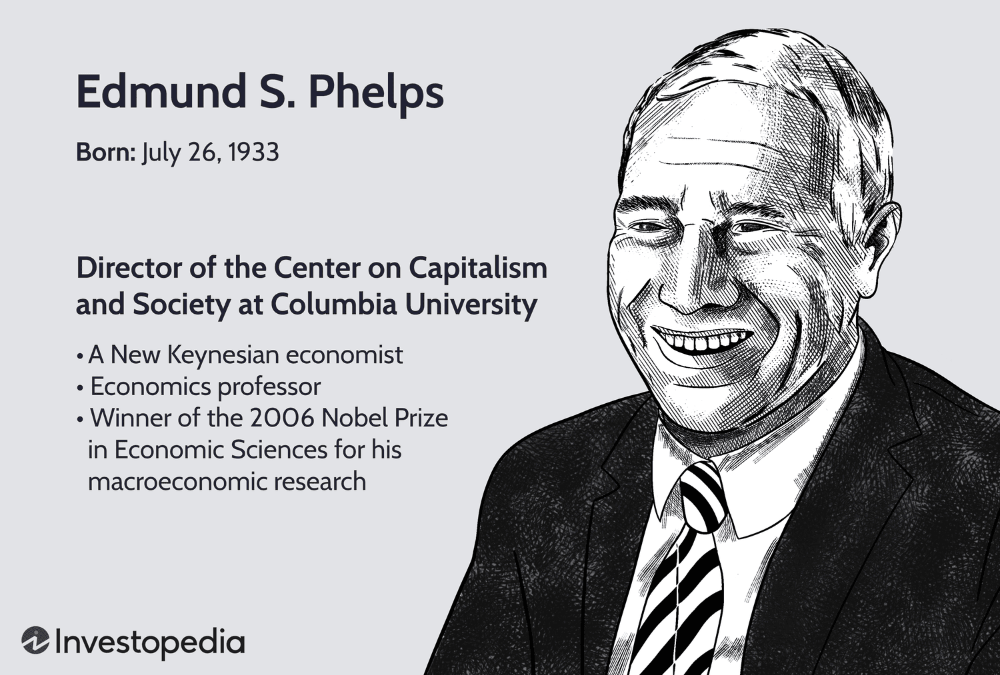

Edmund S. Phelps stands as a prominent figure in economic science, celebrated for his research that profoundly influences modern economic thought. Awarded the Nobel Prize in Economic Sciences in 2006, Phelps is best known for his pioneering work on the dynamics of unemployment and inflation. His development of the expectations-augmented Phillips curve was crucial in understanding the trade-off between unemployment and inflation, a concept that significantly altered the landscape of macroeconomic policy. Phelps's theories on the natural rate of unemployment and adaptive expectations have helped shape economic models that are widely used to both interpret market behavior and inform policy-making.

In parallel, algorithmic trading has emerged as a transformative force within financial markets. This sophisticated form of trading uses computer algorithms to execute trades at speeds and frequencies that are impossible for human traders. Algorithmic trading not only enhances market efficiency but also introduces a range of complexities and risks. It plays a critical role in modern finance, dictating market dynamics and liquidity.



This article aims to explore the intersection between Edmund S. Phelps's economic theories and the methodologies of algorithmic trading. By examining how Phelps's insights into macroeconomics can be integrated into trading algorithms, we seek to uncover potential advancements in trading strategies and market analysis. The article will cover various topics, including a comprehensive background on Phelps, the fundamentals of algorithmic trading, the implications of Phelps's theories for financial markets, and the challenges of applying traditional economic ideas to cutting-edge trading technologies. Through this exploration, we hope to illuminate the value of integrating traditional economic principles with modern financial market practices.

## Table of Contents

## Who is Edmund S. Phelps?

Edmund Strother Phelps, born on July 26, 1933, in Evanston, Illinois, is a distinguished American economist whose work has profoundly influenced macroeconomic thought and policy. Phelps's academic journey began at Amherst College, where he received a Bachelor of Arts degree in 1955. He proceeded to earn his Ph.D. in economics from Yale University in 1959, under the supervision of Nobel laureate James Tobin. 

Phelps's major contributions to economic theory include the introduction of the expectations-augmented Phillips curve. This concept challenged the prevailing notion of a stable inverse relationship between unemployment and inflation, as depicted by the original Phillips curve. Phelps posited that inflation expectations adjust over time, influencing real economic variables. He argued that there is a "natural rate of unemployment," which is unaffected by monetary policy in the long term. This idea significantly altered the understanding of monetary policy's role in influencing employment and inflation.

The expectations-augmented Phillips curve is mathematically represented as:

$$
\pi_t = \pi_{t-1} - \alpha(u_t - u_n) + \epsilon_t
$$

Where:
- $\pi_t$ represents the inflation rate at time $t$,
- $\pi_{t-1}$ is the expected inflation rate,
- $u_t$ is the actual unemployment rate,
- $u_n$ is the natural rate of unemployment,
- $\alpha$ is a positive constant reflecting the sensitivity of inflation to unemployment deviations,
- $\epsilon_t$ is a stochastic error term.

Phelps's insights laid the groundwork for the modern understanding of macroeconomic stabilization policies, influencing the shift towards rules-based policy approaches. His theories underscored the importance of credible monetary policies and the anchoring of inflation expectations to stabilize economies.

Recognition of Phelps's groundbreaking contributions culminated in him receiving the Nobel Prize in Economic Sciences in 2006. The award was bestowed upon him "for his analysis of intertemporal tradeoffs in macroeconomic policy," highlighting his pivotal role in shaping contemporary economic thought. In addition to the Nobel Prize, Phelps has been honored with numerous accolades, reflecting his status as a leading figure in the field of economics. These honors include being a Fellow of the Econometric Society and a Distinguished Fellow of the American Economic Association.

Phelps's contributions continue to resonate in both academic and policy-making circles, as his work provides essential insights into understanding and navigating the complexities of modern economies.

## Understanding Algorithmic Trading

Algorithmic trading, often referred to as algo trading, involves the use of computer algorithms to execute trading orders at optimal speeds and precision that are typically beyond human capabilities. These algorithms follow a defined set of instructions, which can involve timing, price, quantity, or a mathematical model. The primary role of [algorithmic trading](/wiki/algorithmic-trading) is to enhance the efficiency of financial markets by ensuring faster trade executions, improving [liquidity](/wiki/liquidity-risk-premium), and reducing transaction costs.

Algorithmic trading differs markedly from traditional trading methods. Traditional trading often relies on discretionary decision-making, where traders make buy or sell decisions based on their research, intuition, and market experience. In contrast, algorithmic trading automates this process by pre-programming trading decisions based on quantifiable data, removing the emotional aspects of trading decisions. This difference allows for high-frequency trading ([HFT](/wiki/high-frequency-trading-strategies)), a subset of algorithmic trading, where substantial volumes of transactions are executed in fractions of a second.

The key components utilized in algorithmic trading include computer algorithms, data feeds, and analytics platforms. Algorithms are designed to parse market data, identify trading opportunities, and execute trades. High-frequency trading involves particularly sophisticated algorithms that can capitalize on minute market inefficiencies. Additionally, technologies such as [machine learning](/wiki/machine-learning) and [artificial intelligence](/wiki/ai-artificial-intelligence) are increasingly integrated into algorithms to continuously improve their efficacy.

Algorithmic trading offers several advantages. One of the primary benefits is speed; these algorithms can analyze and act on market conditions far quicker than a human could. Additionally, by processing vast amounts of data in real time, algorithms can help create more efficient markets with narrower bid-ask spreads. Moreover, reducing the emotional component in trading can lead to more consistent application of trading strategies.

However, algorithmic trading is not without risks. One significant concern is the potential for systemic risk, where errors in algorithms could lead to market disruptions. The flash crash of May 6, 2010, is a notable example, where algorithmic trading was partly blamed for the rapid and severe market downturn. Additionally, the reliance on technology creates a risk of technical failures, which can lead to substantial financial losses.

In summary, while algorithmic trading brings about efficiency and precision in financial markets, it also raises concerns regarding market stability and technical reliability. As the industry evolves, continuous improvements in technology and regulatory oversight are essential to mitigate these risks.

## Phelps's Economic Theories: Implications for Financial Markets

Edmund S. Phelps's contributions to economic theory fundamentally reshaped the understanding of unemployment and inflation dynamics, primarily through his development of the natural rate of unemployment concept and the theory of adaptive expectations. These theories have profound implications for financial markets and trading strategies.

### The Natural Rate of Unemployment

One of Phelps's seminal contributions is the introduction of the natural rate of unemployment. This concept posits that there is a specific level of unemployment that an economy experiences even when it is at full capacity, due to factors such as labor market imperfections and changes in demographics. Unlike the Phillips curve, which suggested a stable and inverse relationship between unemployment and inflation, Phelps argued that this relationship is only short-term. In the long run, any attempt to keep unemployment below this natural rate using stimulative fiscal or monetary policies would lead to accelerating inflation without a lasting impact on unemployment.

Understanding the natural rate of unemployment allows policymakers and financial market participants to better anticipate shifts in monetary policy. For algorithmic traders and financial analysts, integrating this theory into models could help in predicting central bank actions. For example, if unemployment falls below the natural rate, an algorithm could signal potential tightening of monetary policies, impacting bond yields, currency exchange rates, and stock market valuations.

### Adaptive Expectations

Phelps also advanced the theory of adaptive expectations, which suggests that people adjust their expectations of future inflation based on past experiences. This theory challenges the notion of static expectations and underscores the dynamic adjustments individuals make as they incorporate new information. In practical terms, adaptive expectations explain why people might expect inflation to continue rising if they’ve experienced consistent inflationary trends, in turn affecting consumption, investment decisions, and wage negotiations.

In financial markets, adapting to changes in inflationary expectations is vital for pricing assets accurately. Algorithmic trading systems can be designed to account for shifts in inflation expectations by analyzing historical data trends and current market conditions to forecast future price movements of assets tied to inflation rates such as inflation-linked bonds or commodities.

### Application to Financial Markets

Phelps’s theories offer valuable insights for anticipating economic conditions and making informed trading decisions. For instance, understanding that current inflation trends may influence future inflation expectations helps traders anticipate changes in [interest rate](/wiki/interest-rate-trading-strategies) policies. Similarly, by recognizing that pushing unemployment below the natural rate leads to inflationary pressures, traders can better gauge the potential for policy shifts that might impact asset prices.

To illustrate, consider a hypothetical algorithmic trading model that incorporates Phelps's theories:

```python
def trading_signal(unemployment_rate, natural_unemployment_rate, inflation_trend):
    if unemployment_rate < natural_unemployment_rate and inflation_trend == 'rising':
        return 'sell bonds'
    elif unemployment_rate > natural_unemployment_rate and inflation_trend == 'falling':
        return 'buy bonds'
    else:
        return 'hold'

# Parameters
current_unemployment = 4.5
natural_unemployment = 5.0
current_inflation_trend = 'rising'

signal = trading_signal(current_unemployment, natural_unemployment, current_inflation_trend)
print(f'Trading Signal: {signal}')
```

This simplistic approach uses Phelps's theories to determine bond trading strategies, highlighting potential sell signals when low unemployment coupled with rising inflation indicates possible monetary tightening.

By applying Phelps's insights, financial market participants and algorithmic traders can refine their strategies to better align with macroeconomic realities, enhancing decision-making accuracy and maintaining a proactive stance in dynamic market environments.

## Connecting Phelps's Theories to Algorithmic Trading

Edmund S. Phelps is renowned for his contributions to macroeconomic theory, particularly his work on the natural rate of unemployment and adaptive expectations. These concepts have significant implications for the methodologies used in algorithmic trading, a domain characterized by its reliance on quantitative models and data-driven decision-making processes.

The natural rate of unemployment, which Phelps introduced, suggests that there is a level of unemployment inherent in an economy that cannot be reduced by monetary policy without causing inflation to rise. This theory highlights the importance of equilibrium conditions in market behavior, a principle that can be integrated into algorithmic trading strategies. Understanding that the economy operates around a natural rate of unemployment allows algorithmic traders to incorporate macroeconomic stability indicators into their models. For example, a trading algorithm could adjust its parameters based on deviations from expected unemployment rates, predicting significant shifts in asset prices as markets react to moves away from this equilibrium state.

Phelps's concept of adaptive expectations also offers valuable insights for algorithmic trading. It posits that individuals form their expectations of the future based on past experiences and gradually adjust these expectations as new information becomes available. Translating this idea into algorithmic trading involves designing models that can adapt to market changes by updating their parameters as new data emerges. For instance, a machine learning model used in trading might employ a [reinforcement learning](/wiki/reinforcement-learning) approach where the algorithm iteratively improves its predictions by adjusting its strategies as it “learns” from recent market movements. This dynamic adjustment mechanism aligns with the principles of adaptive expectations by allowing trading systems to reflect changing market sentiments effectively.

Python can be used to create such adaptive models. For instance, the following pseudo-code snippet demonstrates a simple reinforcement learning framework where an algorithm adapts its trading strategy based on recent performance:

```python
import numpy as np

class AdaptiveTrader:
    def __init__(self, alpha=0.1, epsilon=0.1):
        self.alpha = alpha  # Learning rate
        self.epsilon = epsilon  # Exploration factor
        self.q_table = {}  # State-action value table

    def choose_action(self, state):
        if np.random.rand() < self.epsilon:
            return np.random.choice(['buy', 'sell', 'hold'])
        return max(self.q_table.get(state, {'buy': 0, 'sell': 0, 'hold': 0}), key=self.q_table.get(state, {}).get)

    def update_q_table(self, state, action, reward, next_state):
        current_q = self.q_table.get(state, {}).get(action, 0)
        best_next_action = max(self.q_table.get(next_state, {'buy': 0, 'sell': 0, 'hold': 0}), key=self.q_table.get(next_state, {}).get)
        next_q = self.q_table.get(next_state, {}).get(best_next_action, 0)
        new_q = current_q + self.alpha * (reward + next_q - current_q)
        if state not in self.q_table:
            self.q_table[state] = {}
        self.q_table[state][action] = new_q

# Example usage:
trader = AdaptiveTrader()
state = 'current_market_condition'
action = trader.choose_action(state)
# Simulate receiving a reward from the action taken
reward = np.random.rand()
next_state = 'new_market_condition'
trader.update_q_table(state, action, reward, next_state)
```

This adaptive mechanism allows for the incorporation of evolving economic indicators like inflation rates or output gaps into trading strategies, aligning with Phelps's insights on the importance of expectations in economic activities. By integrating macroeconomic principles such as the natural rate of unemployment and adaptive expectations into their quantitative models, algorithmic traders can enhance their strategies, improving the responsiveness and accuracy of their trading systems in capturing market dynamics.

## Challenges and Criticisms

The integration of traditional economic theories, such as those proposed by Edmund S. Phelps, into the realm of modern algorithmic trading presents several challenges. Phelps's theories primarily address macroeconomic dynamics, which are characterized by broad economic indicators and long-term trends. In contrast, algorithmic trading often operates on microsecond timescales, exploiting short-term market inefficiencies. This disconnect in temporal focus presents a fundamental challenge when attempting to apply Phelps's theories to algorithmic trading strategies.

One of the primary criticisms of Phelps's theories, particularly the natural rate of unemployment and adaptive expectations, is their aggregate focus. These theories are designed to understand economy-wide phenomena, which may not translate directly to the nuances of individual asset price movements necessary for algorithmic trading. The assumptions underlying Phelps’s frameworks, such as rational behavior and market efficiency, may not hold in the high-frequency trading (HFT) environment, where irrational behaviors and market anomalies are prevalent.

Algorithmic trading itself is not without criticisms. It has been criticized for contributing to market [volatility](/wiki/volatility-trading-strategies) and flash crashes, as seen in the 2010 flash crash where the Dow Jones Industrial Average plunged about 1,000 points within minutes. The reliance on historical data for developing trading algorithms could also be a limitation as it assumes the future will reflect the past, which may not always be the case.

To address these challenges, adaptations can be made. One potential solution is the integration of macroeconomic indicators derived from Phelps’s theories into trading algorithms as part of a broader data set to predict market movements. For example, incorporating unemployment rates and inflation expectations might provide a macroeconomic context for trading decisions. Additionally, machine learning techniques could be employed to enhance the adaptability of trading models, allowing them to better incorporate and process macroeconomic data alongside traditional market indicators.

Furthermore, there is a need for developing hybrid models that bridge macroeconomic theory with market microstructure insights. By creating models that can operate across different time scales, traders can gain a comprehensive view that harnesses both long-term economic trends and short-term market signals. Advanced economic modeling techniques, such as agent-based models, could also be utilized to simulate market scenarios and test the integration of Phelps’s theories within algorithmic frameworks.

In conclusion, while Phelps's economic theories provide vital insights into macroeconomic trends, applying them to algorithmic trading requires a careful balance of adaptation and innovation. The development of nuanced models that harmonize long-term economic insights with the hyper-specific movements of financial markets can enhance the efficacy and robustness of algorithmic trading strategies.

## Conclusion

Edmund S. Phelps's significant contributions to economic theory, particularly his exploration of the natural rate of unemployment and adaptive expectations, offer valuable insights for understanding financial market dynamics. His work emphasizes the importance of considering long-term equilibrium states and the role of expectations in shaping economic outcomes. These concepts are fundamentally important, not only to macroeconomic policy-makers but also to practitioners in financial markets seeking to anticipate and adapt to market fluctuations.

The integration of Phelps's economic insights into algorithmic trading highlights the potential for enhancing predictive models used by traders. Algorithmic trading, which relies on complex algorithms to execute trades at high speed and [volume](/wiki/volume-trading-strategy), benefits from the foundational understanding of market behavior as posited by economic theories. Implementing principles like those established by Phelps can help shape more robust algorithmic models that incorporate macroeconomic indicators and adaptive elements to adjust to evolving market conditions.

The evolving relationship between traditional economic theory and modern trading technology underscores a transformative period in financial markets. While algorithmic trading represents a technological evolution, aligning it with well-established economic principles offers a framework for more informed and strategic trading practices. Such integrations could potentially lead to improved market efficiencies and a deeper understanding of both short-term market behaviors and long-term trends. Thus, the fusion of theoretical insights from economists like Phelps with sophisticated computational methodologies and data analytics represents a promising frontier in financial market analysis and strategy formulation.

## References & Further Reading

[1]: Phelps, Edmund S. ["Structural Slumps: The Modern Equilibrium Theory of Unemployment, Interest, and Assets"](https://archive.org/details/structuralslumps0000phel). Harvard University Press, 1994.

[2]: Friedman, Milton, and Edmund S. Phelps. ["The Role of Monetary Policy."](https://www.nber.org/system/files/working_papers/w24891/w24891.pdf) The American Economic Review, 1968.

[3]: Phillips, A.W. ["The Relation between Unemployment and the Rate of Change of Money Wage Rates in the United Kingdom, 1861–1957."](https://onlinelibrary.wiley.com/doi/full/10.1111/j.1468-0335.1958.tb00003.x) Economica, 1958.

[4]: Taylor, John B. ["The Great Inflation, the Great Disinflation, and Policies for Future Price Stability."](https://www.rba.gov.au/publications/confs/1992/taylor.html) Journal of Monetary Economics, 1997.

[5]: Bertsimas, Dimitris, and Andrew W. Lo. ["Optimal Control of Execution Costs."](http://web.mit.edu/dbertsim/www/papers/Finance/Optimal%20control%20of%20execution%20costs.pdf) Operations Research, 1998.

[6]: Cartea, Álvaro, and Sebastian Jaimungal. ["Algorithmic and High-Frequency Trading"](https://assets.cambridge.org/97811070/91146/frontmatter/9781107091146_frontmatter.pdf). Cambridge University Press, 2015.