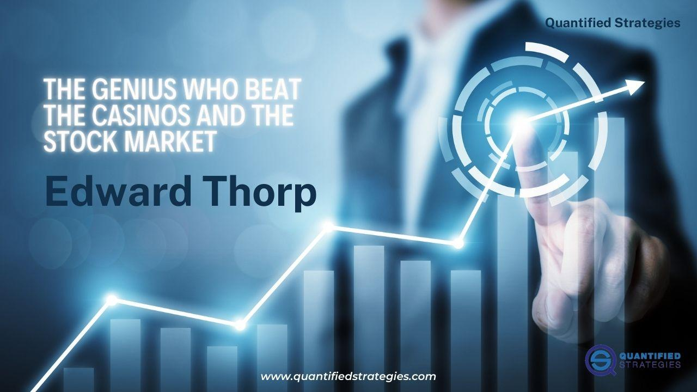

Edward Thorp is widely regarded as a transformative figure in both blackjack gambling and financial markets. His groundbreaking approach to card counting revolutionized the game of blackjack, demonstrating through mathematical proof that the traditional house advantage could be effectively challenged. Utilizing his knowledge, Thorp’s counting system shifted the dynamics at the card tables, presenting a strategic methodology that broke conventional norms.

Beyond the casino, Thorp's influence expanded significantly as he transitioned his mathematical prowess to the financial sector. He pioneered techniques in algorithmic trading that have since become foundational to the industry. Thorp's strategies, notably in the realm of systematic hedge funds, laid the groundwork for subsequent innovations in quantitative finance. His work integrated complex mathematical concepts into trading, establishing new ways to evaluate and manage market risks.



Thorp’s journey illustrates the profound impact of a strong mathematical foundation when applied to real-world scenarios. His contributions extend into modern algorithmic trading, where his legacy continues to influence contemporary strategies and risk management practices. As both a gambler and a scholar, Thorp exemplifies the symbiotic relationship between academia and practical application, successfully transforming both card tables and trading floors into arenas of mathematical exploration.

## Table of Contents

## The Early Years

Edward Thorp's journey into the domains of gambling and quantitative finance finds its roots in his early passion for science and mathematics. Born in 1932 in Chicago, Illinois, Thorp demonstrated an innate curiosity and aptitude for numbers and theoretical constructs from a very young age. This innate proficiency in mathematical concepts laid the foundation for his later groundbreaking achievements.

Thorp's formal education commenced at the University of California, Berkeley, where he pursued a comprehensive study of physical sciences and mathematics. Berkeley, renowned for its rigorous academic environment and intellectual vitality, provided Thorp with a platform to hone his skills and deepen his understanding of mathematical theories and applications. His time at Berkeley fueled his passion for mathematics, ultimately shaping his decision to pursue further studies in the field.

Thorp's academic journey culminated with a transition to the University of California, Los Angeles (UCLA), where he completed his Ph.D. in Mathematics in 1958. At UCLA, Thorp's doctoral research further refined his analytical skills and theoretical knowledge, equipping him with the intellectual tools needed for his future ventures. His doctoral studies not only solidified his scholarly credentials but also expanded his awareness of the potential for mathematical applications beyond academia.

Throughout his academic career, Thorp was particularly influenced by the theoretical precision of mathematics and its ability to deduce logical structures from seemingly chaotic data—a perspective that later became pivotal in his work. His early educational experiences at UC Berkeley and UCLA undoubtedly set the stage for his innovative contributions to both gambling strategies and financial systems. They provided him with a robust platform from which he would revolutionize traditional approaches to blackjack and ultimately pioneer methodologies in quantitative finance.

Edward Thorp's early years showcase the transformative power of robust academic grounding and how it can propel scientific curiosity into groundbreaking practical applications. His educational path underscores the importance of rigorous analytical training in developing innovative solutions to complex problems.

## Revolutionizing Blackjack

Edward Thorp's card counting strategy fundamentally transformed blackjack, evolving it from a game of pure chance to one that could be approached scientifically. With a background in mathematics, Thorp employed statistical analysis to challenge the long-standing perception that the house invariably holds the upper hand. Central to his approach was the use of an IBM 704 computer, a significant technological tool in the 1960s, to simulate thousands of blackjack hands. He sought to determine whether players could systematically alter the odds in their favor by tracking the composition of cards remaining in the deck.

Thorp's methodology hinged on the understanding that a deck rich in high-value cards favored the player. This is because higher cards, such as tens and aces, increase the probability of hitting natural blackjacks, which offer a 3 to 2 payout, and improve conditions for doubling down strategies. Conversely, a deck dense with low cards bolsters the dealer, who must hit until reaching at least a total of 17, regardless of the player's situation.

Utilizing the computational power of the IBM 704, Thorp confirmed that tracking cards that had been played enabled players to adjust their bets and decisions based on the remaining deck's favorable or unfavorable composition. His findings were published in the seminal book "Beat the Dealer" (1962), where he introduced the High-Low strategy, a simple yet effective card counting system. With this method, players assign a value of +1 to cards numbered 2 through 6, 0 to cards 7 through 9, and -1 to 10s and aces. By maintaining a running count, players could gauge their advantage and adjust their bets accordingly.

Thorp's insights had a profound impact on both casinos and players. For players, it democratized winning strategies, suggesting that with skill and discipline, anyone could tilt the odds. For casinos, it necessitated adjustments, such as introducing multi-deck shoes, shuffling more frequently, and instituting new table rules to safeguard against advantage players. Despite these countermeasures, the principles Thorp elaborated continue to inform strategies employed by card counters today.

The mathematical rigor and innovative application of technology Thorp utilized not only revolutionized blackjack but also laid the groundwork for subsequent explorations into probability-based strategies across various domains. His work remains a testament to the power of mathematical insight in challenging established paradigms in games of chance.

## From Casinos to Computers: The First Wearable Device

In the early 1960s, Edward Thorp, in collaboration with renowned mathematician and electrical engineer Claude Shannon, developed the first wearable computer. This innovative device was designed to improve predictions in the game of roulette, highlighting Thorp’s progressive blend of mathematics, technology, and strategy.

The concept originated from Thorp's interest in exploiting biases in roulette wheels, a problem Shannon was also intrigued by, given his profound interest in probability and computing. Together, they engineered a compact, analog-digital hybrid computer that could be discreetly worn to casinos. The operation of this device marked a pioneering attempt at wearable technology—years ahead of its time.

The primary function of their wearable computer was to predict the landing position of the roulette ball with greater accuracy than blind randomness. By analyzing the speed of the wheel and the ball with real-time inputs, the device calculated probable outcomes. The data collection process involved coordinating the timings of these measurements, which were then translated into predictions via complex algorithms. 

This innovation laid the groundwork for the modern wearable technology landscape. Although the device itself was never publicly demonstrated nor used extensively due to legal and practical constraints, its foundational concepts influenced later explorations in portable computing. Thorp’s foresight into personalized computing devices continues to resonate within the technology sector, underlining his role as a visionary in merging real-world applications with academic theory.

Edward Thorp’s achievement with Claude Shannon illustrates a formidable leap in the application of mathematical theory to an uncharted domain of wearable computing. The project underscores the interconnectivity between numerical analysis, mechanical operation, and technology—setting the stage for the multifaceted applications seen in today’s wearables.

## Wall Street and the Birth of Quantitative Finance

Edward Thorp, widely recognized for his pioneering work in gambling, transitioned his mathematical acumen to the world of finance, thereby contributing significantly to the birth of quantitative finance. His step into Wall Street introduced mathematical rigor and a systematic approach to investment strategies, culminating in the establishment of the first market-neutral [hedge fund](/wiki/hedge-fund-trading-strategies), Princeton/Newport Partners, in 1969.

A market-neutral strategy seeks to eliminate market risk by holding long and short positions in various assets, aiming to exploit price inefficiencies. Thorp's fund was innovative in its approach to convertible bond [arbitrage](/wiki/arbitrage). This strategy involves taking advantage of the pricing anomalies between a company's stock and its convertible bonds—securities that can be converted into a predetermined amount of the company's equity. Thorp's success in this area rested on his ability to apply probability and statistical models to assess and predict market movements, thus managing risk with unprecedented precision.

The foundation of Thorp's strategies in quantitative finance lay in his application of stochastic calculus and [statistical arbitrage](/wiki/statistical-arbitrage). By utilizing tools such as the Black-Scholes model, which was still in its early stages at the time, Thorp could effectively calculate the theoretical price of options and identify arbitrage opportunities. The Black-Scholes model is defined as:

$$
C(S, t) = S_0N(d_1) - Xe^{-rt}N(d_2)
$$

where $d_1 = \frac{\ln(S_0/X) + (r + \sigma^2/2)t}{\sigma\sqrt{t}}$ and $d_2 = d_1 - \sigma \sqrt{t}$.

In addition to these mathematical models, Thorp's approach was characterized by rigorous risk management and flexibility. He incorporated [volatility](/wiki/volatility-trading-strategies) and trading [volume](/wiki/volume-trading-strategy) into his quantitative models, which are key elements in modern [algorithmic trading](/wiki/algorithmic-trading) systems. His strategies prefigured statistical arbitrage, which remains a fundamental component of algorithmic trading by leveraging statistical techniques to profit from market inefficiencies.

Through his pioneering work, Thorp not only established the validity of mathematical techniques in finance but also laid the groundwork for future developments in algorithmic trading. His legacy endures as his strategies and insights continue to inform and influence the evolution of [quantitative trading](/wiki/quantitative-trading) models, demonstrating the transformative power of mathematics in financial markets.

## Edward Thorp’s Trading Strategies

Edward Thorp's trading strategies were pioneering efforts that combined mathematical precision with practical market insights. At the heart of his approach was statistical arbitrage, a trading strategy that seeks to profit from pricing inefficiencies between related financial instruments. This was achieved by leveraging statistical models to identify and exploit discrepancies, allowing traders to execute buy-and-sell decisions that are primarily market-neutral.

Thorp's quantitative models were instrumental in this process. These models integrated fundamental elements like volatility and volume, which are critical in assessing market conditions and determining the appropriate timing and magnitude of trades. In essence, these models served as a precursor to the sophisticated trading algorithms widely used today. The use of volatility as a metric allowed Thorp to predict potential price movements and assess risk, while volume provided insights into market [liquidity](/wiki/liquidity-risk-premium) and the strength of price trends.

Risk management was a crucial component of Thorp's strategy. By maintaining a market-neutral stance, he minimized exposure to market-wide risks, thereby ensuring that the strategy's success relied less on market direction and more on the precision of his models. This approach required meticulous calibration of parameters and continuous adaptation to changing market conditions. Thorp's methodology involved rigorous back-testing and real-time adjustments, ensuring resilience and effectiveness even in volatile market scenarios.

In practical terms, Thorp's methods could be represented through simplified versions of algorithms that traders might recognize today. For instance, a basic Python representation of a statistical arbitrage algorithm might involve the following:

```python
import numpy as np
import pandas as pd

# Example: Spread calculation between two correlated assets
def calculate_spread(asset1, asset2):
    return asset1 - asset2

# Simulate trading signals based on z-score of the spread
def trading_signal(spread, mean, std):
    z_score = (spread - mean) / std
    if z_score > 2:
        return 'sell'
    elif z_score < -2:
        return 'buy'
    else:
        return 'hold'

# Historical data for assets
asset1_data = np.random.normal(loc=100, scale=10, size=1000)
asset2_data = np.random.normal(loc=98, scale=10, size=1000)

# Calculate spread and z-score
spread = calculate_spread(asset1_data, asset2_data)
spread_mean = np.mean(spread)
spread_std = np.std(spread)

# Generate trading signals
signals = [trading_signal(s, spread_mean, spread_std) for s in spread]
```

In this simplified example, the spread between two assets (often pairs of stocks) is calculated, and a z-score is used to determine trading actions. The decision to buy or sell is based on statistical measures, ensuring the strategy remains grounded in mathematical probability rather than speculation.

Thorp's meticulous approach, which merged statistical rigor with strategic trading insights, laid the groundwork for the quantitative trading industry. His emphasis on dynamic risk management and continuous adaptation remains a cornerstone of successful trading strategies today.

## Legacy and Continuous Influence

Edward Thorp's methods continue to resonate in both gambling and financial markets, demonstrating the enduring relevance of his innovative approaches. In casinos, Thorp's card counting techniques revolutionized blackjack, prompting establishments to modify their dealing practices and introduce countermeasures to mitigate skilled players' advantages. These responses underscore the effectiveness and impact of Thorp's mathematical strategies in altering gambling dynamics.

In finance, Thorp's pioneering contributions extend to his work on risk and reward theories, which remain integral to contemporary market practices. His insights into probability and statistical analysis have deeply influenced the development of sophisticated financial models. Notable among these is the Black-Scholes model, a cornerstone of modern option pricing theory. Thorp's involvement and ideas significantly contributed to the model's foundation, particularly in its application of stochastic calculus to evaluate financial derivatives. The formula for pricing European call options is expressed as:

$$
C = S_0 N(d_1) - X e^{-rt} N(d_2)
$$

where:
- $C$ is the call option price
- $S_0$ is the current stock price
- $X$ is the strike price
- $r$ is the risk-free interest rate
- $t$ is the time to expiration
- $N(d)$ is the cumulative distribution function of the standard normal distribution
- $d_1$ and $d_2$ are calculated as:
  \[ d_1 = \frac{\ln(S_0/X) + (r + \sigma^2/2)t}{\sigma\sqrt{t}}
$$
  \[ d_2 = d_1 - \sigma\sqrt{t}
$$

Thorp's development of the first market-neutral hedge fund also signaled a transformation in the financial industry. By employing strategies such as convertible bond arbitrage, he showcased how mathematical models could forecast market behavior, optimizing investment portfolios and managing risk. This market-neutral approach laid the groundwork for contemporary algorithmic trading strategies that rely on statistical arbitrage to capitalize on price discrepancies, minimizing directional market risk.

Beyond specific financial models and techniques, Thorp's legacy is evident in the continued application of systematic, quantitative methods across various investment platforms. His advocacy for rigorous risk management and adaptive strategies reflects a far-reaching influence that has helped shape the ethos of successful trading operations today. Thorp’s advancements highlight the scalable and transformative potential of applying mathematical rigor and academic insight to practical, real-world challenges.

## Conclusion

Edward Thorp's accomplishments underscore the profound impact that mathematical rigor can have on diverse real-world applications. Through innovative thinking and a disciplined approach to both gambling and financial markets, Thorp demonstrated the transformative potential of applying systematic methodologies. His groundbreaking work in card counting revolutionized the way blackjack is played, establishing a new canon in casino gaming that surged beyond mere luck to incorporate probabilistic strategies.

Transitioning from casinos to Wall Street, Thorp's insights laid a foundational framework for the emergence of quantitative finance. His pioneering efforts in market-neutral hedge funds and statistical arbitrage brought mathematical precision to trading, enabling the exploitation of price discrepancies and enhancing risk management practices. The emphasis on using mathematical models to predict market movements pre-figured the development of algorithms that are pivotal in today's trading environments.

Thorp's contribution extends beyond his own achievements, as it continues to shape modern trading and investment strategies. By advocating for the use of measurable patterns and maintaining adaptability to evolving market conditions, his methodologies have inspired subsequent generations of quantitative analysts and traders. The ongoing application of his theories on risk and reward within both financial markets and gaming exemplifies his enduring legacy, proving that well-reasoned, mathematically based strategies can offer a significant edge in competitive arenas. Thus, Edward Thorp's life work not only illustrated the application of mathematics in concrete contexts but also heralded a new era where analytical precision meets strategic innovation.

## References & Further Reading

[1]: Thorp, E. O. (1962). ["Beat the Dealer: A Winning Strategy for the Game of Twenty-One."](https://www.amazon.com/Beat-Dealer-Winning-Strategy-Twenty-One/dp/0394703103) Random House.

[2]: Thorp, E. O. (1969). ["Beat the Market: A Scientific Stock Market System."](https://www.amazon.com/Beat-Market-Scientific-Stock-System/dp/0394424395) Random House.

[3]: Thorp, E. O. (2017). ["A Man for All Markets: From Las Vegas to Wall Street, How I Beat the Dealer and the Market."](https://www.amazon.com/Man-All-Markets-Street-Dealer/dp/1400067960) Random House.

[4]: Smith, G. (2004). ["The Scientists of Gambling: Card Counting to Systematic Trading Strategies"](https://www.ncbi.nlm.nih.gov/pmc/articles/PMC5714688/) Barricade Books.

[5]: Poundstone, W. (2005). ["Fortune's Formula: The Untold Story of the Scientific Betting System That Beat the Casinos and Wall Street."](https://www.amazon.com/Fortunes-Formula-Scientific-Betting-Casinos/dp/0809045990) Hill and Wang.

[6]: Mandelbrot, B. B., & Hudson, R. L. (2004). ["The (Mis)Behavior of Markets: A Fractal View of Risk, Ruin, and Reward."](https://users.math.yale.edu/~bbm3/web_pdfs/misbehaviorprelude.pdf) Basic Books.