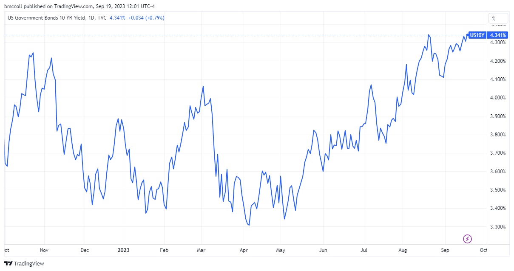

In the fast-paced world of finance, executive leadership, finance, and algorithmic trading play pivotal roles. The intricacies of these elements and their interactions significantly shape the global financial landscape. With the rapid advancements in technology, the financial sector has undergone transformative changes, impacting the strategies and operations of financial institutions worldwide. Algorithmic trading, a key technological innovation, has revolutionized trading practices by automating decision-making processes, which were traditionally reliant on human expertise and intuition.

Algorithmic trading utilizes computer algorithms to execute trades at speeds and efficiencies that are beyond human capabilities. By leveraging vast amounts of market data, algorithms can identify patterns and opportunities, leading to more informed and precise trading decisions. This shift towards automation and data-driven strategies presents both opportunities and challenges for executive leadership within the financial industry. Leaders must navigate these technological advancements, balancing innovation with regulatory compliance and ethical considerations.



Understanding the dynamics of algorithmic trading and its integration into financial operations is essential for professionals aiming to thrive in today's highly competitive and technologically advanced market. As the financial landscape continues to evolve, the ability to adapt and lead in this environment will determine the success of financial professionals and organizations alike. Embracing the opportunities presented by technology, while addressing the inherent challenges, is crucial for driving innovation and sustaining growth in the financial sector.

## Table of Contents

## Understanding Executive Leadership in Finance

Executive leadership in finance is critical to the strategic direction and success of organizations operating within the financial industry. Leaders in this domain are responsible for guiding organizations through complex decision-making processes and driving innovation to achieve sustained growth. One of the core responsibilities of finance executives is to oversee financial operations, ensuring that the organization remains financially sound while adhering to regulatory requirements. This includes managing financial risks, optimizing cash flow, and ensuring that financial reporting is accurate and timely.

A prominent example of strong leadership in this sector is Edward T. Tilly, who has held influential positions at Cboe Global Markets, an exchange holding company that provides trading in some of the world's most popular indexes. His leadership has been pivotal in steering the company through periods of significant change and adaptation. Similarly, his involvement with Clear Street, a firm aiming to modernize infrastructure in capital markets, reflects the increasing need for executives to be adept at integrating technology into financial operations.

As technology continues to permeate the financial sector, the role of finance executives is undergoing a significant evolution. The integration of technology, such as blockchain and artificial intelligence, demands that leaders possess not only traditional financial acumen but also a robust understanding of technological advancements and their implications for financial strategies. This evolution necessitates a shift in leadership style—an openness to change and a willingness to foster an organizational culture that values innovation and agility.

For effective leadership in this rapidly changing landscape, executives must cultivate an environment where innovation thrives. This involves encouraging creativity among staff, investing in training and development programs, and implementing technologies that enhance operational efficiency and customer service. Furthermore, by staying abreast of market changes and adapting their strategies accordingly, finance executives can position their organizations to maximize opportunities while mitigating risks.

The ability to merge financial expertise with technological insight is becoming indispensable for finance leaders. Those who succeed are typically those who can foresee and exploit technological trends, balancing traditional financial strategies with modern algorithm-based approaches. By fostering an innovative organizational culture and being responsive to market dynamics, executive leaders can guide their organizations toward sustainable growth and competitive advantage in an increasingly complex financial ecosystem.

## Finance Meets Technology: The Rise of Algo Trading

Algorithmic trading, commonly known as algo trading, involves leveraging computer algorithms to automate and optimize trading processes. At its core, these algorithms execute trades based on predetermined conditions and criteria, often involving complex mathematical models and real-time data analysis. This approach has transformed financial markets, providing numerous advantages over traditional trading methods.

The primary reason [algorithmic trading](/wiki/algorithmic-trading) has gained immense popularity is its capability to parse and analyze large volumes of market data with incredible speed and precision. These algorithms excel at executing trades in fractions of a second, which is crucial in high-frequency trading environments where profits depend on timing. The algorithms evaluate multiple market variables, such as price movements, [volume](/wiki/volume-trading-strategy), and historical patterns, enabling the execution of trades with minimal human intervention.

The integration of algorithmic trading into financial strategies has led to significant improvements in the efficiency and accuracy of trade execution. By minimizing human errors and emotional biases, algorithms enhance decision-making. Additionally, their ability to operate 24/7 ensures that trading opportunities are not missed, especially in global markets that never sleep.

For finance professionals, understanding algo trading is essential to harness its full potential. The rise of educational programs, such as the Executive Programme in Algorithmic Trading (EPAT), has become crucial for training individuals in this domain. These courses offer in-depth knowledge of algorithmic trading systems, covering aspects like data analysis, quantitative strategies, and programming languages such as Python. 

Knowledge obtained from such courses empowers traders and financial leaders to develop and implement bespoke algorithms tailored to specific market conditions and objectives. This education not only keeps professionals abreast of technological advancements but also provides them with the practical skills needed to adapt to the evolving financial landscape. As algo trading continues to redefine financial markets, the expertise gained through targeted learning programs becomes a valuable asset in career advancement, opening avenues in high-frequency trading and data-driven financial analysis.

## The Role of Education in Navigating Algo Trading

Continuous education is crucial for finance professionals aiming to maintain a competitive edge in a technology-driven market, especially with the growing prevalence of algorithmic trading. Programs like the Executive Programme in Algorithmic Trading (EPAT) are pivotal in offering comprehensive training that covers essential skills such as programming in Python and developing effective algorithmic trading strategies.

The EPAT program, recognized for its industry relevance, equips traders and executives with robust tools to design, develop, and implement trading algorithms effectively. Learning to code in Python enables finance professionals to automate complex trading strategies, perform data analysis, and optimize trading operations. Here's a simple example of how Python can be used to implement a basic moving average crossover strategy, a staple in algorithmic trading:

```python
import numpy as np
import pandas as pd

# Sample data - a dataframe of stock prices
data = pd.DataFrame({'price': [120, 121, 122, 125, 123, 126, 124, 127]})

# Calculate short-term and long-term moving averages
data['short_term_avg'] = data['price'].rolling(window=3).mean()
data['long_term_avg'] = data['price'].rolling(window=5).mean()

# Determine the buy and sell signals
data['signal'] = np.where(data['short_term_avg'] > data['long_term_avg'], 'Buy', 'Sell')

print(data[['price', 'short_term_avg', 'long_term_avg', 'signal']])
```

Such courses not only teach technical skills but also enhance decision-making abilities and market analysis skills. Networking opportunities with industry experts and peers further enrich the learning experience, fostering a deeper understanding of the market landscape.

Moreover, obtaining industry-recognized certifications, like those from EPAT, can significantly boost a professional's career prospects. These certifications often serve as a testament to a professional’s expertise and readiness for roles in high-frequency trading and other advanced trading strategies. The recognition of these certifications by employers can open up new career paths and opportunities in financial institutions that prioritize cutting-edge trading technologies.

In summary, the integration of algorithmic trading in finance necessitates a robust educational foundation in both technology and market dynamics. Continuous learning through structured educational programs empowers finance professionals to innovate, adapt, and excel in increasingly complex trading environments.

## Challenges and Opportunities in Algo Trading Leadership

With innovation in algorithmic trading comes the inevitable challenge of regulatory compliance and ethical considerations. Executives are tasked with balancing the pursuit of technological advancement while ensuring adherence to market regulations. The rapid pace of technological development in finance has often outpaced the regulatory frameworks, creating a dynamic and sometimes precarious environment for leaders in finance. Adherence to financial regulations such as the European Union's Markets in Financial Instruments Directive II (MiFID II) and the U.S. Securities and Exchange Commission (SEC) guidelines is crucial in avoiding market abuse and ensuring transparency and fairness.

Algorithmic trading models, due to their complexity and reliance on vast quantities of data, exhibit a degree of [volatility](/wiki/volatility-trading-strategies) that necessitates rigorous testing and refined risk management strategies. The unpredictability of market conditions can lead to unforeseen consequences if the algorithms are not adequately vetted. Testing involves stress-testing models against historical data to ensure robustness and using [backtesting](/wiki/backtesting) methods to simulate their performance in hypothetical scenarios. This is paramount to mitigate potential risks that could lead to significant financial losses.

Moreover, an exciting opportunity lies in harnessing Artificial Intelligence (AI) and [machine learning](/wiki/machine-learning) for predictive analytics in trading. These technologies can analyze massive datasets far beyond human capability, uncovering patterns and trends that inform trading strategies. Machine learning algorithms can adapt and improve over time, enhancing decision-making processes. For example, [reinforcement learning](/wiki/reinforcement-learning), a subset of machine learning, can be employed to optimize trading strategies by continuously learning from successful and unsuccessful trades.

Here's a basic example of a reinforcement learning framework in Python that simulates a trading environment:

```python
import numpy as np

class TradingEnvironment:
    def __init__(self, initial_balance=10000):
        self.balance = initial_balance
        self.position = 0

    def step(self, action):
        # action: 0 = hold, 1 = buy, 2 = sell
        price_change = (np.random.rand() - 0.5) * 10  # Simulate random price change
        if action == 1:
            self.balance -= price_change
            self.position += 1
        elif action == 2 and self.position > 0:
            self.balance += price_change
            self.position -= 1
        return self.balance

# Example usage:
env = TradingEnvironment()
for _ in range(10):
    action = np.random.choice([0, 1, 2])  # Random action for demonstration
    balance = env.step(action)
    print(f"Action taken: {action}, New balance: {balance}")
```

Successful leadership in this area involves establishing a symbiotic relationship between technology and business strategy. Leaders must integrate technological advancements such as algorithmic trading and AI not just as standalone innovations, but as intrinsic components of their strategic vision. Aligning these innovations with the organization's goals and ensuring they contribute to the overall strategic direction are essential for driving growth and maintaining a competitive edge. By fostering a culture that embraces innovation while adhering to ethical and regulatory standards, finance executives can effectively navigate the challenges and leverage the opportunities presented by algorithmic trading.

## Conclusion

Executive leadership in finance must proactively embrace and integrate algorithmic trading to remain competitive in today's technology-driven world. As financial markets continue to evolve, the ability of leaders to navigate technological complexities with strategic insight is crucial. Leaders who harness the power of technology not only streamline operations but also unlock new avenues for growth and innovation.

Education and adaptability are vital for success in this rapidly changing field. As algorithmic trading becomes increasingly prevalent, finance professionals must continuously update their knowledge and skills. Educational programs and certifications in algorithmic trading equip professionals with the necessary tools to design and implement effective trading strategies. Such knowledge enables them to make informed decisions, optimize trading operations, and mitigate risks.

Understanding the opportunities and challenges presented by algorithmic trading allows leaders to foster innovation and drive organizational growth. The integration of advanced technologies, such as [artificial intelligence](/wiki/ai-artificial-intelligence) and machine learning, offers enhanced predictive analytics and decision-making capabilities. However, leaders must balance technological advancements with ethical practices and regulatory compliance to maintain trust and ensure sustainable success.

Staying informed and prepared is essential for finance professionals to thrive in the modern financial landscape. By cultivating a culture of continuous learning and adaptability, organizations can position themselves to capitalize on technological advancements. Leaders who embrace change and steer their teams through the complexities of algorithmic trading will not only ensure their organizations' survival but will also seize opportunities for unprecedented growth and development.

## References & Further Reading

[1]: Bergstra, J., Bardenet, R., Bengio, Y., & Kégl, B. (2011). ["Algorithms for Hyper-Parameter Optimization."](https://dl.acm.org/doi/10.5555/2986459.2986743) Advances in Neural Information Processing Systems 24.

[2]: ["Advances in Financial Machine Learning"](https://www.amazon.com/Advances-Financial-Machine-Learning-Marcos/dp/1119482089) by Marcos Lopez de Prado

[3]: ["Evidence-Based Technical Analysis: Applying the Scientific Method and Statistical Inference to Trading Signals"](https://www.amazon.com/Evidence-Based-Technical-Analysis-Scientific-Statistical/dp/0470008741) by David Aronson

[4]: ["Machine Learning for Algorithmic Trading"](https://www.amazon.com/Machine-Learning-Algorithmic-Trading-alternative/dp/1839217715) by Stefan Jansen

[5]: ["Quantitative Trading: How to Build Your Own Algorithmic Trading Business"](https://www.amazon.com/Quantitative-Trading-Build-Algorithmic-Business/dp/1119800064) by Ernest P. Chan