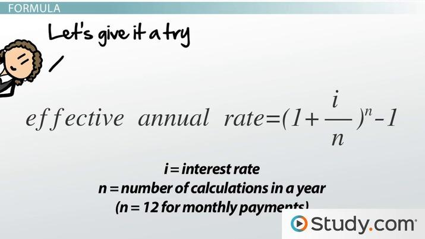

## Table of Contents

## What is the Effective Annual Interest Rate (EAR)?

The Effective Annual Interest Rate (EAR) is a way to figure out how much interest you will really earn or pay on money in a year. It takes into account how often the interest is added to your money, like monthly or daily. This is different from the simple interest rate, which doesn't consider how often the interest is added. For example, if you have a savings account that adds interest every month, the EAR will show you a higher rate than the simple interest rate because you're earning interest on the interest that was added before.

Understanding the EAR is important because it helps you compare different financial products more accurately. If you're looking at two loans or two savings accounts, one might have a lower simple interest rate but a higher EAR because of how often the interest is compounded. By looking at the EAR, you can see which one will actually cost you less or earn you more money over time. It's a useful tool for making smart financial decisions.

## How does the Effective Annual Interest Rate differ from the nominal interest rate?

The Effective Annual Interest Rate (EAR) and the nominal interest rate are two different ways to look at how much interest you'll earn or pay on money. The nominal interest rate is the basic rate you see advertised. It doesn't take into account how often the interest is added to your money. For example, if a bank says they offer a 5% nominal interest rate, that's the rate before considering how often the interest is compounded.

On the other hand, the EAR shows you the real rate of interest you'll earn or pay over a year, taking into account how often the interest is added, like monthly or daily. This means the EAR is usually higher than the nominal rate because it includes the effect of compounding. If you have a savings account with a 5% nominal rate that compounds monthly, the EAR would be higher because you're [earning](/wiki/earning-announcement) interest on the interest that was added before.

Understanding the difference between these two rates is important for making smart financial choices. If you're comparing loans or savings accounts, looking at the EAR gives you a better idea of what you'll actually pay or earn over time. This can help you choose the best option, even if the nominal rates look similar.

## Why is the Effective Annual Interest Rate important for financial decision-making?

The Effective Annual Interest Rate (EAR) is really important for making good money choices because it shows you the real rate of interest you'll pay or earn over a year. Unlike the simple interest rate you see advertised, the EAR takes into account how often the interest is added to your money, like monthly or daily. This means the EAR gives you a more accurate picture of what you'll actually end up paying or earning. When you're looking at different loans or savings accounts, knowing the EAR helps you compare them more fairly and choose the best option for your money.

For example, if you're choosing between two loans, one might have a lower advertised rate but a higher EAR because of how often the interest is compounded. By looking at the EAR, you can see which loan will actually cost you less over time. The same goes for savings accounts. An account with a slightly lower nominal rate might have a higher EAR if it compounds more often, meaning you'll earn more money in the end. Understanding the EAR helps you make smarter choices and get the most out of your money.

## How can you calculate the Effective Annual Interest Rate?

To calculate the Effective Annual Interest Rate (EAR), you need to know the nominal interest rate and how often the interest is compounded. The formula to find the EAR is: EAR = (1 + (nominal interest rate / number of compounding periods))^number of compounding periods - 1. For example, if you have a nominal interest rate of 5% that compounds monthly, you would divide 5% by 12 (the number of months in a year), add 1, raise that to the 12th power, and then subtract 1 to get the EAR.

Let's break it down with a simple example. If you have a savings account with a nominal interest rate of 5% that compounds monthly, you would calculate the EAR like this: First, divide 5% by 12 to get 0.4167%. Then, add 1 to get 1.004167. Next, raise 1.004167 to the 12th power to get about 1.0512. Finally, subtract 1 from 1.0512 to find the EAR, which is about 5.12%. This means the effective annual rate you'll earn on your savings is 5.12%, which is higher than the nominal rate of 5% because of monthly compounding.

## What is the formula for calculating EAR from a nominal rate and the number of compounding periods?

The formula for calculating the Effective Annual Interest Rate (EAR) from a nominal rate and the number of compounding periods is: EAR = (1 + (nominal interest rate / number of compounding periods))^number of compounding periods - 1. This formula helps you figure out the real rate of interest you'll earn or pay over a year, taking into account how often the interest is added to your money.

For example, if you have a nominal interest rate of 5% that compounds monthly, you would divide 5% by 12 (the number of months in a year) to get 0.4167%. Then, you add 1 to get 1.004167, raise that to the 12th power to get about 1.0512, and finally subtract 1 to find the EAR, which is about 5.12%. This means the effective annual rate you'll earn on your savings is 5.12%, which is higher than the nominal rate of 5% because of monthly compounding.

## Can you provide an example of calculating EAR for a loan with monthly compounding?

Let's say you have a loan with a nominal interest rate of 6% that compounds monthly. To find the Effective Annual Interest Rate (EAR), you need to use the formula: EAR = (1 + (nominal interest rate / number of compounding periods))^number of compounding periods - 1. For this loan, the nominal interest rate is 6% and it compounds monthly, so there are 12 compounding periods in a year.

First, you divide the nominal interest rate by the number of compounding periods. That means you divide 6% by 12 to get 0.5%. Then, you add 1 to get 1.005. Next, you raise 1.005 to the 12th power, which gives you about 1.0617. Finally, you subtract 1 from 1.0617 to find the EAR, which is about 6.17%. So, even though the loan's nominal rate is 6%, the effective annual rate you'll pay is actually 6.17% because of the monthly compounding.

## How does the frequency of compounding affect the Effective Annual Interest Rate?

The frequency of compounding has a big impact on the Effective Annual Interest Rate (EAR). When interest is added to your money more often, like monthly instead of yearly, you earn or pay interest on the interest that was added before. This means the more often the interest is compounded, the higher the EAR will be. For example, if you have a savings account with a 5% nominal interest rate, the EAR will be higher if the interest is compounded monthly than if it's compounded yearly. This is because with monthly compounding, you're earning interest on the interest every month, which adds up over the year.

Let's look at a simple example to see how this works. If you have a loan with a 6% nominal interest rate, the EAR will be different depending on how often the interest is compounded. If it's compounded yearly, the EAR is just 6%. But if it's compounded monthly, you divide 6% by 12 to get 0.5%, add 1 to get 1.005, raise that to the 12th power to get about 1.0617, and then subtract 1 to find the EAR, which is about 6.17%. So, even though the nominal rate is the same, the EAR is higher with monthly compounding because you're paying interest on the interest every month.

## What are the implications of a higher EAR for borrowers and investors?

For borrowers, a higher Effective Annual Interest Rate (EAR) means they will end up paying more money over time. If a loan has a higher EAR because of more frequent compounding, the total interest paid will be greater than if the interest were compounded less often. This can make the loan more expensive and affect how much a borrower can afford to borrow. It's important for borrowers to look at the EAR when comparing loans, not just the advertised nominal rate, to understand the real cost of borrowing.

For investors, a higher EAR is a good thing because it means they will earn more money on their investments. If an investment has a higher EAR due to more frequent compounding, the total amount of interest earned will be greater over time. This can lead to bigger returns and help investors grow their money faster. When choosing where to invest, looking at the EAR helps investors see which options will give them the best return on their money.

## How can understanding EAR help in comparing different financial products?

Understanding the Effective Annual Interest Rate (EAR) is really important when you're trying to compare different financial products like loans or savings accounts. The EAR shows you the real rate of interest you'll pay or earn over a year, taking into account how often the interest is added to your money. This is different from the simple interest rate you see advertised, which doesn't consider how often the interest is compounded. By looking at the EAR, you can see which loan will actually cost you less or which savings account will earn you more money over time, even if the advertised rates look similar.

For example, if you're choosing between two loans, one might have a lower advertised rate but a higher EAR because of how often the interest is compounded. By comparing the EARs, you can see which loan will really be cheaper in the end. The same goes for savings accounts. An account with a slightly lower nominal rate might have a higher EAR if it compounds more often, meaning you'll earn more money over the year. Knowing the EAR helps you make smarter financial choices and get the best deal for your money.

## What are common mistakes people make when calculating or interpreting EAR?

One common mistake people make when calculating or interpreting the Effective Annual Interest Rate (EAR) is focusing only on the nominal interest rate. The nominal rate is the simple rate you see advertised, but it doesn't show the real cost or earnings because it doesn't consider how often the interest is added to your money. If you just look at the nominal rate, you might think a loan or savings account is better than it really is. The EAR takes into account how often the interest is compounded, like monthly or daily, so it gives you a more accurate picture of what you'll actually pay or earn over a year.

Another mistake is not understanding how the frequency of compounding affects the EAR. People might think that if two financial products have the same nominal rate, they're the same, but that's not true if one compounds interest more often than the other. For example, a savings account with a 5% nominal rate that compounds monthly will have a higher EAR than one that compounds yearly, meaning you'll earn more money over time. It's important to use the right formula to calculate the EAR, which is EAR = (1 + (nominal interest rate / number of compounding periods))^number of compounding periods - 1, to see the real difference between financial products.

## How does inflation impact the real Effective Annual Interest Rate?

Inflation can change how much money you really earn or pay with the Effective Annual Interest Rate (EAR). If the EAR on your savings account is 5%, but inflation is also 5%, the real value of your money doesn't grow. This is because the prices of things you buy are going up at the same rate as your savings. So, even though you're earning interest, you can't buy more with your money than before. To figure out the real EAR, you need to take away the inflation rate from the EAR. If your EAR is 5% and inflation is 2%, your real EAR is 3%, which means your money is growing a little bit more than the prices are going up.

For borrowers, inflation can make the real cost of a loan less. If you have a loan with an EAR of 6% and inflation is 3%, the real cost of the loan is only 3% because the money you're paying back is worth less over time. This can make borrowing money a bit easier because the value of the money you owe goes down. But it's important to remember that inflation can change, so what looks good now might not be as good if inflation goes up or down. Always think about inflation when you're looking at the EAR to understand the real impact on your money.

## What advanced considerations should be taken into account when using EAR in complex financial models?

When using the Effective Annual Interest Rate (EAR) in complex financial models, it's important to think about how different factors can change the EAR over time. For example, if interest rates change or if there are fees added to a loan or investment, the EAR can be different from what you first calculated. Also, some financial products might have variable rates that go up or down based on the market, so you need to keep updating your EAR calculations to get a true picture of what you'll pay or earn. It's also good to think about how taxes can affect the EAR, because the money you earn might be less after you pay taxes.

Another thing to consider is how inflation can change the real value of the EAR. If inflation is high, the money you earn from an investment might not be worth as much as you think, because the prices of things are going up. This means you need to look at the real EAR, which is the EAR minus the inflation rate, to see how much your money is really growing. In complex models, you might also need to think about how different scenarios could affect the EAR, like if the economy gets better or worse, or if there are changes in the rules about how interest is calculated. All these things can make a big difference in how useful the EAR is for making smart financial choices.

## What is the Understanding of Effective Annual Rate (EAR)?

The Effective Annual Rate (EAR) is a critical metric in finance that offers a comprehensive understanding of the actual interest a financial product or service accrues over a year, factoring in the impact of compounding. Unlike nominal interest rates, which might not consider how often interest is compounded within a year, the EAR reflects the true economic cost or benefit to the consumer or investor, encompassing compound interest effects.

EAR is particularly significant because it allows for a transparent and accurate comparison between financial products that compound interest at different intervals. While nominal interest rates may provide a basic annual interest percentage, they often fail to reveal the true financial implication unless compounding effects are considered. The EAR, on the other hand, adjusts for these effects, providing a clear picture of the actual yield or cost an investor or borrower can expect.

The formula to calculate EAR is as follows:

$$
EAR = \left(1 + \frac{i}{n}\right)^n - 1
$$

where:
- $i$ is the nominal interest rate.
- $n$ is the number of compounding periods per year.

This formula showcases how frequently the interest is compounded impacts the total yield. For instance, a nominal [interest rate](/wiki/interest-rate-trading-strategies) of 5% compounded quarterly does not result simply in a 5% gain over a year, but a slightly higher effective annual rate due to the compounding nature of interest.

The difference between nominal interest rates and EAR becomes evident in financial decisions that involve comparing loans, mortgages, or investment products. For instance, a loan with a lower nominal rate but more frequent compounding might result in a higher actual cost compared to a loan with a slightly higher nominal rate with less frequent compounding. Therefore, by converting nominal rates to EARs, individuals and institutions can make more informed choices.

Calculating the EAR is essential to ensure transparent financial comparisons and optimal selection of financial instruments. It not only aids investors in maximizing returns but also assists borrowers in understanding the true cost of credit facilities, thereby fostering prudent financial planning and decision-making.

## What is the impact of compounding on the Effective Annual Rate (EAR)?

Compounding frequency significantly influences the Effective Annual Rate (EAR), which provides a true measure of interest by accounting for the effects of compounding over time. The frequency at which interest is compounded — whether monthly, quarterly, or annually — alters the total interest accrued and therefore affects the EAR. Understanding these nuances is essential for making informed financial decisions.

Compounding frequency refers to the number of times within a year that interest is calculated and added to the principal balance. The formula to calculate EAR from a given nominal interest rate (i) compounded n times per year is:

$$
\text{EAR} = \left(1 + \frac{i}{n}\right)^n - 1
$$

### Comparison: Monthly vs. Quarterly vs. Annual Compounding

1. **Monthly Compounding**: When interest is compounded monthly, it results in a higher EAR compared to less frequent compounding periods. This is because interest earned in each month is reinvested into the principal for the subsequent month, allowing for more frequent growth. For a nominal rate of 6%, monthly compounding would yield an EAR as shown below:

   $n = 12$

   \[ \text{EAR} = \left(1 + \frac{0.06}{12}\right)^{12} - 1 \approx 0.0617 \text{ or } 6.17\%
$$

2. **Quarterly Compounding**: With quarterly compounding, interest is compounded four times a year. This frequency results in a lower EAR than monthly compounding but higher than annual compounding. For the same nominal rate of 6%:

   $n = 4$

   \[ \text{EAR} = \left(1 + \frac{0.06}{4}\right)^4 - 1 \approx 0.0609 \text{ or } 6.09\%
$$

3. **Annual Compounding**: This is the simplest form, where interest is compounded once at the end of the year. The EAR in this case is equivalent to the nominal interest rate, since there is no intra-year compounding effect. Thus, for an annual compounding:

   $n = 1$

   \[ \text{EAR} = \left(1 + 0.06\right)^1 - 1 = 0.06 \text{ or } 6\%
$$

### Practical Examples

- **Investment Decisions**: Consider an investor choosing between two fixed deposits: one offering 6.1% compounded quarterly and another offering 6.05% compounded monthly. Calculating the EAR for both options will reveal the more lucrative investment.
  - For 6.1% quarterly:
    \[ \text{EAR} = \left(1 + \frac{0.061}{4}\right)^4 - 1 \approx 0.0625 \text{ or } 6.25\%
$$
  - For 6.05% monthly:
    \[ \text{EAR} = \left(1 + \frac{0.0605}{12}\right)^{12} - 1 \approx 0.0623 \text{ or } 6.23\%
$$
  Therefore, the quarterly compounded option is the better choice.

- **Loan Calculations**: Borrowers often encounter varying compounding terms from lenders. Evaluating the EAR helps in identifying the loan with the lowest true cost. For instance, a loan advertised with an annual interest rate of 5.8% compounded monthly will have a true cost higher than 5.8%.
  - For 5.8% monthly:
    \[ \text{EAR} = \left(1 + \frac{0.058}{12}\right)^{12} - 1 \approx 0.0596 \text{ or } 5.96\%
$$

These examples underscore the critical role compounding frequency plays in determining the EAR, thereby highlighting the importance of thoroughly understanding compounding effects for transparent financial comparisons.

## How do algorithmic trading and interest rates interact?

Interest rate calculations play a critical role in [algorithmic trading](/wiki/algorithmic-trading) strategies, influencing decisions that can significantly affect returns. The Effective Annual Rate (EAR) becomes a pivotal [factor](/wiki/factor-investing) in such strategies as it provides a more accurate measure of interest rates by incorporating the effects of compounding. This accuracy allows algorithmic traders to enhance their models, optimize trades, and ultimately improve performance outcomes.

Algorithmic trading relies heavily on precision and speed, and interest rate considerations often drive investment decisions. By using EAR, algorithms can better assess and compare financial products that involve interest calculations. For instance, an investment algorithm determining the best bond purchase may rely on EAR to accurately reflect the bond's yield, after accounting for compounding frequency differences. This precision helps ensure that investment strategies are aligned with the true cost of borrowing or the true yield on investments.

When integrating EAR into quantitative models for trading decisions, it's crucial to understand its mathematical representation:

$$
EAR = \left(1 + \frac{i}{n}\right)^n - 1
$$

where $i$ is the nominal rate and $n$ is the number of compounding periods per year. This formula allows for the conversion of different compounding rates into a universally comparable metric. Such comparisons are invaluable in creating robust algorithms that prioritize investments based on true financial gain, rather than nominal promises.

In a practical context, consider an algorithm designed to leverage interest rate [arbitrage](/wiki/arbitrage) opportunities. By using EAR, the algorithm can more accurately identify disparities between the anticipated returns of different financial instruments. This precision helps automate buy and sell decisions that capitalize on inconsistencies, ultimately achieving more reliable profitability.

Moreover, integrating EAR into algorithmic trading models ensures that the performance metrics reflect realistic expectations. For instance, [backtesting](/wiki/backtesting) a trading strategy using historical interest rates must incorporate EAR to avoid skewing results with nominal rates that don't account for compounding. By ensuring that expected returns align with real-world conditions, traders can refine strategies before execution in live markets.

In Python, the calculation of EAR can be automated within trading algorithms as follows:

```python
def calculate_ear(nominal_rate, compounding_periods):
    return (1 + nominal_rate / compounding_periods) ** compounding_periods - 1

# Example: Calculating EAR with a nominal rate of 5% compounded quarterly
nominal_rate = 0.05
compounding_periods = 4
ear = calculate_ear(nominal_rate, compounding_periods)
print(f"Effective Annual Rate (EAR): {ear:.4f}")
```

In summary, incorporating EAR into algorithmic trading strategies allows traders to account for the nuanced effects of interest rate compounding, optimizing decision-making processes and aligning strategies with realistic financial objectives. This refined approach aids in leveraging market opportunities efficiently, enhancing the overall efficacy of algorithm-driven investments.

## What are the Practical Applications of EAR in Financial Markets?

The Effective Annual Rate (EAR) serves as a critical tool for evaluating and comparing various financial products and investment opportunities. By providing a true measure of interest rates that accounts for the effects of compounding, EAR allows investors and consumers to make more informed decisions.

When assessing investment opportunities, EAR offers a standardized metric that facilitates comparisons across different financial products. For instance, two investment options with the same nominal rate might have different EARs due to varying compounding frequencies. This discrepancy can result in significant differences in the returns generated by each investment. Thus, by considering the EAR, investors are better equipped to identify the option with the highest potential yield.

In the context of loans, calculating the EAR provides insights into the actual cost of borrowing. Lenders often advertise nominal interest rates, which can obscure the true financial burden. By converting these rates to EAR, borrowers gain clarity on the total interest expense they will incur over the loan's lifetime. This transparency supports better debt management decisions, enabling borrowers to select loans with the lowest effective interest costs.

EAR also plays a significant role in savings strategies. Financial institutions may offer different compounding frequencies for savings accounts, affecting the yield over time. Understanding the impact of compounding through EAR calculations can maximize the return on savings. For example, converting nominal interest rates to EAR allows savers to identify accounts that offer better yields, even if they present lower nominal rates.

Mathematically, EAR can be calculated using the formula:

$$
\text{EAR} = \left(1 + \frac{\text{nominal rate}}{n}\right)^{n} - 1
$$

where $n$ is the number of compounding periods per year. For practical applications, using a programming language like Python can streamline the calculation process:

```python
def calculate_ear(nominal_rate, compounding_periods):
    return (1 + nominal_rate / compounding_periods) ** compounding_periods - 1

# Example: Nominal rate of 5% with quarterly compounding
nominal_rate = 0.05
compounding_periods = 4
ear = calculate_ear(nominal_rate, compounding_periods)
print(f"The Effective Annual Rate is {ear * 100:.2f}%")
```

By leveraging the EAR, both investors and consumers can enhance their financial strategies, capitalizing on opportunities for higher returns and more efficient debt management.

## What are the limitations and considerations?

Effective Annual Rate (EAR) is a widely used financial metric, but it is not without limitations and considerations. Understanding these limitations is crucial to ensure precise financial analysis and prevent any potential misinterpretations.

One primary assumption in EAR calculations is the constancy of periodic interest rates. EAR is calculated using the formula:

$$
EAR = \left(1 + \frac{r}{n}\right)^n - 1
$$

where $r$ is the nominal interest rate and $n$ is the number of compounding periods per year. This formula assumes a fixed interest rate over the entire period. In practice, interest rates can fluctuate due to various economic conditions, potentially affecting the accuracy of the EAR. Therefore, relying solely on the EAR without accounting for these variations could lead to suboptimal financial decisions.

Moreover, EAR calculations typically ignore additional financial considerations such as fees and taxes. For example, investment accounts or loans often come with associated fees, which can significantly impact the effective yield or cost. Taxes also play a substantial role, affecting the net return on investments. Failing to incorporate these factors into EAR calculations might result in an overestimated or underestimated financial picture.

These considerations highlight the importance of context-specific application of EAR. While EAR provides a standardized way to compare interest rates across different financial products, its applicability can vary depending on the financial scenario. For instance, when comparing investment opportunities, it is essential to adjust the EAR to account for potential fee structures and varying tax implications. Similarly, when analyzing loans, one should consider how fees and taxes influence the overall cost of borrowing.

Practitioners are encouraged to complement EAR calculations with a thorough analysis of the financial environment, considering both qualitative and quantitative factors. By acknowledging the limitations and making necessary adjustments, decision-makers can more accurately assess financial products and make informed investment choices.

## References & Further Reading

[1]: Fabozzi, F. J., & Modigliani, F. (2009). ["Capital Markets: Institutions and Instruments"](https://archive.org/details/capitalmarketsin0000fabo_b7q6). Pearson Prentice Hall.

[2]: Bodie, Z., Kane, A., & Marcus, A. J. (2014). ["Investments"](https://www.mheducation.com/highered/product/investments-bodie-kane/M9781264412662.html). McGraw-Hill Education.

[3]: ["Interest Rate Risk Modeling: The Fixed Income Valuation Course"](https://www.wiley.com/en-us/Interest+Rate+Risk+Modeling%3A+The+Fixed+Income+Valuation+Course-p-9780471737445) by Sanjay K. Nawalkha, Gloria M. Soto, and Natalia A. Beliaeva

[4]: ["Quantitative Financial Economics: Stocks, Bonds and Foreign Exchange"](https://www.wiley.com/en-us/Quantitative+Financial+Economics%3A+Stocks%2C+Bonds+and+Foreign+Exchange%2C+2nd+Edition-p-9780470091715) by Keith Cuthbertson and Dirk Nitzsche

[5]: ["The Basics of Financial Econometrics: Tools, Concepts, and Asset Management Applications"](https://onlinelibrary.wiley.com/doi/book/10.1002/9781118856406) by Frank J. Fabozzi and Sergio M. Focardi