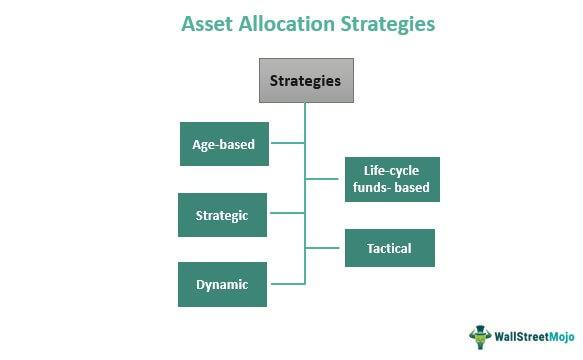

In the ever-evolving landscape of modern finance, understanding and effectively leveraging key concepts such as investment strategies, asset allocation, portfolio management, and algorithmic trading is crucial. These elements collectively inform and guide decision-making processes that can substantially influence financial outcomes. Each component plays a distinct role: investment strategies help dictate the approach investors take to meet their financial objectives; asset allocation determines how investments are distributed across various asset classes to balance risk versus reward; portfolio management involves the hands-on management of an investor's assets in alignment with predetermined goals; and algorithmic trading automates trading processes, often improving efficiency and accuracy.

A comprehensive understanding of these aspects requires not just familiarity with each individually, but also an appreciation of how they can be integrated into a cohesive, synergistic system. When effectively combined, these elements can enhance decision-making, increase potential returns, and reduce risks in investment portfolios. This integration is increasingly important in a financial environment characterized by rapid technological advancement and ever-changing market dynamics.



This article is structured to provide a detailed examination of each of these financial components, beginning with a definition and exploration of various investment strategies — aggressive, conservative, and moderate — and how these can be tailored to meet individual goals and risk profiles. It will then explain the significance of asset allocation, explore different asset allocation strategies, and discuss how they can be chosen based on an investor's risk tolerance and financial objectives. Following that, the section on portfolio management will distinguish between active and passive management while underscoring the importance of diversification and regular rebalancing. An introduction to algorithmic trading will illuminate its growing prominence, the processes involved in executing trades, and the benefits and challenges associated with its implementation. 

The article will also discuss the integration of these elements, highlighting their combined effect on improving financial decision-making. It will provide examples of successful integration in practice, which could serve as a blueprint for investors aiming to enhance their financial strategies. Finally, we will explore future trends, particularly the rise of AI and machine learning, and speculate on their potential to further reshape the landscape of investment and finance. Through this comprehensive examination, readers will be encouraged to adopt a holistic approach to investing, combining these diverse disciplines for optimized financial success.

## Table of Contents

## Investment Strategies

Investment strategies are a fundamental component of financial planning, serving as a blueprint for achieving an investor's financial objectives. These strategies are systematically designed plans that guide how an investor allocates resources across different asset classes to attain desired returns, while keeping risk within acceptable limits. The selection of an appropriate investment strategy is crucial, as it directly influences the potential for financial growth and the investor's ability to weather market fluctuations.

**Aggressive, Conservative, and Moderate Investment Strategies**

There are various investment strategies, each catering to different risk appetites and financial goals. Among these, aggressive, conservative, and moderate strategies are commonly recognized based on their risk-return profiles. 

- **Aggressive Investment Strategies**: These involve high-risk, high-reward investments, often focusing heavily on equities, including small-cap stocks, emerging market funds, and other volatile securities. The primary goal is to achieve substantial capital appreciation. This strategy is suitable for investors with a high-risk tolerance and a long investment horizon, as it includes the potential for significant losses in unfavorable market conditions.

- **Conservative Investment Strategies**: These prioritize capital preservation and income generation over capital appreciation. Investments are typically allocated towards stable and lower-risk securities such as bonds, blue-chip stocks, and money market funds. Such strategies are appropriate for risk-averse investors or those nearing retirement, as they offer lower volatility and potential for consistent, albeit modest, returns.

- **Moderate Investment Strategies**: These strike a balance between risk and reward, combining elements of both aggressive and conservative approaches. Portfolios are diversified across equities, fixed income, and other asset classes to achieve reasonable growth while managing risk. This strategy is aimed at investors with a moderate risk tolerance and a medium to long-term investment horizon.

**Tailoring Strategies Based on Individual Goals and Risk Profiles**

Determining the right investment strategy necessitates a comprehensive assessment of the investor's unique financial goals and risk profile. Factors such as investment timeline, income requirements, and overall financial situation play pivotal roles in shaping the strategy. 

An investor with a goal of capital appreciation over a 20-year horizon might opt for an aggressive strategy, while someone planning for near-term [liquidity](/wiki/liquidity-risk-premium) needs might favor a more conservative approach. Financial advisors often employ methods such as the Modern Portfolio Theory (MPT) to optimize portfolios by assessing the trade-off between risk and return, potentially utilizing software programs to simulate different scenarios.

For example, a Python-based simulation can help investors understand potential outcomes:

```python
import numpy as np

# Define expected returns and covariance matrix for assets
expected_returns = np.array([0.08, 0.05, 0.03])  # Example: Stocks, Bonds, Cash
cov_matrix = np.array([
    [0.1, 0.02, 0.01], 
    [0.02, 0.05, 0.005],
    [0.01, 0.005, 0.002]
])

# Define weights for an aggressive portfolio
weights_aggressive = np.array([0.7, 0.2, 0.1])

# Calculate the expected return and risk for the aggressive portfolio
portfolio_return_aggressive = np.sum(weights_aggressive * expected_returns)
portfolio_risk_aggressive = np.sqrt(np.dot(weights_aggressive.T, np.dot(cov_matrix, weights_aggressive)))

print("Aggressive Portfolio Return:", portfolio_return_aggressive)
print("Aggressive Portfolio Risk:", portfolio_risk_aggressive)
```

In conclusion, selecting an appropriate investment strategy is pivotal for achieving financial goals. By understanding and leveraging the differences between aggressive, conservative, and moderate approaches, investors can tailor their strategies to align with their personal risk tolerance and long-term objectives. This strategic alignment is essential for optimizing financial outcomes and ensuring a well-balanced portfolio.

## Asset Allocation

Asset allocation refers to the process of distributing investments across various asset categories, such as stocks, bonds, real estate, and cash, to optimize the balance between risk and return based on an individual's goals, risk tolerance, and investment horizon. The importance of asset allocation in portfolio management lies in its ability to reduce risk through diversification, aiming to achieve a more stable and potentially higher return over the long term.

### Asset Allocation Strategies

#### Strategic Asset Allocation

Strategic asset allocation is a long-term approach that sets target allocations for various asset classes and periodically rebalances the portfolio to maintain these target allocations. This strategy is based on an investor's long-term financial goals, risk tolerance, and expected returns for each asset class. By adhering to these target allocations, investors can systematically manage risk and reduce the impact of market [volatility](/wiki/volatility-trading-strategies).

For example, if an investor decides to allocate 60% to equities, 30% to fixed income, and 10% to real estate, they will adjust the portfolio holdings to reflect these percentages if market movements cause deviations. 

#### Constant-Weighting Asset Allocation

Constant-weighting asset allocation is similar to strategic allocation but with fixed proportions that are maintained more frequently. Under this strategy, investors regularly rebalance their portfolios to ensure that each asset class remains at a specified proportion, regardless of market movements. This approach often requires more active rebalancing, potentially leading to higher transaction costs, but it aims to maintain a thoroughly diversified portfolio aligned with the investor's original intentions.

#### Tactical Asset Allocation

Tactical asset allocation allows for short-term deviations from established asset allocations to capitalize on market opportunities or economic predictions. This strategy involves a more active management approach, where investors temporarily increase exposure to undervalued or favorable asset classes and reduce exposure to those believed to be overvalued. The objective is to enhance returns during specific economic cycles while ultimately returning to the strategic allocation targets.

### Choosing an Asset Allocation Strategy

Selecting an appropriate asset allocation strategy requires a thorough understanding of an investor's risk tolerance, financial goals, and investment timeline. Risk tolerance is a crucial determinant, as it reflects an investor's comfort level with market volatility and potential losses. An investor with a high risk tolerance may prefer a more aggressive allocation with a higher percentage of equities, whereas a conservative investor may prioritize stability through a greater allocation to bonds and cash.

Financial goals establish the foundation for asset allocation, guiding decisions based on objectives such as retirement planning, purchasing a home, or funding education. The investment timeline further influences strategy choice; longer horizons might allow for more aggressive strategies, while shorter timelines demand conservative approaches to preserve capital.

In practice, it is often beneficial for investors to regularly review and adjust their asset allocation strategy in response to changes in personal circumstances, market conditions, and economic forecasts. This adaptability ensures that portfolio management remains aligned with evolving financial goals and risk profiles.

## Portfolio Management

Portfolio management involves the strategic handling of a collection of investments to achieve specific financial objectives. Its primary goals are maximizing returns, minimizing risk, and ensuring the investor's financial goals are met over a defined period. This process requires continuous assessment and adjustment to respond to market changes and the investor’s evolving situation.

### Active vs. Passive Portfolio Management

Active and passive portfolio management represent two contrasting strategies in managing investments. 

**Active Portfolio Management** seeks to outperform market indexes through proactive decision-making. Portfolio managers using this approach rely on research, forecasts, and their own judgment to make investment choices, regularly buying and selling securities to capitalize on market conditions. A hallmark of active management is its adaptability, permitting shifts in asset allocation to exploit perceived short-term opportunities or to avoid risks.

In contrast, **Passive Portfolio Management** aims to replicate the performance of a specific market index. This strategy involves constructing a portfolio mirroring the components of a chosen index, such as the S&P 500. Passive managers believe in the efficiency of markets, subscribing to the idea that it is difficult and costly to consistently outperform them. Consequently, passive strategies incur fewer transaction costs and generally result in lower fees for investors.

### Diversification and Regular Rebalancing

Diversification is a fundamental principle in portfolio management, aimed at reducing risk by spreading investments across various asset classes, sectors, or geographical regions. By diversifying, the negative performance of one investment is cushioned by the potential positive performance of another, leading to a more stable overall portfolio performance.

Rebalancing involves adjusting the weights of assets in a portfolio to maintain the desired level of asset allocation. Over time, as different investments grow at different rates, the asset allocation of a portfolio may drift away from its original target. Rebalancing ensures that the portfolio return aligns with the investor's risk tolerance and financial goals. This process can be done on a fixed schedule, such as quarterly or annually, or triggered by significant market movements.

Here’s an illustrative example in Python outlining a simple rebalancing strategy:

```python
def rebalance_portfolio(portfolio, target_allocation, threshold=0.05):
    current_total = sum(portfolio.values())
    for asset, current_value in portfolio.items():
        current_allocation = current_value / current_total
        target_value = target_allocation[asset] * current_total

        # Rebalancing condition
        if abs(current_allocation - target_allocation[asset]) > threshold:
            print(f"Rebalancing {asset}: selling/adding to reach target value of {target_value:.2f}")

# Example portfolio and target allocation
portfolio = {'Stocks': 60000, 'Bonds': 40000, 'Cash': 5000}
target_allocation = {'Stocks': 0.60, 'Bonds': 0.35, 'Cash': 0.05}

rebalance_portfolio(portfolio, target_allocation)
```

Through diversification and regular rebalancing, portfolio management seeks to achieve a blend that aligns with the strategic objectives outlined by the investor, striving for optimal performance under varying market conditions.

## Algorithmic Trading

Algorithmic trading refers to the use of computer algorithms to automate the process of trading financial instruments. By leveraging predefined sets of rules and complex mathematical models, [algorithmic trading](/wiki/algorithmic-trading) systems can execute trades at speeds and frequencies impossible for a human trader. The growing significance of algorithmic trading is evidenced by its increasing adoption in various financial markets, primarily due to its ability to process vast datasets and execute orders with minimal human intervention.

**Execution of Algorithmic Trades**

At the core of algorithmic trading is the execution mechanism, which involves several key processes. First, a trading strategy is developed, which is then encoded into an algorithm using specified parameters such as timing, price, or quantity of trades. These algorithms analyze market conditions and execute orders based on the strategy's criteria. The primary goal is to manage trading risk while exploiting small price discrepancies in the market.

In practice, algorithms monitor multiple market indicators and use them to predict price movements. They implement strategies such as [arbitrage](/wiki/arbitrage), [trend following](/wiki/trend-following), or [market making](/wiki/market-making). For instance, a simple trend-following algorithm could be expressed in Python as:

```python
def simple_moving_average(data, window):
    return data.rolling(window=window).mean()

def trading_signal(data, short_window, long_window):
    short_moving_avg = simple_moving_average(data['Close'], short_window)
    long_moving_avg = simple_moving_average(data['Close'], long_window)

    buy_signal = short_moving_avg > long_moving_avg
    sell_signal = short_moving_avg < long_moving_avg

    return buy_signal, sell_signal

# Assume 'market_data' contains historical price data.
signals = trading_signal(market_data, 40, 100)
```

This example calculates the moving averages for two different time frames and generates buy or sell signals based on their crossover.

**Benefits of Algorithmic Trading**

The primary benefits of algorithmic trading include improved accuracy, reduced transaction costs, and minimization of emotional decision-making. Algorithms can execute trades at optimal prices by reacting to market changes swiftly and without fatigue. Additionally, they allow for back-testing on historical data, which helps in refining strategies and improving their reliability before actual deployment.

Cost efficiency is another major advantage. By automating trades, firms can process high volumes of transactions, with reduced overhead costs, thereby increasing profitability.

**Challenges in Algorithmic Trading**

Despite its advantages, algorithmic trading is not without challenges. Developing robust algorithms requires a profound understanding of both financial markets and quantitative analysis. Maintaining these systems involves continuous monitoring and adjustments to ensure they operate correctly as market conditions evolve. 

Technical glitches and system failures pose significant risks. Furthermore, high-frequency trading ([HFT](/wiki/high-frequency-trading-strategies)), a subclass of algorithmic trading, has been criticized for amplifying market volatility as these rapid trades can exacerbate price movements.

Moreover, while executing large volumes of trades, algorithms might impact market liquidity or cause price slippage if not designed properly. 

To sum up, while algorithmic trading represents a significant advancement in the financial sector, providing numerous benefits such as speed and efficiency, it also entails substantial risk management and technical expertise. As technology advances, these systems are expected to become more sophisticated, enhancing intricate financial operations.

## Integration and Synergy

Integration of investment strategies, asset allocation, portfolio management, and algorithmic trading is crucial for optimizing financial outcomes and enhancing decision-making in modern finance. Each element plays an integral role in a comprehensive financial plan, and their combined application results in a more robust and adaptable approach.

Investment strategies serve as the blueprint for decision-making, determining how resources are allocated to achieve specific financial goals. When integrated with asset allocation, investors can effectively diversify their portfolios, considering various risk profiles and market conditions. Asset allocation, by distributing investments across diverse asset classes, mitigates risk and tailors the portfolio to align with the investor’s objectives.

Portfolio management is the continuous process of constructing and maintaining an optimal investment mix. The integration of active and passive strategies within portfolio management allows for a balanced approach that can respond to changing market dynamics. Rebalancing portfolios regularly ensures alignment with strategic goals and controls exposure to different asset classes.

Algorithmic trading contributes by executing trades with speed and precision that surpasses human capabilities. Algorithms can analyze vast amounts of data, identifying trends and executing trades based on pre-defined criteria. This not only increases efficiency but also reduces the emotional and psychological biases often associated with manual trading.

One practical example of successful integration is the use of robo-advisors, which utilize algorithms to create and manage investment portfolios automatically. These platforms assess the investor’s risk tolerance and financial goals, recommend a diversified asset allocation, and execute trades to maintain the desired investment strategy. The synergy of these elements results in optimized portfolios that adapt to market conditions while minimizing human error and administrative costs.

Furthermore, large hedge funds and investment firms frequently adopt advanced algorithmic models for portfolio management. By integrating real-time market data and sophisticated algorithms, these institutions make informed decisions that enhance returns and maintain competitive advantages.

Overall, the synergy of investment strategies, asset allocation, portfolio management, and algorithmic trading enhances financial decision-making processes. It provides an effective and comprehensive framework for achieving improved financial outcomes, highlighting the necessity of an integrated approach in modern finance.

## Future Trends

The financial landscape is continuously evolving, driven by emerging trends in investment strategies and portfolio management. One of the most significant trends is the increasing role of technology, particularly [artificial intelligence](/wiki/ai-artificial-intelligence) (AI) and [machine learning](/wiki/machine-learning) (ML), which are reshaping traditional approaches.

AI and machine learning have become pivotal in developing advanced analytical tools that enhance decision-making processes. These technologies enable the analysis of vast datasets to identify patterns and predict market trends, offering a significant edge in strategy formulation. For instance, machine learning algorithms can process historical data to forecast asset price movements, which aids in crafting more effective investment strategies. A common application is the use of natural language processing (NLP) to analyze news articles and social media to gauge market sentiment, subsequently informing buy or sell decisions.

Algorithmic trading, bolstered by AI, is also a crucial trend. These systems execute trades at high speed and accuracy, utilizing complex algorithms that can adapt based on machine learning insights. The algorithms can adjust strategies in real-time, optimizing portfolios and achieving cost efficiency. However, the reliance on AI and ML also presents challenges such as data privacy concerns, model transparency, and the potential for significant losses if models fail unexpectedly.

Predictive analytics, a facet of machine learning, is expected to play a more central role in risk management. Portfolio managers can leverage AI to assess the risk-reward profiles of investments dynamically, thus facilitating more personalized and responsive asset allocations. This advancement could pave the way for more innovative portfolio management strategies that adjust automatically to market conditions and individual risk tolerance levels.

Looking forward, the future landscape of finance and investment is likely to be characterized by increasing automation and digitization. The integration of blockchain technology and smart contracts could revolutionize transaction processing, adding security and transparency to financial markets. Furthermore, decentralized finance (DeFi) platforms, which operate independently of traditional banks, are gaining traction and could redefine access to financial services.

In conclusion, the fusion of AI, blockchain, and other technologies is set to transform investment strategies and portfolio management, offering unprecedented opportunities for innovation and efficiency. As these technologies evolve, they will undoubtedly redefine the financial industry's dynamics, demanding adaptability and foresight from market participants.

## Conclusion

In this article, we have explored the critical components of modern finance, including investment strategies, asset allocation, portfolio management, and algorithmic trading. Each of these disciplines plays a distinct role in achieving financial goals, yet their true potential is realized when integrated effectively. By synthesizing these elements, investors can create a robust framework capable of navigating the complexities of the financial markets.

Investment strategies provide the foundational blueprint for action, tailored to align with individual risk appetites and objectives. Proper asset allocation ensures that resources are distributed optimally across various asset classes, balancing risk and reward. Portfolio management, whether active or passive, emphasizes the need for ongoing evaluation and adjustment, ensuring portfolios remain aligned with goals. Finally, algorithmic trading introduces automation and precision, offering a competitive edge in executing trades efficiently.

The synergy achieved through integration enables investors to make well-informed decisions, optimizing returns while mitigating risks. By embracing a holistic approach, which combines strategic planning, diversification, adaptability, and technology, investors can enhance their financial outcomes.

Ultimately, the seamless integration of these diverse financial disciplines is imperative for maximizing investment success. Investors are encouraged to adopt this comprehensive perspective, harnessing the strengths of each component to build resilient and prosperous financial futures.

## References & Further Reading

To gain a deeper understanding of the components discussed in this article, the following resources provide valuable insights and further reading materials:

1. **Investment Strategies**: 
   - For comprehensive guides on investment planning, consider "The Intelligent Investor" by Benjamin Graham, which explores fundamental analysis and value investing.
   - The CFA Institute offers extensive materials on investment strategy and portfolio management through their CFA program, which is highly regarded in the finance industry.

2. **Asset Allocation**: 
   - "Asset Allocation: Balancing Financial Risk" by Roger C. Gibson is a detailed resource on the importance and strategies of asset allocation in managing risk.
   - Explore the principles of modern portfolio theory with works like "Modern Portfolio Theory and Investment Analysis" by Edwin J. Elton and Martin J. Gruber.

3. **Portfolio Management**: 
   - "Active Portfolio Management" by Richard C. Grinold and Ronald N. Kahn discusses techniques for optimizing portfolio returns using quantitative models.
   - To understand the benefits of diversification and rebalancing, refer to the article "Portfolio Management: Efficiently Balancing Risk and Reward" published by The Journal of Portfolio Management.

4. **Algorithmic Trading**:
   - "Algorithmic Trading: Winning Strategies and Their Rationale" by Ernie Chan provides an insightful introduction to the world of algorithmic trading.
   - The technical aspects are covered in "Algorithmic Trading and DMA: An introduction to direct access trading strategies" by Barry Johnson.

5. **Integration and Synergy**:
   - Articles from the "Financial Analysts Journal" often explore the integration of different investment strategies and tools.
   - McKinsey & Company's insights into financial strategy offer examples of strategic integration in practice, which can often be accessed through their business publications.

6. **Future Trends and Technology**:
   - "Investing in the Age of AI - Harnessing Machine Learning for Investment Insights" in Harvard Business Review discusses future trends and the impact of AI on finance.
   - Keep abreast of emerging trends by subscribing to publications like "Journal of Financial Economics" and "Risk.net".

Engaging with these resources will provide a broader perspective on the discussed topics, enabling a more profound comprehension of investment strategies, asset allocation, portfolio management, and algorithmic trading.

