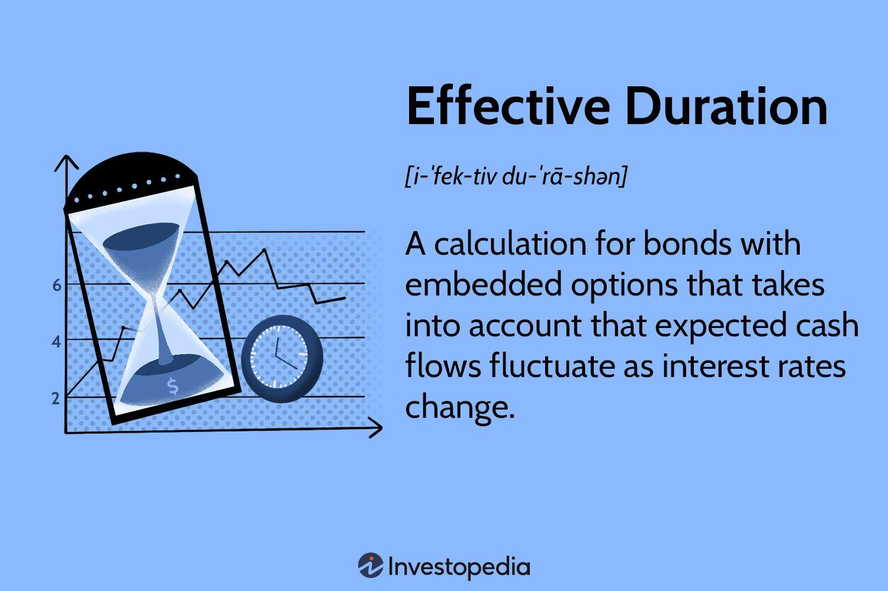

## Table of Contents

## What is effective duration in bond investment?

Effective duration is a way to measure how sensitive a bond's price is to changes in interest rates. It helps investors understand how much the value of their bond might go up or down if interest rates change. Think of it like this: if interest rates rise, bond prices usually fall, and if interest rates drop, bond prices typically rise. Effective duration gives you a number that tells you how much the bond's price will change for a 1% change in interest rates.

For example, if a bond has an effective duration of 5 years, it means that for every 1% increase in interest rates, the bond's price is expected to drop by about 5%. On the other hand, if interest rates fall by 1%, the bond's price should go up by about 5%. This measure is especially useful for bonds with features like callable options, where the issuer can pay off the bond early, because it takes into account how these features might affect the bond's sensitivity to interest rate changes.

## How is effective duration different from modified duration?

Effective duration and modified duration both measure how much a bond's price might change when interest rates change, but they do it a bit differently. Modified duration is a simpler measure that works well for bonds that don't have any special features like being able to be paid off early. It looks at the bond's time to maturity and its coupon payments to figure out how sensitive the bond's price is to interest rate changes. If a bond has a modified duration of 6 years, it means its price might go down by about 6% if interest rates go up by 1%.

Effective duration, on the other hand, is a bit more complex and is used for bonds with special features, like callable bonds where the issuer can pay off the bond before it matures. Effective duration takes into account how these features might change the bond's sensitivity to interest rates. For example, if interest rates drop, a callable bond might be paid off early, which affects its price differently than a regular bond. So, effective duration gives a more accurate picture of price sensitivity for these types of bonds.

## Why is effective duration important for bond investors?

Effective duration is important for bond investors because it helps them understand how much the price of their bond might change if interest rates go up or down. This is crucial because interest rates can affect the value of bonds a lot. If an investor knows the effective duration of their bond, they can predict how much money they might lose or gain if interest rates change by a certain amount. For example, if a bond has an effective duration of 4 years, the investor knows that if interest rates go up by 1%, the bond's price might drop by about 4%.

This measure is especially useful for bonds that have special features, like being able to be paid off early by the issuer. These features can make the bond's price react differently to interest rate changes than a regular bond. Effective duration takes these features into account, giving investors a more accurate idea of how their bond will behave. By knowing the effective duration, investors can make better decisions about which bonds to buy or sell, and how to manage their investment portfolio to match their risk and return goals.

## How do you calculate the effective duration of a bond?

To calculate the effective duration of a bond, you need to know how the bond's price changes when interest rates go up or down. First, you find out what the bond's price would be if interest rates go up by a small amount, like 0.1%. Then, you find out what the bond's price would be if interest rates go down by the same small amount. You take the difference between these two prices and divide it by twice the change in interest rates (which is 0.2% in this case). This gives you the effective duration.

For example, let's say a bond is worth $1,000 now. If interest rates go up by 0.1%, the bond's price might drop to $995. If interest rates go down by 0.1%, the bond's price might go up to $1,005. The difference between these prices is $10 ($1,005 - $995). You divide this difference by twice the change in interest rates (0.2%), which is $10 / 0.002 = 5,000. So, the effective duration of this bond is 5 years. This means if interest rates change by 1%, the bond's price might change by about 5%.

## What factors influence the effective duration of a bond?

The effective duration of a bond is influenced by several key factors. One important [factor](/wiki/factor-investing) is the bond's time to maturity. Bonds that take longer to mature usually have a higher effective duration because their prices are more sensitive to changes in interest rates. For example, a bond that matures in 30 years will likely have a higher effective duration than a bond that matures in 5 years. Another factor is the bond's coupon rate. Bonds with lower coupon rates tend to have higher effective durations because their future cash flows are more spread out over time, making them more sensitive to interest rate changes.

In addition to these, the presence of special features in a bond can also affect its effective duration. Callable bonds, for instance, have an effective duration that takes into account the possibility of the bond being paid off early by the issuer. This can make the bond's price react differently to interest rate changes compared to a regular bond. Also, the overall level of interest rates in the market can influence effective duration. When interest rates are low, the effective duration of a bond might be higher because small changes in rates can have a bigger impact on the bond's price.

## Can effective duration be used for bonds with embedded options?

Yes, effective duration is especially useful for bonds with embedded options, like callable or putable bonds. These options give the issuer or the bondholder the right to take certain actions, like paying off the bond early or selling it back to the issuer. Because of these options, the bond's price can react differently to changes in interest rates compared to a regular bond. Effective duration takes these options into account, giving a more accurate measure of how sensitive the bond's price is to interest rate changes.

For example, if interest rates drop, a callable bond might be paid off early by the issuer, which can limit how much the bond's price goes up. Effective duration helps investors understand this by showing how much the bond's price might change if interest rates move by a certain amount, considering the possibility of the bond being called. This makes it a valuable tool for investors who want to know how their bonds with embedded options will behave in different interest rate environments.

## How does effective duration help in managing interest rate risk?

Effective duration helps investors manage interest rate risk by telling them how much a bond's price might change if interest rates go up or down. When you know a bond's effective duration, you can guess how much money you might lose or gain if interest rates change. For example, if a bond has an effective duration of 5 years, and interest rates go up by 1%, the bond's price might drop by about 5%. This helps investors decide if they're okay with that risk or if they should look for bonds with a different effective duration.

This measure is especially helpful for bonds that have special features, like being able to be paid off early. These features can make the bond's price react differently to interest rate changes. Effective duration takes these features into account, so investors get a better idea of how their bond will behave. By understanding effective duration, investors can choose bonds that match their comfort with risk and make smarter choices about their investment portfolio.

## What are the limitations of using effective duration as a measure?

Effective duration is a helpful tool, but it has some limits. One big limit is that it assumes interest rates change by the same amount for all times. In real life, short-term rates might go up while long-term rates stay the same, or vice versa. This can make the bond's price change differently than what effective duration predicts. Also, effective duration is based on small changes in interest rates. If rates change a lot, the bond's price might not follow the effective duration as closely.

Another limit is that effective duration doesn't tell you everything about how a bond will act. It's just one piece of the puzzle. Other things like how much the bond pays out, how long it lasts, and any special features it has can also affect its price. So, while effective duration is good for guessing how a bond might react to small changes in interest rates, it's not perfect and should be used with other tools to get a full picture of a bond's risk.

## How does effective duration change with shifts in the yield curve?

Effective duration can change when the yield curve shifts because it measures how sensitive a bond's price is to changes in interest rates. The yield curve shows how interest rates change over different times, like short-term rates versus long-term rates. If the yield curve shifts in a way where short-term rates go up but long-term rates stay the same, the effective duration of a bond might not change as much as if all rates went up by the same amount. This is because effective duration assumes that all interest rates move together, but in real life, they can move differently.

When the yield curve changes shape, like becoming steeper or flatter, it can affect how much a bond's price changes. For example, if the yield curve gets steeper, meaning the difference between short-term and long-term rates gets bigger, bonds with longer times to mature might see their effective duration go up. This is because their prices become more sensitive to changes in long-term rates. So, understanding how the yield curve might shift can help investors guess how the effective duration of their bonds might change, but it's not always easy to predict exactly what will happen.

## What role does effective duration play in portfolio management?

Effective duration is a key tool in managing a bond portfolio because it helps investors understand how changes in interest rates might affect the value of their bonds. By knowing the effective duration of each bond in their portfolio, investors can predict how much the overall value of their portfolio might go up or down if interest rates change. For example, if an investor has a portfolio with an average effective duration of 6 years, they know that if interest rates go up by 1%, the portfolio's value might drop by about 6%. This helps investors make smart choices about which bonds to buy or sell to match their comfort with risk and their investment goals.

In portfolio management, effective duration also helps investors balance their portfolio to manage interest rate risk. If an investor wants to lower their risk from rising interest rates, they might choose bonds with shorter effective durations because these bonds are less sensitive to interest rate changes. On the other hand, if they're willing to take on more risk for a chance at higher returns, they might pick bonds with longer effective durations. By using effective duration, investors can build a portfolio that fits their risk and return needs, making it a crucial part of their overall investment strategy.

## How can investors use effective duration to compare different bonds?

Investors can use effective duration to compare different bonds by looking at how sensitive each bond's price is to changes in interest rates. If two bonds have different effective durations, it means their prices will change by different amounts if interest rates go up or down. For example, if one bond has an effective duration of 4 years and another has an effective duration of 6 years, the second bond's price will change more for the same change in interest rates. This helps investors decide which bond fits better with their risk and return goals. If they want less risk, they might choose the bond with the shorter effective duration.

Effective duration is also helpful when comparing bonds with special features, like callable bonds. These bonds can be paid off early by the issuer, which can affect how their prices change with interest rates. By comparing the effective durations of these bonds, investors can see how much these features might impact the bond's price sensitivity. This way, they can make more informed choices about which bonds to include in their portfolio, balancing the potential risks and rewards based on how interest rates might change in the future.

## What advanced strategies involve the use of effective duration in bond trading?

In bond trading, one advanced strategy that uses effective duration is called duration matching. This strategy involves buying and selling bonds to keep the overall effective duration of a portfolio at a certain level. For example, if an investor wants to keep their portfolio's sensitivity to interest rate changes the same, they might sell bonds with a high effective duration and buy bonds with a lower effective duration if they think interest rates will go up. This helps them manage the risk of their portfolio better by keeping its effective duration in line with their risk goals.

Another strategy is called immunization. This is when investors use effective duration to protect their portfolio from interest rate changes. They do this by matching the effective duration of their bond portfolio to the time they need the money. For example, if they need the money in 5 years, they might choose bonds with an effective duration of 5 years. This way, if interest rates change, the portfolio's value should stay about the same until they need the money. Both of these strategies show how effective duration can be a powerful tool for managing and trading bonds in different interest rate environments.

## What is Understanding Effective Duration?

Effective duration is a key financial metric that quantifies how sensitive a bond's price is to changes in interest rates. This measure is particularly relevant for bonds with complex structures, such as those with embedded options, because it considers potential changes in cash flows that may arise from these features. Conventional measures like Macaulay or modified duration assume that the cash flows of a bond remain constant, but effective duration takes into account scenarios where cash flows might change, such as when a bond is callable or putable.

Understanding effective duration involves a slightly more sophisticated calculation than other duration measures. It is calculated using the bond’s current price ($P_0$), alongside hypothetical prices if yields were to decrease and increase ($P_{-}$ and $P_{+}$, respectively). The formula for effective duration is:

$$
\text{Effective Duration} = \frac{P_{-} - P_{+}}{2 \times P_0 \times \Delta y}
$$

where $\Delta y$ represents the change in yield. This formula measures the average percentage change in the price of a bond for a one percentage point change in yield and is especially useful in quantifying interest rate risk for bonds whose cash flows can change due to embedded options.

By incorporating how price might shift with [interest rate](/wiki/interest-rate-trading-strategies) changes, effective duration becomes an essential tool for investors. It enables them to anticipate how much the price of a bond could fluctuate when there are shifts in yield, allowing better management of the interest rate risk inherent in their bond portfolios. For instance, comparing effective durations across a portfolio can assist in enhancing strategic allocation decisions, helping investors align their portfolios with their risk tolerance and investment goals.

For practitioners and analysts, understanding effective duration is crucial. It equips them with the ability to evaluate how various interest rate scenarios would affect a bond portfolio's value. Portfolio strategies often incorporate effective duration to minimize risks related to interest rate changes, thereby stabilizing portfolio performance amidst volatile market environments.

## What is the Role of Effective Duration in Bond Investment?

Effective duration plays a crucial role in bond investment as it allows investors to gauge potential fluctuations in bond prices due to changes in interest rates. This sensitivity measure is vital for making informed investment decisions and tailoring bond portfolios to align with specific financial objectives and risk tolerance levels.

By understanding effective duration, investors can strategically allocate their portfolios to manage interest rate exposure effectively. This concept becomes particularly relevant for bonds with embedded options, such as callable and putable bonds, where cash flow patterns can change with varying interest rates. For instance, a callable bond allows the issuer to repay the bond before its maturity if interest rates fall significantly, altering the expected cash flows, and thus, the bond's effective duration.

Using effective duration, investors can immunize their portfolios against interest rate shifts. This is achieved by constructing a bond portfolio with a duration that matches the investor's desired investment horizon. The aim is to stabilize portfolio value despite fluctuations in interest rates, minimizing the impact of adverse rate changes on bond prices.

In practical terms, the formula for effective duration ($D_e$) is given by:

$$
D_e = \frac{P_{-} - P_{+}}{2 \cdot P_0 \cdot \Delta y}
$$

where:
- $P_{-}$ is the bond price if yields decrease,
- $P_{+}$ is the bond price if yields increase,
- $P_0$ is the current bond price,
- $\Delta y$ is the change in yield.

This formula highlights how changes in market interest rates directly affect bond prices, enabling investors to assess and manage risks associated with various bond investments. Effective duration thus becomes indispensable for evaluating different bond types, considering both market conditions and individual investment strategies, to ensure optimal portfolio performance.

## References & Further Reading

[1]: Fabozzi, F. J. (2007). ["Fixed Income Analysis"](https://books.google.com/books/about/Fixed_Income_Analysis.html?id=lujLawVLS3YC). John Wiley & Sons.

[2]: ["Bond Pricing and Portfolio Analysis: Protecting Investors in the Long Run"](https://www.amazon.com/Bond-Pricing-Portfolio-Analysis-Protecting/dp/0262541459) by Olivier de La Grandville

[3]: Munk, C. (2011). ["Fixed Income Modelling."](https://academic.oup.com/book/27887) SSRN.

[4]: ["The Handbook of Fixed Income Securities"](https://www.amazon.com/Handbook-Fixed-Income-Securities-Ninth/dp/1260473899) by Frank J. Fabozzi

[5]: ["Managing Interest Rate Risk: The Next Great Financial Challenge"](https://papers.ssrn.com/sol3/papers.cfm?abstract_id=1392543) by John J. Stephens