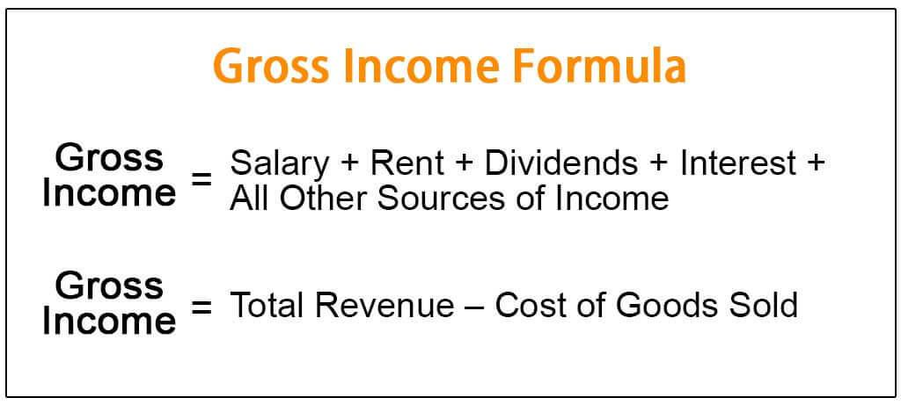

Effective Gross Income (EGI) serves as a fundamental metric for both real estate investors and property managers by offering a more nuanced understanding of a property's income potential. Unlike gross rental income, EGI accounts for factors such as vacancies and credit losses, thus providing a realistic projection of cash flow. This measurement is essential for making informed investment decisions, such as evaluating a property's market value, forecasting future income, and underwriting loans.

Algorithmic trading, commonly known as algo trading, is growing in importance within real estate investment analysis. At its core, this strategy employs advanced algorithms to automate and optimize trading strategies, thereby increasing execution efficiency. The intersection of EGI calculations and algorithmic trading marks a significant advancement in real estate income strategies. By integrating EGI with algo trading platforms, investors gain the ability to analyze market trends and optimize strategies using real-time data. This integration potentially enhances the accuracy of income projections and aids in making timely investment decisions.



This article aims to explore how the synergy between EGI calculations and algorithmic trading can lead to optimized strategies for maximizing real estate income. It provides insights into the mechanics of EGI, its components, and the role of algorithmic tools in refining investment strategies. Readers will learn how modern technology can transform real estate investment by offering more precise data analysis and strategic planning capabilities.

## Table of Contents

## What is Effective Gross Income?

Effective Gross Income (EGI) is a fundamental concept in real estate investment, providing a comprehensive insight into a property's potential to generate revenue. EGI represents the total income generated from a property, after accounting for vacancies and credit losses. It is calculated by taking the potential gross rental income that a property could earn if fully occupied, then adding other income sources such as parking and laundry fees. From this total, vacancy and credit loss allowances are subtracted to provide a realistic view of expected income.

Mathematically, EGI can be represented by the following formula:

$$
\text{EGI} = (\text{Potential Gross Rental Income} + \text{Other Income}) - (\text{Vacancy Losses} + \text{Credit Losses})
$$

This formula highlights the components that impact EGI. The potential gross rental income assumes full occupancy of the property without any external factors affecting rental income. Other income might include payments from additional services or features associated with the property, such as fees from parking lots, rentable storage units, or coin-operated laundry facilities. 

However, real-world scenarios often lead to vacancies and defaulted payments, which are captured in the vacancy and credit losses component. The inclusion of these factors means EGI provides a more realistic assessment of the expected cash flow, rather than an optimistic projection based purely on maximum potential income. 

For real estate investors, EGI is critical as it not only informs about the annual potential revenue but also plays a pivotal role in forecasting and financial decision-making. It assists investors in understanding the true cash flow potential of an investment, enabling a more accurate evaluation of the property's profitability. EGI is frequently employed in investment analysis, loan underwriting, and financial modeling, establishing its role as a core metric in real estate investment strategy.

## Components of EGI

Effective Gross Income (EGI) consists of several components that collectively provide a comprehensive view of a property's potential earnings. Understanding these components is essential for making informed decisions in real estate investment. The components of EGI include potential gross rental income, ancillary income sources, and adjustments for vacancies and credit losses.

**Potential Gross Rental Income (PGRI):** This figure represents the total rental income a property could generate if it were fully occupied at market rental rates without any interruptions. It is calculated by multiplying the number of rentable units by the market rent for each unit. For example, if a property has 50 units each renting for $1,000 per month, the potential gross rental income is $50,000 per month or $600,000 per year.

$$
\text{PGRI} = \text{Units} \times \text{Market Rent}
$$

**Other Income Sources:** In addition to rental income, properties often generate income from other sources such as fees for parking, revenue from on-site laundry facilities, or vending machines. These ancillary revenue streams can significantly enhance a property's income potential. For instance, if a property collects $500 per month from parking fees and $300 from laundry machines, this contributes an additional $800 monthly to the effective gross income.

**Vacancy and Credit Losses:** Real-world market conditions dictate that not all units will be occupied at all times. Vacancies represent unoccupied units, while credit losses arise from tenants defaulting on their rent. These factors necessitate adjustments to the PGRI to derive the EGI. Typically, a percentage of the PGRI is allocated to account for these vacancies and credit losses. For example, if a property expects a 5% vacancy rate and a 2% credit loss, 7% of the potential income might be deducted from the PGRI to calculate the EGI.

$$
\text{EGI} = \text{PGRI} + \text{Other Income} - (\text{PGRI} \times \text{Vacancy \& Credit Loss Rate})
$$

By understanding and calculating these components accurately, investors and property managers can obtain a realistic picture of a property's income potential, which is crucial for effective financial planning and investment analysis.

## Importance of EGI in Real Estate Investment

Effective Gross Income (EGI) is a vital metric for real estate investors as it offers a method for assessing a property's potential financial performance. EGI serves as a fundamental analytical tool for projecting realistic income, essential for informed financial decision-making and ensuring accurate financial projections.

EGI aids in real estate valuation by providing a clear understanding of what income can be expected from a property, considering typical market challenges like vacancies and credit losses. This anticipated income stream becomes a foundation for determining the property's market value. When EGI is factored into property valuations, potential buyers and investors can better assess investment viability, comparing it against acquisition costs and expected returns.

In the context of investment analysis, EGI plays a significant role in projecting future cash flows. Investors use EGI to create realistic financial forecasts, essential for comparing different investment opportunities. Furthermore, these projections are crucial during the underwriting process, as lenders rely on EGI figures to assess the risk of granting a loan. A credible EGI analysis can improve the likelihood of securing financing by demonstrating a property's potential to generate stable and sufficient income.

Mathematically, EGI is expressed as:

$$
\text{EGI} = \text{Potential Gross Income} + \text{Other Income} - \text{Vacancy and Credit Losses}
$$

In Python, an equivalent calculation might appear as follows:
```python
def calculate_egi(potential_gross_income, other_income, vacancy_losses, credit_losses):
    return potential_gross_income + other_income - (vacancy_losses + credit_losses)

potential_gross_income = 120000  # Example value
other_income = 15000  # Example value, from amenities or services
vacancy_losses = 5000  # Example value
credit_losses = 3000  # Example value

egi = calculate_egi(potential_gross_income, other_income, vacancy_losses, credit_losses)
print(f"Effective Gross Income: ${egi}")
```

The EGI calculation, therefore, provides a framework for weighing profitability against expected operating realities, forming the backbone of strategic planning and effective real estate investment management.

 to Algorithmic Trading in Real Estate

Algorithmic trading, often synonymous with "algo trading," employs complex algorithms to automate and execute trading strategies with precision and speed. The essence of [algorithmic trading](/wiki/algorithmic-trading) lies in its ability to process vast amounts of data rapidly, offering predictive insights and optimizing decision-making processes. While traditionally associated with the stock markets, this technology has found significant applications within real estate investment, particularly when integrated with effective gross income (EGI) calculations.

In real estate, algorithmic trading serves as a powerful tool for analyzing market trends and optimizing investment strategies. The evaluation of market conditions involves large datasets that include property prices, historical trends, interest rates, and demographic information. By utilizing algorithmic models, investors can not only assess these factors but also predict future market movements, enhancing their strategic investments.

A crucial aspect of algorithmic trading in real estate is its capacity to incorporate EGI calculations efficiently. EGI, a vital metric for assessing a property's income potential, is derived from potential gross rental income and other property-related revenues, adjusted for vacancies and credit losses. With algorithmic trading platforms, this calculation can be streamlined and automated, ensuring real-time analysis and enhancing decision-making.

The integration of EGI within these platforms ensures a dynamic investment strategy. Real-time data processing allows for instantaneous adjustments based on changes in vacancy rates or market conditions, providing an advantage over traditional, more static methods. This real-time adaptability is vital for making informed investment decisions, ultimately leading to optimized income strategies and reduced financial risks.

In essence, the incorporation of algorithmic trading and EGI calculations provides a data-driven approach to real estate investment, enabling investors to harness real-time insights and make strategic decisions with greater accuracy and confidence.

## EGI Calculation in Algo Trading

Algorithmic trading is transforming the calculation and management of Effective Gross Income (EGI) in real estate investments by leveraging advanced computational techniques. Automating EGI calculations through algo trading ensures improved accuracy and efficiency, providing a competitive edge in real estate portfolio management.

### Automation and Forecasting

Automated systems can enhance the prediction and management of vacancy rates and credit losses—critical components of EGI. Traditionally, calculating EGI manually involves estimating the potential gross rental income, adding other income sources, subtracting vacancy costs, and accounting for credit losses. This manual approach is prone to errors and time-consuming processes. By automating these calculations, algorithmic systems increase precision and save time, allowing investors to make informed decisions rapidly.

```python
def calculate_egi(potential_rental_income, other_income, vacancy_rate, credit_loss_rate):
    vacancy_loss = potential_rental_income * vacancy_rate
    credit_loss = potential_rental_income * credit_loss_rate
    egi = (potential_rental_income + other_income) - (vacancy_loss + credit_loss)
    return egi
```

The function `calculate_egi` automates the EGI formula, enabling real-time computation when integrated into an algo trading platform. This ensures consistent evaluation and quick adjustments based on market changes.

### Managing Dynamic Market Conditions

Automated trading platforms equipped with [machine learning](/wiki/machine-learning) algorithms can analyze historical data to detect patterns and predict future vacancies and credit losses more accurately than traditional methods. These predictions assist investors in adjusting strategies proactively, minimizing financial exposure due to unexpected market fluctuations.

### Algorithmic Portfolio Optimization

Real estate portfolios can benefit from algorithms designed to optimize investment strategies using EGI calculations. Techniques such as genetic algorithms and neural networks are increasingly employed to fine-tune portfolios. These algorithms assess data-driven insights, adjust property holdings, and balance risk with potential returns.

For instance, a genetic algorithm can run simulations to identify an optimal allocation that maximizes returns while considering potential vacancies and defaults, effectively integrating EGI into comprehensive decision-making processes.

In summary, the integration of algorithmic trading in EGI calculations significantly refines real estate investment strategies. By automating complex calculations and forecasting market conditions with high accuracy, investors can optimize their portfolios, adapt to dynamic environments, and enhance overall financial performance.

## Benefits of Combining EGI with Algo Trading

Combining Effective Gross Income (EGI) calculations with algorithmic trading significantly enhances strategic planning capabilities for real estate investors. This synergy enables the efficient utilization of data-driven tools to forecast and mitigate risks associated with property investments.

One of the primary benefits of integrating algorithmic trading with EGI calculations is the ability to derive predictive insights. Advanced algorithms analyze vast datasets in real-time, detecting patterns and trends that might impact rental income, such as shifts in housing demand or economic conditions. This allows investors to anticipate potential vacancies or defaults and take preemptive measures. For instance, by employing machine learning models, investors can predict vacancy rates based on historical data and current market dynamics, thereby optimizing rental strategies to maintain high occupancy levels.

Moreover, the integration of algorithmic trading facilitates dynamic adjustments to investment strategies. As the real estate market is inherently volatile, the ability to adapt quickly to changing conditions is invaluable. Algorithms can continuously monitor market indicators, such as interest rates and property values, allowing investors to recalibrate their portfolios in response to real-time data. For example, Python's Pandas library can be utilized to process and analyze financial data efficiently, enabling investors to update EGI projections and make informed decisions promptly.

Here is an example of a simple Python script utilizing the Pandas library to adjust EGI calculations based on new market data:

```python
import pandas as pd

# Simulated dataset of rental incomes and vacancy rates
data = {'Month': ['Jan', 'Feb', 'Mar'], 'Rental Income': [10000, 9500, 9800], 'Vacancy Rate': [0.05, 0.07, 0.06]}
df = pd.DataFrame(data)

# Function to calculate EGI
def calculate_egi(rental_income, vacancy_rate):
    return rental_income * (1 - vacancy_rate)

# Apply the EGI calculation
df['EGI'] = df.apply(lambda row: calculate_egi(row['Rental Income'], row['Vacancy Rate']), axis=1)

print(df)
```

This approach to real estate investment not only enhances profitability by optimizing income and minimizing losses but also empowers investors with the agility required to thrive in ever-changing markets. Integrating EGI with algorithmic trading represents a forward-thinking strategy that aligns with the increasing demand for precision and responsiveness in financial planning.

## Case Studies

In recent years, the intersection of real estate investment and algorithmic trading has provided a groundbreaking approach to optimizing property income through precise forecasting techniques. This section examines real-world examples where Effective Gross Income (EGI) and algorithmic trading algorithms have been seamlessly integrated, thereby enhancing the financial performance of real estate firms.

One notable case involves a prominent commercial real estate fund that significantly increased its profitability by harnessing EGI calculations combined with state-of-the-art algorithmic analysis. This fund, managing multiple properties across different urban areas, initially faced challenges in accurately predicting rental income due to fluctuating vacancy rates and market dynamics. Traditional methods often led to conservative estimates, affecting the fund’s strategic planning and capital allocation.

To address these challenges, the fund implemented an algorithmic trading platform designed to automate EGI computations and adapt dynamically to market conditions. The platform leveraged historical data, such as past rental incomes, vacancy trends, and credit loss records, to build a predictive model capable of generating accurate income forecasts. Through machine learning techniques, the model continuously refined its predictions by analyzing new data streams, such as local economic indicators and occupancy data captured in real-time.

The adoption of this algorithmic approach allowed the fund to enhance its forecasting accuracy significantly. By precisely estimating EGI, the fund could optimize rental pricing strategies, reduce the impact of vacancies, and proactively manage credit risks. This led to an increase in net operating income (NOI), translating into higher yields for investors.

One of the algorithms used by the fund is based on a combination of regression analysis and neural networks, executed in a Python environment. The following Python snippet illustrates a simplified version of such a model:

```python
import numpy as np
from sklearn.linear_model import LinearRegression
from sklearn.neural_network import MLPRegressor

# Simulated data for training
historical_vacancy_rates = np.array([0.05, 0.06, 0.04, 0.07]).reshape(-1, 1)
rental_income = np.array([120000, 115000, 125000, 110000])

# Linear Regression Model
regression_model = LinearRegression()
regression_model.fit(historical_vacancy_rates, rental_income)

# Neural Network Model
nn_model = MLPRegressor(hidden_layer_sizes=(10,), max_iter=1000)
nn_model.fit(historical_vacancy_rates, rental_income)

# Predicting future rental income
future_vacancy_rate = np.array([0.03]).reshape(-1, 1)
predicted_income_lr = regression_model.predict(future_vacancy_rate)
predicted_income_nn = nn_model.predict(future_vacancy_rate)

print("Linear Regression Prediction:", predicted_income_lr)
print("Neural Network Prediction:", predicted_income_nn)
```

The integration of EGI calculations with algorithmic trading not only provided transformative insights but also ensured that investment strategies remained agile and responsive to market changes. This case demonstrates the profound benefits of technological adoption in real estate, particularly for firms seeking to leverage data-driven methods to maximize their investment outcomes.

## Conclusion

Effective Gross Income (EGI) remains an indispensable metric in assessing a property's financial health. By integrating EGI into algorithmic trading platforms, real estate investors can harness the power of technology to significantly enhance their investment decisions and strategies. This approach aligns with the growing trend towards data-driven investment methodologies across various sectors, including real estate.

The incorporation of EGI into algorithmic trading platforms represents a pivotal advancement that adapts traditional financial analysis to modern technological capabilities. Algorithmic trading allows for sophisticated analysis by executing predefined strategies using algorithms that can analyze large datasets swiftly and accurately. By utilizing real-time data, these platforms can incorporate variables such as vacancy rates and credit losses, making EGI calculations more dynamic and reflective of market conditions.

Investors must embrace these advanced tech-driven methodologies to improve profitability and strategic planning. The dynamic nature of real estate markets necessitates strategies that can quickly respond to fluctuations, and algorithmic tools provide the precision needed for such adjustments. This synergy between EGI calculations and algorithmic trading not only reduces risks associated with vacancies or defaults but also facilitates more accurate property valuations and investment forecasts.

In conclusion, the integration of EGI into algorithmic trading is not just an enhancement; it's essential for future-proofing investments in an increasingly competitive and unpredictable real estate market. Embracing these tools will enable investors to remain competitive, optimize their portfolios, and capitalize on emerging market opportunities effectively.

## FAQs

### What is EGI and why is it important in real estate?

Effective Gross Income (EGI) represents a property's total potential rental income after accounting for vacancy rates and credit losses. EGI is crucial for real estate investors as it provides an accurate projection of a property's income potential, facilitating informed financial decision-making. By adjusting for factors like vacancies and payment defaults, EGI helps investors assess the realistic cash flow from a property, which is essential for evaluating investment value, securing loans, and planning long-term financial strategies.

### How does algo trading apply to real estate investment?

Algorithmic trading, commonly associated with financial securities, is increasingly being adopted in real estate investment. This approach utilizes complex algorithms and computational models to analyze large sets of market data. In real estate, these algorithms can efficiently process and interpret trends, pricing, and other relevant market variables. As a result, investors can use this data-driven approach to optimize investment strategies, predict market movements, and execute trades or transactions with greater precision and speed.

### What are the benefits of integrating EGI with algorithmic strategies?

The integration of EGI into algorithmic strategies offers numerous advantages for real estate investors. By automating EGI calculations, investors can achieve more accurate income projections and swiftly adjust to market fluctuations. This synergy allows investors to leverage real-time data analysis for predictive insights, reducing risks associated with unforeseen vacancies or tenant defaults. The incorporation of algorithmic tools ensures that investment strategies are continuously optimized, fostering enhanced strategic planning and improved profitability.

### Can algorithmic trading handle dynamic real estate market changes effectively?

Algorithmic trading is well-suited to handle dynamic changes in the real estate market. Advanced algorithms can process real-time data, adapt to new information, and execute trades accordingly. Machine learning and [artificial intelligence](/wiki/ai-artificial-intelligence) enhance these algorithms by enabling them to learn from historical and current data patterns, further improving accuracy in forecasting market trends and potential risks. Consequently, algorithmic trading provides a robust framework for adapting to and capitalizing on the dynamic nature of real estate markets, allowing investors to make informed decisions quickly.

## References & Further Reading

[1]: Bergstra, J., Bardenet, R., Bengio, Y., & Kégl, B. (2011). ["Algorithms for Hyper-Parameter Optimization."](https://dl.acm.org/doi/10.5555/2986459.2986743) Advances in Neural Information Processing Systems 24.

[2]: ["Advances in Financial Machine Learning"](https://www.amazon.com/Advances-Financial-Machine-Learning-Marcos/dp/1119482089) by Marcos Lopez de Prado

[3]: ["Evidence-Based Technical Analysis: Applying the Scientific Method and Statistical Inference to Trading Signals"](https://www.amazon.com/Evidence-Based-Technical-Analysis-Scientific-Statistical/dp/0470008741) by David Aronson

[4]: ["Machine Learning for Algorithmic Trading"](https://github.com/stefan-jansen/machine-learning-for-trading) by Stefan Jansen

[5]: ["Quantitative Trading: How to Build Your Own Algorithmic Trading Business"](https://www.amazon.com/Quantitative-Trading-Build-Algorithmic-Business/dp/1119800064) by Ernest P. Chan