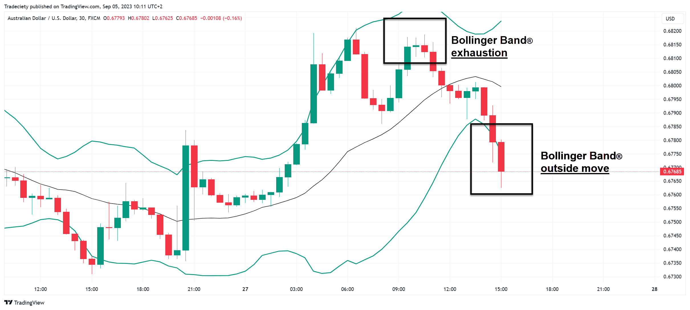

## Table of Contents

## What are Bollinger Bands and how are they calculated?

Bollinger Bands are a tool used in stock trading to help understand how a stock is doing. They were created by a man named John Bollinger. The bands show the highest and lowest prices a stock has reached over a certain time, usually 20 days. There are three lines: the middle line is the average price of the stock over those 20 days, and the top and bottom lines are set above and below this average.

To calculate Bollinger Bands, you start by finding the average price of the stock over the last 20 days. This average is called the Simple Moving Average (SMA). Next, you figure out how much the stock's price has varied from this average over those 20 days. This variation is called the standard deviation. The top band is the SMA plus two times the standard deviation, and the bottom band is the SMA minus two times the standard deviation. Traders use these bands to see if a stock's price is too high or too low compared to what it usually does.

## What is the significance of the middle, upper, and lower bands in Bollinger Bands?

The middle band in Bollinger Bands is really important because it shows the average price of a stock over the last 20 days. It's like a guide that helps traders see where the stock usually is. If the stock's price is close to this middle band, it means the stock is acting normally. Traders use this middle band to compare where the stock's price is now to where it has been on average.

The upper and lower bands are also very helpful. The upper band is set above the middle band, and it shows the highest price the stock might reach based on how much it has moved around in the past. If the stock's price goes above this upper band, it might mean the stock is getting too expensive and could go down soon. The lower band is set below the middle band and shows the lowest price the stock might reach. If the stock's price goes below this lower band, it might mean the stock is getting too cheap and could go up soon. These bands help traders decide when to buy or sell a stock.

## How can beginners use Bollinger Bands to identify overbought and oversold conditions?

Beginners can use Bollinger Bands to spot when a stock might be overbought or oversold by looking at where the stock's price is compared to the upper and lower bands. If the stock's price touches or goes above the upper band, it might be overbought. This means the stock could be too expensive and might drop in price soon. It's a signal for beginners to think about selling or waiting for a better time to buy.

On the other hand, if the stock's price touches or goes below the lower band, it might be oversold. This means the stock could be too cheap and might go up in price soon. It's a signal for beginners to think about buying the stock, as it could be a good deal. By watching where the price is in relation to these bands, beginners can make smarter choices about when to buy or sell.

## What are some common indicators that can be effectively combined with Bollinger Bands?

One common indicator that works well with Bollinger Bands is the Relative Strength Index (RSI). The RSI helps measure how fast a stock's price is going up or down and shows if it might be overbought or oversold. When you use the RSI with Bollinger Bands, you can get a better idea of when to buy or sell. If the RSI shows a stock is overbought and the price is also touching the upper Bollinger Band, it might be a good time to sell. If the RSI shows the stock is oversold and the price is touching the lower Bollinger Band, it could be a good time to buy.

Another useful indicator to use with Bollinger Bands is the Moving Average Convergence Divergence (MACD). The MACD helps show the relationship between two moving averages of a stock's price. It can tell you if the stock's trend is getting stronger or weaker. When you combine MACD with Bollinger Bands, you can see if the stock's price is likely to keep moving in the same direction or if it might change soon. For example, if the MACD shows a strong upward trend and the stock's price is near the lower Bollinger Band, it might be a good buying opportunity because the price could be about to go up.

## How does the Relative Strength Index (RSI) complement Bollinger Bands in trading strategies?

The Relative Strength Index (RSI) and Bollinger Bands work well together because they both help traders see if a stock might be overbought or oversold. The RSI measures how quickly a stock's price is going up or down and gives a number between 0 and 100. If the RSI is over 70, it means the stock might be overbought, which means it could be too expensive and might go down soon. If the RSI is under 30, it means the stock might be oversold, which means it could be too cheap and might go up soon. By looking at the RSI, traders can get a better idea of when the stock's price might change.

When you use the RSI with Bollinger Bands, you can make smarter choices about buying and selling. Bollinger Bands show the highest and lowest prices a stock has reached recently, with the middle line showing the average price. If the stock's price touches the upper Bollinger Band and the RSI is over 70, it's a strong sign that the stock might be overbought and could be a good time to sell. If the stock's price touches the lower Bollinger Band and the RSI is under 30, it's a strong sign that the stock might be oversold and could be a good time to buy. Using both indicators together gives traders more confidence in their decisions.

## Can you explain how the Moving Average Convergence Divergence (MACD) works with Bollinger Bands?

The Moving Average Convergence Divergence (MACD) is another tool that traders use to see if a stock's price is going to keep moving in the same direction or if it might change soon. The MACD looks at two moving averages of a stock's price and shows the difference between them. If the MACD line crosses above the signal line, it might mean the stock's price is going to go up. If the MACD line crosses below the signal line, it might mean the stock's price is going to go down. When you use the MACD with Bollinger Bands, you can get a better idea of what the stock might do next.

Bollinger Bands show the highest and lowest prices a stock has reached recently, with a middle line that shows the average price. If the stock's price is near the lower Bollinger Band and the MACD shows a strong upward trend, it might be a good time to buy the stock because the price could be about to go up. On the other hand, if the stock's price is near the upper Bollinger Band and the MACD shows a strong downward trend, it might be a good time to sell because the price could be about to go down. By looking at both the MACD and Bollinger Bands, traders can make smarter choices about when to buy or sell a stock.

## What are the advantages of using the Stochastic Oscillator alongside Bollinger Bands?

The Stochastic Oscillator is another tool that traders use to see if a stock is overbought or oversold. It measures where the stock's price is compared to its highest and lowest prices over a certain time, usually 14 days. The Stochastic Oscillator gives a number between 0 and 100. If the number is over 80, it means the stock might be overbought and could go down soon. If the number is under 20, it means the stock might be oversold and could go up soon. When you use the Stochastic Oscillator with Bollinger Bands, you can see both the price movement and the stock's position within its recent range. This helps traders make better decisions about when to buy or sell.

Using the Stochastic Oscillator with Bollinger Bands gives traders more information to work with. Bollinger Bands show the highest and lowest prices a stock has reached recently, with a middle line that shows the average price. If the stock's price touches the upper Bollinger Band and the Stochastic Oscillator is over 80, it's a strong sign that the stock might be overbought and could be a good time to sell. If the stock's price touches the lower Bollinger Band and the Stochastic Oscillator is under 20, it's a strong sign that the stock might be oversold and could be a good time to buy. By looking at both indicators together, traders can feel more confident in their trading decisions.

## How can traders use volume indicators like On-Balance Volume (OBV) with Bollinger Bands?

On-Balance Volume (OBV) is a tool that looks at how much a stock is being bought and sold. It adds up the [volume](/wiki/volume-trading-strategy) on days when the stock's price goes up and subtracts it on days when the price goes down. This helps traders see if more people are buying or selling the stock. When you use OBV with Bollinger Bands, you can see if the stock's price movement is backed up by strong buying or selling. If the stock's price touches the upper Bollinger Band and the OBV is going up, it means a lot of people are buying the stock, which might mean the price will keep going up. If the stock's price touches the lower Bollinger Band and the OBV is going down, it means a lot of people are selling the stock, which might mean the price will keep going down.

Using OBV with Bollinger Bands helps traders make better choices about buying and selling stocks. If the stock's price is near the lower Bollinger Band and the OBV is going up, it could be a good time to buy because the price might be about to go up. On the other hand, if the stock's price is near the upper Bollinger Band and the OBV is going down, it could be a good time to sell because the price might be about to go down. By looking at both the OBV and Bollinger Bands, traders can get a better idea of what the stock might do next and feel more confident in their decisions.

## What advanced techniques involve using Bollinger Bandwidth to gauge market volatility?

Bollinger Bandwidth is a tool that helps traders see how much a stock's price is moving around. It measures the distance between the upper and lower Bollinger Bands and divides it by the middle band. When the Bandwidth is small, it means the stock's price isn't moving much and the market might be calm. When the Bandwidth is large, it means the stock's price is moving a lot and the market might be more exciting or risky. Traders use this to see if the market is getting more or less volatile.

One way to use Bollinger Bandwidth is to look for times when the Bandwidth is very small. This can mean the stock's price is squeezed and might be about to make a big move. Traders might get ready to buy or sell when they see this. Another way is to watch for times when the Bandwidth gets bigger. This can mean the stock's price is starting to move more and the market is getting more volatile. By watching the Bandwidth, traders can get a better idea of when to make their moves in the market.

## How can expert traders implement Bollinger Bands with Fibonacci retracement levels for enhanced analysis?

Expert traders can use Bollinger Bands along with Fibonacci retracement levels to get a better idea of where a stock's price might go next. Fibonacci retracement levels help traders see where the stock's price might stop going down or up before it starts moving again. These levels are drawn on a chart based on the highest and lowest prices the stock has reached recently. When traders see that the stock's price is close to a Fibonacci level and also touching the upper or lower Bollinger Band, it can be a strong sign that the price might change soon. For example, if the stock's price is near the upper Bollinger Band and also at a Fibonacci level, it might be a good time to sell because the price could go down soon.

By using both Bollinger Bands and Fibonacci retracement levels, traders can make more confident decisions. If the stock's price touches the lower Bollinger Band and is also near a Fibonacci level, it might be a good time to buy because the price could go up soon. This combination of tools helps traders see not just if the stock is overbought or oversold, but also where it might find support or resistance based on its recent price movements. This can lead to better trading strategies and potentially more successful trades.

## What are some pitfalls and common mistakes to avoid when combining Bollinger Bands with other indicators?

One common mistake traders make when using Bollinger Bands with other indicators is relying too much on just one signal. For example, if a stock's price touches the upper Bollinger Band and the RSI is over 70, it might look like a good time to sell. But if you don't look at other things like the stock's overall trend or news about the company, you might make a bad choice. It's important to use several indicators together and also look at the bigger picture before deciding to buy or sell.

Another pitfall is not understanding how different indicators work together. Sometimes, indicators can give mixed signals. For instance, the MACD might show a strong upward trend, but the stock's price is near the lower Bollinger Band. If you don't know how to balance these signals, you might get confused and make the wrong move. It's helpful to learn how each indicator works and practice using them together to see how they can help or sometimes mislead you.

## Can you discuss any case studies or real-world examples where combining Bollinger Bands with other indicators led to successful trading outcomes?

One real-world example of successfully combining Bollinger Bands with other indicators comes from a trader who used them with the Relative Strength Index (RSI) to trade Apple Inc. (AAPL) stock. The trader noticed that when AAPL's stock price touched the upper Bollinger Band and the RSI was over 70, it often meant the stock was overbought and likely to drop soon. By selling the stock at these points, the trader was able to make profits several times. On the other hand, when the stock price touched the lower Bollinger Band and the RSI was under 30, it suggested the stock was oversold and likely to rise. The trader bought the stock at these points and saw gains as the price rebounded. This combination of indicators helped the trader make informed decisions and achieve successful trades.

Another example involves a trader who used Bollinger Bands with the Moving Average Convergence Divergence (MACD) to trade Tesla Inc. (TSLA) stock. The trader observed that when TSLA's stock price was near the lower Bollinger Band and the MACD showed a strong upward trend, it was a good time to buy. This strategy worked well because the stock often rose after these signals. Conversely, when the stock price was near the upper Bollinger Band and the MACD showed a strong downward trend, it was a good time to sell. By following these signals, the trader was able to capitalize on the stock's volatility and make profitable trades. Combining these two indicators provided a clearer picture of the stock's potential movements, leading to successful trading outcomes.

## What are Bollinger Bands and how do they work?

Bollinger Bands are a technical analysis tool developed by John Bollinger in the early 1980s. They consist of three lines plotted on a price chart: the middle band, the upper band, and the lower band. These bands are used to identify potential overbought or oversold conditions in a market, as well as to measure market [volatility](/wiki/volatility-trading-strategies).

The middle band is a simple moving average (SMA) of the asset's price, typically over a 20-day period. The formula for calculating the middle band is:

$$
\text{Middle Band} = \text{SMA}(n)
$$

where $n$ is the number of periods over which the average is calculated, usually 20.

The upper band is calculated by adding a multiple of the standard deviation to the middle band. The lower band is calculated by subtracting the same multiple of the standard deviation from the middle band. The formulas for the upper and lower bands are:

$$
\text{Upper Band} = \text{Middle Band} + (k \times \text{Standard Deviation})
$$

$$
\text{Lower Band} = \text{Middle Band} - (k \times \text{Standard Deviation})
$$

where $k$ is typically set to 2, indicating two standard deviations.

Bollinger Bands measure market volatility by capturing how prices deviate from the average price. When volatility increases, the bands widen due to larger fluctuations in market prices, while they contract when volatility decreases.

Typical signals derived from Bollinger Bands include the identification of overbought or oversold conditions. When an asset's price touches or moves outside the upper band, it may be considered overbought, potentially signaling a price correction or reversal. Conversely, when the price touches or moves below the lower band, it may be considered oversold, indicating a possible upward price movement.

Bollinger Bands provide a visual representation of market volatility and potential reversal points, making them a valuable tool for traders seeking to interpret price movements and trends.

## What is the Role of Bollinger Bands in Technical Analysis?

Bollinger Bands are a widely utilized tool in technical analysis that assist traders in assessing market conditions and making informed trading decisions. These bands consist of three lines: a middle simple moving average (SMA), an upper band, and a lower band. The upper and lower bands are typically calculated by adding and subtracting a standard deviation multiple from the SMA, effectively encapsulating price movements and volatility.

**Determining Price Trends**

Bollinger Bands play a crucial role in identifying price trends. When the price consistently moves along the upper band, it indicates a strong upward trend. Conversely, when the price hugs the lower band, it suggests a downtrend. The middle band, the SMA, serves as a dynamic reference point, helping traders to recognize the trend direction over the chosen period. 

Mathematically, the upper and lower bands are defined as:

$$
\text{Upper Band} = \text{SMA}(n) + k \times \text{Standard Deviation}(n)
$$
$$
\text{Lower Band} = \text{SMA}(n) - k \times \text{Standard Deviation}(n)
$$

where $n$ is the period for the moving average and $k$ is a constant typically set to 2.

**Identifying Breakout Prices and Trading Ranges**

In addition to trend identification, Bollinger Bands are instrumental in pinpointing [breakout](/wiki/breakout-trading) prices and trading ranges. A breakout typically occurs when the price moves decisively outside the upper or lower band and continues in that direction. This breakout signals a potential start of a new trend and presents an opportunity for traders. In contrast, a period of low volatility is characterized by bands contracting, indicating a consolidating market often within a range. Such conditions forecast potential breakouts, as tight bands precede large price movements.

**Signaling Changes in Volatility**

Bollinger Bands inherently signal changes in market volatility. When bands widen, this implies increased volatility, whereas narrowing bands indicate a decrease. Recognizing these changes helps traders anticipate market conditions where significant price adjustments could occur. This flexibility makes Bollinger Bands a useful tool for adapting trading strategies based on expected volatility shifts.

**Setting Stop-loss and Profit-taking Points**

Traders frequently use Bollinger Bands to determine stop-loss and profit-taking points. For instance, in an uptrend identified with prices near the upper band, a stop-loss can be set below the middle band or the lower band to minimize potential losses if the trend reverses. Similarly, profit-taking may be considered when prices reach or breach the upper band, forewarning a potential price pullback. This dynamic application of Bollinger Bands aids traders in managing risk more effectively and capitalizing on market movements.

In summary, Bollinger Bands serve as a comprehensive tool in technical analysis, enabling traders to detect trends, anticipate breakouts, and manage risks through better-informed stop-loss and profit-taking placements. Their ability to reflect market volatility and provide a context for price movements makes them invaluable for strategic trading decisions.

## What Key Indicators Complement Bollinger Bands?

Bollinger Bands are a popular technical analysis tool, but their effectiveness can be significantly enhanced by using complementary indicators like BandWidth, %b, and BBTrend. These indicators help traders gain deeper insights into market conditions and make more informed trading decisions.

### BandWidth and the Bollinger Squeeze

BandWidth is an indicator derived from Bollinger Bands that measures the distance between the upper and lower bands. It is calculated using the formula:

$$
\text{BandWidth} = \frac{\text{Upper Band} - \text{Lower Band}}{\text{Middle Band}}
$$

A key role of BandWidth is to identify the Bollinger Squeeze, a phenomenon where BandWidth reaches its lowest level. The Bollinger Squeeze indicates a period of low volatility, suggesting a potential breakout. As volatility tends to increase after a period of contraction, monitoring BandWidth can help traders anticipate significant price movements.

### %b Indicator

The %b indicator describes a security's price relative to the Bollinger Bands. It is calculated as follows:

$$
\%\text{b} = \frac{\text{Price} - \text{Lower Band}}{\text{Upper Band} - \text{Lower Band}}
$$

Here are typical %b values: 
- A %b of 1 indicates that the price is at the upper band.
- A %b of 0 signals that the price is at the lower band.
- A %b of 0.5 shows that the price is at the middle band.

By using %b, traders can gauge where the price resides concerning the bands, aiding in identifying overbought or oversold conditions and potential reversals.

### BBTrend for Analyzing Trend Strength and Direction

BBTrend is another indicator associated with Bollinger Bands, providing insights into the strength and direction of a trend. BBTrend is calculated with the following formula:

$$
\text{BBTrend} = (\text{Price} - \text{Middle Band}) + (\text{Upper Band} - \text{Lower Band})
$$

A positive BBTrend value typically indicates an uptrend, whereas a negative value suggests a downtrend. By assessing BBTrend, traders can better understand the market's prevailing trend strength and make decisions accordingly.

These supplementary indicators—BandWidth, %b, and BBTrend—enhance the utility of Bollinger Bands by providing additional signals for traders to identify volatility, price positions, and trend direction effectively. Employing these indicators can lead to more robust trading strategies and a greater understanding of market dynamics.

## References & Further Reading

[1]: ["Bollinger on Bollinger Bands"](https://www.amazon.com/Bollinger-Bands-John/dp/0071373683) by John A. Bollinger

[2]: ["Technical Analysis of the Financial Markets"](https://drive.google.com/file/d/1OcDrGakDhaejT7J7xGEE3HHKy7xmrafy/preview) by John J. Murphy

[3]: ["Quantitative Trading: How to Build Your Own Algorithmic Trading Business"](https://github.com/LucindaYa/quant-resources/blob/master/Quantitative%20Trading%20How%20to%20Build%20Your%20Own%20Algorithmic%20Trading%20Business.pdf) by Ernest P. Chan

[4]: ["Evidence-Based Technical Analysis"](https://www.amazon.com/Evidence-Based-Technical-Analysis-Scientific-Statistical/dp/0470008741) by David Aronson

[5]: Niederhoffer, Victor, "The Speculator as Hero," [Journal of Finance](https://www.fff.org/explore-freedom/article/speculator-hero/), 47(1), pp. 97-126, 1992.