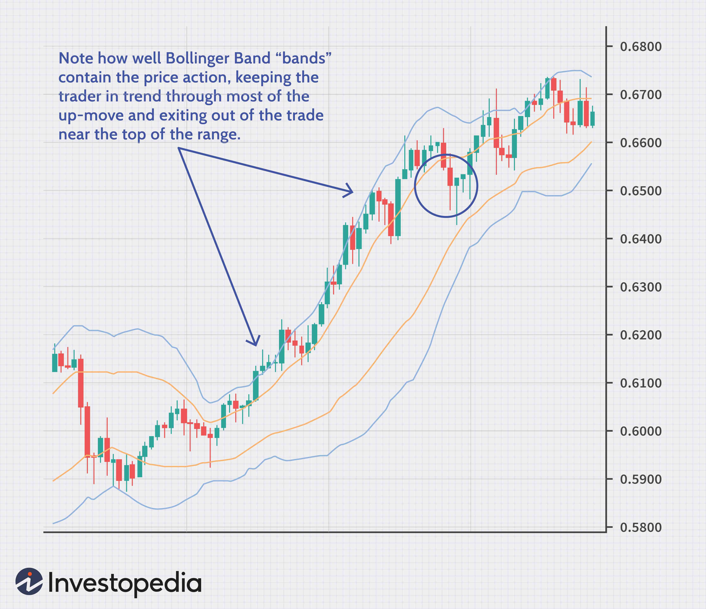

Technical analysis is a cornerstone of trading strategies, offering investors tools for predicting future market movements by analyzing past price data and market trends. Among the myriad techniques available, trading indicators stand out as a crucial component, assisting traders in making informed decisions. Bollinger Bands represent one of the most significant trading indicators in technical analysis. Developed by John Bollinger in the 1980s, these bands are used to measure market volatility and identify relative price levels. They consist of a middle band, usually a 20-day simple moving average, and two outer bands, which are standard deviations away from the middle band. The formula for the upper band is:

$$
\text{Upper Band} = \text{SMA}(20) + (k \times \text{standard deviation})
$$



and for the lower band:

$$
\text{Lower Band} = \text{SMA}(20) - (k \times \text{standard deviation})
$$

where $k$ is typically 2. This construction allows traders to identify overbought or oversold conditions and potential market reversals.

Bollinger Bands' importance in algorithmic trading cannot be overstated. These indicators are integral to automated trading systems that rely on precise, data-driven decisions. By quantifying volatility, Bollinger Bands enable algorithms to execute trades based on changes in market conditions. They are often used in conjunction with additional indicators to enhance trading accuracy and profitability. The adaptability and simplicity of Bollinger Bands make them ideal for integration into algorithmic trading strategies, facilitating consistent and objective trade executions without emotional biases.

Understanding the strategic application of Bollinger Bands and their role in technical analysis is essential for traders aiming to exploit market volatility effectively. As we explore various Bollinger Band strategies, their utility in both manual and automated trading systems becomes evident, paving the way for improved market performance and strategic diversification.

## Table of Contents

## Understanding Bollinger Bands

Bollinger Bands are a technical analysis tool developed by John Bollinger in the early 1980s. They consist of three lines plotted on a price chart: the middle band, the upper band, and the lower band. These bands are used to identify potential overbought or oversold conditions in a market, as well as to measure market [volatility](/wiki/volatility-trading-strategies).

The middle band is a simple moving average (SMA) of the asset's price, typically over a 20-day period. The formula for calculating the middle band is:

$$
\text{Middle Band} = \text{SMA}(n)
$$

where $n$ is the number of periods over which the average is calculated, usually 20.

The upper band is calculated by adding a multiple of the standard deviation to the middle band. The lower band is calculated by subtracting the same multiple of the standard deviation from the middle band. The formulas for the upper and lower bands are:

$$
\text{Upper Band} = \text{Middle Band} + (k \times \text{Standard Deviation})
$$

$$
\text{Lower Band} = \text{Middle Band} - (k \times \text{Standard Deviation})
$$

where $k$ is typically set to 2, indicating two standard deviations.

Bollinger Bands measure market volatility by capturing how prices deviate from the average price. When volatility increases, the bands widen due to larger fluctuations in market prices, while they contract when volatility decreases.

Typical signals derived from Bollinger Bands include the identification of overbought or oversold conditions. When an asset's price touches or moves outside the upper band, it may be considered overbought, potentially signaling a price correction or reversal. Conversely, when the price touches or moves below the lower band, it may be considered oversold, indicating a possible upward price movement.

Bollinger Bands provide a visual representation of market volatility and potential reversal points, making them a valuable tool for traders seeking to interpret price movements and trends.

## The Role of Bollinger Bands in Technical Analysis

Bollinger Bands are a widely utilized tool in technical analysis that assist traders in assessing market conditions and making informed trading decisions. These bands consist of three lines: a middle simple moving average (SMA), an upper band, and a lower band. The upper and lower bands are typically calculated by adding and subtracting a standard deviation multiple from the SMA, effectively encapsulating price movements and volatility.

**Determining Price Trends**

Bollinger Bands play a crucial role in identifying price trends. When the price consistently moves along the upper band, it indicates a strong upward trend. Conversely, when the price hugs the lower band, it suggests a downtrend. The middle band, the SMA, serves as a dynamic reference point, helping traders to recognize the trend direction over the chosen period. 

Mathematically, the upper and lower bands are defined as:

$$
\text{Upper Band} = \text{SMA}(n) + k \times \text{Standard Deviation}(n)
$$
$$
\text{Lower Band} = \text{SMA}(n) - k \times \text{Standard Deviation}(n)
$$

where $n$ is the period for the moving average and $k$ is a constant typically set to 2.

**Identifying Breakout Prices and Trading Ranges**

In addition to trend identification, Bollinger Bands are instrumental in pinpointing [breakout](/wiki/breakout-trading) prices and trading ranges. A breakout typically occurs when the price moves decisively outside the upper or lower band and continues in that direction. This breakout signals a potential start of a new trend and presents an opportunity for traders. In contrast, a period of low volatility is characterized by bands contracting, indicating a consolidating market often within a range. Such conditions forecast potential breakouts, as tight bands precede large price movements.

**Signaling Changes in Volatility**

Bollinger Bands inherently signal changes in market volatility. When bands widen, this implies increased volatility, whereas narrowing bands indicate a decrease. Recognizing these changes helps traders anticipate market conditions where significant price adjustments could occur. This flexibility makes Bollinger Bands a useful tool for adapting trading strategies based on expected volatility shifts.

**Setting Stop-loss and Profit-taking Points**

Traders frequently use Bollinger Bands to determine stop-loss and profit-taking points. For instance, in an uptrend identified with prices near the upper band, a stop-loss can be set below the middle band or the lower band to minimize potential losses if the trend reverses. Similarly, profit-taking may be considered when prices reach or breach the upper band, forewarning a potential price pullback. This dynamic application of Bollinger Bands aids traders in managing risk more effectively and capitalizing on market movements.

In summary, Bollinger Bands serve as a comprehensive tool in technical analysis, enabling traders to detect trends, anticipate breakouts, and manage risks through better-informed stop-loss and profit-taking placements. Their ability to reflect market volatility and provide a context for price movements makes them invaluable for strategic trading decisions.

## Key Indicators Complementing Bollinger Bands

Bollinger Bands are a popular technical analysis tool, but their effectiveness can be significantly enhanced by using complementary indicators like BandWidth, %b, and BBTrend. These indicators help traders gain deeper insights into market conditions and make more informed trading decisions.

### BandWidth and the Bollinger Squeeze

BandWidth is an indicator derived from Bollinger Bands that measures the distance between the upper and lower bands. It is calculated using the formula:

$$
\text{BandWidth} = \frac{\text{Upper Band} - \text{Lower Band}}{\text{Middle Band}}
$$

A key role of BandWidth is to identify the Bollinger Squeeze, a phenomenon where BandWidth reaches its lowest level. The Bollinger Squeeze indicates a period of low volatility, suggesting a potential breakout. As volatility tends to increase after a period of contraction, monitoring BandWidth can help traders anticipate significant price movements.

### %b Indicator

The %b indicator describes a security's price relative to the Bollinger Bands. It is calculated as follows:

$$
\%\text{b} = \frac{\text{Price} - \text{Lower Band}}{\text{Upper Band} - \text{Lower Band}}
$$

Here are typical %b values: 
- A %b of 1 indicates that the price is at the upper band.
- A %b of 0 signals that the price is at the lower band.
- A %b of 0.5 shows that the price is at the middle band.

By using %b, traders can gauge where the price resides concerning the bands, aiding in identifying overbought or oversold conditions and potential reversals.

### BBTrend for Analyzing Trend Strength and Direction

BBTrend is another indicator associated with Bollinger Bands, providing insights into the strength and direction of a trend. BBTrend is calculated with the following formula:

$$
\text{BBTrend} = (\text{Price} - \text{Middle Band}) + (\text{Upper Band} - \text{Lower Band})
$$

A positive BBTrend value typically indicates an uptrend, whereas a negative value suggests a downtrend. By assessing BBTrend, traders can better understand the market's prevailing trend strength and make decisions accordingly.

These supplementary indicators—BandWidth, %b, and BBTrend—enhance the utility of Bollinger Bands by providing additional signals for traders to identify volatility, price positions, and trend direction effectively. Employing these indicators can lead to more robust trading strategies and a greater understanding of market dynamics.

## Bollinger Bands in Algorithmic Trading

Bollinger Bands are a crucial component in [algorithmic trading](/wiki/algorithmic-trading) systems due to their versatile ability to measure market volatility and identify potential turning points in asset prices. Their integration into algorithmic strategies provides systematic approaches to trading, wherein predefined rules and criteria guide the decision-making process, facilitating a more disciplined and less emotion-driven trading environment.

Algorithmic strategies involving Bollinger Bands often exploit the unique characteristics of these bands to automate trades. The basic structure of a Bollinger Band system includes three lines: the middle band, typically a simple moving average (SMA), and two outer bands that represent price volatility, calculated as standard deviations from the SMA. This structure allows algorithms to assess price levels relative to historical volatility, offering signals that can trigger buy or sell orders.

A fundamental example of an algorithmic trading strategy using Bollinger Bands involves the identification of overbought or oversold conditions. When the price touches or crosses above the upper band, it may indicate an overbought condition, suggesting a sell opportunity. Conversely, when the price touches or falls below the lower band, it indicates an oversold condition, suggesting a buy opportunity. This logic can be encoded into a trading algorithm to automatically perform trades when these conditions are met. For instance, in Python, a simple strategy could be illustrated as follows:

```python
import pandas as pd

def bollinger_band_strategy(prices, sma_period=20, std_multiplier=2):
    sma = prices.rolling(sma_period).mean()
    std = prices.rolling(sma_period).std()

    upper_band = sma + (std_multiplier * std)
    lower_band = sma - (std_multiplier * std)

    buy_signals = (prices < lower_band)
    sell_signals = (prices > upper_band)

    return buy_signals, sell_signals

# Example usage with a pandas Series 'prices'
# buy_signals, sell_signals = bollinger_band_strategy(prices)
```

Automation in trading provides several advantages, including the ability to process large data sets swiftly and objectively, reducing the cognitive burden on traders. Algorithms can operate without succumbing to human biases, enabling consistent execution of trades according to pre-established parameters. This consistency can enhance trading performance, especially in volatile markets where rapid decision-making is crucial.

Moreover, algorithmic trading systems incorporating Bollinger Bands can operate continuously, monitoring markets and reacting instantly to favorable conditions, thereby increasing the potential for capitalizing on market inefficiencies. Automatic [backtesting](/wiki/backtesting) with historical data further allows traders to refine their strategies and confidence in their systems before deploying them in live trading environments. 

In conclusion, the automation of trading with Bollinger Bands not only optimizes the execution of trades but also offers a level of analytical depth and precision that is challenging to achieve manually.

## Advanced Bollinger Band Trading Strategies

Bollinger Band trading strategies are renowned for their effectiveness in pinpointing potential market opportunities. A particularly potent strategy within this framework is the Bollinger Band Squeeze, which is recognized for its ability to forecast breakouts. This strategy is predicated on the concept that periods of low volatility generally precede significant price movements. When the Bollinger Bands, which consist of a middle band (moving average) and two outer bands (standard deviations), converge tightly, it symbolizes a volatility compression. This compression indicates potential energy building within the market, which often leads to an explosive price move in either direction.

### Breakout Strategies and Mean Reversion Tactics

The Bollinger Band Squeeze serves as an effective springboard for breakout strategies. Traders observing a squeeze will wait for prices to decisively break above or below the bands. A breakout above the upper band might be indicative of a bullish trend, while a breakout below the lower band could signal a bearish trend. To mitigate the risk of false breakouts, it's common for traders to incorporate confirmation from other indicators or price action, such as candlestick patterns or [momentum](/wiki/momentum) oscillators.

Mean reversion tactics, on the other hand, differ significantly from breakout strategies. These tactics operate on the principle that prices will revert to their mean or average over time. When prices touch the upper band, it suggests potential overbought conditions, and when they touch the lower band, it implies possible oversold conditions. Traders may look to initiate trades betting on the reversion of price back to the moving average.

### Practical Examples and Scenarios

Imagine a scenario where a stock experiences a tight Bollinger Band Squeeze for several trading sessions. During this period, the band's width narrows, indicating suppressed volatility. For a breakout strategy, a trader might set buy stop orders slightly above the upper band and sell stop orders slightly below the lower band, aiming to capitalize on a breakout in either direction.

Conversely, in a mean reversion play, a trader might look for price actions where the asset consistently returns to the moving average after reaching an extremity. For instance, if a stock frequently touches the upper band and reverts to the mean (middle band), this could signify a strategy centered on short-selling at the upper band and closing short positions near the middle band.

### Code Example for Implementing Bollinger Bands in MQL4

For those interested in algorithmic trading, Bollinger Bands can be programmatically implemented using MQL4, a language used for MetaTrader 4. Here is a simplified example:

```cpp
// MQL4 code for Bollinger Bands Trading Strategy
input int period = 20; // Period for Bollinger Bands
input double deviation = 2.0; // Deviation for the bands

double upperBand, middleBand, lowerBand;

// Calculate Bollinger Bands
void OnTick() {
    middleBand = iMA(NULL, 0, period, 0, MODE_SMA, PRICE_CLOSE, 0);
    upperBand = iBands(NULL, 0, period, deviation, 0, PRICE_CLOSE, MODE_UPPER, 0);
    lowerBand = iBands(NULL, 0, period, deviation, 0, PRICE_CLOSE, MODE_LOWER, 0);

    // Basic breakout strategy: Buy if price exceeds upper band
    if (Close[0] > upperBand) {
        // Logic to open a Buy position
    }
    // Sell if price falls below lower band
    else if (Close[0] < lowerBand) {
        // Logic to open a Sell position
    }
}
```

This code initializes Bollinger Bands based on a specified period and deviation. It evaluates each tick to determine if the price breaks above the upper band or below the lower band, signaling trading actions accordingly. This forms the basis for more advanced strategies, where parameters can be optimized and additional indicators can be integrated for better decision-making.

By employing the Bollinger Band Squeeze and combining it with either breakout or mean reversion strategies, traders can seek to enhance their market performance. These approaches, when coded into algorithms, offer efficiency and precision that can be advantageous in volatile markets.

## Optimizing Bollinger Band-Based Strategies

Optimizing Bollinger Band-based strategies involves refining parameters and integrating complementary tools to enhance trading performance across various market scenarios. One of the primary considerations in optimizing these strategies is adjusting the Band Period and Multiplier. The Band Period represents the number of periods considered to calculate the Simple Moving Average (SMA) and standard deviation, while the Multiplier determines the width of the bands from the SMA. Typically, a 20-day period with a multiplier of 2 is used. However, altering these parameters can adapt the Bollinger Bands to different market conditions. For volatile markets, a shorter period may increase sensitivity, while a higher multiplier can prevent premature signals in more stable conditions.

Volume indicators play a crucial role in validating potential breakouts signaled by Bollinger Bands. Volume often precedes price changes, meaning a surge in [volume](/wiki/volume-trading-strategy) can confirm the strength of a breakout. Using volume indicators, such as the On-Balance Volume (OBV) or the Volume Oscillator, can help distinguish genuine breakouts from false signals by correlating price actions with volume movements.

Combining Bollinger Bands with other trend indicators can enhance strategy robustness. Indicators like the Relative Strength Index (RSI) or Moving Average Convergence Divergence (MACD) can provide additional confirmation for trades. For example, an overbought RSI condition at the upper Bollinger Band might suggest a potential reversal, signaling an [exit](/wiki/exit-strategy) for long positions.

Backtesting Bollinger Band strategies is vital for strategy refinement. Backtesting involves applying historical market data to the chosen strategy to assess its potential success. This process helps identify the optimal settings for the Band Period and Multiplier while highlighting the market conditions the strategy performs best under. Here is a simple example of backtesting a Bollinger Band strategy in Python using pandas and numpy:

```python
import numpy as np
import pandas as pd

def calculate_bollinger_bands(data, period=20, multiplier=2):
    data['SMA'] = data['Close'].rolling(window=period).mean()
    data['STD'] = data['Close'].rolling(window=period).std()
    data['Upper Band'] = data['SMA'] + (data['STD'] * multiplier)
    data['Lower Band'] = data['SMA'] - (data['STD'] * multiplier)
    return data

def backtest_strategy(data):
    data['Position'] = np.where(data['Close'] < data['Lower Band'], 1, 
                                np.where(data['Close'] > data['Upper Band'], -1, 0))
    data['Strategy Return'] = data['Position'].shift(1) * data['Return']
    return data['Strategy Return'].cumsum()

# Example usage
historical_data = pd.DataFrame({'Close': [/* historical price data */]})
historical_data['Return'] = historical_data['Close'].pct_change()
bollinger_data = calculate_bollinger_bands(historical_data)
cumulative_returns = backtest_strategy(bollinger_data)
```

Refining Bollinger Band strategies is an ongoing process requiring continual evaluation and adjustment to market dynamics. Effective optimization can significantly enhance a trader's ability to navigate diverse market environments, maximizing the potential for profitable trades.

## Conclusion

Bollinger Bands have proven to be a versatile and reliable tool in both discretionary and algorithmic trading. Their ability to adapt dynamically to market volatility provides traders with valuable insight into potential price movements, enabling them to make informed decisions. By establishing overbought and oversold conditions, as well as potential breakout points, Bollinger Bands serve as a foundational element for various trading strategies. This flexibility underscores their value across diverse market environments.

The integration of Bollinger Bands in algorithmic trading systems further enhances their significance. Through automation, traders can execute strategies with speed and precision, benefiting from the systematic analysis Bollinger Bands provide. Algorithmic trading allows for the execution of complex strategies that can be backtested and refined to optimize performance. This iterative process of testing and adapting is crucial for maintaining a competitive edge in rapidly changing markets.

Continuous exploration and backtesting are essential for the development of optimal strategies utilizing Bollinger Bands. As market conditions evolve and new technologies emerge, trading strategies must also adapt. The inclusion of additional technical indicators, such as moving averages or trendlines, can complement the insights gained from Bollinger Bands and refine trading signals.

The advancement of technology continues to reshape trading landscapes, facilitating the creation of sophisticated algorithms that leverage [machine learning](/wiki/machine-learning), [artificial intelligence](/wiki/ai-artificial-intelligence), and other innovative approaches. These developments promise to further enhance the utility and application of Bollinger Bands in future trading strategies, allowing traders to harness cutting-edge tools for improved decision-making and risk management.

## References & Further Reading

[1]: ["Bollinger on Bollinger Bands"](https://www.amazon.com/Bollinger-Bands-John/dp/0071373683) by John A. Bollinger

[2]: ["Technical Analysis of the Financial Markets"](https://drive.google.com/file/d/1OcDrGakDhaejT7J7xGEE3HHKy7xmrafy/preview) by John J. Murphy

[3]: ["Quantitative Trading: How to Build Your Own Algorithmic Trading Business"](https://github.com/LucindaYa/quant-resources/blob/master/Quantitative%20Trading%20How%20to%20Build%20Your%20Own%20Algorithmic%20Trading%20Business.pdf) by Ernest P. Chan

[4]: ["Evidence-Based Technical Analysis"](https://www.amazon.com/Evidence-Based-Technical-Analysis-Scientific-Statistical/dp/0470008741) by David Aronson

[5]: Niederhoffer, Victor, "The Speculator as Hero," [Journal of Finance](https://www.fff.org/explore-freedom/article/speculator-hero/), 47(1), pp. 97-126, 1992.