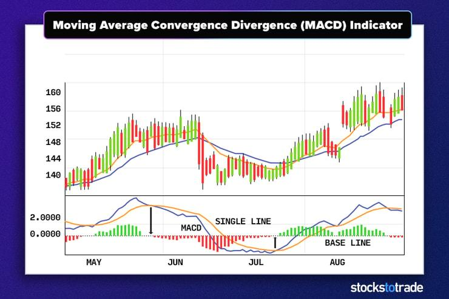

The Moving Average Convergence Divergence (MACD) indicator is a fundamental component of technical analysis and algorithmic trading. It is designed to uncover changes in the strength, direction, momentum, and duration of a trend in a stock's price. By providing insights into potential trend reversals and continuation, the MACD is widely utilized to identify potential buy and sell signals, making it a staple among traders and investors alike. 

The MACD achieves this by analyzing the relationship between two moving averages of a stock's price, typically using a combination of exponential moving averages (EMAs). This dual-layer analysis enhances its ability to predict price movements with greater reliability. The indicator generates three primary components: the MACD line, the signal line, and the histogram. These components collectively help traders make informed decisions based on visual and mathematical data.



Throughout this article, we will explore the intricacies of the MACD, examining how it functions, its practical applications in trading, and its seamless integration into algorithmic trading strategies. This exploration aims to equip traders with a comprehensive understanding of the MACD and its pivotal role in modern trading practices.

## Table of Contents

## Understanding MACD

The Moving Average Convergence Divergence (MACD) indicator is a sophisticated tool in technical analysis, primarily used to assess the strength, direction, momentum, and duration of a price trend. At its core, MACD functions as a momentum oscillator derived from the relationship between two exponential moving averages (EMAs) of differing lengths. Specifically, the MACD is calculated by subtracting the longer-period EMA from the shorter-period EMA. This operation transforms two trend-following indicators into a single momentum oscillator that provides diverse market insights.

Typically, the MACD parameters are set to 12, 26, and 9 days. These values are used as follows:

- The **MACD line** is generated by calculating the difference between the 12-day EMA and the 26-day EMA. Mathematically, it can be represented as:
$$
  \text{MACD Line} = \text{EMA}_{12} - \text{EMA}_{26}

$$

- The **Signal line** is then computed by taking a 9-day EMA of the MACD line itself. This line is crucial for producing buy or sell signals based on its interaction with the MACD line.

- The **Histogram** is a graphical representation that depicts the difference between the MACD line and the Signal line. It provides a visual cue about the momentum, offering a clearer understanding through its bar representation. The formula for the histogram is:
$$
  \text{Histogram} = \text{MACD Line} - \text{Signal Line}

$$

Divergences between the MACD line and the Signal line serve as powerful tools for identifying potential trend reversals. When the MACD line crosses above the Signal line, it is typically considered a bullish signal, indicating a potential increase in asset prices. Conversely, when the MACD line crosses below the Signal line, it is regarded as a bearish signal, potentially indicating a decline in asset prices. Recognizing these divergence patterns and interpreting them correctly can significantly enhance trading decisions, offering actionable insights into market dynamics.

## How the MACD Works

The Moving Average Convergence Divergence (MACD) operates by evaluating the relationship between two exponential moving averages (EMAs) of a security's price. The MACD line, the primary component of this indicator, is derived by subtracting the 26-day EMA from the 12-day EMA. This calculation provides insight into the [momentum](/wiki/momentum) and direction of a price trend over time. 

To further refine the signal provided by the MACD line, a nine-day EMA of the MACD line itself is computed and plotted alongside as the signal line. The interaction between the MACD line and the signal line serves as a crucial indicator of potential changes in price direction. When the MACD line crosses above the signal line, it generally indicates a bullish trend, while a cross below suggests a bearish trend.

The histogram component of the MACD is another valuable aspect, offering a visual representation of the convergence or divergence between the MACD line and the signal line. It is calculated as follows:

$$

\text{Histogram} = \text{MACD line} - \text{Signal line}.
$$

The length and direction of the histogram bars reflect the strength and momentum of the trend, making the MACD a comprehensive tool for identifying potential buy or sell signals. In Python, the basic computation of the MACD and histogram can be implemented using libraries like Pandas and NumPy as follows:

```python
import pandas as pd

# Sample data: 'close' is a pandas Series of closing prices
def calculate_macd(close, short_window=12, long_window=26, signal_window=9):
    short_ema = close.ewm(span=short_window, adjust=False).mean()
    long_ema = close.ewm(span=long_window, adjust=False).mean()
    macd_line = short_ema - long_ema
    signal_line = macd_line.ewm(span=signal_window, adjust=False).mean()
    histogram = macd_line - signal_line
    return macd_line, signal_line, histogram

# Example usage
# close_prices = pd.Series([...])  # Provide closing price data
# macd_line, signal_line, hist = calculate_macd(close_prices)
```

This code snippet calculates the MACD line, signal line, and histogram, enabling a straightforward interpretation of momentum changes and potential trading signals.

## MACD in Technical Analysis

The Moving Average Convergence Divergence (MACD) indicator is a versatile analytical tool frequently utilized to confirm existing trends and pinpoint potential reversal points in stock prices. Its primary components—the MACD line, signal line, and histogram—provide traders with a comprehensive view of price momentum and facilitate informed decision-making.

MACD is particularly effective when used in conjunction with other technical analysis tools. For instance, integrating it with support and resistance levels can enhance the accuracy of its signals. Support and resistance levels act as barriers to price movement, where prices tend to reverse direction. By aligning MACD signals with these levels, traders can better predict potential price reversals or continuations. Additionally, incorporating candlestick patterns, which visually depict price movements, can offer more granular insights into market sentiment and potential trend shifts.

A critical aspect of MACD's utility in technical analysis is the identification of divergences—a situation where the MACD line moves in a different direction than the price of the asset. Such divergences often signal potential reversals. For instance, when the price of an asset reaches new highs while the MACD line fails to achieve a new high, it may suggest waning momentum that could lead to a price drop. Conversely, when the price hits new lows, but the MACD line does not, it may indicate diminishing selling pressure and a possible ascent in price.

These divergences become actionable signals that traders monitor closely. When properly identified and aligned with other confirmation tools, MACD divergences can offer robust trading opportunities that potentially enhance profitability. By effectively combining MACD with other technical analysis techniques, traders can better navigate the complexities of financial markets and achieve more accurate trading outcomes.

## Best Practices for Using MACD

MACD (Moving Average Convergence Divergence) should not be used in isolation when applied to trading strategies, as relying solely on a single indicator can limit the robustness of any analysis. For a more comprehensive approach to market analysis, combining MACD with other technical indicators is recommended. Indicators such as the Relative Strength Index (RSI), stochastic oscillators, or additional moving averages can provide complementary information, enhancing the confidence and precision of trading signals.

For instance, pairing MACD with RSI can help confirm trends because RSI measures the velocity of price movements, offering insights into overbought or oversold conditions. Similarly, stochastic oscillators are adept at identifying potential reversal points by comparing the closing price of a security to its price range over a specific period, thus corroborating signals from MACD regarding momentum shifts.

Regular [backtesting](/wiki/backtesting) of MACD-based strategies is critical to understanding their effectiveness across different market conditions. Backtesting involves simulating a strategy on historical data to evaluate its potential performance. This process can highlight the strengths and weaknesses of a strategy and offer insights into necessary adjustments. Furthermore, incorporating stop-loss points helps mitigate risks from false signals that may arise due to sudden market [volatility](/wiki/volatility-trading-strategies) or flat-trending conditions. A stop-loss order is designed to limit an investor's loss on a position and can be crucial in protecting capital during unexpected market downturns.

Another essential consideration is the adjustment of MACD settings based on the specific asset and prevailing market conditions. The standard MACD setup involves using the 12-day and 26-day exponential moving averages (EMA) to compute the MACD line, with a 9-day EMA as the signal line. However, these parameters may not suit all trading scenarios, particularly for assets with different volatilities or trading volumes. Adjusting these settings allows traders to align the sensitivity of the MACD with the characteristics of the asset being analyzed. For example, shorter time frames (such as 5, 10, and 5) could make the MACD more responsive to recent price changes, which might be beneficial in fast-moving markets.

Ultimately, leveraging a combination of indicators, performing rigorous backtests, setting prudent stop-loss orders, and fine-tuning MACD settings are best practices that enhance the reliability of MACD in trading strategies and contribute to more informed decision-making in dynamic markets.

## MACD in Algo Trading

In [algorithmic trading](/wiki/algorithmic-trading), the Moving Average Convergence Divergence (MACD) indicator plays a vital role in automating trading decisions, making it a cornerstone of many trading systems. The inherent mathematical clarity of MACD's calculations facilitates its integration into algorithmic frameworks, allowing traders to implement systematic and precise trading strategies. 

The MACD indicator is fundamentally based on exponential moving averages (EMAs), calculating the difference between a shorter-term EMA (typically 12 days) and a longer-term EMA (typically 26 days). This is expressed as:

$$

\text{MACD line} = \text{EMA}_{12} - \text{EMA}_{26} 
$$

A signal line, which is usually a 9-day EMA of the MACD line, is often plotted to identify changes in trend direction:

$$

\text{Signal line} = \text{EMA}_{9}(\text{MACD line}) 
$$

Traders can program algorithms to execute trades based on predefined MACD signal crossovers or divergences. A common trading strategy involves buying when the MACD line crosses above the signal line (bullish crossover) and selling when the MACD line crosses below the signal line (bearish crossover).

In Python, such a strategy can be implemented using libraries like pandas for data manipulation and numpy for numerical calculations. Here's a simple example:

```python
import pandas as pd
import numpy as np

# Assume df is a pandas DataFrame with DateTime index and a 'Close' column for stock prices.

# Calculate EMAs
short_ema = df['Close'].ewm(span=12, adjust=False).mean()
long_ema = df['Close'].ewm(span=26, adjust=False).mean()

# Calculate MACD and Signal line
df['MACD'] = short_ema - long_ema
df['Signal'] = df['MACD'].ewm(span=9, adjust=False).mean()

# Define buy (1) and sell (-1) signals
df['Signal'] = 0
df.loc[df['MACD'] > df['Signal'], 'Signal'] = 1
df.loc[df['MACD'] < df['Signal'], 'Signal'] = -1

# Detect crossovers
df['Position'] = df['Signal'].diff()
buy_signals = df[df['Position'] == 1]
sell_signals = df[df['Position'] == -1]

```

This code demonstrates how to calculate the MACD and signal line and identify crossover points that trigger buy or sell signals. The algorithmic approach reduces human bias and emotion, enabling consistent trading decisions based on empirical data.

Algorithm traders frequently utilize backtesting to refine these strategies, ensuring that the MACD-based rules align with historical performance before deploying them in live markets. This careful preparation and the ability to automate trade execution make MACD a valuable tool in the rapidly evolving sector of algorithmic trading.

## Challenges and Limitations

The Moving Average Convergence Divergence (MACD) indicator is a valuable tool in technical analysis but is not without its challenges and limitations. One significant limitation is its potential to produce false signals, especially in volatile or flat-trending markets. These environments can cause fluctuations that may lead to erroneous interpretations of potential trend reversals or continuations, as the price movements trigger many crossings of the MACD and signal lines without a significant underlying trend.

Traders must exercise caution to avoid over-reliance on the MACD indicator alone. It is crucial to use MACD in conjunction with other technical indicators or analysis tools to create a more comprehensive trading strategy. This diverse approach helps mitigate the risks associated with relying on single-signal indicators, which might not always present an accurate picture of market conditions.

Furthermore, constant updates to the MACD algorithm are essential, as market conditions can be dynamic and unpredictable. A static approach to MACD calculations may not accommodate shifts in market behavior over time. Here is a basic implementation of the MACD calculation using Python, which traders can adapt to adjust the parameters based on specific asset and market conditions:

```python
import pandas as pd

def calculate_macd(price_data, short_window=12, long_window=26, signal_window=9):
    # Calculate EMAs
    short_ema = price_data.ewm(span=short_window, adjust=False).mean()
    long_ema = price_data.ewm(span=long_window, adjust=False).mean()

    # MACD line calculation
    macd_line = short_ema - long_ema

    # Signal line calculation
    signal_line = macd_line.ewm(span=signal_window, adjust=False).mean()

    # Histogram calculation
    macd_histogram = macd_line - signal_line

    return macd_line, signal_line, macd_histogram
```

In practice, adapting the MACD algorithm may involve backtesting various parameter settings to find the most effective configuration for current market trends. Continuous monitoring and adjustment are vital to optimize the indicator's performance, ensuring traders respond appropriately to evolving market dynamics. By acknowledging these challenges, traders can better prepare and respond to the limitations, enhancing the efficacy of the MACD indicator in their trading strategies.

## Conclusion

The Moving Average Convergence Divergence (MACD) indicator continues to be an essential tool for traders employing technical analysis to inform their trading decisions. Its utility lies not only in its ability to illuminate trends and potential reversals but also in its seamless integration into algorithmic trading strategies. By converting complex market data into actionable insights, MACD enhances the precision and efficiency with which trades are executed.

Algorithmic trading benefits significantly from the mathematical nature of MACD. Algorithms can be designed to react swiftly to changes detected by the MACD, executing trades automatically based on predefined criteria such as signal crossovers or divergences. Such automation reduces the time lag between market analysis and trade execution, which can be critical in fast-moving markets.

However, the dynamic and often unpredictable nature of financial markets necessitates continuous learning and adaptation for effective MACD utilization. Traders are encouraged to regularly evaluate and adjust their MACD settings to ensure they remain aligned with current market conditions. This could involve altering the periods used in the exponential moving averages (EMAs) or incorporating additional indicators to validate MACD signals.

By combining the MACD with other indicators and maintaining an adaptive approach, traders can mitigate risks associated with false signals, particularly in volatile or flat-trending markets. Thus, while MACD serves as a powerful indicator in technical analysis, it also invites ongoing refinement and strategic enhancement to maximize its potential. Through such diligent application, traders can maintain the relevance and effectiveness of MACD within their trading arsenal.

## References & Further Reading

[1]: Murphy, J. J. (1999). ["Technical Analysis of the Financial Markets: A Comprehensive Guide to Trading Methods and Applications."](https://archive.org/details/technicalanalysi0000murp) New York Institute of Finance.

[2]: Pring, M. J. (1991). ["Technical Analysis Explained: The Successful Investor's Guide to Spotting Investment Trends and Turning Points."](https://archive.org/details/technicalanalysi00prin) McGraw-Hill.

[3]: Appel, G. (2005). ["Technical Analysis: Power Tools for Active Investors."](https://dl.acm.org/doi/book/10.5555/1408581) FT Press.

[4]: Jankovsky, D. (2008). ["The Art of the Trade: What I Learned (and Lost) Trading the Chicago Futures Markets."](https://www.amazon.com/Art-Trade-Learned-Trading-Chicago/dp/0470138998) John Wiley & Sons.

[5]: Elder, A. (2002). ["Come Into My Trading Room: A Complete Guide to Trading."](https://www.amazon.com/Come-Into-My-Trading-Room/dp/0471225347) Wiley Trading.

