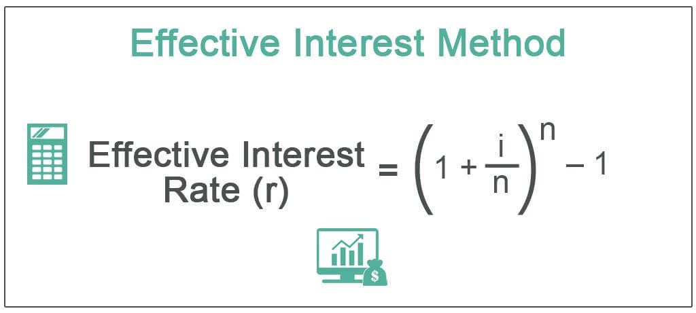

Bond amortization is a crucial accounting process that involves the gradual reduction of a bond's carrying value over its life. This process is significant as it influences the reported earnings of bond issuers and investors by matching the interest expense with the bond's coupon payment period. Amortization helps in evenly spreading the bond discount or premium over its tenure, facilitating more accurate financial reporting.

Interest rates play a fundamental role in bond markets as they determine the bond's yield and market price. When interest rates rise, existing bond prices generally fall, and vice versa, due to the inverse relationship between bond prices and interest rates. This is primarily due to the opportunity cost of holding lower-yielding bonds when new issues provide higher returns.



An essential method for bond amortization is the effective interest method, which calculates interest expenses based on the bond's carrying amount and yields a more accurate representation of financial activity than alternative methods like the straight-line approach. This method adjusts the interest expense to reflect the bond's true economic cost, resulting in periodic fluctuations that align with changing interest rates. The formula for the effective interest expense can be represented as:

$$
\text{Interest Expense} = \text{Carrying Amount of Bond} \times \text{Effective Interest Rate}
$$

Algorithmic trading, or algo trading, is the use of computer algorithms to trade financial instruments, including bonds, at high efficiency and speed. This method of trading introduces precision and optimization in bond markets, allowing traders to capitalize on tiny price movements. Integrating effective interest calculations into algorithmic strategies can enhance decision-making by accounting for interest rate changes and amortization schedules, which underpin the strategy's efficiency.

The article aims to explore the processes of bond amortization, delve into the particularities of the effective interest method, and discuss how these factors coalesce within algorithmic trading. By understanding these financial techniques, investors and traders can develop strategies that optimize returns and manage risks effectively in modern financial markets.

## Table of Contents

## Understanding Bond Amortization

Bond amortization refers to the process of gradually writing down the premium or discount on a bond over its remaining life. This is an essential concept for both investors and issuers because it impacts the financial statements and investment valuations. By systematically reducing the bond's carrying amount, both parties can accurately reflect the bond's true economic value over time.

Bond amortization can be conducted through different methods, primarily the straight-line method and the effective interest method. The straight-line method involves expensing an equal amount of the premium or discount each period, making it simple but less accurate in reflecting the bond's financial reality, as interest expenses do not remain constant over the life of the bond.

In contrast, the effective interest method provides a more precise approach. It involves calculating the interest expense based on the bond's carrying amount and the market [interest rate](/wiki/interest-rate-trading-strategies) at the time of issuance, adjusting for the bond's premium or discount. The formula for this is:

$$
\text{Interest Expense} = \text{Carrying Amount} \times \text{Market Interest Rate}
$$

This method results in a varying interest expense each period, essentially aligning the financial reporting with the bond's actual economic value over time.

Bond amortization significantly affects accounting practices and financial statements. For investors, accurate amortization ensures the bond's yield, which is the total expected return based on the bond's cash flow of interest payments and principal repayment, is properly reflected. For issuers, it ensures accurate reporting of liabilities and interest expenses, influencing profitability and tax obligations.

Understanding key terms related to bond amortization is crucial. The face value of a bond is the principal amount that will be returned to the investor at maturity. The coupon rate is the annual interest rate paid on the bond's face value, and the yield represents the bond's annual return based on its current market price, factoring in both coupon payments and any amortization of premium or discount. Proper comprehension of these terms and methods enables better decision-making when assessing bonds for investment or issuance.

## The Effective Interest Method

The effective interest method is a financial technique used to allocate interest expenses over the life of a bond or financial instrument. It differs from other methods, such as the straight-line method, by accounting for the time value of money and yielding a more accurate representation of interest expenses on a financial statement. This method ensures that the interest expense for each period is proportional to the carrying amount of the bond at the beginning of that period.

Under the effective interest method, the interest expense for a period is calculated by multiplying the carrying amount of the bond at the start of the period by the bond's market interest rate (also known as the effective interest rate). This results in a varying interest expense in financial reports, reflecting the actual economic cost of borrowing.

Consider a bond with a face value of $1,000, a coupon rate of 5%, a market (effective) interest rate of 6%, and a maturity of three years. The bond was issued at a discount, hence its initial carrying value is less than the face value. The formula for calculating the interest expense in any given period `t` is defined as:

$$
\text{Interest Expense}_t = \text{Carrying Amount}_{t-1} \times \text{Effective Interest Rate}
$$

For example:

- In the first year, assume the carrying amount of the bond is $950. The interest expense would be:

  \[ \text{Interest Expense}_1 = 950 \times 0.06 = 57
$$

- In the second year, the carrying amount is adjusted by adding the amortized amount from the first year, say $957. The new interest expense would be:

  \[ \text{Interest Expense}_2 = 957 \times 0.06 = 57.42
$$

Subsequent calculations follow the same method, where the carrying amount is adjusted each period for the amortized amount and the calculated interest via the formula. Such adjustments allow for the matching of the actual cost of borrowing against the periods benefiting from the borrowed funds.

The advantage of using the effective interest method lies in its precision in financial reporting. It aligns with the International Financial Reporting Standards (IFRS) and Generally Accepted Accounting Principles (GAAP), ensuring that the interest burden reflected in the financial statements is consistent with the actual economic cost of the bond. This method provides investors and analysts a clearer picture of a company's financial health and borrowing costs over time. 

By contrast, the straight-line method divides the total interest expense equally over each period, which may not accurately reflect the economic reality if market interest rates fluctuate or if the bond was issued at a premium or discount. The effective interest method, therefore, supports enhanced transparency and comparability in financial analysis.

## Interest Rates and Bonds

Interest rates are a pivotal [factor](/wiki/factor-investing) in determining bond prices and yields. As a fundamental principle, bond prices and interest rates have an inverse relationship: when interest rates rise, bond prices typically fall, and vice versa. This inverse relationship occurs because, as new bonds are issued with higher yields to match increased interest rates, existing bonds with lower yields become less attractive, causing their market prices to decrease.

Bond amortization, specifically through the effective interest method, is also influenced by the interest rate environment. The effective interest method calculates periodic interest expenses based on the carrying amount of the bond and the market interest rate at issuance. Consequently, in a fluctuating interest rate environment, the actual cash flow generated by a bond may differ from prior expectations, influencing the amortization schedule.

When there are changes in interest rates, the effective interest method reflects these changes by adjusting the carrying amount of the bond on the financial statements. For bonds issued at a discount or premium, the amortization of the bond discount or premium will adjust the bond’s book value. The impact of changing interest rates on this method is particularly visible in the recalculated interest expenses that are booked on an ongoing basis. This approach ensures that the financial statements accurately reflect the true cost of borrowing.

Effective interest rate adjustments can be illustrated with a basic Python snippet that calculates the interest expense of a bond issued at a premium or discount:

```python
def calculate_bond_interest(expense, carrying_amount, market_rate):
    interest_expense = carrying_amount * market_rate
    new_carrying_amount = carrying_amount - (interest_expense - expense)
    return interest_expense, new_carrying_amount

# Example values
face_value = 1000000  # $1,000,000
coupon_rate = 0.05  # 5%
market_rate = 0.04  # 4%
carrying_amount = 1050000  # $1,050,000

interest_expense, new_carrying = calculate_bond_interest(face_value * coupon_rate, carrying_amount, market_rate)
print(f"Interest Expense: {interest_expense:.2f}, New Carrying Amount: {new_carrying:.2f}")
```

Managing interest rate risk in bond portfolios involves several strategies. Duration management is a commonly used technique that adjusts the portfolio's duration to counterbalance interest rate fluctuations. Investors may also use interest rate swaps and futures to hedge against adverse movements. Diversification across different bonds with varying maturities and durations can also mitigate risk. Additionally, employing active trading strategies to adjust portfolio holdings in response to anticipated interest rate changes is another method to manage risk effectively.

## Algorithmic Trading and Bonds

Algorithmic trading utilizes computer systems to execute trades automatically based on pre-defined criteria and has become increasingly prevalent in financial markets. It leverages complex algorithms, high-speed data processing, and advanced analytics to make trading decisions with minimal human intervention. The growth of [algorithmic trading](/wiki/algorithmic-trading) is driven by the demand for improved efficiency, transparency, and [liquidity](/wiki/liquidity-risk-premium), along with the ability to execute trades at speeds and frequencies that are impossible for human traders.

In the context of bond markets, algorithmic trading can be applied to manage large volumes of trades and react swiftly to market changes. Bonds, as fixed-income securities, present unique opportunities and challenges for algorithmic trading. The relatively less liquid nature of bond markets compared to equities can be addressed by algorithms that optimize trade execution by timing trades and managing large orders in a way that minimizes market impact and reduces transaction costs.

Effective interest calculations are crucial in developing trading algorithms for bonds. The principal feature of bonds is their periodic interest payments or coupons, which are influenced by the effective interest rate. This rate is used to calculate the amortization of bond premiums or discounts over the life of the bond, which can affect the bond's yield and overall return. For algorithmic strategies, incorporating effective interest rate calculations allows traders to more accurately assess the value of a bond and make informed trading decisions based on predicted interest rate shifts and their impact on bond prices.

The benefits of utilizing algorithmic trading in bond portfolios are manifold. Firstly, algorithms can enhance the accuracy of pricing models by continuously adjusting to market data, thus optimizing returns. Additionally, they enable the implementation of advanced risk management techniques, such as scenario analysis and stress testing, to better manage interest rate and credit risks. Algorithms also facilitate the diversification of bond portfolios by dynamically reallocating assets in response to market conditions, which can improve overall portfolio performance.

Moreover, algorithmic trading can improve the operational efficiency of bond trading by streamlining processes and reducing the likelihood of human error. The ability to backtest strategies using historical data further allows traders to refine their algorithms for better outcomes. As a result, algorithmic trading in bonds not only aids in maximizing profits but also contributes to a well-balanced portfolio that aligns with investors’ risk tolerance and return expectations.

Overall, the fusion of algorithmic trading and bond markets presents compelling advantages, particularly when effective interest calculations are utilized to enhance decision-making processes. As technology advances, the integration of sophisticated algorithms is likely to continue shaping the future of bond trading.

## Integrating Bond Amortization Techniques with Algo Trading

Integrating bond amortization techniques with algorithmic trading involves combining financial acumen with computational algorithms to enhance bond trading strategies. Bond amortization principles, particularly the effective interest method, can be instrumental in crafting trading algorithms that anticipate and respond to market conditions.

**Incorporating Bond Amortization into Algorithmic Trading Strategies**

Bond amortization serves as a cornerstone for evaluating and forecasting bond performance. In the context of algorithmic trading, it allows for a precise calculation of bond yields and interest expenses, which are pivotal in making informed trading decisions. Algorithms can be designed to leverage these calculations, optimizing bond investment strategies by incorporating data from interest rate forecasts and economic indicators.

An algorithm might calculate the bond's yield using the effective interest method, allowing adjustments in portfolio allocation based on future interest rate predictions. For instance, if the forecast predicts a rise in interest rates, the algorithm might reduce exposure to long-duration bonds, which are more sensitive to interest rate changes.

**Case Studies of Algorithmic Success Using Bond Amortization Techniques**

There are notable instances where integrating bond amortization principles with algorithmic trading has yielded significant success. For example, some hedge funds employ complex algorithms that utilize the effective interest method to continuously reassess the value of bond portfolios. These algorithms factor in variables such as changes in LIBOR or alternative benchmark rates, ensuring an adaptive response to dynamic financial environments. 

Backtesting has shown that such algorithms often outperform traditional trading models, particularly in volatile markets where interest rate fluctuations are common. By effectively incorporating amortization calculations, these algorithms more accurately track changes in bond value, leading to optimized buy/sell decisions and improved portfolio returns.

**Challenges and Limitations**

Despite its potential, integrating bond amortization techniques within algorithmic trading is not without challenges. One significant limitation is the complexity of accurately forecasting interest rates, which directly impacts the amortization calculations. Even minor errors in rate predictions can result in substantial misvaluation of bonds, hampering the algorithm's effectiveness.

Moreover, the computational intensity required to integrate comprehensive amortization calculations with real-time trading decisions can strain resources. This necessitates robust computational infrastructure and sophisticated software capable of handling vast datasets efficiently.

Additionally, market liquidity and sudden economic shifts can pose challenges. Algorithms based heavily on historical amortization data may struggle with unprecedented market movements, necessitating adaptive [machine learning](/wiki/machine-learning) models that can recalibrate strategies on-the-fly to maintain efficacy.

In conclusion, while integrating bond amortization techniques with algorithmic trading holds considerable promise, it requires careful execution and a sound understanding of both financial principles and computational technologies. As technology continues to evolve, the refinement of these strategies is expected to lead to more sophisticated and reliable trading models.

## Conclusion

In this article, we explored the intricate dynamics of bond amortization, delving into the effective interest method and its profound implications within the framework of algorithmic trading. Bond amortization stands as a critical concept for both investors and issuers, providing insights into the allocation of interest expenses over the duration of a bond's life. This financial technique not only influences accounting practices but also impacts financial statements, offering transparency and accuracy in reporting.

The effective interest method, as we've seen, differs from other amortization methods by aligning interest expenses with the bond's carrying amount, resulting in a more precise reflection of financial reality. This method's advantage lies in its ability to capture the true cost of debt, thereby offering users a meticulous understanding of financial obligations.

Interest rates further play a pivotal role, influencing bond prices and yields. They are integral to bond amortization calculations and the effective interest approach. A change in interest rates can dramatically alter the financial landscape, affecting both the valuation and accounting of bonds. The strategic management of interest rate risk, therefore, becomes indispensable for optimizing bond portfolios.

The integration of algorithmic trading within bond markets heralds a new era of financial analysis, resting heavily on sophisticated computations such as those provided by the effective interest method. Algorithms armed with these calculations can optimize trading strategies, enhance returns, and manage risk with remarkable precision. This intersection of financial techniques underscores their significance in modern investing and trading.

In conclusion, understanding and applying bond amortization, particularly through the effective interest method, is essential for anyone engaged in financial markets. These methodologies offer a robust foundation for integrating complex financial instruments into algorithmic trading strategies. Embracing these principles can empower investors and financial professionals to gain a competitive edge, encouraging the adoption of these sophisticated tools in their own financial analyses or algorithmic frameworks.

## Additional Resources

### Books

1. **"Principles of Corporate Finance" by Richard A. Brealey, Stewart C. Myers, and Franklin Allen**  
   This comprehensive guide covers various aspects of corporate finance, including bond valuation and amortization, making it a fundamental resource for understanding the financial principles behind bonds.

2. **"Fixed Income Securities: Tools for Today's Markets" by Bruce Tuckman and Angel Serrat**  
   This book provides an in-depth look at the mechanics of fixed income markets, including detailed sections on the calculation of effective interest and bond pricing.

3. **"Algorithmic Trading: Winning Strategies and Their Rationale" by Ernie Chan**  
   This work outlines strategies used in algorithmic trading, with sections dedicated to the application of financial theories, such as effective interest methods, in algorithmic approaches.

### Articles

1. **"Understanding the Yield Curve and Its Role in Fixed-Income Portfolio Strategies" by CFA Institute**  
   This article explores the relationship between interest rates and bonds, with emphasis on how these factors influence investment strategies in the bond market.

2. **"The Impact of Interest Rate Changes on Bond Portfolios" by The Journal of Portfolio Management**  
   A thorough analysis of how fluctuating interest rates affect the valuation and amortization of bonds, providing insights useful for both manual and algorithmic trading.

### Online Courses

1. **Coursera - "Bonds & Stocks: An Introduction to Fixed Income & Equities"**  
   Offered by the University of Geneva, this [course](/wiki/best-algorithmic-trading-courses) provides foundational knowledge on bonds and equities, including the mechanics of amortization and valuation.

2. **Khan Academy - "The Bond Market"**  
   A free resource that covers the basics of bond markets, including pricing, yields, and the impact of interest rates, making it useful for beginners.

3. **edX - "Algorithmic Trading and Stocks Essential" by Indian School of Business (ISB)**  
   This course offers a comprehensive view of algorithmic trading, focusing on its application in various markets, including fixed income.

### Financial Software and Tools

1. **Bloomberg Terminal**  
   This industry-standard software provides detailed analytics and data on bond markets, including sophisticated tools for implementing and analyzing effective interest methods.

2. **Python Libraries: Pandas and NumPy**  
   These libraries offer powerful data manipulation and numerical computing capabilities, making them useful for implementing bond amortization calculations and developing trading algorithms. Below is a simple example code calculating effective interest rate using Python:

   ```python
   import numpy as np

   principal = 1000
   coupon_rate = 0.05
   market_rate = 0.06
   periods = 10

   def effective_interest(principal, coupon_rate, market_rate, periods):
       coupon_payment = principal * coupon_rate
       cash_flows = np.full(periods, coupon_payment)
       cash_flows[-1] += principal
       discount_factors = [1 / (1 + market_rate) ** i for i in range(1, periods + 1)]
       present_value = np.dot(cash_flows, discount_factors)
       return present_value

   print(f"Present value: {effective_interest(principal, coupon_rate, market_rate, periods)}")
   ```

3. **QuantConnect**  
   An algorithmic trading platform that allows users to design and test strategies including bond trading algorithms, with integrations for interest rate modeling and bond amortization techniques.

These resources provide varied perspectives and tools necessary for deepening knowledge in bond amortization, effective interest methods, and algorithmic trading approaches.

## References & Further Reading

[1]: Brealey, R. A., Myers, S. C., & Allen, F. (2011). ["Principles of Corporate Finance"](https://www.mheducation.com/highered/product/principles-corporate-finance-brealey-myers/M9781264080946.html). McGraw-Hill Education.

[2]: Tuckman, B., & Serrat, A. (2011). ["Fixed Income Securities: Tools for Today's Markets"](https://www.wiley.com/en-us/Fixed+Income+Securities%3A+Tools+for+Today%27s+Markets%2C+4th+Edition-p-9781119835554). Wiley.

[3]: Chan, E. (2009). ["Algorithmic Trading: Winning Strategies and Their Rationale"](https://github.com/ftvision/quant_trading_echan_book). Wiley.

[4]: CFA Institute. (2018). ["Understanding the Yield Curve and Its Role in Fixed-Income Portfolio Strategies"](https://blogs.stage.cfainstitute.org/blog/2018/06/08/daniel-kahneman-four-keys-to-better-decision-making/).

[5]: The Journal of Portfolio Management. (2020). ["The Impact of Interest Rate Changes on Bond Portfolios"](https://jpm.pm-research.com/front).