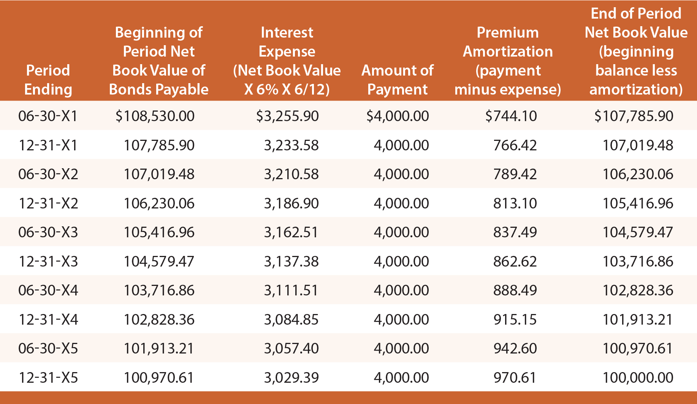

## Table of Contents

## What is the effective interest rate method?

The effective interest rate method is a way to figure out how much interest you're really paying or earning on a loan or investment. It's different from the simple interest rate because it takes into account how often the interest is added to the account. For example, if you have a savings account that adds interest every month, the effective interest rate will be higher than the simple interest rate because you're earning interest on the interest that was added before.

This method is really useful for understanding the true cost of borrowing money or the real return on an investment. It helps you see the bigger picture by showing you the actual rate you're dealing with, not just the advertised rate. Banks and financial institutions often use this method to give a more accurate picture of what you'll end up paying or earning over time.

## How does the effective interest rate method differ from the straight-line method for bond amortization?

The effective interest rate method and the straight-line method are two ways to handle bond amortization, which is how you spread out the cost of a bond over time. The effective interest rate method is more accurate because it uses the bond's market interest rate to figure out how much interest you pay or earn each period. This means the interest expense changes over time, getting smaller as the bond gets closer to being paid off. It's like paying a little less interest each time because you're paying down the bond's value.

On the other hand, the straight-line method is simpler but less accurate. It spreads the total interest cost evenly over the life of the bond. So, if you have a bond that lasts 10 years, you'd pay the same amount of interest every year. This method is easier to calculate, but it doesn't reflect how the bond's value changes over time. It's like paying the same amount of interest no matter how much of the bond you've paid off.

In summary, the effective interest rate method gives a more realistic picture of how much interest you're really paying or [earning](/wiki/earning-announcement) because it adjusts for the bond's changing value. The straight-line method, while easier to use, doesn't account for these changes and can make your interest payments seem more consistent than they actually are.

## What is bond amortization and why is it important?

Bond amortization is a way to spread out the cost of a bond over the time you own it. When you buy a bond, you might pay more or less than its face value. If you pay more, you have to slowly reduce that extra amount over time. If you pay less, you slowly increase the bond's value on your [books](/wiki/algo-trading-books) until it matches the face value. This process of adjusting the bond's value is called amortization.

It's important because it helps show the true cost of the bond over time. Without amortization, your financial statements might not accurately show how much you're really spending or earning from the bond. By spreading out the cost, you get a clearer picture of your finances, which is crucial for making good decisions about investments and managing money.

## Can you explain the formula used in the effective interest rate method?

The effective interest rate method uses a formula to figure out how much interest you pay or earn each period. The formula is: Interest Expense = Carrying Amount of the Bond x Effective Interest Rate. The carrying amount is the bond's value on your books after you've made adjustments for any premium or discount you paid when you bought the bond. The effective interest rate is the market rate at the time you bought the bond.

Each time you use this formula, you'll find out how much interest you need to pay or earn for that period. You then take that interest amount and subtract it from the bond's carrying amount if it's a premium bond, or add it if it's a discount bond. This changes the carrying amount for the next period. By doing this over and over, you slowly adjust the bond's value until it matches the face value at the end of the bond's life.

## What are the steps to apply the effective interest rate method for bond amortization?

To apply the effective interest rate method for bond amortization, start by figuring out the bond's carrying amount. This is the amount you paid for the bond, which might be more or less than its face value. If you paid more, it's a premium; if you paid less, it's a discount. Next, you need to know the effective interest rate, which is the market rate when you bought the bond. Multiply the carrying amount by the effective interest rate to find out the interest expense for the first period.

Once you have the interest expense, you adjust the carrying amount. If it's a premium bond, subtract the interest expense from the carrying amount. If it's a discount bond, add the interest expense to the carrying amount. This new carrying amount becomes the starting point for the next period. You keep doing this for each period until the bond matures. By the end, the carrying amount should match the bond's face value, showing how the premium or discount has been spread out over time.

## How do you calculate the interest expense using the effective interest rate method?

To calculate the interest expense using the effective interest rate method, you start with the bond's carrying amount. This is the amount you paid for the bond, which could be more or less than its face value. You then multiply this carrying amount by the effective interest rate, which is the market rate at the time you bought the bond. The result of this multiplication is the interest expense for that period.

After you find the interest expense, you adjust the bond's carrying amount. If you paid more for the bond than its face value, you subtract the interest expense from the carrying amount. If you paid less, you add the interest expense to the carrying amount. This new carrying amount becomes the starting point for calculating the interest expense in the next period. You keep doing this until the bond matures, and the carrying amount should then match the bond's face value.

## What is the impact of the effective interest rate method on the carrying amount of a bond?

The effective interest rate method changes the carrying amount of a bond over time. The carrying amount is the value of the bond on your books, which might start out different from the bond's face value if you paid more or less for it. Each period, you figure out the interest expense by multiplying the carrying amount by the effective interest rate, which is the market rate when you bought the bond. This interest expense is then used to adjust the carrying amount. If you paid more for the bond than its face value, you subtract the interest expense from the carrying amount. If you paid less, you add the interest expense to it.

By doing this over and over, the carrying amount slowly moves towards the bond's face value. If you paid a premium, the carrying amount gets smaller each time because you're subtracting the interest expense. If you paid a discount, the carrying amount gets bigger because you're adding the interest expense. By the time the bond matures, the carrying amount should be the same as the face value. This way, the effective interest rate method helps show the real cost of the bond over time by spreading out any extra you paid or saved when you bought it.

## How does the effective interest rate method affect the income statement and balance sheet?

The effective interest rate method impacts the income statement by changing how much interest expense you report each period. When you use this method, you figure out the interest expense by multiplying the bond's carrying amount by the effective interest rate. This means the interest expense might go up or down over time, depending on whether you paid a premium or a discount for the bond. On your income statement, you'll see these changing interest expenses, which can affect your net income. If the interest expense is higher, it reduces your net income more. If it's lower, it reduces your net income less.

On the balance sheet, the effective interest rate method changes the carrying amount of the bond. The carrying amount starts as the amount you paid for the bond, which could be more or less than its face value. Each period, you adjust this carrying amount by either adding or subtracting the interest expense you calculated. If you paid more for the bond than its face value, you subtract the interest expense, making the carrying amount smaller over time. If you paid less, you add the interest expense, making the carrying amount bigger. By the time the bond matures, the carrying amount should match the bond's face value. This way, your balance sheet shows a more accurate picture of the bond's value as it gets closer to being paid off.

## What are the advantages of using the effective interest rate method over other methods?

The effective interest rate method is better than other methods because it gives a truer picture of how much interest you're really paying or earning. It uses the market interest rate to figure out the interest each period, which means the interest expense changes over time. This is more accurate because it matches the real cost of the bond. Other methods, like the straight-line method, just spread the total interest evenly over the bond's life, which doesn't show how the bond's value changes. So, the effective interest rate method helps you understand the real financial impact of the bond better.

Another advantage is that it makes your financial statements more accurate. On the income statement, the changing interest expense shows up, which can affect your net income more realistically. On the balance sheet, the bond's carrying amount gets adjusted each period, moving closer to the bond's face value. This means your balance sheet shows the bond's true value as it gets paid off. Using the effective interest rate method helps you make better financial decisions because it gives you a clearer and more honest picture of your finances.

## Can you provide an example of how to amortize a bond using the effective interest rate method?

Let's say you bought a bond for $10,500 that has a face value of $10,000 and a 5-year term. The market interest rate when you bought it was 6%. You paid more than the face value, so you have a premium of $500. To figure out the interest expense for the first year, you multiply the bond's carrying amount, which is $10,500, by the effective interest rate of 6%. That gives you an interest expense of $630 for the first year. Now, you subtract this interest expense from the carrying amount. So, $10,500 minus $630 equals $9,870. This is the new carrying amount for the next year.

In the second year, you use the new carrying amount of $9,870 and multiply it by the 6% effective interest rate. This gives you an interest expense of $592.20 for the second year. You subtract this from the carrying amount again, so $9,870 minus $592.20 equals $9,277.80. This process keeps going for each year until the bond matures. By the end of the 5 years, the carrying amount should be close to the bond's face value of $10,000, showing how the premium has been spread out over time. This way, you can see the real cost of the bond more clearly.

## How does the effective interest rate method handle changes in market interest rates?

The effective interest rate method uses the market interest rate at the time you buy the bond to figure out the interest expense each period. If the market interest rate changes after you buy the bond, it doesn't change the rate you use for your calculations. You keep using the same effective interest rate for the whole time you own the bond. This means that even if the market rates go up or down, your interest expense stays based on the original rate.

This can make a difference in how much you end up paying or earning compared to new bonds sold at the new market rates. If rates go up, new bonds might have higher interest expenses, but your bond's interest stays the same. If rates go down, new bonds might have lower interest expenses, but again, your bond's interest stays the same. This way, the effective interest rate method keeps your bond's costs predictable, even when the market changes.

## What are the common pitfalls or errors to avoid when using the effective interest rate method for bond amortization?

When using the effective interest rate method for bond amortization, one common mistake is not keeping track of the bond's carrying amount correctly. The carrying amount changes each period because you need to add or subtract the interest expense. If you forget to update it, your calculations for the next period will be wrong. This can make your financial statements show the wrong amount of interest expense and the wrong value for the bond.

Another pitfall is using the wrong interest rate. The effective interest rate method uses the market rate at the time you bought the bond, not the rate on the bond itself or any new market rates. If you use the wrong rate, your interest expense will be off, and your bond's value won't be adjusted correctly over time. It's important to stick with the original effective interest rate for the whole time you own the bond to get the right numbers.

## What is Bond Amortization and How is it Understood?

Bond amortization refers to the process of gradually writing down the premium or discount on a bond over its remaining life. This is an essential concept for both investors and issuers because it impacts the financial statements and investment valuations. By systematically reducing the bond's carrying amount, both parties can accurately reflect the bond's true economic value over time.

Bond amortization can be conducted through different methods, primarily the straight-line method and the effective interest method. The straight-line method involves expensing an equal amount of the premium or discount each period, making it simple but less accurate in reflecting the bond's financial reality, as interest expenses do not remain constant over the life of the bond.

In contrast, the effective interest method provides a more precise approach. It involves calculating the interest expense based on the bond's carrying amount and the market [interest rate](/wiki/interest-rate-trading-strategies) at the time of issuance, adjusting for the bond's premium or discount. The formula for this is:

$$
\text{Interest Expense} = \text{Carrying Amount} \times \text{Market Interest Rate}
$$

This method results in a varying interest expense each period, essentially aligning the financial reporting with the bond's actual economic value over time.

Bond amortization significantly affects accounting practices and financial statements. For investors, accurate amortization ensures the bond's yield, which is the total expected return based on the bond's cash flow of interest payments and principal repayment, is properly reflected. For issuers, it ensures accurate reporting of liabilities and interest expenses, influencing profitability and tax obligations.

Understanding key terms related to bond amortization is crucial. The face value of a bond is the principal amount that will be returned to the investor at maturity. The coupon rate is the annual interest rate paid on the bond's face value, and the yield represents the bond's annual return based on its current market price, factoring in both coupon payments and any amortization of premium or discount. Proper comprehension of these terms and methods enables better decision-making when assessing bonds for investment or issuance.

## What is the Effective Interest Method?

The effective interest method is a financial technique used to allocate interest expenses over the life of a bond or financial instrument. It differs from other methods, such as the straight-line method, by accounting for the time value of money and yielding a more accurate representation of interest expenses on a financial statement. This method ensures that the interest expense for each period is proportional to the carrying amount of the bond at the beginning of that period.

Under the effective interest method, the interest expense for a period is calculated by multiplying the carrying amount of the bond at the start of the period by the bond's market interest rate (also known as the effective interest rate). This results in a varying interest expense in financial reports, reflecting the actual economic cost of borrowing.

Consider a bond with a face value of $1,000, a coupon rate of 5%, a market (effective) interest rate of 6%, and a maturity of three years. The bond was issued at a discount, hence its initial carrying value is less than the face value. The formula for calculating the interest expense in any given period `t` is defined as:

$$
\text{Interest Expense}_t = \text{Carrying Amount}_{t-1} \times \text{Effective Interest Rate}
$$

For example:

- In the first year, assume the carrying amount of the bond is $950. The interest expense would be:

  \[ \text{Interest Expense}_1 = 950 \times 0.06 = 57
$$

- In the second year, the carrying amount is adjusted by adding the amortized amount from the first year, say $957. The new interest expense would be:

  \[ \text{Interest Expense}_2 = 957 \times 0.06 = 57.42
$$

Subsequent calculations follow the same method, where the carrying amount is adjusted each period for the amortized amount and the calculated interest via the formula. Such adjustments allow for the matching of the actual cost of borrowing against the periods benefiting from the borrowed funds.

The advantage of using the effective interest method lies in its precision in financial reporting. It aligns with the International Financial Reporting Standards (IFRS) and Generally Accepted Accounting Principles (GAAP), ensuring that the interest burden reflected in the financial statements is consistent with the actual economic cost of the bond. This method provides investors and analysts a clearer picture of a company's financial health and borrowing costs over time. 

By contrast, the straight-line method divides the total interest expense equally over each period, which may not accurately reflect the economic reality if market interest rates fluctuate or if the bond was issued at a premium or discount. The effective interest method, therefore, supports enhanced transparency and comparability in financial analysis.

## References & Further Reading

[1]: Brealey, R. A., Myers, S. C., & Allen, F. (2011). ["Principles of Corporate Finance"](https://www.mheducation.com/highered/product/principles-corporate-finance-brealey-myers/M9781264080946.html). McGraw-Hill Education.

[2]: Tuckman, B., & Serrat, A. (2011). ["Fixed Income Securities: Tools for Today's Markets"](https://www.wiley.com/en-us/Fixed+Income+Securities%3A+Tools+for+Today%27s+Markets%2C+4th+Edition-p-9781119835554). Wiley.

[3]: Chan, E. (2009). ["Algorithmic Trading: Winning Strategies and Their Rationale"](https://github.com/ftvision/quant_trading_echan_book). Wiley.

[4]: CFA Institute. (2018). ["Understanding the Yield Curve and Its Role in Fixed-Income Portfolio Strategies"](https://blogs.stage.cfainstitute.org/blog/2018/06/08/daniel-kahneman-four-keys-to-better-decision-making/).

[5]: The Journal of Portfolio Management. (2020). ["The Impact of Interest Rate Changes on Bond Portfolios"](https://jpm.pm-research.com/front).