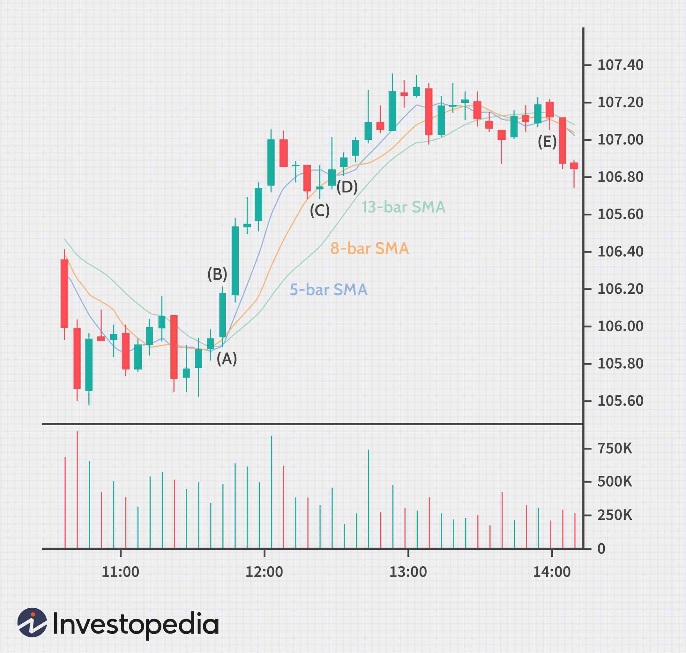

Day trading is a form of trading where securities are bought and sold within the same trading day, with the objective of profiting from short-term price fluctuations. This approach has gained significant traction in today’s digital marketplace due to its accessibility and potential for rapid financial returns. With advancements in technology and the proliferation of online trading platforms, more individuals are venturing into day trading, attracted by the promise of autonomy and the allure of the financial markets.

Algorithmic trading, the use of computer programs to execute trades based on pre-defined criteria, plays a crucial role in modern financial markets. By leveraging algorithms, traders can exploit market inefficiencies more efficiently than manual methods allow. Algorithms can analyze vast amounts of data at high speed, executing trades in milliseconds based on real-time market conditions. This not only enhances trading efficiency but also aids in minimizing emotional biases that might affect decision-making.



Moving averages are a fundamental tool in trading strategies, widely used to identify trends over a period by smoothing out price data. They help traders discern patterns and potential reversal points by providing a clearer view of the market trend, free from minute-by-minute volatility. There are several types of moving averages, including simple moving averages (SMA), exponential moving averages (EMA), and weighted moving averages, each offering different sensitivities to price changes. For instance, an SMA is calculated by taking the arithmetic mean of prices over a specific period, while an EMA places more weight on the most recent prices, thus responsive to recent price movements.

This article aims to explore how the integration of day trading, algorithmic trading, and moving averages can create robust trading strategies. By understanding and applying these concepts cohesively, traders can improve their decision-making processes and potentially enhance their profitability. The insights provided will be beneficial to both novice traders, who are building their foundational knowledge, and seasoned traders, seeking to refine their strategies through innovative approaches.

The exploration of these topics will not only equip traders with practical knowledge but also encourage the incorporation of technological advancements into their trading routines. By harnessing the power of algorithmic models and moving averages, traders can gain a competitive edge in the fast-paced financial markets.

## Table of Contents

## Understanding Moving Averages

A moving average is a statistical calculation used to analyze data points by creating a series of averages of different subsets of the full dataset. In the context of financial markets, moving averages are commonly employed to soften fluctuations in price data and to help identify underlying trends. There are three main types of moving averages: simple, exponential, and weighted.

A simple moving average (SMA) is the arithmetic mean of a given set of prices over a specific time period. For example, a 10-day SMA calculates the average of the closing prices of the last 10 days. It is represented by the formula:

$$
\text{SMA} = \frac{P_1 + P_2 + \ldots + P_n}{n}
$$

where $P$ represents the price at each day and $n$ is the number of days. 

An exponential moving average (EMA) assigns greater weight to more recent prices, reducing the lag observed in SMAs. The EMA is calculated using the formula:

$$
\text{EMA}_t = \alpha \times P_t + (1 - \alpha) \times \text{EMA}_{t-1}
$$

where $\alpha$ is the smoothing constant, calculated as $\frac{2}{n+1}$, $P_t$ is the price at time $t$, and $\text{EMA}_{t-1}$ is the EMA of the previous period.

A weighted moving average (WMA) also considers all data points but assigns different weights to each, typically placing more significance on recent prices. The formula for WMA is:

$$
\text{WMA} = \frac{w_1P_1 + w_2P_2 + \ldots + w_nP_n}{w_1 + w_2 + \ldots + w_n}
$$

where $w_i$ is the weight assigned to each price point.

Moving averages are crucial for identifying trends in financial markets as they mitigate the effects of short-term [volatility](/wiki/volatility-trading-strategies) and noise. This smoothing property helps provide clearer signals for trend directions by filtering out random price spikes that may not indicate true market conditions. Traders often use them to infer potential buy or sell signals, with crossover strategies being a popular application. For instance, a common strategy is to purchase a security when a short-term moving average crosses above a long-term moving average, indicating a potential uptrend.

Visual examples of moving averages often depict price data with overlaying SMA, EMA, and WMA lines on a trading chart. These lines typically exhibit smoother curves compared to the raw price data, thus aiding traders in visualizing the direction of the trend.

Nonetheless, moving averages are not without pitfalls. They are lagging indicators, meaning they reflect past price action and may not predict future movements. This can lead to late entry or [exit](/wiki/exit-strategy) signals, especially in volatile markets. Furthermore, the choice of time period significantly impacts their effectiveness; too short a period may result in excessive sensitivity to price changes, while too long a period may render the average too sluggish to be reactive. Traders must adjust the parameters according to their specific market context and trading objectives to optimize their strategy.

In summary, moving averages are integral tools in evaluating and following market trends, providing a clearer view amidst price data fluctuations. Understanding their different types and the appropriate application is essential for accurate interpretation and effective trading strategy development.

## Day Trading Basics

Day trading refers to the buying and selling of financial instruments within a single trading day. The primary objective is to capitalize on small price fluctuations, aiming for quick gains from market movements. Unlike long-term investing, day traders close positions by the market's close, minimizing overnight risks and reacting to intraday volatility.

Day trading differs significantly from other trading methods such as swing trading or positional trading. Swing traders hold positions for several days to weeks, seeking profits from expected uptrends or downtrends. Positional trading, on the other hand, involves holding positions for several months to years, focusing on the underlying fundamental attributes of the security. Day trading stands apart due to its short time frame and reliance on technical analysis and market sentiment, rather than broader macroeconomic factors.

Day traders utilize various tools and platforms to execute their strategies efficiently. These include advanced charting software, real-time data feeds, and direct access brokers. Platforms such as MetaTrader, Thinkorswim, and [Interactive Brokers](/wiki/interactive-brokers-api) are popular choices due to their robust analytics and order execution capabilities. Additionally, day traders may employ proprietary trading systems and algorithmic strategies to automate and optimize their trades.

The world of [day trading](/wiki/day-trading-spy) holds significant risks and rewards. The potential for substantial profits over a short period is enticing; however, the volatility can lead to rapid losses. Markets can be unpredictable, and even seasoned traders encounter losing trades. To manage risk, day traders often use stop-loss orders and position sizing strategies. Liquidity is essential, as the ability to quickly enter and exit trades without significant price impact is crucial for success.

Day trading is subject to regulatory considerations, which vary by jurisdiction. In the United States, the Financial Industry Regulatory Authority (FINRA) requires pattern day traders maintaining less than $25,000 in equity in their trading accounts to limit their trading activities. Moreover, various exchanges and regulatory bodies impose rules to safeguard market integrity and investor interests.

Essential skills for day traders include a thorough understanding of market operations, technical analysis proficiency, and the ability to remain emotionally stable during rapid market fluctuations. Successful day traders are disciplined, quick decision-makers, and continuously learn to adapt to changing market conditions [1].

---

[1] FINRA Rules. (n.d.). Day Trading: Your Dollars at Risk. Retrieved from [https://www.finra.org/investors/learn-to-invest/types-investments/day-trading](https://www.finra.org/investors/learn-to-invest/types-investments/day-trading).

## Algorithmic Trading in Day Trading

Algorithmic trading involves the use of computer algorithms to automate trading decisions and implement strategies, leveraging mathematical models and complex computations. In day trading, where trades are executed within the same day to capitalize on intraday price movements, [algorithmic trading](/wiki/algorithmic-trading) plays a crucial role in enhancing efficiency and precision.

Day traders commonly utilize several types of algorithms, each serving different purposes. Strategies such as [trend following](/wiki/trend-following), mean reversion, and statistical [arbitrage](/wiki/arbitrage) are popular among traders. Trend-following algorithms, for example, rely on technical indicators like moving averages to determine the direction of price movements. Mean reversion strategies exploit price fluctuations by assuming that prices will revert to a mean or average over time. Statistical arbitrage involves exploiting pricing inefficiencies between correlated financial instruments.

The benefits of algorithmic trading in day trading are noteworthy. Speed is a significant advantage, as algorithms can analyze vast datasets, monitor multiple markets, and execute trades faster than a human trader. This rapid processing capability is crucial in the highly volatile and time-sensitive domain of day trading. Efficiency is another benefit; algorithms can operate based on predefined criteria, ensuring consistent adherence to the trading strategy without deviation. Emotion management is particularly important in day trading, where rapid market shifts can induce stress and impulsivity. Algorithms eliminate emotion-driven decisions by following a systematic and logic-based approach.

However, algorithmic trading is not without its challenges and risks. Market conditions can change suddenly, rendering pre-programmed strategies ineffective. Additionally, technical failures, such as software bugs or system outages, pose significant risks. High-frequency trading, a form of algorithmic trading, can exacerbate market volatility and contribute to flash crashes, where prices plummet rapidly within minutes.

Successful algorithmic trading strategies in day trading often involve sophisticated models and [backtesting](/wiki/backtesting). For instance, algorithmic systems that utilize moving averages to identify crossover points (where a short-term average crosses above or below a long-term average) are prevalent. Such strategies aim to signal the beginning or end of a trend, guiding trading decisions accordingly. Another example includes pairs trading, a [statistical arbitrage](/wiki/statistical-arbitrage) strategy where two correlated securities are traded based on the assumption that their historical price relationship will mean-revert. 

These examples illustrate the potential of integrating algorithmic methods into day trading, with the possibility of achieving significant gains through strategic design and implementation. Nonetheless, it is essential for traders to remain vigilant, continuously assess their strategies, and adapt to ever-changing market dynamics.

## Incorporating Moving Averages in Algo Trading Strategies

Moving averages are integral components in the construction of algorithmic trading models, primarily due to their role in trend identification and signal generation. By interpreting price action over time, moving averages help in making informed decisions regarding entry and exit points in trades.

### Encoding Moving Averages into Algorithmic Models

To effectively use moving averages in algorithmic trading, traders often encode specific strategies into their algorithms. This involves programming the conditions under which trades are executed. A popular approach is using crossover strategies, where two moving averages are compared: a shorter-period and a longer-period moving average. The basic principle is straightforward—when the shorter MA crosses above the longer MA, it indicates a buy signal; conversely, when it crosses below, a sell signal is generated.

### Algorithmic Strategies Utilizing Moving Averages

1. **Simple Moving Average (SMA) Crossover:**
   - The SMA crossover strategy is fundamental where, typically, a 50-period SMA is used in conjunction with a 200-period SMA. The crossing of the shorter MA over the longer one suggests a bullish trend.

2. **Exponential Moving Average (EMA) Crossover:**
   - The EMA grants more weight to recent prices, making it more responsive to current market activities. A common setup involves a 12-period EMA and a 26-period EMA, widely used in the MACD (Moving Average Convergence Divergence) indicator for trade signals.

3. **Weighted Moving Average (WMA) Strategies:**
   - Similar to EMA but with linear weights, WMA strategies are less common but useful when greater emphasis is needed on recent data points, helping fine-tune short-term trading signals.

### Backtesting Process for Validation

Backtesting is a critical process in validating the effectiveness of moving average-based trading strategies. It involves running the algorithm on historical data to assess its accuracy and profitability. By inputting past market data, traders can simulate how their algorithm would have performed, allowing for analysis of potential gains and losses.

```python
import pandas as pd
import numpy as np

# Example of a simple moving average crossover strategy backtest
def moving_average_crossover_strategy(data, short_window=50, long_window=200):
    signals = pd.DataFrame(index=data.index)
    signals['price'] = data['Close']
    # Generate short and long moving averages
    signals['short_mavg'] = data['Close'].rolling(window=short_window, min_periods=1).mean()
    signals['long_mavg'] = data['Close'].rolling(window=long_window, min_periods=1).mean()

    # Generate signals
    signals['signal'] = 0.0
    signals['signal'][short_window:] = np.where(signals['short_mavg'][short_window:] 
                                                > signals['long_mavg'][short_window:], 1.0, 0.0)

    # Generate trading orders
    signals['positions'] = signals['signal'].diff()
    return signals

# Assuming 'data' is a DataFrame with historical market prices
# signals = moving_average_crossover_strategy(data)
```

### Adapting Strategies to Market Conditions

Market conditions can vary significantly, necessitating flexibility in algorithmic strategies. Volatile markets may require shorter MA periods to react faster, while stable markets might benefit from longer periods to avoid noise. Constant monitoring and adjustments are essential in optimizing strategy effectiveness.

### Case Studies and Examples

Several successful trading systems have illustrated the efficacy of moving averages in algorithmic trading. One notable example includes the use of moving average strategies in high-frequency trading ([HFT](/wiki/high-frequency-trading-strategies)) firms, where milliseconds matter, and swift decision-making is critical. Another example is the use of SMAs in trend-following systems, which have been employed by numerous hedge funds to generate steady returns over the decades.

In conclusion, moving averages, when properly integrated within algorithmic models, can significantly enhance the precision and efficacy of day trading strategies. Through rigorous backtesting and continual adaptation to market dynamics, traders can harness these strategies for consistent success.

## Building Your Own Day Trading Algo Using Moving Averages

Building a successful day trading algorithm using moving averages involves a structured approach that includes strategy development, technical setup, and iterative testing. Here's how you can systematically develop a moving average-based trading strategy:

### Setting Goals for Your Algorithmic Strategy

Before initiating any development, it's crucial to define the goals you want to achieve with your algorithmic trading strategy. These goals may include desired return ratios, risk tolerance levels, frequency of trades, and the types of financial instruments targeted. Defining clear objectives helps in tailoring the parameters of your algorithm and in evaluating performance effectiveness.

### Choosing the Right Moving Averages

Selecting the appropriate moving averages is vital in ensuring the strategy aligns with market conditions. Commonly used types include:

- **Simple Moving Average (SMA):** Best suited for a general overview of market trends, but may lag behind more rapidly changing conditions.

- **Exponential Moving Average (EMA):** Provides more weight to recent prices, making it more responsive to market changes—ideal for faster trading environments.

- **Weighted Moving Average (WMA):** Similar to EMA but allows customizing the weighting scheme according to specific trading requirements.

For example, short-term traders might prefer a combination of short-term (e.g., 9-period EMA) and long-term (e.g., 50-period SMA) moving averages to capitalize on smaller price movements.

### Coding a Simple Moving Average Strategy

To implement a simple moving average crossover strategy, follow these basic steps using Python:

```python
import pandas as pd
import numpy as np
import matplotlib.pyplot as plt

# Load historical price data
data = pd.read_csv('price_data.csv')
data['SMA_50'] = data['Close'].rolling(window=50).mean()
data['SMA_200'] = data['Close'].rolling(window=200).mean()

# Generate signals
data['Signal'] = np.where(data['SMA_50'] > data['SMA_200'], 1, 0)
data['Position'] = data['Signal'].diff()

# Plotting to visualize the strategy
plt.figure(figsize=(12, 6))
plt.plot(data['Close'], label='Price', alpha=0.5)
plt.plot(data['SMA_50'], label='50-Day SMA', alpha=0.75)
plt.plot(data['SMA_200'], label='200-Day SMA', alpha=0.75)
plt.plot(data[data['Position'] == 1].index, 
         data['SMA_50'][data['Position'] == 1], 
         '^', markersize=10, color='g', label='Buy Signal')
plt.plot(data[data['Position'] == -1].index, 
         data['SMA_50'][data['Position'] == -1], 
         'v', markersize=10, color='r', label='Sell Signal')
plt.legend(loc='best')
plt.show()
```
This foundational code calculates the moving averages and executes trades based on crossover signals.

### Testing and Optimizing Your Algo

Testing your algorithm involves backtesting with historical data to evaluate its performance under different scenarios. It's vital to include metrics such as Sharpe ratio, maximum drawdown, and win/loss ratio. Use these insights to optimize parameters like moving average periods or thresholds for trade signals.

Optimization might involve adjusting the moving average windows or combining multiple indicators to refine signal accuracy. Consider forward testing with live or paper trading to further validate performance in actual market conditions.

### Resources for Further Learning and Development

To become proficient in developing trading algos, several resources can prove invaluable:

- **Books:** "Algorithmic Trading" by Ernie Chan offers a comprehensive guide to creating trading algorithms.
- **Online Courses:** Platforms like Coursera and edX provide courses in Python programming and financial engineering.
- **Forums and Communities:** Engage with communities such as QuantConnect and QuantInsti for collaborative learning and support.
- **Research Papers:** Publications from finance and applied mathematics journals can provide deeper insights into advanced techniques.

Developing a robust day trading algorithm using moving averages is an iterative process. It requires a firm grasp of financial markets, analytical skills, and the ability to adapt strategies as market conditions evolve.

## Best Practices and Considerations

In the fast-evolving world of algorithmic day trading, education and continuous learning are essential. Markets are dynamic, and strategies that work today may not be effective tomorrow. Traders must continually enhance their knowledge, keeping up with advancements in trading algorithms, market conditions, and regulatory changes. Platforms such as Coursera, edX, and Udacity offer numerous courses tailored to algorithmic trading and financial analysis, serving as valuable resources for both novice and experienced traders.

Effective risk management is crucial in algorithmic day trading. One common technique is diversification, which involves spreading investments across various assets to reduce risk. Another approach is the use of stop-loss orders, where trades are automatically exited when a predetermined price level is reached, minimizing potential losses. Incorporating position sizing models, such as the Kelly Criterion, can also help in determining the optimal trade size based on the trader's risk tolerance and the strategy's risk-reward profile.

Psychological aspects play a significant role when relying on algorithms in trading. Algorithms eliminate human emotion from the trading process, providing an objective approach to executing trades. However, traders might develop a false sense of security, believing their algorithm is infallible. It is essential to understand that no algorithm can guarantee success and that market anomalies can lead to unexpected outcomes. Regular evaluation and refinement of trading algorithms are necessary to maintain their effectiveness.

Staying updated with technological developments is critical in algorithmic trading. The trading landscape is continuously evolving with the introduction of new technologies, such as [machine learning](/wiki/machine-learning) and [artificial intelligence](/wiki/ai-artificial-intelligence). Traders should be adept at using these technologies to enhance their strategies. Additionally, understanding the infrastructure, such as high-frequency trading systems and data feed handlers, can provide a competitive edge.

Ethical considerations and market impact are significant concerns in algorithmic trading. Algorithms have the potential to manipulate markets or lead to unintended consequences, such as flash crashes. Traders must ensure their strategies comply with ethical standards and regulations to maintain market integrity. Transparency in algorithmic processes and compliance with regulatory requirements, such as those set by the Securities and Exchange Commission (SEC) or the Financial Conduct Authority (FCA), are imperative.

In summary, algorithmic day traders must prioritize continuous education, employ robust risk management strategies, and remain aware of the psychological implications of relying on algorithms. Keeping abreast of technological advancements and adhering to ethical standards will contribute to sustainable success in the algorithmic trading arena.

## Conclusion

Day trading, algorithmic trading, and moving averages are powerful tools and methodologies that, when integrated, offer a comprehensive approach to modern financial markets. Moving averages, whether simple, exponential, or weighted, provide traders with crucial insights into market trends by smoothing out price data. This smoothing effect aids in reducing market noise, allowing traders to focus on potential trend reversals and continuations.

The synergy between day trading and algorithmic trading is evident. Day trading focuses on taking advantage of price movements within a single trading day, requiring quick decision-making and adaptability. Algorithmic trading enhances this process by offering speed and precision, minimizing human errors and emotions. Algorithms leverage mathematical models to automate trading strategies, improving efficiency and effectiveness in rapidly changing markets. By incorporating moving averages into these algorithms, traders can fine-tune their entry and exit points through strategies such as moving average crossovers, which trigger buy or sell signals when shorter and longer-term moving averages intersect.

This integration not only streamlines trading processes but also empowers traders to develop innovative strategies by harnessing technology and data science. As markets evolve, continual innovation becomes crucial for maintaining competitiveness. By backtesting moving average strategies, traders can empirically validate their effectiveness under various market conditions, allowing for the refinement and adaptation of their approaches.

Successful trading strategy development hinges on a solid understanding of market dynamics combined with a willingness to embrace technological advancements. Studying historical data, employing rigorous testing methods, and remaining flexible in strategy implementation are key components. Traders are encouraged to leverage educational resources and tools to expand their knowledge, keeping abreast of industry trends and technological progress.

For those interested in deepening their understanding, numerous resources and educational materials are available. Books, online courses, and financial blogs offer insights into technical analysis, trading psychology, and algorithm development. Engaging with trading communities and forums can also provide practical insights and peer support.

In conclusion, the integration of moving averages, day trading, and algorithmic trading offers substantial benefits. Through innovation and continuous learning, traders can enhance their strategic edge, ensure effective risk management, and optimize their trading activities in the complex landscape of financial markets.

## References & Further Reading

[1]: Bergstra, J., Bardenet, R., Bengio, Y., & Kégl, B. (2011). ["Algorithms for Hyper-Parameter Optimization."](https://papers.nips.cc/paper/4443-algorithms-for-hyper-parameter-optimization) Advances in Neural Information Processing Systems 24.

[2]: ["Advances in Financial Machine Learning"](https://www.amazon.com/Advances-Financial-Machine-Learning-Marcos/dp/1119482089) by Marcos Lopez de Prado

[3]: ["Evidence-Based Technical Analysis: Applying the Scientific Method and Statistical Inference to Trading Signals"](https://www.amazon.com/Evidence-Based-Technical-Analysis-Scientific-Statistical/dp/0470008741) by David Aronson

[4]: ["Machine Learning for Algorithmic Trading"](https://github.com/stefan-jansen/machine-learning-for-trading) by Stefan Jansen

[5]: ["Quantitative Trading: How to Build Your Own Algorithmic Trading Business"](https://www.amazon.com/Quantitative-Trading-Build-Algorithmic-Business/dp/1119800064) by Ernest P. Chan