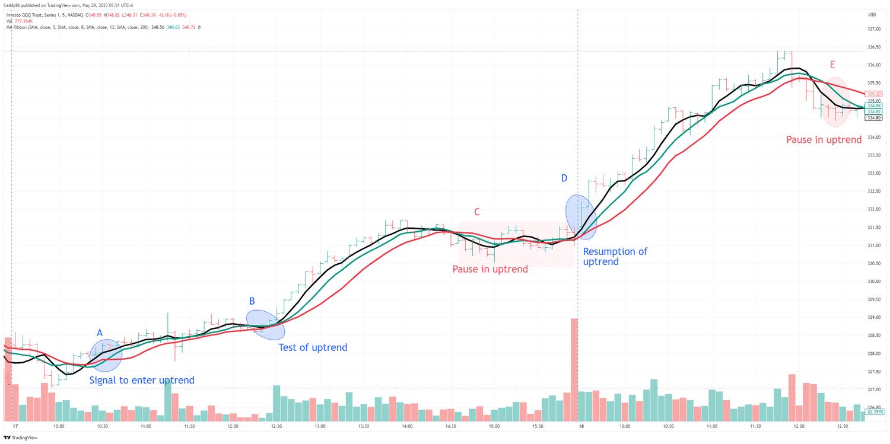

## Table of Contents

## What is a moving average and how is it used in day trading?

A moving average is a tool used in trading to smooth out price data over a specific period of time. It helps traders see the overall trend of a stock or other financial instrument by averaging out the price over that period. For example, a 10-day moving average would take the average closing price of the last 10 days. This makes it easier to spot trends because it reduces the impact of short-term price fluctuations.

In day trading, moving averages are used to make quick decisions about buying and selling. Traders often use short-term moving averages, like a 5-day or 10-day moving average, to get a sense of the immediate trend. If the price of a stock is above its moving average, it might be seen as a good time to buy because the trend is upward. Conversely, if the price is below the moving average, it might be a signal to sell because the trend is downward. By comparing different moving averages, traders can also look for crossovers, where a short-term moving average crosses above or below a longer-term one, to make trading decisions.

## How do simple moving averages (SMA) differ from exponential moving averages (EMA)?

Simple moving averages (SMA) and exponential moving averages (EMA) are both used to smooth out price data, but they do it in different ways. An SMA calculates the average price of a security over a specific number of periods. For example, a 10-day SMA adds up the closing prices of the last 10 days and then divides by 10. This means that each day's price has an equal impact on the average. SMAs are easy to calculate and understand, but they can be slow to respond to recent price changes because they give equal weight to all data points.

On the other hand, an EMA gives more weight to recent prices, making it more responsive to new information. To calculate an EMA, you start with an SMA and then apply a multiplier to give more importance to the most recent price. This multiplier is usually a fraction, like 2/(n+1) where n is the number of periods. Because EMAs react faster to price changes, traders often use them to get quicker signals about trend changes. However, this responsiveness can also lead to more false signals if the market is volatile.

In summary, the main difference between SMAs and EMAs is how they weigh the price data. SMAs are straightforward and give equal importance to all prices in the period, while EMAs focus more on recent prices, making them more sensitive to new trends. Depending on a trader's strategy and how quickly they need to react to market changes, they might choose one over the other.

## What are the most common time periods used for moving averages in day trading?

In day trading, the most common time periods for moving averages are short-term, usually between 5 to 20 periods. A 5-period moving average looks at the last 5 minutes, hours, or days depending on the chart time frame. Traders use these short periods to get quick signals about where the price is heading. For example, a 10-period moving average might show if the price is going up or down in the last 10 minutes, helping traders decide when to buy or sell.

Some traders also use medium-term moving averages, like 50 or 100 periods, but these are less common in day trading because they take longer to respond to price changes. A 50-period moving average might be used on a 1-minute chart to see the trend over a longer time frame within the trading day. These can help confirm the short-term signals or give a broader view of the market's direction.

Overall, the choice of time period depends on how quickly a trader wants to react to the market. Short-term moving averages are popular in day trading because they help make fast decisions, while medium-term averages can provide a bit more context but are used less frequently due to their slower response times.

## How can moving averages help identify trends in the market?

Moving averages help identify trends in the market by smoothing out the price data over time. When you look at a chart, the price can jump around a lot. A moving average takes the average price over a certain number of days or hours, making it easier to see if the price is generally going up or down. For example, if the price stays above the moving average, it might mean the market is in an uptrend. If it stays below, it could be a downtrend. This helps traders see the bigger picture instead of getting distracted by small price changes.

Traders also use moving averages to spot when a trend might be changing. They look for something called a "crossover." This happens when a shorter-term moving average, like a 10-day average, crosses above or below a longer-term one, like a 50-day average. If the short-term average goes above the long-term one, it might be a sign that an uptrend is starting. If it goes below, it could mean a downtrend is starting. By watching these crossovers, traders can make decisions about buying or selling based on the new trend direction.

## What is the crossover strategy and how is it applied using moving averages?

The crossover strategy is a way traders use moving averages to figure out when to buy or sell. They watch two moving averages: one that looks at the price over a shorter time, like 10 days, and one that looks at it over a longer time, like 50 days. When the short-term moving average crosses above the long-term one, it's called a "golden cross." Traders see this as a sign that the price might start going up, so it could be a good time to buy. On the other hand, when the short-term average crosses below the long-term one, it's called a "death cross." This might mean the price is going to go down, so it could be a good time to sell.

To use the crossover strategy, traders keep an eye on the chart where these moving averages are shown. They look for the moment when the lines cross each other. If they see a golden cross, they might buy the stock, hoping to sell it later at a higher price. If they see a death cross, they might sell the stock to avoid losing money as the price drops. This strategy helps traders make decisions based on clear signals from the moving averages, making it easier to spot trends and act on them quickly.

## How can moving averages be used to set stop-loss and take-profit levels?

Moving averages can help traders set stop-loss levels to protect their money. A stop-loss is a price where a trader decides to sell a stock to avoid losing too much money. When using moving averages, traders might set their stop-loss just below a key moving average. For example, if a trader is following an uptrend and using a 50-day moving average, they might set their stop-loss just below this line. If the price drops below the moving average, it could mean the trend is changing, and the stop-loss would trigger a sell to limit losses.

Moving averages can also help set take-profit levels, which is the price where a trader decides to sell a stock to make a profit. In an uptrend, traders might look to take profits when the price reaches a certain distance above the moving average. For instance, if a trader is using a 20-day moving average and the price is going up, they might decide to sell and take their profit when the price gets 5% above the moving average. This way, moving averages help traders know when to lock in their gains before the trend might reverse.

## What are the limitations and potential pitfalls of using moving averages in day trading?

Using moving averages in day trading can be tricky because they are not perfect. One big problem is that they can give false signals. This happens when the price moves above or below the moving average, but then quickly goes back the other way. Traders might buy or sell based on these signals, only to find out the trend didn't really change. This can lead to losses if they act too quickly on these false signals. Also, moving averages are based on past data, so they can be slow to react to what's happening in the market right now. This delay can make traders miss out on quick changes in the market, which is a big deal in day trading where things move fast.

Another issue is that moving averages can make traders too confident. They might think that just because the price is above or below a moving average, they know exactly what will happen next. But the market can be unpredictable, and moving averages don't account for big news or events that can suddenly change prices. Traders need to be careful not to rely too much on moving averages and should use other tools and information to make their decisions. By understanding these limitations, traders can use moving averages more wisely and avoid some of the common pitfalls in day trading.

## How can combining different types of moving averages improve trading strategies?

Combining different types of moving averages can help traders make better decisions. By using both simple moving averages (SMA) and exponential moving averages (EMA), traders can get a clearer picture of the market. SMAs are good for seeing the overall trend because they treat all prices the same. But they can be slow to react to new changes. EMAs, on the other hand, focus more on recent prices, so they can show new trends faster. When traders use both, they can see the big picture with the SMA and get quick signals from the EMA. This can help them decide when to buy or sell more confidently.

Another way to improve trading strategies is by using moving averages with different time periods. For example, a trader might use a short-term moving average like a 10-day average and a longer-term one like a 50-day average. When the short-term average crosses above the long-term one, it might be a good time to buy because it suggests the price is starting to go up. If the short-term average crosses below the long-term one, it might be a good time to sell because it suggests the price is starting to go down. By watching these crossovers, traders can catch trends early and make better trading decisions.

## What advanced techniques involve using multiple moving averages, such as the triple moving average strategy?

The triple moving average strategy is a way to use three moving averages at the same time to make trading decisions. Traders pick three different time periods for the moving averages, like a short-term one (maybe 5 days), a medium-term one (maybe 20 days), and a long-term one (maybe 50 days). When the short-term average crosses above both the medium and long-term averages, it's a strong sign that the price might start going up. This could be a good time to buy. On the other hand, if the short-term average crosses below both the medium and long-term averages, it's a strong sign that the price might start going down. This could be a good time to sell. By using three moving averages, traders can get more confident signals about when to buy or sell.

Another advanced technique is to use moving averages to create trading bands. Traders can plot two moving averages, one short-term and one long-term, and then add a third line that's a certain percentage above and below the short-term average. This creates a band around the price. When the price moves above the upper band, it might be overbought, which means it's a good time to sell. When the price moves below the lower band, it might be oversold, which means it's a good time to buy. This technique helps traders see when the price is moving too far away from the average and might be ready to come back to the middle. By using these bands, traders can make more informed decisions about when to enter or exit trades.

## How can moving averages be integrated with other technical indicators to enhance trading decisions?

Moving averages can be used with other technical indicators to make better trading choices. One common way is to use them with the Relative Strength Index (RSI). The RSI helps traders see if a stock is overbought or oversold. When the RSI is above 70, it might mean the price is too high and could drop soon. When it's below 30, it might mean the price is too low and could go up. Traders can use moving averages to confirm these signals. If the RSI shows a stock is overbought and the price is also below a key moving average, it might be a good time to sell. If the RSI shows a stock is oversold and the price is above a key moving average, it might be a good time to buy.

Another way to use moving averages with other indicators is with the Moving Average Convergence Divergence (MACD). The MACD helps traders see the strength and direction of a trend. It uses two lines: the MACD line and the signal line. When the MACD line crosses above the signal line, it might be a good time to buy because it suggests the trend is getting stronger. When it crosses below, it might be a good time to sell because the trend might be getting weaker. Traders can use moving averages to confirm these signals too. If the MACD shows a buy signal and the price is above a key moving average, it can make the buy signal stronger. If the MACD shows a sell signal and the price is below a key moving average, it can make the sell signal stronger. By combining moving averages with other indicators, traders can make more confident decisions.

## What role do moving averages play in algorithmic trading and automated systems?

Moving averages are important tools in algorithmic trading and automated systems. These systems use computers to make trading decisions based on rules set by traders. Moving averages help these systems see trends in the market by smoothing out the price data over time. For example, an algorithm might use a 50-day moving average to decide if a stock is in an uptrend or a downtrend. If the price stays above the moving average, the system might buy the stock, thinking it will keep going up. If the price stays below, the system might sell, thinking it will keep going down.

In automated systems, moving averages can also help set rules for when to buy or sell. Traders can program their systems to look for crossovers, where a short-term moving average crosses above or below a long-term one. For example, if a 10-day moving average crosses above a 50-day moving average, the system might see this as a signal to buy. If it crosses below, the system might see it as a signal to sell. By using moving averages, these systems can make quick decisions without needing a person to watch the market all the time. This makes trading faster and can help catch trends early.

## How can traders backtest and optimize moving average strategies to improve performance?

Traders can backtest moving average strategies by looking at past data to see how well the strategy would have worked. They use software that lets them apply their moving average rules to historical price data. For example, they might test a strategy that buys when a 10-day moving average crosses above a 50-day one and sells when it crosses below. By running this test on past data, traders can see how many times the strategy made money and how many times it lost money. This helps them understand if the strategy is good or if it needs changes.

To optimize moving average strategies, traders can try different time periods for the moving averages. They might start with a 10-day and a 50-day moving average but then test other combinations, like a 5-day and a 20-day or a 20-day and a 100-day. They can also adjust the rules for when to buy or sell, like waiting for the price to stay above or below the moving average for a few days before making a trade. By testing many different setups, traders can find the one that works best for their goals. This way, they can improve their chances of making money in the future.

## What is Understanding Moving Averages?

A moving average is a statistical calculation used to analyze data points by creating a series of averages of different subsets of the full dataset. In the context of financial markets, moving averages are commonly employed to soften fluctuations in price data and to help identify underlying trends. There are three main types of moving averages: simple, exponential, and weighted.

A simple moving average (SMA) is the arithmetic mean of a given set of prices over a specific time period. For example, a 10-day SMA calculates the average of the closing prices of the last 10 days. It is represented by the formula:

$$
\text{SMA} = \frac{P_1 + P_2 + \ldots + P_n}{n}
$$

where $P$ represents the price at each day and $n$ is the number of days. 

An exponential moving average (EMA) assigns greater weight to more recent prices, reducing the lag observed in SMAs. The EMA is calculated using the formula:

$$
\text{EMA}_t = \alpha \times P_t + (1 - \alpha) \times \text{EMA}_{t-1}
$$

where $\alpha$ is the smoothing constant, calculated as $\frac{2}{n+1}$, $P_t$ is the price at time $t$, and $\text{EMA}_{t-1}$ is the EMA of the previous period.

A weighted moving average (WMA) also considers all data points but assigns different weights to each, typically placing more significance on recent prices. The formula for WMA is:

$$
\text{WMA} = \frac{w_1P_1 + w_2P_2 + \ldots + w_nP_n}{w_1 + w_2 + \ldots + w_n}
$$

where $w_i$ is the weight assigned to each price point.

Moving averages are crucial for identifying trends in financial markets as they mitigate the effects of short-term [volatility](/wiki/volatility-trading-strategies) and noise. This smoothing property helps provide clearer signals for trend directions by filtering out random price spikes that may not indicate true market conditions. Traders often use them to infer potential buy or sell signals, with crossover strategies being a popular application. For instance, a common strategy is to purchase a security when a short-term moving average crosses above a long-term moving average, indicating a potential uptrend.

Visual examples of moving averages often depict price data with overlaying SMA, EMA, and WMA lines on a trading chart. These lines typically exhibit smoother curves compared to the raw price data, thus aiding traders in visualizing the direction of the trend.

Nonetheless, moving averages are not without pitfalls. They are lagging indicators, meaning they reflect past price action and may not predict future movements. This can lead to late entry or [exit](/wiki/exit-strategy) signals, especially in volatile markets. Furthermore, the choice of time period significantly impacts their effectiveness; too short a period may result in excessive sensitivity to price changes, while too long a period may render the average too sluggish to be reactive. Traders must adjust the parameters according to their specific market context and trading objectives to optimize their strategy.

In summary, moving averages are integral tools in evaluating and following market trends, providing a clearer view amidst price data fluctuations. Understanding their different types and the appropriate application is essential for accurate interpretation and effective trading strategy development.

## References & Further Reading

[1]: Bergstra, J., Bardenet, R., Bengio, Y., & Kégl, B. (2011). ["Algorithms for Hyper-Parameter Optimization."](https://papers.nips.cc/paper/4443-algorithms-for-hyper-parameter-optimization) Advances in Neural Information Processing Systems 24.

[2]: ["Advances in Financial Machine Learning"](https://www.amazon.com/Advances-Financial-Machine-Learning-Marcos/dp/1119482089) by Marcos Lopez de Prado

[3]: ["Evidence-Based Technical Analysis: Applying the Scientific Method and Statistical Inference to Trading Signals"](https://www.amazon.com/Evidence-Based-Technical-Analysis-Scientific-Statistical/dp/0470008741) by David Aronson

[4]: ["Machine Learning for Algorithmic Trading"](https://github.com/stefan-jansen/machine-learning-for-trading) by Stefan Jansen

[5]: ["Quantitative Trading: How to Build Your Own Algorithmic Trading Business"](https://www.amazon.com/Quantitative-Trading-Build-Algorithmic-Business/dp/1119800064) by Ernest P. Chan