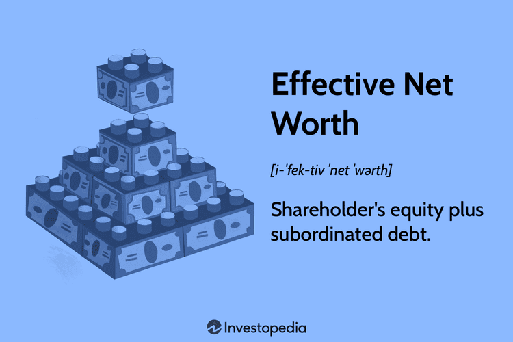

In today's complex financial landscape, understanding key concepts such as net worth and financial literacy is crucial. As financial markets evolve, individuals are increasingly aware of the importance of managing personal wealth efficiently. Net worth, which is calculated as the difference between total assets and total liabilities ([Net Worth = Assets - Liabilities](https://www.investopedia.com/terms/n/networth.asp)), serves as a snapshot of one's financial health. By consistently assessing this metric, individuals can better navigate their financial journeys.

The introduction of technology has significantly altered traditional financial practices, making advanced tools such as algorithmic trading more accessible to a wider audience. Algorithmic trading, or algo trading, employs computer algorithms to execute trades based on pre-determined criteria, offering speed and precision that manual trading cannot achieve. With these advancements, individuals have new avenues to potentially grow their wealth beyond conventional methods.



This article explores the relationship between net worth, financial literacy, and algo trading, and provides insights on effectively managing these areas. Financial literacy, the ability to understand and apply various financial skills, including personal financial management, budgeting, and investing, is a foundational element of economic stability and prosperity. Increasing one's financial literacy can lead to more informed and strategic financial decisions, ultimately impacting net worth positively.

Our goal is to provide readers with actionable strategies to enhance their financial literacy and improve their net worth. This involves understanding the interplay between technological tools, such as algorithmic trading, and traditional financial principles. By the end of this read, you'll have a clearer understanding of how modern financial tools and knowledge can contribute to financial success. As we move forward, balancing knowledge and technology will be key in achieving long-term financial stability and growth.

## Table of Contents

## Understanding Net Worth

Net worth is a key indicator of an individual's financial health, representing the difference between total assets and total liabilities. The formula for calculating net worth is straightforward:

$$
\text{Net Worth} = \text{Total Assets} - \text{Total Liabilities}
$$

### Understanding Assets and Liabilities

**Assets** are resources owned by an individual that have economic value. They can be categorized into various types:

- **Liquid Assets**: These are cash or assets that can be easily converted to cash, such as checking accounts, savings accounts, and money market funds.
- **Real Estate**: This includes the market value of owned property, such as a home or rental properties.
- **Investments**: Stocks, bonds, mutual funds, and retirement accounts are considered investments.
- **Personal Property**: High-value items such as vehicles, jewelry, and collectibles.

**Liabilities**, on the other hand, are obligations that deplete resources. They include:

- **Short-term Obligations**: Credit card debt and personal loans with terms shorter than one year.
- **Long-term Debt**: Mortgages, student loans, and car loans that extend beyond one year.

### Importance of Assessing Net Worth

Regular evaluation of net worth provides a clear picture of financial stability and progress towards financial goals. A positive net worth suggests financial health, as assets exceed liabilities. Conversely, a negative net worth indicates that liabilities surpass assets, signaling potential financial distress. Tracking net worth over time can reveal trends, motivating individuals to adjust their financial strategies.

### Strategies to Build Net Worth

1. **Increase Income**: Higher earnings can bolster net worth by allowing more resources for saving and investing.
2. **Manage Expenses**: Creating and adhering to a budget can help control spending and increase savings.
3. **Save Diligently**: Regular contributions to savings accounts and emergency funds add to liquid assets.
4. **Invest Wisely**: Allocating funds into diversified investment portfolios can enhance asset growth. Understanding market trends and investment vehicles is crucial for making informed decisions.
5. **Reduce Liabilities**: Paying off debt systematically, starting with high-interest liabilities, can significantly improve net worth over time.

### Practical Example

Here's a simple Python script to calculate net worth:

```python
# Sample data
assets = {
    "cash": 5000,
    "savings_account": 15000,
    "investment_account": 30000,
    "real_estate": 200000,
    "car": 15000
}

liabilities = {
    "credit_card_debt": 4000,
    "student_loan": 20000,
    "mortgage": 150000
}

# Calculate total assets and liabilities
total_assets = sum(assets.values())
total_liabilities = sum(liabilities.values())

# Calculate net worth
net_worth = total_assets - total_liabilities

print(f"Net Worth: ${net_worth}")
```

This approach enables individuals to input their own financial data and determine their net worth, providing a basis for evaluating financial decisions and strategies. 

Building net worth is a dynamic and ongoing process, requiring disciplined financial management and strategic planning. By understanding and monitoring net worth, individuals can work towards achieving greater financial security and wealth.

## The Role of Financial Literacy

Financial literacy serves as the cornerstone of effective financial decision-making, crucial for navigating today's complex financial environment. It entails a comprehensive understanding of key financial concepts such as budgeting, investing, and debt management, which are essential for maintaining and improving financial health.

Budgeting is a fundamental component of financial literacy that involves creating a plan to manage income and expenditure effectively. By allocating resources wisely, individuals can ensure their expenses do not exceed their income, thereby avoiding unnecessary debt accumulation. A well-crafted budget can also facilitate savings and investment, contributing to the enhancement of net worth over time.

Investing is another critical area where financial literacy plays a significant role. Understanding investment vehicles such as stocks, bonds, mutual funds, and real estate equips individuals to choose options aligned with their financial goals and risk tolerance. This knowledge enables them to optimize returns while managing risks, thereby increasing their wealth.

Debt management is an equally vital aspect of financial literacy. Grasping the intricacies of interest rates, loan terms, and credit scoring allows individuals to manage their debts efficiently. By minimizing high-interest debt and maintaining a healthy credit profile, individuals can preserve more of their income for savings and investment.

The impact of enhanced financial literacy on net worth is profound. Informed individuals can make strategic choices that help accumulate assets while minimizing liabilities. This approach leads to an improvement in financial stability and security. For example, knowing how to refinance a mortgage or consolidate high-interest debts can result in significant savings, directly affecting one's net worth positively.

Several resources can significantly aid in enhancing financial literacy. Educational materials, including [books](/wiki/algo-trading-books), online courses, and seminars, provide valuable knowledge on various financial topics. Workshops and webinars offer interactive learning experiences, while financial advisors deliver personalized guidance tailored to individual circumstances. These resources contribute to a deeper understanding of financial concepts and empower individuals to make prudent financial choices.

In conclusion, financial literacy is intrinsically linked to financial stability. An educated approach to personal finance enables individuals not only to manage their current financial obligations better but also to improve their net worth over time. By utilizing available resources and continuously expanding their financial knowledge, individuals can build a robust foundation for achieving their long-term financial goals.

## Algorithmic Trading: A Modern Tool for Wealth Growth

Algorithmic trading, often referred to as algo trading, is a method that utilizes computer algorithms to execute trades at optimal times based on pre-defined criteria such as timing, price, or quantity. These algorithms, devoid of human emotion, are designed to analyze market data and execute trades at high speeds, ensuring that trading opportunities are seized with precision. Algo trading thus offers clear advantages including increased speed, improved accuracy, and enhanced trading efficiency. According to research [1], [algorithmic trading](/wiki/algorithmic-trading) can process thousands of variables simultaneously, leading to more informed trading decisions compared to human traders.

Traditionally, algorithmic trading has been dominated by institutional investors such as hedge funds and banks due to the high technical and financial entry barriers. However, with the advent of technological advancements and the rise of fintech, individual investors now find these tools increasingly accessible. Platforms like MetaTrader and NinjaTrader allow individuals to use algorithmic strategies without requiring extensive coding knowledge, thereby democratizing the use of algo trading.

Despite its accessibility, understanding the inherent risks and opportunities of algo trading is critical. One notable risk is the potential for algorithmic errors, which can result in significant financial losses. For example, an incorrectly programmed algorithm might misinterpret market signals, leading to erroneous trades. Additionally, reliance on historical data to predict future market trends can be flawed, especially in unprecedented market conditions. It is, therefore, imperative for traders to comprehensively test their algorithms using past data and implement stop-loss orders to mitigate risks.

The opportunities presented by algo trading are substantial. One of its primary benefits is the ability to perform [backtesting](/wiki/backtesting)—using historical data to validate the effectiveness of a trading strategy. Moreover, algo trading can integrate various complex models like mean reversion, [momentum](/wiki/momentum) strategies, and [arbitrage](/wiki/arbitrage) opportunities, which require swift execution and aren't feasible manually. 

To integrate algorithmic trading into personal investment strategies, an individual can start by identifying specific financial goals and risk tolerance levels. The next step would involve selecting a trading platform that supports algorithmic execution and offers robust backtesting capabilities. Investors might then choose pre-built algorithms or develop custom strategies using languages such as Python. For example, Python libraries like NumPy and pandas offer tools for data manipulation and analysis, while libraries like TA-Lib provide technical analysis capabilities.

```python
import numpy as np
import talib

# Simple Moving Average strategy example
closing_prices = np.array([120, 121, 122, 125, 123, 126])

# Calculate a simple moving average
sma = talib.SMA(closing_prices, timeperiod=3)

print(sma)
```

In summary, by understanding and leveraging algorithmic trading, individual investors can enhance their trading processes, reduce human error, and potentially improve their financial outcomes through strategic and informed execution of trades.

---

[1] Liew, Jimmy, et al. "High-frequency trading and market performance." The Oxford Handbook of the Economics of Central Banking. 2019.

## Integrating Financial Literacy with Algo Trading

Integrating financial literacy with algorithmic trading can significantly enhance an individual's ability to make informed and strategic investment decisions. Financial literacy provides the foundational knowledge required to understand and evaluate various investment opportunities accurately. When investors possess a robust understanding of financial concepts, they are better positioned to comprehend the complexities and potential benefits of algorithmic trading systems.

Algorithmic trading, which relies on pre-defined parameters and computer programs to execute trades, offers numerous advantages, including increased speed and precision. However, these benefits can only be maximized by those who possess the requisite financial knowledge to interpret and apply the information generated by algorithmic systems.

Effective integration of financial literacy and algorithmic trading requires continuous learning and adaptation. The financial markets are dynamic, subject to frequent changes influenced by economic indicators, geopolitical events, and technological advancements. Investors need to stay informed about these changes to update their strategies and ensure their algorithmic trading systems are optimized for current market conditions. Continuous education can be facilitated through online courses, financial seminars, webinars, and accessing up-to-date financial news and analysis.

Building a robust foundation of financial knowledge involves understanding key concepts such as asset allocation, risk management, market analysis, and investment strategy formulation. Familiarity with statistical tools and programming languages like Python can also be advantageous. For example, Python libraries such as `pandas` and `numpy` are widely used for data analysis in finance. A simple Python snippet to calculate moving averages, a common component of trading algorithms, might look like this:

```python
import pandas as pd

# Sample data
data = {'prices': [100, 102, 104, 107, 110, 115]}
df = pd.DataFrame(data)

# Calculate moving average
df['moving_average'] = df['prices'].rolling(window=3).mean()
print(df)
```

Investors aiming to integrate financial literacy with algorithmic trading can also benefit from numerous online platforms that offer both educational resources and algo trading capabilities. Websites such as Investopedia provide valuable articles and tutorials, while platforms like QuantConnect and Alpaca offer environments to develop and test algorithmic trading strategies.

Finally, practical tips for merging financial literacy with algorithmic trading include setting clear investment goals, understanding your risk tolerance, starting with simple trading algorithms before progressing to more complex ones, and ensuring continuous monitoring and adjustment of trading strategies. By focusing on these aspects, individuals can effectively harness the power of algorithmic trading to make strategic, informed investment decisions, leading to potential wealth growth over time.

## Conclusion: Path to Effective Wealth Management

Effective wealth management is a holistic process that involves understanding net worth, enhancing financial literacy, and utilizing modern trading tools like algorithmic trading. By assembling these elements, individuals can significantly improve their financial security and grow their assets. 

Understanding net worth is fundamental. It is calculated as the difference between total assets and total liabilities. Regularly assessing this financial metric helps in making informed decisions and tracking financial health. Building a healthy net worth involves strategic income management, prudent spending, disciplined saving, and smart investments.

Enhancing financial literacy is equally important. It forms the foundation of successful financial decision-making, enabling individuals to competently handle budgeting, investing, and debt management. By engaging with educational resources, workshops, and financial advisors, individuals can build their financial knowledge, which directly correlates with improved financial stability.

The integration of modern trading tools such as algorithmic trading can accelerate wealth growth. These tools offer improved speed, accuracy, and efficiency in executing trades, previously accessible mainly to institutional investors, but now increasingly available to individual investors. Understanding the associated risks and opportunities is crucial for effectively leveraging these technological advancements in personal investment strategies.

To successfully integrate financial literacy with algorithmic trading, individuals must engage in continuous learning and adapt to market dynamics and technological changes. A robust foundation of financial knowledge is essential to maximize the benefits of these systems. 

Practical steps towards achieving effective wealth management include proactive financial education and exploring emerging technologies in investment. The balance of knowledge and technology is pivotal in achieving financial goals. With diligent effort, individuals can pave their way towards a prosperous future, characterized by financial security and literacy.

## References & Further Reading

[1]: Liew, Jimmy, et al. "High-frequency trading and market performance." In *The Oxford Handbook of the Economics of Central Banking* (2019).

[2]: ["Net Worth: What Is It and How to Calculate It."](https://www.investopedia.com/terms/n/networth.asp) Investopedia.

[3]: Lopez de Prado, Marcos. ["Advances in Financial Machine Learning."](https://www.amazon.com/Advances-Financial-Machine-Learning-Marcos/dp/1119482089) Wiley.

[4]: Chan, Ernest P. ["Quantitative Trading: How to Build Your Own Algorithmic Trading Business."](https://github.com/ftvision/quant_trading_echan_book) Wiley.

[5]: Aronson, David. ["Evidence-Based Technical Analysis: Applying the Scientific Method and Statistical Inference to Trading Signals."](https://www.amazon.com/Evidence-Based-Technical-Analysis-Scientific-Statistical/dp/0470008741) Wiley.

[6]: Jansen, Stefan. ["Machine Learning for Algorithmic Trading."](https://github.com/stefan-jansen/machine-learning-for-trading)

[7]: ["Algorithmic Trading."](https://en.wikipedia.org/wiki/Algorithmic_trading) Investopedia. 

[8]: ["Financial Literacy: What You Need to Know."](https://www.ramseysolutions.com/financial-literacy/what-is-financial-literacy) Investopedia.