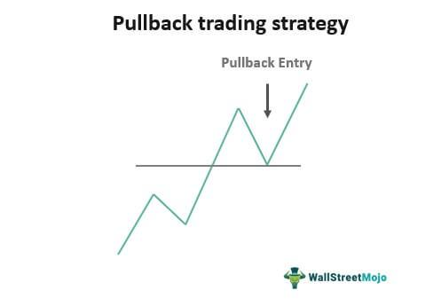

## Table of Contents

## What is pullback trading and why is it important for traders?

Pullback trading is a strategy where traders buy a stock or other financial asset after it has experienced a temporary drop in price, expecting it to rise again. This drop, or pullback, happens after the asset has been going up for a while. Traders see this as a chance to get into the market at a lower price before the upward trend continues. They look for signs that the pullback is over and the price will start going up again, like certain patterns on a chart or other signals.

This strategy is important for traders because it can help them make more money and manage risk better. By buying during a pullback, traders can enter the market at a lower price than if they had bought when the price was at its highest. This can lead to bigger profits if the price goes up as expected. Also, pullbacks give traders a chance to set better stop-loss orders, which are used to limit losses if the price doesn't go up as planned. Understanding and using pullbacks can make trading more successful and less risky.

## How can beginners identify potential pullbacks in the market?

Beginners can identify potential pullbacks by looking at price charts and watching for certain patterns. One common pattern is when the price of a stock or asset goes up for a while and then starts to drop a little bit. This drop should not be too big, usually just a small dip from the recent highs. If the price stays above important support levels, which are like price floors where the price often stops falling, it might be a good sign of a pullback. Beginners can also use simple tools like trend lines to see if the price is still following an overall upward trend, even during the dip.

Another way to spot pullbacks is by paying attention to what's happening in the market and any news that might affect the price. If there's no big bad news that would cause a long-term drop, and the price is just taking a short break from going up, it could be a pullback. Beginners should also watch trading [volume](/wiki/volume-trading-strategy), which is how many shares or assets are being bought and sold. If the volume is low during the price drop, it might mean that not many people are selling, and the price might go back up soon. By combining these simple observations, beginners can start to get a feel for when a pullback might be happening.

## What are the key indicators used to confirm a pullback?

To confirm a pullback, traders often look at moving averages. A moving average is a line on a chart that shows the average price of a stock over a certain period, like 50 days or 200 days. If the price drops but stays above these moving averages, it can be a sign that the pullback is just a small dip and the price might go back up soon. Another important indicator is the Relative Strength Index (RSI), which measures how fast the price is moving up or down. If the RSI shows that the stock is not overbought, meaning it's not too high, it can also confirm that the pullback is likely temporary.

Another key indicator is the volume of trades. If the volume is low during the price drop, it suggests that not many people are selling, and the price might recover quickly. On the other hand, if the volume is high, it might mean that more people are selling, and the pullback could be the start of a bigger drop. Lastly, chart patterns like the "bull flag" or "bear flag" can help confirm pullbacks. A bull flag pattern, for example, shows a small dip after a big rise, and it often signals that the price will continue going up after the pullback.

## How does one set up entry points during a pullback?

Setting up entry points during a pullback means deciding when to buy a stock after it has dropped a bit in price. You want to buy at a good price before the stock starts going up again. To do this, look at the price chart and see where the stock has been going up and then dipped. A good entry point is often just after the price starts to go back up from the dip. You can use a moving average, like the 50-day or 200-day line, as a guide. If the price stays above this line during the dip, it's a sign that the pullback might be over, and it's a good time to buy.

Another way to set up an entry point is by watching the trading volume. If the volume is low during the price drop, it means not many people are selling, and the price might go back up soon. So, a good entry point would be when you see the price starting to rise again with a bit more volume. Also, keep an eye on the Relative Strength Index (RSI). If the RSI is not too high, it can confirm that the pullback is just a small dip, and it's a safe time to enter the market. By combining these simple observations, you can find a good entry point during a pullback and hopefully buy the stock at a lower price before it goes up again.

## What risk management techniques should be applied in pullback trading?

When you're trading using pullbacks, it's really important to manage your risks so you don't lose too much money. One good way to do this is by setting stop-loss orders. A stop-loss order is like a safety net that tells your broker to sell the stock if the price drops to a certain level. This can help you limit your losses if the price doesn't go back up after the pullback. You should place your stop-loss just below the lowest point of the pullback, so if the price keeps going down, you won't lose too much.

Another technique is to not put all your money into one trade. This is called diversification. If you spread your money across different stocks or assets, you won't lose everything if one of them doesn't go up after a pullback. It's also smart to only risk a small part of your money on each trade, like 1% or 2% of your total trading money. This way, even if you're wrong about a pullback, you won't lose a big chunk of your money. By using these simple risk management techniques, you can trade pullbacks more safely and keep your losses small.

## Can you explain the common mistakes traders make during pullbacks and how to avoid them?

One common mistake traders make during pullbacks is jumping in too early. They see the price start to drop and think it's a good time to buy, but the price can keep falling more than they expected. To avoid this, traders should wait for signs that the price is starting to go back up, like seeing it move above a moving average or noticing a higher trading volume when the price starts to rise again. Waiting for these signs can help them enter the market at a better time.

Another mistake is not using stop-loss orders or setting them too far away from the current price. If the price keeps dropping after they buy, traders can lose a lot of money without a stop-loss to limit their losses. To avoid this, they should always set a stop-loss just below the lowest point of the pullback. This way, if the price doesn't go back up, they'll only lose a small amount. It's also important to stick to the stop-loss and not move it further away hoping the price will turn around.

Lastly, traders often get too excited and put too much money into one trade during a pullback. This can lead to big losses if the trade doesn't go their way. To avoid this, they should only risk a small part of their money on each trade, like 1% or 2%. By spreading their money across different trades and not betting too much on one, they can manage their risk better and protect their trading account from big losses.

## How do market trends influence the effectiveness of pullback trading strategies?

Market trends play a big role in how well pullback trading works. When the market is going up, or in an uptrend, pullbacks are often good times to buy because the price usually keeps going up after a small drop. Traders look for these pullbacks in an uptrend to get into the market at a lower price and make more money when the price goes back up. But if the market is going down, or in a downtrend, pullbacks might not be as good. The price might keep falling after a small rise, so buying during a pullback in a downtrend can lead to losses. So, it's important to know the overall trend of the market before using a pullback trading strategy.

Understanding the market trend also helps traders decide when to use other tools and indicators. In an uptrend, traders might use moving averages to see if the price is still above the trend line during a pullback, which can be a sign to buy. They might also watch the trading volume to make sure not too many people are selling during the dip. But in a downtrend, these same signs might not work as well. The price might drop below the moving average and keep falling, or the volume might be high during a small rise, showing that more people are selling. By paying attention to the market trend, traders can use pullback strategies more effectively and avoid big losses.

## What advanced technical analysis tools can enhance pullback trading?

To make pullback trading better, traders can use some advanced tools. One of these tools is the Fibonacci retracement. It helps traders see how far the price has dropped during a pullback. They draw lines on the chart to show where the price might stop falling and start going back up. If the price reaches one of these lines and then starts to rise again, it can be a good sign to buy. Another tool is the MACD, or Moving Average Convergence Divergence. This tool shows the strength of the price movement. If the MACD line crosses above the signal line during a pullback, it can mean the price is about to go up again, which is a good time to enter the market.

Another useful tool is the Bollinger Bands. These are lines drawn on the chart that show how much the price is moving around. When the price touches the lower band during a pullback and then starts to go up, it can be a sign that the pullback is over. Traders can also use the Ichimoku Cloud, which is a bit more complicated but can give a lot of information about the trend and where the price might go next. If the price stays above the cloud during a pullback, it's a sign that the overall trend is still up, and it might be a good time to buy. By using these advanced tools, traders can get a better idea of when to enter the market during a pullback and make more successful trades.

## How should traders adjust their pullback strategies across different time frames?

Traders need to change how they use pullback strategies depending on the time frame they are looking at. If you are trading on a short time frame, like a few minutes or hours, pullbacks can happen a lot. You need to be quick to spot these small dips and enter the market fast. You can use shorter moving averages, like a 20-period or 50-period, to see if the price is still going up overall. Also, you might want to set your stop-loss orders closer to the entry point because the price can move a lot in a short time.

On longer time frames, like daily or weekly charts, pullbacks are bigger and happen less often. You can take more time to decide when to buy because the price moves slower. Use longer moving averages, like a 200-period, to see if the price is still in an uptrend. You might also set your stop-loss orders a bit further away from the entry point because the price might take longer to go back up after a pullback. By adjusting your strategy to fit the time frame you are trading on, you can make better decisions and have more successful trades.

## What role does volume play in confirming pullbacks and how should it be analyzed?

Volume is really important when you're trying to figure out if a pullback is real or not. It's like looking at how many people are buying and selling a stock. If the price goes down a bit but not many people are selling, that's a good sign. It means the pullback might just be a small dip and the price could go back up soon. Traders look at the volume during the price drop. If it's low, it shows that not many people think the price will keep going down, so it's a good time to buy.

To analyze volume, traders watch it on the chart along with the price. They compare the volume during the pullback to the volume when the price was going up before. If the volume is lower during the dip, it's a sign that the pullback is just a temporary thing. But if the volume is high when the price drops, it might mean more people are selling, and the price could keep going down. By paying attention to volume, traders can make better choices about when to buy during a pullback and avoid big losses.

## How can traders use psychological analysis to improve their pullback trading?

Traders can use psychological analysis to improve their pullback trading by understanding their own emotions and the emotions of other traders in the market. When a stock's price drops a bit, it can make traders feel scared or worried that the price will keep going down. But if they can stay calm and remember that pullbacks are normal in an uptrend, they can see it as a chance to buy at a lower price. By not letting fear take over, traders can make better decisions and stick to their trading plan.

Another way psychological analysis helps is by understanding the behavior of other traders. When a lot of people start selling during a pullback, it can push the price down even more. But if traders can see that this selling might be driven by panic rather than a real change in the stock's value, they can wait for the panic to calm down and buy when the price starts to go back up. By using psychological analysis to keep their emotions in check and understand the market's mood, traders can make smarter moves during pullbacks and improve their trading success.

## What are some expert strategies for maximizing profits during pullbacks?

One expert strategy for maximizing profits during pullbacks is to use multiple time frames to confirm the trend. Traders can look at a longer time frame, like a daily chart, to see if the stock is in an overall uptrend. Then, they can switch to a shorter time frame, like an hourly chart, to find the right entry point during the pullback. By combining information from different time frames, traders can be more sure that the price will go back up after the dip, which can help them make more money.

Another strategy is to use advanced technical indicators like Fibonacci retracement levels to find the best entry points. When a stock's price drops during a pullback, traders can draw Fibonacci lines on the chart to see where the price might stop falling and start going up again. If the price reaches one of these levels and then starts to rise, it's a good sign to buy. By using these tools, traders can enter the market at a better price and increase their chances of making a bigger profit when the price goes back up.

## References & Further Reading

[1]: Bergstra, J., Bardenet, R., Bengio, Y., & Kégl, B. (2011). ["Algorithms for Hyper-Parameter Optimization."](https://dl.acm.org/doi/10.5555/2986459.2986743) Advances in Neural Information Processing Systems 24.

[2]: ["Advances in Financial Machine Learning"](https://www.amazon.com/Advances-Financial-Machine-Learning-Marcos/dp/1119482089) by Marcos Lopez de Prado

[3]: ["Evidence-Based Technical Analysis: Applying the Scientific Method and Statistical Inference to Trading Signals"](https://www.amazon.com/Evidence-Based-Technical-Analysis-Scientific-Statistical/dp/0470008741) by David Aronson

[4]: ["Machine Learning for Algorithmic Trading"](https://github.com/stefan-jansen/machine-learning-for-trading) by Stefan Jansen

[5]: ["Quantitative Trading: How to Build Your Own Algorithmic Trading Business"](https://www.amazon.com/Quantitative-Trading-Build-Algorithmic-Business/dp/1119800064) by Ernest P. Chan