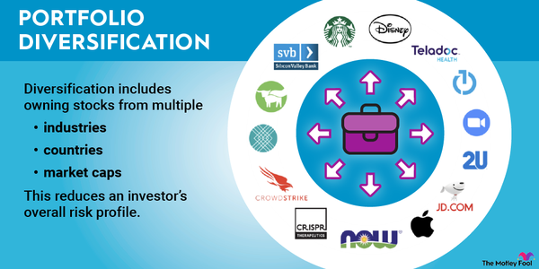

## Table of Contents

## What is portfolio diversification and why is it important?

Portfolio diversification is when you spread your investments across different types of assets, like stocks, bonds, and real estate. Instead of putting all your money in one place, you divide it among many different investments. This helps to reduce the risk because if one investment does poorly, the others might do well and balance it out.

It's important because it helps protect your money. Imagine if you had all your money in one company's stock and that company went bankrupt. You could lose everything. But if you have your money in many different places, the failure of one won't hurt as much. Diversification can lead to more stable returns over time and can help you sleep better at night knowing your investments are safer.

## How does diversification help in reducing risk?

Diversification helps in reducing risk by spreading your investments across different types of assets. When you put your money in many different places, like stocks, bonds, and real estate, you're not relying on just one thing to do well. If one of your investments goes down in value, the others might go up or stay the same, which can help balance out the losses. It's like not putting all your eggs in one basket.

This strategy reduces the impact of any single investment's poor performance on your overall portfolio. For example, if the stock market has a bad year, but your bonds and real estate investments do well, you won't lose as much money as if you had only invested in stocks. By diversifying, you're smoothing out the ups and downs of your investments, making it less likely that you'll lose a lot of money all at once. This can give you more peace of mind and help you stick to your investment plan over the long term.

## What are the different types of assets one can include in a diversified portfolio?

A diversified portfolio can include many different types of assets. Some common ones are stocks, which are shares in a company, and bonds, which are like loans you give to a company or government that they pay back with interest. Real estate is another big one, where you can invest in property like houses or buildings. You can also add commodities, which are things like gold, oil, or agricultural products that you can buy and sell.

There are also other types of assets you can include to diversify even more. Mutual funds and exchange-traded funds (ETFs) are collections of different investments put together, so when you buy one, you're actually investing in many things at once. Some people also invest in alternative assets like art, collectibles, or cryptocurrencies, which can be riskier but can add variety to your portfolio. By including a mix of these different assets, you can spread out your risk and potentially improve your overall returns.

## How should a beginner start diversifying their investment portfolio?

A beginner should start by learning about different types of investments like stocks, bonds, and real estate. They can begin with a small amount of money and invest in a few different assets. One easy way to start is by putting money into a mutual fund or an [ETF](/wiki/etf-trading-strategies), which are collections of different investments. This way, even with a small amount of money, a beginner can own a piece of many different assets and start diversifying their portfolio right away.

As they get more comfortable, beginners can add more types of investments to their portfolio. They might want to include some stocks of different companies, some bonds, and maybe even a bit of real estate through a real estate investment trust (REIT). It's important to keep learning and maybe talk to a financial advisor to make sure they're making good choices. Over time, as they gain more experience and their financial situation changes, they can adjust their investments to keep their portfolio diversified and aligned with their goals.

## What is the role of stocks, bonds, and commodities in portfolio diversification?

Stocks play a big role in portfolio diversification because they can grow a lot over time. When you buy stocks, you're buying a small piece of a company. If the company does well, the value of your stock can go up, and you might also get dividends, which are like little payments from the company. But stocks can be risky because their value can go up and down a lot. By having stocks from different companies and different industries, you spread out that risk. This way, if one company or industry does badly, the others might do well and balance it out.

Bonds are another important part of a diversified portfolio. When you buy a bond, you're lending money to a company or government, and they promise to pay you back with interest. Bonds are usually less risky than stocks because they give you regular interest payments and return your money at the end. They can help balance out the ups and downs of stocks in your portfolio. If the stock market goes down, your bonds might still be paying you interest, which can make you feel more secure.

Commodities like gold, oil, or agricultural products can also help diversify your portfolio. These are physical things you can buy and sell. Commodities often don't move in the same way as stocks and bonds, so they can add another layer of protection. For example, if the stock market crashes, gold might go up in value because people see it as a safe place to put their money. By including commodities, you're adding something different to your mix of investments, which can help protect you from big losses and give you a more stable portfolio overall.

## How can geographic diversification enhance a portfolio?

Geographic diversification means spreading your investments across different countries and regions. This can help make your portfolio stronger because different parts of the world can do well at different times. If the economy in one country is not doing well, another country might be doing better. By having investments in many places, you can balance out the ups and downs in your portfolio. It's like not putting all your eggs in one basket, but instead, spreading them out around the world.

This kind of diversification can also protect you from risks that affect only one country, like political changes or natural disasters. For example, if a big storm hits one country and hurts its economy, your investments in other countries might not be affected. By investing globally, you can take advantage of growth in different economies and reduce the chance that a problem in one place will hurt all your money. This can lead to a more stable and potentially more profitable portfolio over time.

## What are sector diversification strategies and how can they be implemented?

Sector diversification means spreading your investments across different parts of the economy, like technology, healthcare, or energy. Each part, or sector, can do well or badly at different times. By having investments in many sectors, you can balance out the risks. If one sector is not doing well, another sector might be doing better, which can help protect your money. This way, you're not relying on just one part of the economy to grow your investments.

You can implement sector diversification by buying stocks or funds that focus on different sectors. For example, you might buy some stocks in a tech company, some in a healthcare company, and some in an energy company. Another way is to invest in sector-specific ETFs or mutual funds. These funds collect money from many people and invest it in a whole group of companies within one sector. By doing this, you can own a piece of many different sectors with just a few investments. As you keep an eye on how each sector is doing, you can adjust your investments to make sure your portfolio stays balanced and diversified.

## How does one balance the trade-off between risk and return in a diversified portfolio?

Balancing the trade-off between risk and return in a diversified portfolio means finding the right mix of investments that can grow your money while keeping your risks in check. When you invest, you want your money to grow, but you also don't want to lose it all if things go wrong. Different investments have different levels of risk and return. Stocks can grow a lot but are riskier, while bonds are safer but usually don't grow as much. By spreading your money across these different types of investments, you can aim for a good return without taking on too much risk.

To find this balance, you need to think about your goals and how much risk you can handle. If you're young and can wait a long time for your money to grow, you might be okay with more risk and invest more in stocks. But if you need your money soon or don't like big ups and downs, you might want more bonds and safer investments. It's important to keep checking your portfolio and adjust it as your life changes. This way, you can keep your investments in line with what you want and how much risk you're willing to take.

## What advanced strategies can be used for portfolio diversification beyond traditional assets?

One advanced strategy for portfolio diversification beyond traditional assets is investing in alternative investments like hedge funds, private equity, and venture capital. These types of investments can offer higher returns but come with more risk and often require more money to start. Hedge funds use different strategies to make money, like betting on stocks going down as well as up. Private equity involves buying parts of private companies, and venture capital means investing in new, small companies that might grow a lot. By adding these to your portfolio, you can spread your risk and possibly earn more than with just stocks and bonds.

Another strategy is to invest in cryptocurrencies and digital assets. Cryptocurrencies like Bitcoin and Ethereum can add a new layer of diversification because they often move differently than stocks and bonds. They can be very risky and go up and down a lot, but some people believe they could be a big part of the future of money. You can also invest in other digital assets like non-fungible tokens (NFTs) or blockchain technology companies. These investments can help protect your portfolio from big losses in traditional markets and give you a chance to be part of new technology trends.

## How can one use correlation analysis to improve portfolio diversification?

Correlation analysis helps you understand how different investments move together. When you look at the correlation between investments, you're checking if they go up and down at the same time or if they move in opposite ways. If two investments have a high correlation, it means they usually move together. If they have a low or negative correlation, they move differently. By choosing investments that don't move the same way, you can make your portfolio more diversified and reduce your risk. For example, if stocks and bonds have a low correlation, when stocks go down, bonds might go up or stay the same, which can help balance your portfolio.

Using correlation analysis, you can pick a mix of investments that will help smooth out the ups and downs of your portfolio. You might find that adding some commodities or real estate to your mix of stocks and bonds can lower the overall risk because these assets often don't move the same way as stocks. By looking at historical data and seeing how different assets have moved in the past, you can make smarter choices about what to include in your portfolio. This way, you're not just guessing; you're using data to help you build a more stable and potentially more profitable investment strategy.

## What are the common pitfalls to avoid when diversifying a portfolio?

One common mistake people make when diversifying their portfolio is over-diversification. This happens when you spread your money too thin across too many investments. It can make it hard to keep track of everything and might not give you the best returns. Instead of focusing on a few good investments, you end up with a lot of small ones that don't really help your money grow. It's important to find a balance where you have enough variety to reduce risk but not so much that it becomes unmanageable.

Another pitfall is not understanding the risks of each investment. Just because you have different types of assets doesn't mean you're safe if you don't know how each one works. For example, if you put money into a risky sector or a volatile stock without knowing it, your portfolio might still be at risk. Always do your homework and understand what you're investing in. This way, you can make better choices and truly diversify your portfolio in a way that protects your money.

## How should an expert continuously monitor and adjust a diversified portfolio for optimal performance?

An expert should continuously monitor a diversified portfolio by regularly checking how each investment is doing. This means looking at the performance of stocks, bonds, commodities, and any other assets in the portfolio. They should also keep an eye on economic news, market trends, and any changes in the companies or sectors they've invested in. By staying informed, they can see if their investments are doing well or if there are any signs of trouble. It's also important to use tools like correlation analysis to understand how different parts of the portfolio are moving together and make sure they're still helping to reduce risk.

Adjusting a diversified portfolio for optimal performance involves making changes based on what the monitoring shows. If some investments are doing much better than others, the expert might want to rebalance the portfolio to keep it diversified. This could mean selling some of the winners and buying more of the underperformers to maintain the right mix. They should also consider their investment goals and risk tolerance, which might change over time. If the market or the economy shifts in a big way, the expert might need to make bigger changes to keep the portfolio on track. By staying proactive and making smart adjustments, they can help the portfolio perform as well as possible while managing risk.

## References & Further Reading

[1]: ["Advances in Financial Machine Learning"](https://www.amazon.com/Advances-Financial-Machine-Learning-Marcos/dp/1119482089) by Marcos Lopez de Prado

[2]: ["Machine Learning for Algorithmic Trading"](https://github.com/stefan-jansen/machine-learning-for-trading) by Stefan Jansen

[3]: ["Quantitative Trading: How to Build Your Own Algorithmic Trading Business"](https://books.google.com/books/about/Quantitative_Trading.html?id=j70yEAAAQBAJ) by Ernest P. Chan

[4]: ["Asset Allocation: Balancing Financial Risk"](https://www.amazon.com/Asset-Allocation-Balancing-Financial-Fifth/dp/0071804188) by Roger C. Gibson

[5]: Elton, E. J., Gruber, M. J., Brown, S. J., & Goetzmann, W. N. (2009). ["Modern Portfolio Theory and Investment Analysis, Ninth Edition"](https://books.google.com/books/about/Modern_Portfolio_Theory_and_Investment_A.html?id=181CEAAAQBAJ)