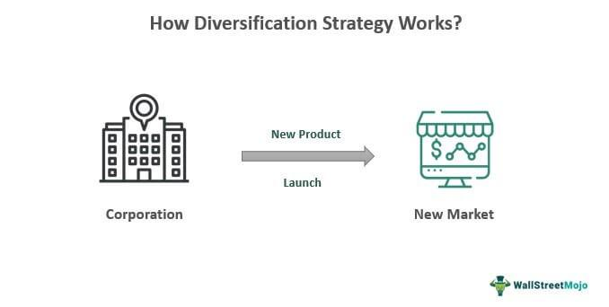

In today's rapidly evolving economic landscape, financial planning has become an essential aspect of managing personal and organizational wealth. The complexity and unpredictability of global markets necessitate robust financial strategies to safeguard assets and ensure growth. At the core of effective financial planning lies the development of well-structured investment strategies. These strategies are crucial in achieving financial goals, securing retirement funds, and navigating the ever-fluctuating economic environment.

Structured investment strategies are designed to optimize returns while managing risk, catering to individuals' unique financial objectives and risk appetites. They typically encompass a range of financial instruments, including stocks, bonds, and exchange-traded funds (ETFs), each offering distinct benefits and risk profiles. The thoughtful selection and combination of these instruments are fundamental to successful investment planning.



This article will explore key facets of modern financial strategies, including portfolio diversification, comprehensive financial planning, and the innovative technique of algorithmic trading. Portfolio diversification involves spreading investments across various asset classes, sectors, and geographies to minimize risk and maximize returns. This traditional approach remains a cornerstone of financial planning, proving particularly beneficial during periods of market volatility.

Financial planning also extends to setting clear financial goals, encompassing saving, investing, and insuring assets to ensure long-term security. The involvement of professional financial planners and fiduciary advisors often proves invaluable in crafting personalized strategies tailored to individual needs and goals.

Innovation and technology play transformative roles in contemporary financial strategies. Algorithmic trading, an advanced method differing substantially from traditional trading, harnesses the power of complex algorithms to conduct trades with high efficiency and minimal emotional bias. This approach leverages cutting-edge machine learning and artificial intelligence techniques, heralding a modern era of investment planning.

As we scrutinize these elements, it becomes clear how intrinsic the integration of technology and diversification is to crafting resilient financial strategies. These components not only enhance portfolio performance but also adapt to the continuously shifting economic milieu, ensuring robust financial health.

## Table of Contents

## Understanding Investment Strategies

Investment strategies are systematic plans devised to allocate resources within an investment portfolio to achieve specific financial objectives. These strategies play a critical role in financial planning as they guide individuals and institutions on how best to invest their capital to maximize returns while managing risk.

There are several types of investment strategies, each catering to different investor preferences and market conditions. Common strategies include investing in stocks, bonds, and exchange-traded funds (ETFs). Stocks represent ownership in a company and their value can be influenced by factors such as corporate performance and market conditions. Bonds, on the other hand, are debt securities that provide regular interest payments and return the principal at maturity, making them less volatile compared to stocks. ETFs offer a diversified portfolio in a single investment, combining characteristics of both stocks and mutual funds, and are traded on major exchanges.

Strategic investment decisions are largely influenced by individual financial goals and risk tolerance. Financial goals could range from saving for retirement to generating short-term income, and these objectives dictate the choice of investment strategy. Risk tolerance, which is the degree of variability in investment returns an investor is willing to withstand, is equally critical. For instance, a risk-averse individual may prefer bonds or dividend-paying stocks, while a risk-tolerant investor might opt for aggressive [growth stocks](/wiki/growth-stocks) or sector-specific ETFs.

Financial advisors and wealth managers play a vital role in crafting effective investment strategies. These professionals assess the financial circumstances and goals of their clients to recommend personalized investment plans. They provide expertise in identifying suitable asset classes, evaluating market trends, and adjusting portfolios to align with changing goals and market conditions. By leveraging their experience and knowledge, financial advisors help ensure that investment strategies are both robust and adaptable to the dynamic economic environment.

## The Importance of Portfolio Diversification

Portfolio diversification is a fundamental concept in investment management, crucial for mitigating risk and optimizing returns. At its core, diversification involves spreading investments across various financial instruments, industries, and geographical regions to reduce exposure to any single asset or risk. This principle is based on the adage "Don't put all your eggs in one basket." By diversifying, investors aim to enhance the stability of their portfolios, particularly during periods of market [volatility](/wiki/volatility-trading-strategies).

**Traditional Approaches to Diversification**

1. **Asset Class Diversification**: This approach involves allocating investments across different asset classes like equities, fixed income (bonds), cash, and real estate. Each asset class has its own risk and return characteristics. For instance, stocks generally offer higher potential returns but come with increased risk, while bonds typically provide lower returns with reduced risk. By balancing these, investors can align their portfolios with their risk tolerance and financial objectives.

2. **Sector Diversification**: Within an asset class, further diversification can be achieved by investing in multiple sectors or industries. Economic cycles affect industries differently; for example, consumer staples often perform well during downturns, while technology may lead during economic expansions. Sector diversification minimizes the impact of sector-specific downturns on the overall portfolio performance.

3. **Geographic Diversification**: Investing across various geographic regions or countries helps mitigate risks associated with economic or political instability in a single region. Emerging markets, for example, may offer robust growth opportunities but come with greater volatility. Diversifying geographically can reduce potential negative impacts from localized events.

**Benefits of a Diversified Portfolio During Market Volatility**

A well-diversified portfolio can cushion against unexpected market downturns. During periods of high volatility, asset classes often perform differently—some may lose value while others gain or remain stable. This balance helps in maintaining portfolio value and reducing losses. Historical data indicate that portfolios with diverse holdings typically experience less severe losses compared to non-diversified ones, maintaining more stable long-term growth trajectories.

**Advanced Diversification Techniques**

Beyond traditional methods, investors increasingly utilize advanced diversification strategies:

- **Alternative Investments**: These include assets like hedge funds, private equity, commodities, and real estate, which often have low correlations with traditional asset classes. Their inclusion can provide additional layers of risk mitigation and return potential.

- **Derivatives and Hedging**: Options and futures can be used to hedge against potential losses, providing a form of insurance for the portfolio.

- **Thematic and ESG Investments**: Selecting investments based on themes (like technological innovation) or environmental, social, and governance (ESG) criteria can also diversify portfolios while aligning with personal values and future trends.

In conclusion, diversification is a strategic tool necessary for risk management in investment portfolios. Its effectiveness in reducing risk and enhancing returns is supported by various historical and empirical studies, making it a cornerstone of prudent financial planning. As financial markets continue to evolve, understanding and implementing diversification strategies will remain a key aspect of sound investment practice.

## Financial Planning for a Secure Future

Comprehensive financial planning encompasses several key elements, including saving, investing, and insurance, to ensure long-term financial security. This process involves analyzing an individual’s current financial status and setting actionable steps to achieve specific future goals. Effective financial planning often begins with establishing clear financial objectives, such as building an emergency fund, purchasing a home, funding education, or ensuring a comfortable retirement.

The significance of setting financial goals cannot be overstated, as they provide the framework for making informed decisions about saving and investing. Retirement planning is particularly critical, given increasing life expectancies and the uncertainties surrounding government pension systems. It typically involves estimating future income needs and developing investment strategies to achieve these needs over time.

Several tools and resources are available to assist in financial planning. Budgeting applications like Mint or You Need A Budget (YNAB) help individuals track their spending and savings patterns. Online platforms such as Vanguard and Fidelity offer calculators for estimating retirement savings goals, while robo-advisors like Betterment or Wealthfront provide automated, low-cost investment management services.

Professional financial planners and fiduciary advisors play a crucial role in crafting tailored financial strategies. These professionals offer expert advice, taking into account an individual’s unique financial situation, risk tolerance, and goals. As fiduciaries, they are legally obligated to act in their client’s best interest, providing a valuable safeguard against conflicts of interest that might arise in the financial industry.

In conclusion, comprehensive financial planning is essential for a secure financial future, with saving, investing, and insurance forming its core pillars. By setting realistic financial goals and utilizing available tools and resources, individuals can effectively manage their financial journeys. Engaging with professional advisors can further enhance this process, ensuring informed decision-making and adherence to best practices.

## Algorithmic Trading: A Modern Approach

Algorithmic trading, also known as algo-trading or automated trading, involves using computer algorithms to execute trades based on predefined criteria. Unlike traditional trading, which relies heavily on human intuition and manual analysis, [algorithmic trading](/wiki/algorithmic-trading) utilizes software to analyze data, make decisions, and execute trades at speeds much faster than a human can manage. This technological approach reduces human error and the emotional biases often associated with investment decisions.

One of the primary advantages of algorithmic trading is its efficiency. Algorithms can process vast amounts of data in real-time, quickly identifying trading opportunities and executing trades at optimal prices. This efficiency is particularly beneficial in high-frequency trading, where the speed of execution is crucial. Additionally, algorithmic trading minimizes emotional bias. Human traders are subject to psychological influences such as fear and greed, which can lead to irrational decision-making. By contrast, algorithms operate based on logic and data-driven criteria, leading to more consistent and disciplined trading strategies.

Several common algorithmic trading strategies illustrate how these systems function. Trend-following strategies capitalize on market trends by purchasing assets in a rising trend and selling in a falling trend. These strategies rely on indicators such as moving averages to determine the best entry and [exit](/wiki/exit-strategy) points. Mean reversion strategies, on the other hand, assume that asset prices will revert to their historical mean over time. Here, algorithms identify deviations from average prices and execute trades expecting a return to normalcy.

Algorithmic trading has further evolved with the integration of [machine learning](/wiki/machine-learning) (ML) and [artificial intelligence](/wiki/ai-artificial-intelligence) (AI). These technologies enhance the capability of trading algorithms by enabling them to learn from historical data, recognize complex patterns, and adapt to changing market conditions. For instance, a machine learning model could be trained to predict asset price movements by analyzing patterns in historical price data. Incorporating AI, algorithms become capable of self-improvement, refining their decision-making processes without explicit human intervention.

A simple example of a trend-following algorithm using Python might involve setting a strategy based on moving averages:

```python
import pandas as pd

# Example DataFrame with historical price data
data = pd.DataFrame({'Price': [100, 102, 105, 107, 110, 108, 107]})

# Calculate moving averages
data['Short_MA'] = data['Price'].rolling(window=2).mean()
data['Long_MA'] = data['Price'].rolling(window=3).mean()

# Signal when short moving average crosses above long moving average
data['Signal'] = 0
data.loc[data['Short_MA'] > data['Long_MA'], 'Signal'] = 1
data['Position'] = data['Signal'].diff()

print(data)
```

The code indicates buy positions when the short moving average crosses above the long moving average. In real-world applications, much more sophisticated algorithms are deployed, factoring in numerous indicators and utilizing advanced models powered by AI and ML.

Overall, the integration of algorithmic trading into financial markets represents a shift towards more automated, efficient, and potentially more profitable trading methodologies. As technology continues to advance, so too will the capabilities and prevalence of algorithmic strategies within the financial sector.

## Integrating Diversification and Algo-Trading in Financial Planning

The integration of algorithmic trading into a diversified portfolio offers an enhanced approach to maximize investment performance. Algorithmic trading, employing pre-programmed instructions for automated trading, can optimize trade executions, reduce emotional biases, and seize short-lived market opportunities—traits that are essential when managing a diversified portfolio.

### Enhancing Performance Through Algo-Trading

A diversified portfolio comprises various assets that aim to reduce risk through diversification across asset classes, sectors, or geographies. When algorithmic trading is incorporated, it can provide additional value by swiftly executing trades based on quantitative models, thus capturing gains from market inefficiencies. For example, algorithmic strategies such as statistical [arbitrage](/wiki/arbitrage) can exploit temporary mispricings between securities, contributing to higher portfolio returns.

### Backtesting and Continuous Adaptation

The reliability of algorithmic trading systems hinges on rigorous [backtesting](/wiki/backtesting), which involves evaluating a trading strategy using historical data to ascertain its potential profitability. Backtesting ensures that the algorithms are robust under various market conditions. Strategies should consistently be monitored and adapted based on performance metrics and changing market environments. This continuous adaptation is crucial because financial markets are dynamic and subject to regulatory changes, economic shifts, and unexpected events.

### Potential Risks and Mitigation

While algorithmic trading offers many advantages, it also introduces risks such as model overfitting, where a strategy performs well on historical data but poorly in live markets. Market disruptions or "flash crashes," often exacerbated by algorithmic trades, exemplify these risks. Proper financial planning can mitigate such risks by implementing robust risk management protocols, like stop-loss orders, and continuously updating algorithms to reflect current market realities. Employing a balanced approach that combines human oversight with automated systems can further minimize unintended consequences.

### The Role of Technology in Future Investment Strategies

Technological advancements are reshaping investment strategies, offering tools that enhance efficiency and accuracy. Machine learning and artificial intelligence (AI) play pivotal roles in developing sophisticated trading algorithms capable of analyzing vast datasets to uncover patterns and predict market movements. These technologies enable real-time analysis and decision-making, further supporting the integration of algorithmic trading within diversified portfolios.

The future of financial planning will likely involve increasingly sophisticated AI-driven models that provide personalized investment strategies, adapting not only to market changes but also to individual investor profiles and preferences. Financial professionals must stay informed about technological advancements to leverage these tools effectively and ensure the robustness of investment strategies.

In summary, algorithmic trading, when combined with portfolio diversification, has the potential to enhance overall performance by optimizing trade execution and leveraging market opportunities. Continual strategy refinement and adherence to sound financial planning principles remain vital to addressing the inherent risks and harnessing the potential of these advanced trading methodologies.

## Conclusion

In today’s complex economic environment, the integration of diversified investment strategies with cutting-edge technology emerges as a vital component of sound financial planning. The key points discussed in this article have underscored the necessity of combining traditional investment wisdom with modern technological advancements to achieve optimal financial outcomes. Portfolio diversification remains a cornerstone in risk management, ensuring that investments are spread across various asset classes, sectors, and geographies to withstand market fluctuations effectively. Simultaneously, the advent of algorithmic trading, with its ability to enhance efficiency and eliminate emotional biases, has revolutionized the way trading is conducted, providing investors with powerful tools to capitalize on market opportunities.

As individuals embark on their financial journey, the importance of seeking professional guidance cannot be overstated. Financial planners and fiduciary advisors play a crucial role in crafting personalized strategies that align with one's financial goals and risk tolerance. Moreover, ongoing education is essential to remain informed about the evolving landscape of financial strategies and technological tools. By staying informed, investors can make informed decisions and adapt to changes in the economic environment.

Looking ahead, the future of investing is poised for significant transformation, driven by continuous innovations in technology and finance. Machine learning and artificial intelligence are set to further enhance trading algorithms, making them more sophisticated and responsive to dynamic market conditions. This confluence of technology and investment strategies promises a more secure financial future, empowering investors to navigate uncertainties with confidence and precision. By embracing these advancements and integrating them into well-rounded financial plans, individuals can look forward to achieving their long-term financial objectives and securing their financial well-being.

## References & Further Reading

[1]: ["Advances in Financial Machine Learning"](https://www.amazon.com/Advances-Financial-Machine-Learning-Marcos/dp/1119482089) by Marcos Lopez de Prado

[2]: ["Machine Learning for Algorithmic Trading"](https://github.com/stefan-jansen/machine-learning-for-trading) by Stefan Jansen

[3]: ["Quantitative Trading: How to Build Your Own Algorithmic Trading Business"](https://books.google.com/books/about/Quantitative_Trading.html?id=j70yEAAAQBAJ) by Ernest P. Chan

[4]: ["Asset Allocation: Balancing Financial Risk"](https://www.amazon.com/Asset-Allocation-Balancing-Financial-Fifth/dp/0071804188) by Roger C. Gibson

[5]: Elton, E. J., Gruber, M. J., Brown, S. J., & Goetzmann, W. N. (2009). ["Modern Portfolio Theory and Investment Analysis, Ninth Edition"](https://books.google.com/books/about/Modern_Portfolio_Theory_and_Investment_A.html?id=181CEAAAQBAJ)