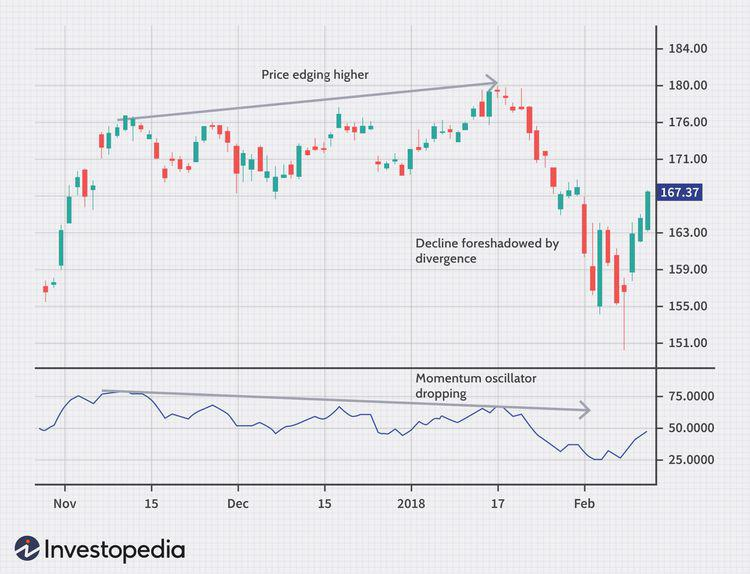

## Table of Contents

## What is swing trading and how does it differ from other trading styles?

Swing trading is a style of trading where you hold onto stocks or other investments for a short time, usually a few days to a couple of weeks. The goal is to make money from the ups and downs in the price of the investment. Swing traders look for patterns in the price movements and try to buy low and sell high within this short period. It's different from day trading, where you buy and sell within the same day, and it's also different from long-term investing, where you might hold onto an investment for months or years.

Swing trading is often seen as a middle ground between day trading and long-term investing. It requires less time and attention than day trading, which can be very intense and stressful because you need to watch the market all day. But it's more active than long-term investing, where you might check your investments once a month or even less often. Swing traders use technical analysis, which means they look at charts and patterns to make their decisions, rather than focusing on the overall health and future of the company like long-term investors might. This makes swing trading a good choice for people who want to be more involved than long-term investors but don't want the high pressure of day trading.

## What are candlesticks and why are they important in swing trading?

Candlesticks are a type of chart used in trading to show how the price of something, like a stock, changes over time. Each candlestick represents a certain period, like a day or an hour, and shows four important prices: the opening price, the closing price, the highest price, and the lowest price during that time. The body of the candlestick is a rectangle that shows the opening and closing prices. If the closing price is higher than the opening price, the body is usually colored white or green. If it's lower, the body is usually colored black or red. The lines, or wicks, above and below the body show the highest and lowest prices during that period.

Candlesticks are important in swing trading because they help traders see patterns in price movements. These patterns can tell traders when it might be a good time to buy or sell. For example, a pattern called a "hammer" might show that the price is about to go up, which could be a good time to buy. By looking at candlestick charts, swing traders can make better decisions about when to enter and exit trades. This can help them make more money and avoid big losses. So, understanding candlesticks is a key part of being a successful swing trader.

## How can beginners identify basic candlestick patterns for swing trading?

For beginners, identifying basic candlestick patterns for swing trading starts with understanding the most common ones. One of the simplest patterns to spot is the "Doji." A Doji looks like a cross or plus sign and happens when the opening and closing prices are very close to each other. This pattern can show that the market is unsure about which way the price will go next. Another easy pattern is the "Hammer," which has a small body at the top and a long wick below it. This usually means the price might start going up soon, so it could be a good time to buy.

Another useful pattern is the "Shooting Star," which is the opposite of the Hammer. It has a small body at the bottom and a long wick above it, suggesting that the price might start going down. This could be a signal to sell. The "Engulfing" pattern is also important. It happens when one candlestick completely covers the body of the previous one. If a bullish (green or white) candlestick engulfs a bearish (red or black) one, it might mean the price will go up. If a bearish candlestick engulfs a bullish one, it might mean the price will go down.

To get better at spotting these patterns, beginners should practice looking at candlestick charts and trying to find these shapes. It can be helpful to use a trading platform that lets you draw on the charts to mark the patterns. Over time, you'll get better at seeing these patterns quickly and using them to make smart trading decisions. Remember, no pattern is a sure thing, but they can help you make more informed choices in swing trading.

## What are oscillators and how do they assist in swing trading?

Oscillators are tools that traders use to understand if a stock's price is too high or too low. They show this by moving between two set points, usually 0 and 100. When the oscillator gets close to the top number, it might mean the price is too high and could go down soon. When it's near the bottom, it might mean the price is too low and could go up. This helps swing traders decide when to buy or sell.

In swing trading, oscillators are useful because they help spot when a stock's price might change direction. For example, a common oscillator is the Relative Strength Index (RSI). If the RSI goes above 70, it might mean the stock is overbought and could drop soon. If it goes below 30, it might mean the stock is oversold and could rise. By watching these signals, swing traders can make better choices about when to enter and exit trades, helping them make more money and avoid big losses.

## Which popular oscillators should swing traders use and why?

Swing traders often use the Relative Strength Index (RSI) because it's easy to understand and helps spot when a stock might be overbought or oversold. The RSI moves between 0 and 100. If it goes above 70, it might mean the stock's price is too high and could go down soon. If it drops below 30, it might mean the price is too low and could go up. This helps swing traders decide when to buy or sell, making it a popular choice.

Another useful oscillator is the Moving Average Convergence Divergence (MACD). The MACD shows the relationship between two moving averages of a stock's price. It helps traders see if the stock's price trend is getting stronger or weaker. When the MACD line crosses above the signal line, it might be a good time to buy because the price could go up. When it crosses below, it might be a good time to sell because the price could go down. Many swing traders use the MACD because it gives clear signals about when to make trades.

## How can one combine candlestick patterns with oscillators for better trading decisions?

Combining candlestick patterns with oscillators can help swing traders make better decisions. Candlestick patterns show what the price is doing right now and can signal when it might change direction. For example, if you see a Hammer pattern, it might mean the price is about to go up. Oscillators like the RSI or MACD give more information about whether the price is too high or too low. If the RSI is below 30 and you see a Hammer, it's a strong sign that the price might go up soon. This combination helps traders feel more confident about when to buy or sell.

Using both tools together can also help traders avoid making bad trades. For example, if you see a Shooting Star pattern, it might mean the price is about to go down. But if the RSI is not above 70, the price might not be too high yet. So, waiting for the RSI to confirm the Shooting Star can help you make a better decision. By looking at both candlestick patterns and oscillators, swing traders can get a fuller picture of what the market is doing and make smarter trades.

## What are some common entry and exit strategies using candlesticks and oscillators?

One common entry strategy is to look for a bullish candlestick pattern like a Hammer or a Bullish Engulfing pattern, and then check if the RSI is below 30. If you see both, it's a good sign that the price might go up soon. So, you can buy the stock at that time. For example, if you see a Hammer and the RSI is at 25, it might be a good time to enter the trade. This way, you're using both the candlestick pattern and the oscillator to make a more confident decision.

For exit strategies, you can look for bearish candlestick patterns like a Shooting Star or a Bearish Engulfing pattern, and then check if the RSI is above 70. If you see both, it's a good sign that the price might go down soon. So, you can sell the stock at that time. For example, if you see a Shooting Star and the RSI is at 75, it might be a good time to exit the trade. Using both tools together helps you avoid selling too early or too late, making your trades more successful.

## How can risk management be improved using these technical analysis tools?

Using candlestick patterns and oscillators can help you manage risk better when you trade. These tools give you more information about when to buy or sell. For example, if you see a Hammer pattern and the RSI is below 30, it might be a good time to buy because the price could go up. But if you only see one of these signals, you might wait and not risk your money until you see both. This way, you're making safer choices and not jumping into trades too quickly.

Another way these tools help with risk management is by telling you when it's time to get out of a trade. If you see a Shooting Star and the RSI is above 70, it might be a good time to sell because the price could go down. By waiting for both signals, you're less likely to hold onto a stock too long and lose money. Using candlestick patterns and oscillators together helps you make smarter decisions and protect your money better.

## What are advanced candlestick patterns and how can they enhance swing trading strategies?

Advanced candlestick patterns are more complex than basic ones and can give swing traders more detailed information about what the market might do next. Patterns like the "Morning Star" and "Evening Star" are examples of these. A Morning Star is a three-candle pattern that shows the price might go up soon. It starts with a long red candle, followed by a small candle that can be red or green, and ends with a long green candle. An Evening Star is the opposite and shows the price might go down. It starts with a long green candle, followed by a small candle, and ends with a long red candle. By recognizing these patterns, swing traders can make better guesses about when to buy or sell.

Using these advanced patterns can help swing traders improve their strategies because they give more signals about price movements. For example, if you see a Morning Star and the RSI is below 30, it's a strong sign that the price might go up soon. This can make you more confident about entering a trade. On the other hand, if you see an Evening Star and the RSI is above 70, it's a strong sign that the price might go down, so you might want to sell. By combining these advanced patterns with other tools like oscillators, swing traders can make smarter decisions and manage their risks better.

## How do market conditions affect the effectiveness of candlestick and oscillator-based strategies?

Market conditions can really change how well candlestick and oscillator-based strategies work. When the market is moving a lot, like during big news events or economic changes, these tools can be very helpful. Candlestick patterns can show you when the price might change direction quickly, and oscillators like the RSI can tell you if the price is too high or too low. In a fast-moving market, these signals can help you make quick decisions and catch big price swings. But, if the market is very choppy and hard to predict, you might see a lot of false signals. That means the patterns and oscillators might trick you into thinking the price will go one way when it goes the other.

In a calm market, where prices don't move much, candlestick and oscillator-based strategies might not work as well. The patterns and signals might not be as clear, and you might wait a long time for a good chance to trade. In these conditions, you might need to be more patient and look for other signs to help you decide when to buy or sell. No matter what the market is doing, it's always a good idea to use these tools along with other ways to understand the market, like looking at the news or what other people are saying about the stock. This can help you make better choices and manage your risks, no matter what the market is like.

## Can you explain the psychological aspects of trading with candlesticks and oscillators?

Trading with candlesticks and oscillators can mess with your mind a bit. These tools show you patterns and signals that can make you feel excited or worried about your trades. For example, if you see a Hammer pattern and the RSI is low, you might feel really sure about buying a stock. But if the market doesn't move the way you expect, you might start to doubt yourself and feel stressed. It's important to remember that no tool is perfect, and the market can be unpredictable. So, it's good to stay calm and not let your feelings make you do things you might regret later.

Another thing to think about is how these tools can make you see patterns that aren't really there. Sometimes, you might really want to see a certain pattern because you're hoping for a big win. This can trick you into thinking you see a Morning Star or an Evening Star when it's not really clear. It's easy to get caught up in the excitement of trading and start seeing what you want to see instead of what's really there. To do better, try to stay patient and don't rush into trades just because you think you see a pattern. Take a step back, look at the bigger picture, and make sure you're making choices based on what the tools are really showing you, not just what you hope they're showing you.

## What are the latest research findings or innovations in using candlesticks and oscillators for swing trading?

Recent research in swing trading has looked at new ways to use candlesticks and oscillators to make better trading decisions. One study found that combining candlestick patterns with machine learning can help predict price movements more accurately. By teaching a computer to recognize patterns and also look at other data like volume and news, traders can get more reliable signals. Another finding is that using multiple oscillators together, like the RSI and MACD, can give a fuller picture of the market. This helps traders see when the market might be overbought or oversold and when it's a good time to buy or sell.

Innovations in technology have also made it easier for traders to use candlesticks and oscillators. New trading platforms now have tools that automatically spot candlestick patterns and show oscillator values in real-time. This means traders can see important signals quickly and don't have to spend a lot of time looking at charts. Some platforms even use artificial intelligence to give personalized advice based on these tools, helping traders make smarter choices. These advancements make it easier for both new and experienced traders to use candlesticks and oscillators effectively in their swing trading strategies.

## What is the Role of Trading Oscillators?

Oscillators are crucial tools in technical analysis, designed to gauge the [momentum](/wiki/momentum) of price movements within a market. By measuring the speed and change of stock price movements, oscillators help traders identify potential overbought or oversold conditions. This can flag potential price reversals or the continuation of a trend.

Two of the most widely used oscillators in swing trading are the Relative Strength Index (RSI) and the Moving Average Convergence Divergence (MACD). 

The RSI is a momentum oscillator that measures the magnitude of recent price changes to evaluate overbought or oversold conditions. It is calculated using the formula:

$$
\text{RSI} = 100 - \left( \frac{100}{1 + \text{RS}} \right)
$$

where RS (Relative Strength) is the average gain of up periods during the specified time frame divided by the average loss of down periods. Generally, an RSI above 70 indicates overbought conditions, suggesting a possible reversal or pullback, while an RSI below 30 indicates oversold conditions, hinting at a potential upward reversal.

The MACD, another popular oscillator, is composed of two moving averages that help signal changes in momentum: the MACD line and the signal line. The MACD line is the difference between the 12-day and the 26-day exponential moving averages (EMA), whereas the signal line is typically a 9-day EMA of the MACD line. The MACD can generate signals through crossovers, overbought/oversold conditions, and divergences. A typical MACD crossover strategy might involve looking for buy signals when the MACD line crosses above the signal line and sell signals when the MACD line crosses below the signal line.

Oscillators can significantly enhance trading strategies when used in conjunction with candlestick patterns. For instance, if a candlestick pattern suggests a potential reversal, confirming this with a supportive oscillator signal, such as RSI indicating oversold conditions, can increase the confidence in the trade setup.

Incorporating oscillators into swing trading strategies allows traders to add an additional layer of analysis, helping to confirm potential entry and [exit](/wiki/exit-strategy) points. By signaling the underlying momentum of price movements, they provide valuable context that enhances the predictive power of technical analysis tools.

## How can Risk Management and Strategy Optimization be effectively implemented?

Effective swing trading requires a disciplined approach to risk management and strategy optimization. Market [volatility](/wiki/volatility-trading-strategies) presents inherent risks, and traders must employ systematic methods to safeguard their investments.

Using stop-loss orders is a fundamental risk management practice. A stop-loss order automatically sells a security when its price falls to a predetermined level, limiting potential losses. For instance, if a trader buys a stock at $100 and sets a stop-loss at $95, the maximum potential loss is restricted to $5 per share. This method ensures traders are not overly exposed to adverse market movements. 

Position sizing is another crucial tool, determining the number of units to trade based on account size, risk tolerance, and the stop-loss distance. The formula often used for position sizing is:

$$

\text{Position Size} = \frac{\text{Account Risk}}{\text{Trade Risk}}
$$

where $\text{Account Risk}$ is the maximum amount a trader is willing to lose on a trade, and $\text{Trade Risk}$ is the difference between the order entry price and the stop-loss price per unit. By calculating position sizes in this manner, traders can maintain consistent risk levels across trades.

Regularly reviewing and optimizing algorithms is equally vital for enduring trading success. Algorithmic trading systems must adapt to changing market conditions. Such reviews involve [backtesting](/wiki/backtesting) algorithms against historical data, adjusting parameters, and testing performance across various market scenarios. Continuously learning about market patterns is integral to understanding how external factors influence market behavior. This knowledge enables traders to refine their strategies and algorithms, ensuring they remain effective over time.

Incorporating these strategies into swing trading not only mitigates risk but also enhances the likelihood of achieving consistent returns. Traders are advised to create a robust risk management plan, regularly update their trading algorithms, and stay informed about market dynamics. This comprehensive approach to strategy optimization helps navigate the complexities of financial markets and supports long-term trading success.

## References & Further Reading

[1]: Bergstra, J., Bardenet, R., Bengio, Y., & Kégl, B. (2011). ["Algorithms for Hyper-Parameter Optimization."](https://papers.nips.cc/paper/4443-algorithms-for-hyper-parameter-optimization) Advances in Neural Information Processing Systems 24.

[2]: ["Advances in Financial Machine Learning"](https://www.amazon.com/Advances-Financial-Machine-Learning-Marcos/dp/1119482089) by Marcos Lopez de Prado

[3]: ["Evidence-Based Technical Analysis: Applying the Scientific Method and Statistical Inference to Trading Signals"](https://www.amazon.com/Evidence-Based-Technical-Analysis-Scientific-Statistical/dp/0470008741) by David Aronson

[4]: ["Machine Learning for Algorithmic Trading"](https://github.com/stefan-jansen/machine-learning-for-trading) by Stefan Jansen

[5]: ["Quantitative Trading: How to Build Your Own Algorithmic Trading Business"](https://www.amazon.com/Quantitative-Trading-Build-Algorithmic-Business/dp/1119800064) by Ernest P. Chan