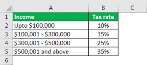

This article explores how tax rates, tax policy, calculation methodologies, and algorithmic trading intersect and influence financial decision-making. Understanding these concepts is crucial for traders, businesses, and fintech companies aiming to optimize tax liabilities and profitability. Tax systems differ globally, affecting trading strategies, which necessitates a nuanced appreciation of both domestic and international tax policies. As the digital economy grows, international tax rules have become more complex, emphasizing the need for comprehensive knowledge in these areas. Tax optimization strategies will be covered, targeting individual investors and corporate entities to aid in efficient financial planning and increased profitability.

## Table of Contents



## Understanding Tax Rates and Tax Policy

Tax rates play a pivotal role in financial planning, significantly impacting both personal and corporate decision-making processes. They inform how much income individuals can retain after taxes and how much capital companies have available for reinvestment. The primary types of tax rates include marginal, average, and effective tax rates, each affecting financial activities in unique ways.

**Marginal Tax Rate**: This is the rate at which the last dollar of income is taxed. It increases as income rises, often applied within progressive tax systems. For example, in a progressive tax system like that of the United States, individuals may pay 10% on their first $10,000 of income, but the marginal rate might increase to 24% on income over $80,000. The marginal tax rate is crucial for individuals and corporations in assessing the tax impact of additional income.

**Average Tax Rate**: This is calculated as the total tax paid divided by total income. It represents the percentage of total income paid in taxes and offers a broad view of the tax burden. For instance, if an individual earns $100,000 and pays $20,000 in taxes, their average tax rate is 20%.

**Effective Tax Rate**: This rate provides a more comprehensive understanding of an entity's tax burden. For individuals, it is calculated by dividing total taxes paid by taxable income. For corporations, it's the total taxes paid divided by earnings before taxes (EBT). This rate is particularly useful for comparing taxation levels among different entities or individuals, as it considers deductions, credits, and differing sources of income.

In addition to understanding tax rates, tax policy critically shapes the tax structures that govern economic systems. Tax policy comprises various categories like income tax, capital gains tax, and corporate tax, each with distinct implications. 

**Income Tax**: Levied on individual earnings, income tax is the most common form of taxation. It can be progressive, where the rate increases with income, or flat, where the rate is constant regardless of income level.

**Capital Gains Tax**: This tax applies to the profit realized on the sale of non-inventory assets such as stocks, bonds, or real estate. The rate may differ based on whether gains are short-term or long-term, impacting investment strategies.

**Corporate Tax**: Corporations are taxed on their profits. This tax affects business decisions, influencing aspects like reinvestment, dividend distribution, and pricing strategies.

Understanding the basics of tax rates and policy is indispensable for traders and investors. It aids in the efficient management of tax liabilities, allowing for informed decisions that can optimize net income. Knowledge of these aspects is also vital for strategic planning, where tax-efficient investments and operations can significantly enhance profitability. External references such as government publications and financial textbooks provide further insights into these concepts, aiding deeper comprehension and application in various economic contexts.

## Calculation of Effective Tax Rates

The effective tax rate serves as a pertinent metric that offers a more realistic picture of an entity’s or individual's tax burden compared to marginal tax rates. To calculate the effective tax rate, one would divide the total tax paid by taxable income for individuals or earnings before taxes (EBT) for corporations. This calculation can be expressed through the following formulas:

For Individuals:
$$
\text{Effective Tax Rate (ETR)} = \frac{\text{Total Tax Paid}}{\text{Taxable Income}}
$$

For Corporations:
$$
\text{Effective Tax Rate (ETR)} = \frac{\text{Total Tax Paid}}{\text{Earnings Before Taxes (EBT)}}
$$

The significance of the effective tax rate lies in its ability to reflect the proportion of income or earnings that is actually paid in taxes, providing a clearer insight into the tax burden beyond what marginal or advertised tax rates might suggest. Unlike marginal tax rates, which apply only to the income in the highest tax bracket, the effective tax rate considers all the taxable income, making it particularly useful for financial analysis and comparison.

For instance, two corporations with different taxable incomes but similar total tax paid might have very different effective tax rates, offering insights into discrepancies in their tax liabilities and potential tax planning strategies. Similarly, for individual taxpayers, understanding their effective tax rate can aid in better budgeting and financial planning by highlighting the actual percentage of income that goes towards taxes.

In practice, effective tax rates can vary widely across different entities due to factors such as tax credits, deductions, and differing income compositions, making them an essential metric for comparing taxation levels. This measure assists analysts and policymakers in evaluating the fairness and efficiency of tax systems and in making informed decisions regarding fiscal policies and personal or corporate finance management.

## Impact of Tax Rates on Algorithmic Trading

Algorithmic trading, a method of executing orders using pre-programmed instructions accounting for variables such as time, price, and [volume](/wiki/volume-trading-strategy), can be significantly influenced by tax rates. Successful [algorithmic trading](/wiki/algorithmic-trading) strategies typically depend on thin margins and [high frequency](/wiki/high-frequency-trading) transactions, making them sensitive to even small changes in tax liabilities. 

The introduction of transaction taxes, such as a financial transaction tax (FTT), can potentially alter the dynamics of algorithmic trading. These taxes are levied on specific financial transactions, such as the purchase of stocks, bonds, or derivatives, and are generally calculated as a percentage of the transaction value. For example, an FTT imposing a 0.1% tax on each stock trade could result in substantial additional costs for high-frequency trading ([HFT](/wiki/high-frequency-trading-strategies)) strategies that rely on executing thousands of trades daily. This tax could force traders to rethink their strategy as the cumulative tax burden could erode profit margins significantly.

Algorithmic traders must consider the effective tax rate when optimizing their strategies. The effective tax rate is defined as total taxes paid divided by total taxable income, providing a more comprehensive view of the tax burden than nominal rates. Optimizing for tax efficiency might involve altering holding periods to benefit from different capital gains tax rates. For instance, in many jurisdictions, long-term capital gains taxes are lower than short-term rates, incentivizing holding positions longer to maximize after-tax returns.

Additionally, algorithmic traders must be adaptable to changes in tax legislation and compliance requirements. Tax codes and regulations are subject to change, and staying informed is crucial for maintaining compliance and optimizing profitability. Automated systems in algorithmic trading can incorporate updates to tax rates and regulations, allowing for rapid adjustment to trading algorithms. This adaptability ensures that tax considerations are seamlessly integrated into trading decisions, potentially through automated recalibration.

To illustrate the impact of tax rate changes, consider a basic Python script modeling the effect of a hypothetical transaction tax on a trading strategy:

```python
def transaction_cost(price, shares, tax_rate):
    """
    Calculate total transaction cost including a transaction tax.

    :param price: Price per share
    :param shares: Number of shares
    :param tax_rate: Transaction tax rate (as a decimal)
    :return: Total transaction cost
    """
    gross_cost = price * shares
    tax = gross_cost * tax_rate
    return gross_cost + tax

# Example usage
price = 100  # price per share
shares = 1000  # quantity of shares
tax_rate = 0.001  # 0.1% transaction tax

total_cost = transaction_cost(price, shares, tax_rate)
print(f"Total transaction cost with tax: ${total_cost}")
```

By programming these calculations into their trading systems, traders can quantify potential costs associated with various tax rates and adjust their strategies accordingly.

In conclusion, effective taxation strategy is essential for algorithmic traders seeking to maximize profitability. Awareness of transaction taxes and effective tax rates, along with the agile adoption of new tax laws and regulations, positions traders to make informed decisions that preserve their competitive edge in a tax-implicated trading environment.

## Global Tax Rate Comparisons and Their Implications

Different regions adopt tax systems that significantly shape international trading and investment strategies. The tax landscape plays a crucial role in guiding decisions made by traders, fintech companies, and investors aiming to optimize their global operations. 

One prominent variation in tax systems is seen in the comparison between progressive and flat tax regimes. The United States employs a progressive tax system, where tax rates increase with higher income brackets. This approach aims to ensure equitable tax contributions relative to individual earnings. On the other hand, several Asian countries, like Hong Kong and Singapore, favor a flatter tax structure with lower rates, offering a simpler framework that may attract foreign investments and businesses due to lower overall tax burdens.

The progressive tax system affects investors and businesses operating in the U.S., influencing their decision-making and financial planning. For instance, high-income individuals or corporations might face elevated tax liabilities, prompting a reassessment of investment locations. Conversely, countries with flat tax systems might become appealing to entities seeking to minimize tax expenses, thereby attracting foreign direct investment (FDI).

In Europe, tax variations also play a pivotal role in shaping economic activities. Countries with relatively high corporate tax rates, such as France and Germany, contrast with those like Ireland, which offers competitive low corporate tax rates to lure multinational corporations. This disparity provides significant competitive advantages or disadvantages depending on a company's operational strategy and location preferences.

Understanding these global tax rate differences is imperative for traders and fintech companies. Successful international operations depend on comprehensively analyzing tax implications, ensuring compliance, and strategically structuring activities to benefit from favorable tax conditions. Companies may consider establishing headquarters or subsidiaries in jurisdictions with more beneficial tax regimes to enhance profitability and shareholder value.

Additionally, global tax trends are influenced by ongoing reforms, such as efforts to standardize corporate tax rates and combat tax avoidance through initiatives like the Organisation for Economic Co-operation and Development's (OECD) Base Erosion and Profit Shifting (BEPS) project. These initiatives aim to establish a fair tax environment, minimizing the impact of jurisdictional rate discrepancies and ensuring multinational corporations contribute appropriately to all markets they operate in.

For fintech companies particularly, staying informed about these tax dynamics and potential reforms is crucial for maintaining a competitive edge. Adjusting to international tax variations enables them to optimize cost structures, strategically expand operations, and sustain compliance with an evolving regulatory landscape.

## Tax Optimization Strategies for Traders

Traders employ various tax optimization strategies to minimize their tax liabilities and maximize profits. One effective method is tax-loss harvesting, which involves selling securities at a loss to offset capital gains and reduce taxable income. This strategy not only mitigates current tax burdens but can also be strategically timed to benefit from future tax planning.

Investing in tax-deferred accounts, such as Individual Retirement Accounts (IRAs) or 401(k) plans, provides another avenue for traders to defer tax liabilities. Contributions to these accounts are often tax-deductible, and the investments grow tax-free until withdrawals begin, usually at retirement. This postponement allows traders to benefit from compounding gains over time.

International tax planning is crucial for traders operating in global markets. Selecting jurisdictions with favorable tax regimes can significantly enhance profitability. Countries like Singapore and Ireland offer competitive corporate tax rates and incentives for financial activities, making them attractive locations for fintech companies and traders. It’s essential for traders to understand the tax treaties between countries to avoid double taxation and capitalize on any available credits and exemptions.

To effectively implement these strategies, traders must maintain accurate records of transactions and remain informed about changes in tax laws. This proactive approach ensures compliance and optimizes tax liabilities, ultimately improving financial outcomes.

## The Future of Tax Rates in the Digital Era

As the digital economy continues to expand, the evolution of tax policies is inevitable. Digital taxation is an emerging policy area designed to address the complexities introduced by digital transactions and the cross-border nature of the digital economy. Governments worldwide are developing mechanisms to tax digital services, recognizing that existing tax frameworks are often insufficient to account for digital transactions that transcend conventional geographical and jurisdictional boundaries.

The Organization for Economic Cooperation and Development (OECD) and the Group of Twenty (G20) have been instrumental in shaping international tax norms around digital services. The OECD's Base Erosion and Profit Shifting (BEPS) project and its digital taxation initiatives aim to ensure that digital giants contribute fairly across all markets they operate in. These initiatives propose profit allocation rules that take into account the significant economic presence of digital companies in various jurisdictions, despite the lack of a traditional physical presence.

In addition to digital taxation, the growing focus on sustainability has led to the introduction and expansion of environmental taxes, including carbon taxes. These taxes are designed to mitigate the environmental impact by incentivizing lower emissions and promoting cleaner technologies. As countries strive to meet climate targets, these taxes are anticipated to become more widespread and impactful across industries. Fintech companies, along with other sectors, must anticipate the economic implications of these environmental duties on their operational costs and supply chains.

Adapting to these evolving tax landscapes requires vigilance. Traders and companies operating within the digital sector must remain cognizant of policy changes that could affect their business models and compliance requirements. The ability to forecast tax liabilities and incorporate them into financial strategies will be critical for maintaining competitive advantage. Companies can benefit from investing in tax-technology solutions that enhance their agility in managing these changes, ensuring that they are well-positioned to navigate the expanding digital and environmental tax terrain efficiently and compliantly. 

Ultimately, the capacity to stay ahead of tax trends—through strategic planning, investment in technology, and awareness of global policy developments—will be paramount for fintech firms and traders aiming to optimize their operations and sustain profitability in the digital era.

## Conclusion

Navigating tax rates, policies, and their impacts on trading involves considerable complexity, yet it remains a vital aspect for ensuring financial health. Investors and companies must continuously update and integrate tax considerations into their strategic planning. This dynamic requires an understanding of diverse global tax systems, effective tax rate calculation, and their direct influence on trading strategies.

One principal aspect is the need for comprehensive knowledge of how varying tax rates and policies can affect decisions in algorithmic trading and investment. Staying informed on these details allows traders to anticipate changes, adjust strategies to minimize tax liabilities, and capitalize on any favorable conditions. By doing so, entities not only improve their profitability but also ensure compliance with regulatory frameworks.

Tax optimization strategies play a critical role, offering methods like tax-loss harvesting and investment in tax-deferred accounts. These strategies allow the deferral of tax liabilities and alignment with jurisdictional advantages, thus maximizing profit potentials. Python and other programming languages can be effectively utilized to automate these processes, from calculating effective tax rates to implementing algorithmic trading strategies that account for transaction taxes.

As the digital economy continues to expand, the advent of digital taxation policies and emerging environmental taxes, like carbon taxes, necessitates agile adaptation. Monitoring these trends and adjusting strategies accordingly will be crucial for sustained success. Therefore, maintaining tax efficiency is not only about reducing the tax burden but also ensuring strategic compliance in an evolving fiscal landscape. Companies and individual investors alike must recognize the importance of this proactive approach to secure a solid financial foundation and drive long-term growth.

## References & Further Reading

[1]: ["OECD's Base Erosion and Profit Shifting (BEPS) Project"](https://www.oecd.org/en/topics/base-erosion-and-profit-shifting-beps.html), Organisation for Economic Co-operation and Development (OECD).

[2]: ["International Corporate Tax Rate Comparisons"](https://sgp.fas.org/crs/misc/R41743.pdf), Tax Foundation.

[3]: ["Capital Gains Taxation and Economic Growth"](https://www.atr.org/sites/default/files/assets/ATR%20Memo%20-%20Capital%20Gains%20Taxation%20and%20Economic%20Growth.pdf), National Bureau of Economic Research.

[4]: ["Algorithmic Trading: Strategies for Managing Transaction Costs"](https://blog.quantinsti.com/algorithmic-trading/), Financial Analysts Journal.

[5]: ["Tax Policy and Economic Development"](https://journals.sagepub.com/doi/10.1177/08912424211022832), Brookings Institution.

[6]: ["The Role of Taxation in the Development of European Monetary Union"](https://www.europarl.europa.eu/factsheets/en/sheet/79/history-of-economic-and-monetary-union), Oxford Review of Economic Policy.

[7]: ["Effective Tax Rates: An International Comparison"](https://www.taxpolicycenter.org/briefing-book/how-do-us-taxes-compare-internationally), Social Science Research Network (SSRN).