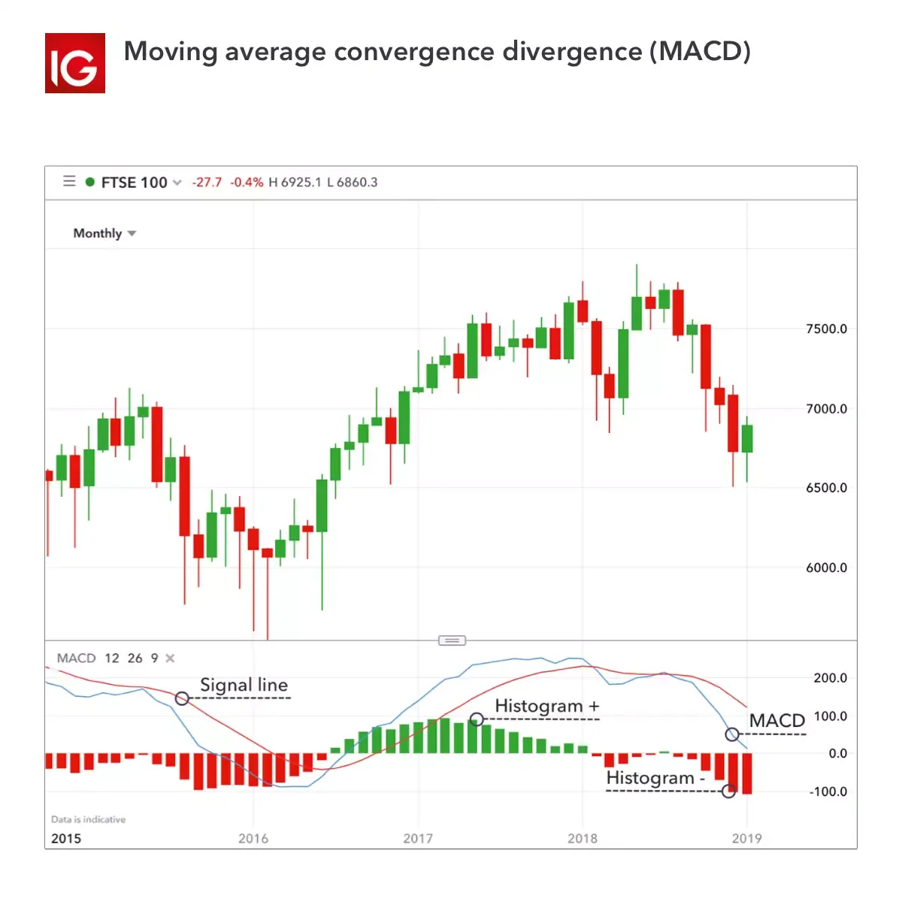

## Table of Contents

## What are trading indicators and why are they important for traders?

Trading indicators are tools that traders use to help them make decisions about buying and selling stocks, currencies, or other financial assets. These indicators analyze market data, like price and volume, to give traders insights into market trends and possible future movements. There are many different types of indicators, and they can be based on mathematical calculations or simple observations of market behavior.

Indicators are important for traders because they help reduce the guesswork in trading. By using indicators, traders can spot trends, find good times to enter or exit trades, and manage their risks better. This can lead to more informed decisions and potentially more successful trades. While no indicator can predict the market perfectly, they can provide valuable information that helps traders make smarter choices.

## How do beginners identify the most common trading indicators?

Beginners can start by learning about some of the most common trading indicators, like moving averages, the Relative Strength Index (RSI), and the Moving Average Convergence Divergence (MACD). Moving averages smooth out price data to show trends over time. They are easy to spot on charts because they look like lines that follow the price. The RSI measures how fast and how much a price has changed, helping traders see if a stock might be overbought or oversold. The MACD shows the relationship between two moving averages and can signal when to buy or sell.

To identify these indicators, beginners should look at trading charts, which are available on many online platforms. On these charts, moving averages will appear as lines that can be set to different time periods, like 50-day or 200-day. The RSI will usually be shown as a line that moves between 0 and 100. If it's above 70, it might mean the asset is overbought, and if it's below 30, it might be oversold. The MACD will show up as two lines and a histogram. When the MACD line crosses above the signal line, it can be a buy signal, and when it crosses below, it can be a sell signal. By getting familiar with these visual cues, beginners can start using indicators to guide their trading decisions.

## What is the difference between leading and lagging indicators?

Leading indicators are tools that try to predict what the market will do next. They look at things like how fast prices are changing or how many people are buying and selling. These indicators can give traders early signals about where the market might be headed. For example, the Relative Strength Index (RSI) can show if a stock is getting too expensive or too cheap before it actually happens. But, because they are trying to predict the future, leading indicators can sometimes be wrong.

Lagging indicators, on the other hand, tell you what the market has already done. They are based on past data and help confirm trends that have already started. A common lagging indicator is a moving average, which shows the average price of a stock over a certain time. It's useful for seeing if a trend is strong and likely to continue. While lagging indicators don't help predict the future, they are very reliable for understanding what has happened and can help traders make decisions based on solid evidence.

## How can traders effectively use moving averages in their trading strategy?

Traders can use moving averages to understand the overall direction of a market. A moving average is a line on a chart that shows the average price of a stock over a certain period of time, like 50 days or 200 days. When the price of a stock stays above its moving average, it can mean the stock is in an uptrend and might keep going up. If the price stays below the moving average, it could mean the stock is in a downtrend and might keep going down. By looking at where the price is compared to the moving average, traders can decide when to buy or sell. For example, if the price goes above a moving average that was below it before, it might be a good time to buy because it could mean the start of an uptrend.

Moving averages can also be used to find the best times to enter or exit trades. Traders often look at two moving averages with different time periods, like a 50-day and a 200-day moving average. When the shorter-term moving average (like the 50-day) crosses above the longer-term moving average (like the 200-day), it's called a "golden cross," and it can be a strong signal to buy. On the other hand, when the shorter-term moving average crosses below the longer-term moving average, it's called a "death cross," and it can be a signal to sell. By using these signals, traders can try to catch the beginning of big trends and avoid holding onto stocks that are about to go down.

## What are the key considerations when using the Relative Strength Index (RSI)?

When using the Relative Strength Index (RSI), it's important to understand that it measures how fast and how much a stock's price has changed. The RSI is shown as a line that moves between 0 and 100. If the RSI goes above 70, it might mean the stock is overbought and could go down soon. If it goes below 30, it might mean the stock is oversold and could go up soon. But, these numbers are not always perfect signals. Sometimes, the RSI can stay above 70 or below 30 for a long time if the stock is in a strong trend. So, traders need to be careful and not rely only on these numbers.

Another key thing to consider is that the RSI can help spot when a stock's price might change direction. If the RSI makes a higher high while the stock's price makes a lower high, it's called a bearish divergence. This can be a warning that the stock's price might start to go down. On the other hand, if the RSI makes a lower low while the stock's price makes a higher low, it's called a bullish divergence. This can be a sign that the stock's price might start to go up. By looking at these patterns, traders can get clues about what might happen next with the stock's price. But, like all indicators, the RSI is not always right, so it's best to use it along with other tools and information.

## How does the Moving Average Convergence Divergence (MACD) indicator work, and how can it be applied?

The Moving Average Convergence Divergence (MACD) is a tool that helps traders see when a stock's price might be ready to change direction. It uses two moving averages: a fast one and a slow one. The fast moving average is usually 12 days, and the slow one is 24 days. The difference between these two averages is called the MACD line. There's also another line called the signal line, which is usually a 9-day moving average of the MACD line. When the MACD line crosses above the signal line, it can be a sign to buy because it might mean the stock's price is starting to go up. When the MACD line crosses below the signal line, it can be a sign to sell because it might mean the stock's price is starting to go down.

Traders can use the MACD in a few different ways. One way is to look for when the MACD line crosses the signal line. If the MACD line goes from below to above the signal line, it's a bullish signal, which means it might be a good time to buy. If it goes from above to below the signal line, it's a bearish signal, which means it might be a good time to sell. Another way to use the MACD is to look at the histogram, which shows the difference between the MACD line and the signal line. If the histogram bars start to get bigger, it means the difference between the two lines is growing, which can show that the trend is getting stronger. If the bars start to get smaller, it means the difference is shrinking, which can show that the trend might be getting weaker. By watching these signals, traders can make better decisions about when to buy or sell stocks.

## What are Bollinger Bands and how can they enhance trading decisions?

Bollinger Bands are a tool traders use to understand how much a stock's price is moving around. They look like three lines on a chart: a middle line, which is a moving average, and two outer lines, called bands. The bands are usually set two standard deviations away from the middle line. This means they stretch out when the stock's price is bouncing around a lot and come closer together when the price is staying pretty steady. By watching how the price moves in relation to these bands, traders can get a sense of whether the stock might be ready to change direction or keep going the way it's going.

Traders can use Bollinger Bands to make better decisions about buying and selling stocks. When the price touches or goes outside the upper band, it might mean the stock is getting too expensive and could start to go down. When the price touches or goes outside the lower band, it might mean the stock is getting too cheap and could start to go up. Traders also look at how wide the bands are. If the bands are getting closer together, it can mean the stock's price isn't moving much, and a big move might be coming soon. By paying attention to these signals, traders can try to buy low and sell high, which is the goal of trading.

## How can traders combine multiple indicators to improve their trading accuracy?

Traders can improve their trading accuracy by using more than one indicator at the same time. This is because different indicators look at different things about the market. For example, a trader might use moving averages to see the big trend of a stock, the Relative Strength Index (RSI) to see if the stock is getting too expensive or too cheap, and the Moving Average Convergence Divergence (MACD) to spot when the stock might change direction. By looking at all these different pieces of information, traders can get a clearer picture of what might happen next and make better decisions about when to buy or sell.

Using multiple indicators can also help traders avoid making mistakes. Sometimes, one indicator might give a signal that looks good, but another indicator might show that it's not a good time to trade. For example, if the MACD says it's time to buy, but the RSI shows the stock is overbought, a trader might decide to wait before buying. By waiting for signals from different indicators to line up, traders can feel more confident in their choices and reduce the chance of losing money. Combining indicators like this can lead to more successful trades over time.

## What are the pitfalls of over-relying on trading indicators?

Over-relying on trading indicators can lead to problems for traders. One big issue is that indicators are not always right. They look at past data and try to guess what will happen next, but the market can change in unexpected ways. If a trader depends too much on indicators, they might miss important signs that the market is about to do something different. This can cause them to buy or sell at the wrong times and lose money.

Another problem is that using too many indicators can make things confusing. When traders try to use lots of different indicators at the same time, it can be hard to figure out what's really going on. They might get mixed signals, where one indicator says to buy and another says to sell. This can make it hard to make a clear decision. Also, if traders focus too much on indicators, they might ignore other important information, like news about the company or the economy, which can also affect stock prices.

## How can advanced traders customize indicators to suit specific market conditions?

Advanced traders can customize indicators to better fit the market they're trading in by changing the settings of the indicators. For example, if a trader is looking at a fast-moving market, they might shorten the time period of a moving average to get quicker signals. If the market is slower, they might use a longer time period to see the bigger trends. They can also adjust the levels on the Relative Strength Index (RSI) to better match the market's behavior. If a stock often stays overbought for a long time, a trader might set the overbought level higher than the usual 70 to avoid getting false signals.

Another way advanced traders customize indicators is by creating their own. They might mix different indicators together or change how they work to fit their trading style. For example, a trader could make a new indicator by combining the Moving Average Convergence Divergence (MACD) with Bollinger Bands to get a better sense of both momentum and volatility. By doing this, traders can tailor their tools to the specific conditions of the market they're trading in, which can help them make more accurate decisions and potentially improve their trading results.

## What role do volume-based indicators play in confirming trends and reversals?

Volume-based indicators help traders see how strong a trend or a reversal might be. These indicators look at how many shares of a stock are being bought and sold. If a lot of shares are being traded, it means there's a lot of interest in the stock, and the trend or reversal is more likely to keep going. For example, if a stock's price is going up and the volume is also going up, it's a good sign that the uptrend is strong. On the other hand, if the price is going up but the volume is low, it might mean the uptrend is weak and could change direction soon.

Traders use volume-based indicators like the On-Balance Volume (OBV) and the Volume-Weighted Average Price (VWAP) to confirm what they see in price movements. The OBV adds up the volume on days when the price goes up and subtracts it on days when the price goes down. If the OBV is going up along with the price, it confirms that the uptrend is strong. The VWAP shows the average price of a stock, taking into account the volume at each price level. If the price is above the VWAP, it can mean the stock is in a strong uptrend, and if it's below, it might be in a downtrend. By using these volume-based indicators, traders can get a better idea of whether a trend or reversal is likely to continue or not.

## How can traders backtest their indicator-based strategies to optimize performance?

Backtesting is when traders use old market data to see how well their trading strategies would have worked in the past. To backtest an indicator-based strategy, a trader picks the indicators they want to use, like moving averages or the RSI, and sets the rules for when to buy and sell based on these indicators. They then use a computer program to run through historical data and see how their strategy would have performed. This helps them find out if their strategy makes money or loses money over time. By doing this, traders can tweak their strategy, like changing the time periods of the indicators or adjusting the buy and sell signals, to try to make it work better.

It's important for traders to backtest their strategies carefully because the past doesn't always predict the future. They need to make sure they use a lot of different market conditions in their backtesting, so they can see how their strategy might work in different situations. If a strategy works well in backtesting, it might be a good sign, but traders should still be careful and test it in the real market before using it with a lot of money. Backtesting helps traders feel more confident in their strategies and can help them avoid big mistakes by showing them what might go wrong.

## What is Technical Analysis and Why is it Important?

Technical analysis involves examining historical market data, primarily focusing on price, to predict future price movements. It is predicated on the idea that historical trading activity and price variations can indicate future trends. By identifying patterns that recur in market behavior, traders aim to make informed predictions regarding future price directions.

Unlike [fundamental analysis](/wiki/fundamental-analysis), which seeks to determine a security's intrinsic value through an examination of economic indicators, earnings, and other financial metrics, technical analysis is purely focused on market-generated data, such as prices and volumes. This orientation allows technical analysis to be applicable across varied asset classes, including stocks, futures, and currencies. For instance, trend-following models, one of the primary applications of technical analysis, are rooted in the belief that prices move in identifiable directions over time.

Technical analysis is popular among traders due to its systematic approach that is backed by statistical reasoning. By utilizing mathematical indicators like moving averages, relative strength indices, and Bollinger Bands, traders can identify market trends and key entry and [exit](/wiki/exit-strategy) points. One simple, yet commonly used equation in technical analysis is the formula for the Moving Average (MA), defined as:

$$
MA_t = \frac{1}{n} \sum_{i=0}^{n-1} P_{t-i}
$$

where $MA_t$ is the moving average at time $t$, $n$ is the number of periods considered, and $P_{t-i}$ represents the price at time $t-i$. Such a moving average smooths out price data, providing traders a clearer view of the trend over a specified timeframe.

Another fundamental concept is support and resistance levels, which describe price points on a chart that tend to act as barriers, preventing the price of an asset from moving in a certain direction. When price approaches a support level, it may have difficulty falling below it, whereas a resistance level can indicate a point where price might struggle to climb higher.

Tools and indicators used in technical analysis provide valuable insights into market psychology and can help delineate periods of market [momentum](/wiki/momentum), overstretched conditions, or consolidation phases. For instance, when the Relative Strength Index (RSI) crosses above 70, it might signal an overbought condition, suggesting that a market correction could be imminent.

In summary, technical analysis is an integral aspect of modern trading practices, offering an evidence-based methodology via chart patterns and technical indicators for predicting future market behaviors. Its use in conjunction with other analytical forms can aid traders in creating robust and adaptable trading strategies, thereby optimizing their chances of success in dynamic market environments.

## What are the popular technical indicators used in algorithmic trading?

Trading indicators play a crucial role in algorithmic trading. They help in analyzing market conditions and making informed decisions. Some of the most popular indicators include Moving Averages, Relative Strength Index, Moving Average Convergence Divergence, Bollinger Bands, Stochastic Oscillator, Average Directional Index, and Volume Weighted Average Price.

**Moving Averages (MA):** Moving Averages are used to smooth out price data to identify trends over a specific period. There are two main types: Simple Moving Average (SMA) and Exponential Moving Average (EMA). The SMA is calculated by taking the average of a set of prices over a specific number of periods. In contrast, the EMA gives more weight to recent prices, making it more responsive to new information. Moving Averages are invaluable for identifying support and resistance levels and trend direction.

In Python, a simple moving average of a list of prices can be calculated as follows:

```python
def simple_moving_average(prices, period):
    return sum(prices[-period:]) / period

prices = [120, 125, 130, 135, 140]
sma = simple_moving_average(prices, 3)
```

**Relative Strength Index (RSI):** The RSI measures the speed and change of price movements. It is a momentum oscillator that ranges between 0 and 100. Traders use RSI to identify whether a security is overbought or oversold. Typically, RSI values above 70 indicate overbought conditions, while values below 30 suggest oversold conditions.

The RSI formula is:

$$
\text{RSI} = 100 - \left( \frac{100}{1 + \frac{\text{Average Gain}}{\text{Average Loss}}} \right)
$$

**Moving Average Convergence Divergence (MACD):** The MACD is a trend-following momentum indicator that shows the relationship between two moving averages of a security’s price. It is calculated by subtracting the 26-period EMA from the 12-period EMA. The MACD line is often plotted with a 9-period EMA called the signal line, which acts as a trigger for buy and sell signals.

**Bollinger Bands:** These bands consist of a middle band (SMA) and two outer bands (standard deviations away from the SMA). Bollinger Bands are used to measure market volatility and identify overbought or oversold conditions. Prices near the upper band indicate overbought conditions, while prices near the lower band suggest oversold conditions.

**Stochastic Oscillator:** This momentum indicator compares a security's closing price to its price range over a specific period. It is used to generate overbought and oversold signals, as well as identifying potential trend reversals.

**Average Directional Index (ADX):** ADX is used to quantify the strength of a trend. It ranges from 0 to 100, with values above 20 indicating a strong trend. The ADX does not indicate trend direction but solely its strength.

**Volume Weighted Average Price (VWAP):** VWAP provides the average price a security has traded at throughout the day, based on both volume and price. It is often used by traders to assess trading efficiency and benchmark performance.

Each of these indicators offers distinct insights, and their combined use can significantly enhance trading strategies in algorithmic trading by providing comprehensive market analysis.

## References & Further Reading

[1]: Bergstra, J., Bardenet, R., Bengio, Y., & Kégl, B. (2011). ["Algorithms for Hyper-Parameter Optimization."](https://dl.acm.org/doi/10.5555/2986459.2986743) Advances in Neural Information Processing Systems 24.

[2]: ["Advances in Financial Machine Learning"](https://www.amazon.com/Advances-Financial-Machine-Learning-Marcos/dp/1119482089) by Marcos Lopez de Prado

[3]: ["Evidence-Based Technical Analysis: Applying the Scientific Method and Statistical Inference to Trading Signals"](https://www.amazon.com/Evidence-Based-Technical-Analysis-Scientific-Statistical/dp/0470008741) by David Aronson

[4]: ["Machine Learning for Algorithmic Trading"](https://github.com/stefan-jansen/machine-learning-for-trading) by Stefan Jansen

[5]: ["Quantitative Trading: How to Build Your Own Algorithmic Trading Business"](https://github.com/LucindaYa/quant-resources/blob/master/Quantitative%20Trading%20How%20to%20Build%20Your%20Own%20Algorithmic%20Trading%20Business.pdf) by Ernest P. Chan