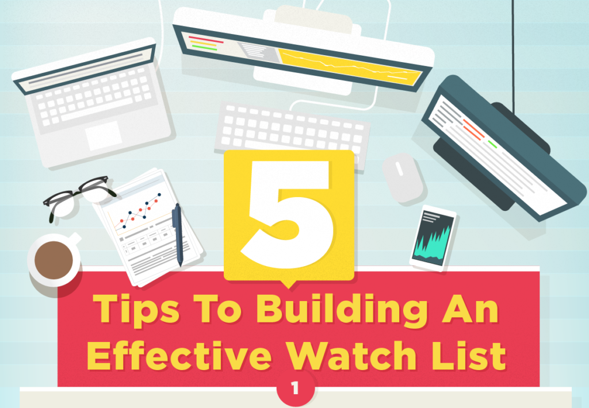

## Table of Contents

## What is a watchlist and why is it important for investors?

A watchlist is a list of stocks or other investments that an investor is interested in and wants to keep an eye on. It helps investors to track the performance of these investments without actually buying them. By keeping a watchlist, investors can monitor price changes, news, and other important information about the stocks they are considering.

Having a watchlist is important for investors because it allows them to make better decisions about when to buy or sell investments. It helps them to stay organized and focused on their investment goals. By regularly reviewing their watchlist, investors can spot trends and opportunities that they might otherwise miss. This can lead to more informed and potentially more profitable investment choices.

## How do beginners start building their first watchlist?

Beginners can start building their first watchlist by first identifying their investment goals. Are they looking to grow their money over time, or do they want to earn regular income? Once they know their goals, they can start looking for stocks or other investments that match those goals. They can use online tools or apps to search for companies in industries they are interested in or that they think will do well in the future.

After finding some potential investments, beginners should add them to their watchlist. They can do this on a piece of paper, in a spreadsheet, or using a financial app or website. It's important to keep the watchlist updated by regularly checking the prices and news about the investments on it. This way, beginners can learn more about how the market works and make better decisions when they are ready to start investing their money.

## What are the key factors to consider when selecting stocks for a watchlist?

When picking stocks for a watchlist, beginners should think about the company's financial health. This means looking at things like how much money the company makes, its debts, and how well it is doing compared to other companies in the same industry. It's also good to check if the stock price seems fair compared to how much the company is worth. This can help you find stocks that might be a good deal.

Another important factor is the company's future growth potential. This involves understanding the industry the company is in and whether it is likely to grow in the future. Reading news and reports about the company can help you see if it has new products or services that could make it more successful. Also, think about any risks that could affect the company, like changes in the economy or new laws that might hurt its business.

Lastly, consider your own investment goals and how long you plan to keep the stock. If you want to make money quickly, you might look for stocks that go up and down a lot. But if you want to keep your money safe and grow it slowly, you might choose stocks that are more stable and pay regular dividends. By thinking about these things, you can build a watchlist that fits your needs and helps you make smart investment choices.

## How can one use financial ratios and metrics to evaluate potential watchlist candidates?

Financial ratios and metrics are important tools for evaluating stocks for your watchlist. One key ratio to look at is the price-to-earnings (P/E) ratio. This tells you how much you are paying for each dollar of the company's earnings. A lower P/E might mean the stock is a good deal, but you should compare it to other companies in the same industry. Another useful metric is the debt-to-equity ratio, which shows how much the company relies on borrowed money. A high ratio can be risky, especially if the company's earnings drop.

Another important metric is the return on equity (ROE), which measures how well the company uses its money to make profits. A higher ROE is generally better, but again, it's helpful to compare it to other companies in the same field. You can also look at the company's dividend yield if you want regular income from your investments. This shows how much the company pays out in dividends compared to its stock price. By using these ratios and metrics, you can get a clearer picture of a company's financial health and decide if it's a good fit for your watchlist.

## What role does sector and industry analysis play in watchlist construction?

Sector and industry analysis is important when you're building your watchlist. It helps you understand which parts of the economy are doing well and which ones might have problems. For example, if you see that the technology sector is growing fast, you might want to add some tech companies to your watchlist. On the other hand, if an industry like oil and gas is struggling, you might be careful about adding those stocks. By looking at sectors and industries, you can find good opportunities and avoid risks.

When you focus on specific industries, you can also learn more about what makes a company successful in that area. For instance, in the healthcare industry, you might look at how a company's new drugs or treatments are doing. In the retail sector, you might check how well a company is doing online compared to its competitors. This kind of detailed analysis helps you pick stocks that have a good chance of doing well in the future. By understanding the bigger picture of sectors and industries, you can make smarter choices for your watchlist.

## How should an investor balance diversification and focus within their watchlist?

Balancing diversification and focus in a watchlist means spreading your investments across different types of companies and industries while also keeping a close eye on a few key stocks. Diversification helps reduce risk because if one industry or company does badly, it won't hurt your whole watchlist. For example, you might have stocks from tech, healthcare, and energy sectors. This way, if tech stocks go down, your healthcare and energy stocks might still do well.

At the same time, having too many stocks can make it hard to keep track of them all. That's why it's good to focus on a smaller number of stocks that you think have the best chance of doing well. You can spend more time learning about these companies and watching their news and financial reports. By balancing diversification and focus, you can have a watchlist that is both safe and potentially profitable.

## What are some advanced screening techniques for refining a watchlist?

Advanced screening techniques can help you make your watchlist better by looking at more detailed information. One way to do this is by using technical analysis, which means looking at stock charts and patterns to see how the price might move in the future. You can use tools like moving averages or the Relative Strength Index (RSI) to find stocks that are trending up or might be a good buy because they are undervalued. Another technique is to use fundamental analysis, which involves looking at a company's financial statements to see how healthy it is. You can screen for stocks with good earnings growth, low debt, or high return on equity to find companies that are likely to do well.

Another advanced technique is to use sector rotation strategies. This means watching how different parts of the economy are doing and moving your focus to the sectors that are expected to do better in the near future. For example, if you think the economy is going to grow, you might want to focus on stocks in industries like technology or consumer goods. You can also use sentiment analysis, which looks at what people are saying about a company on social media or in the news. If a lot of people are talking positively about a stock, it might be a good time to add it to your watchlist. By using these advanced screening techniques, you can make smarter choices and build a watchlist that is more likely to help you reach your investment goals.

## How can technical analysis be integrated into watchlist management?

Technical analysis can help you manage your watchlist by looking at stock charts and patterns. This helps you see how the price of a stock might move in the future. You can use tools like moving averages, which show the average price of a stock over time, to find stocks that are trending up. Another tool is the Relative Strength Index (RSI), which tells you if a stock is overbought or oversold. By adding stocks to your watchlist that show good trends and signals, you can make better decisions about when to buy or sell.

You can also use technical analysis to set up alerts on your watchlist. For example, you can set an alert to notify you when a stock's price crosses above or below a certain moving average. This way, you don't have to check your watchlist all the time, but you'll still know when something important happens. By using these technical analysis tools, you can keep your watchlist updated and make smarter investment choices based on how the market is moving.

## What are the best practices for regularly updating and maintaining a watchlist?

To keep your watchlist useful, you need to update it regularly. This means checking the stocks on your list often to see how they are doing. Look at the stock prices, read the news about the companies, and check their financial reports. If a stock is doing really well or really badly, you might want to buy it or take it off your list. Also, if you find new stocks that seem interesting, add them to your watchlist. It's good to set a time each week or month to go over your watchlist and make any changes you need.

Another important thing is to keep your watchlist organized. Make sure you know why each stock is on your list and what you are looking for from it. You can use notes or tags to remember your reasons. If your watchlist gets too big, it can be hard to keep track of everything, so it's okay to remove stocks that don't seem important anymore. By staying organized and updating your watchlist regularly, you can make better investment choices and stay on top of your goals.

## How can one use macroeconomic indicators to adjust their watchlist?

Macroeconomic indicators like unemployment rates, inflation, and GDP growth can tell you a lot about how the economy is doing. If the economy is growing, you might want to add more stocks to your watchlist, especially from industries that do well when people have more money to spend, like technology or consumer goods. On the other hand, if the economy is slowing down, you might want to be more careful and focus on industries that are more stable, like utilities or healthcare. By keeping an eye on these big-picture numbers, you can make smarter choices about which stocks to watch.

For example, if inflation is going up, you might want to look at companies that can raise their prices without losing customers. This could mean adding stocks from industries like energy or food to your watchlist. If interest rates are going up, it might be a good idea to watch companies that don't have a lot of debt, because they won't have to pay as much to borrow money. By adjusting your watchlist based on these macroeconomic indicators, you can better prepare for changes in the economy and pick stocks that are more likely to do well in different situations.

## What are the common pitfalls to avoid in watchlist construction?

When you're building your watchlist, one big mistake to avoid is having too many stocks on it. If your list gets too long, it can be hard to keep track of all the stocks and understand what's going on with each one. It's better to focus on a smaller number of stocks that you really know about and think have good potential. Another common pitfall is not updating your watchlist often enough. The stock market changes all the time, so you need to check your list regularly and make changes when things happen, like if a company's earnings go up or down, or if there's big news about the industry.

Another thing to watch out for is not paying attention to the bigger picture, like what's happening with the economy or in different industries. If you ignore these things, you might miss important signs that could affect your stocks. Also, be careful not to put all your eggs in one basket by focusing too much on one industry or type of stock. It's important to have a mix of different stocks to spread out your risk. By avoiding these common mistakes, you can build a watchlist that helps you make better investment decisions.

## How can expert investors use algorithmic tools to enhance their watchlist strategies?

Expert investors can use algorithmic tools to make their watchlist better by using them to look at a lot of data quickly. These tools can find patterns and trends that might be hard for a person to see. For example, an algorithm can look at stock prices, news, and financial reports all at once to find stocks that meet certain rules, like having a good price-to-earnings ratio or a strong growth trend. This helps experts find stocks that they might want to watch more closely or even buy.

Algorithms can also help experts keep their watchlist updated without having to check everything themselves all the time. They can set up the tools to send alerts when something important happens, like when a stock's price goes above or below a certain level, or when there's big news about a company. This way, experts can focus on the stocks that need their attention the most. By using these tools, expert investors can make smarter choices and manage their watchlist more efficiently.

## How can Portfolio Management be optimized for the best returns?

Portfolio management represents the strategic process of assembling a portfolio that meets an investor's specific financial objectives while effectively managing risk. This discipline requires careful consideration of an investment's risk-return profile, taking into account diverse sectors, geographies, and asset classes to construct a balanced portfolio.

A cornerstone of effective portfolio management is the principle of diversification. Diversification involves spreading investments across various asset types such as equities, bonds, commodities, and real estate to reduce risk. This is rooted in the concept that individual asset performances are not perfectly correlated. For example, when the stock market is experiencing a downturn, government bonds might perform well, and this inverse relationship can protect the portfolio's value. The key is to combine assets whose price movements are not strongly correlated, thereby smoothing overall portfolio [volatility](/wiki/volatility-trading-strategies). The mathematical representation of diversification can be illustrated using the variance of a portfolio:

$$
\sigma_p^2 = \sum_{i=1}^{n} w_i^2 \sigma_i^2 + \sum_{i=1}^{n} \sum_{j \neq i}^{n} w_i w_j \sigma_i \sigma_j \rho_{ij}
$$

Where:
- $\sigma_p^2$ is the portfolio variance.
- $w_i$ and $w_j$ are the weights of the assets in the portfolio.
- $\sigma_i$ and $\sigma_j$ are the standard deviations of the assets.
- $\rho_{ij}$ is the correlation coefficient between asset $i$ and asset $j$.

Balancing risk and return is essential in portfolio management. This involves selecting investments that match the investor's risk tolerance and return expectations. Investors often use metrics like the Sharpe Ratio to evaluate the risk-adjusted return of the portfolio:

$$
\text{Sharpe Ratio} = \frac{R_p - R_f}{\sigma_p}
$$

Where:
- $R_p$ is the expected portfolio return.
- $R_f$ is the risk-free rate.
- $\sigma_p$ is the standard deviation of the portfolio.

Rebalancing is another critical component, ensuring that the portfolio remains aligned with the investor's objectives over time. Market fluctuations can cause the value of assets to drift, thereby altering the portfolio's risk profile. Periodic rebalancing involves realigning the proportions of assets to maintain the desired asset allocation. This can be achieved through buying and selling assets in the portfolio. For example, if the original allocation was 60% equities and 40% bonds, but equities now constitute 70% due to market rallies, a rebalancing would involve selling equities and buying bonds to return to the original allocation.

Python can be utilized to perform portfolio rebalancing. Here’s a simple example of a rebalancing script:

```python
import pandas as pd

# Sample portfolio with current and target allocations
portfolio = {
    'Equities': {'current': 70000, 'target': 0.6},
    'Bonds': {'current': 30000, 'target': 0.4}
}

# Total portfolio value for calculation
total_value = sum(asset['current'] for asset in portfolio.values())

# Calculate target values and trades needed for rebalancing
for asset, values in portfolio.items():
    target_value = total_value * values['target']
    trade_value = target_value - values['current']
    print(f"{asset}: Rebalance by trading {trade_value} units")

# Output: 
# Equities: Rebalance by trading -10000.0 units
# Bonds: Rebalance by trading 10000.0 units
```

By adjusting the investment mix and rebalancing, portfolio management aims to maximize returns while keeping aligned with the investor's risk preferences. These principles underpin successful long-term investment strategies in a dynamic market environment.

## How can we integrate Watchlist, Portfolio Management, and Algo Trading?

Integrating watchlists, portfolio management, and algorithmic trading forms a comprehensive approach to modern investing. Each element contributes a unique advantage that, when combined, optimizes investment strategies.

A watchlist acts as the initial step in pinpointing potential investment opportunities. By curating a list of financial instruments that align with an investor’s criteria, one can monitor these assets for changes in price, [volume](/wiki/volume-trading-strategy), or other relevant indicators. For instance, an investor might include stocks that show promising fundamentals, display favorable technical patterns, or fall within a specific sector of interest. This focused attention ensures that when conditions are ripe for investment, these assets are top-of-mind and ready for action.

Once potential investments are identified, they can be integrated into a well-structured portfolio. Portfolio management involves careful asset selection to attain diversification, thereby mitigating risk. An optimal portfolio includes a variety of asset classes and sectors to cushion against market volatility. For example, the formula for variance $\sigma^2_p$ of a two-asset portfolio is:

$$
\sigma^2_p = w_1^2\sigma_1^2 + w_2^2\sigma_2^2 + 2w_1w_2\sigma_{12}
$$

where $w_1$ and $w_2$ are the weights of the two assets, $\sigma_1^2$ and $\sigma_2^2$ are their variances, and $\sigma_{12}$ is the covariance between them. This showcases the quantitative blending of diversification to manage risks.

Algorithmic trading further refines this process by automating trading decisions. Algorithms can be programmed to initiate trades based on specific market conditions or investment rules, proceeding at a speed and precision beyond human capabilities. For example, an algorithm might be set to buy a stock if its moving average crosses above a certain threshold (a signal of potential upward [momentum](/wiki/momentum)) and sell if it crosses below another threshold. Algorithms can also employ complex statistical analyses such as mean reversion or trend following, allowing them to execute trades with minimal delay.

The synergy of watchlists, portfolio management, and algorithmic trading enables investors to swiftly act on market opportunities while maintaining overarching strategic goals. This integrated approach not only streamlines the investment process but also enhances the ability to manage risk effectively, ensuring that portfolios are dynamically adjusted in response to evolving market landscapes. This adaptability is crucial in optimizing both short-term gains and long-term investment success.

## References & Further Reading

[1]: ["Advances in Financial Machine Learning"](https://www.amazon.com/Advances-Financial-Machine-Learning-Marcos/dp/1119482089) by Marcos Lopez de Prado

[2]: ["Evidence-Based Technical Analysis: Applying the Scientific Method and Statistical Inference to Trading Signals"](https://www.amazon.com/Evidence-Based-Technical-Analysis-Scientific-Statistical/dp/0470008741) by David Aronson

[3]: ["Machine Learning for Algorithmic Trading"](https://github.com/stefan-jansen/machine-learning-for-trading) by Stefan Jansen

[4]: ["Quantitative Trading: How to Build Your Own Algorithmic Trading Business"](https://www.amazon.com/Quantitative-Trading-Build-Algorithmic-Business/dp/1119800064) by Ernest P. Chan

[5]: Abarbanell, J. S., & Bushee, B. J. (1998). "Abnormal returns to a fundamental analysis strategy." The Accounting Review, 73(1), 19-45. 

[6]: Aldridge, I. (2013). ["High-Frequency Trading: A Practical Guide to Algorithmic Strategies and Trading Systems,"](https://books.google.com/books/about/High_Frequency_Trading.html?id=6l0DDQAAQBAJ) 2nd Edition, Wiley.