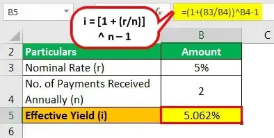

In the ever-evolving world of finance, understanding investment returns is crucial for both seasoned investors and novices. Accurate assessment of investment outcomes drives strategic decision-making and risk management. One fundamental concept aiding in this analysis is the effective yield, particularly in the context of bond investments. Effective yield is a measure that incorporates the power of compounding, thereby offering a more detailed insight into the profitability of an investment than the nominal yield, which considers only simple interest.

Effective yield provides a clearer picture by accounting for how often interest payments are reinvested, which significantly affects the overall return. This metric is crucial when evaluating bonds, as it helps investors understand the real gains from interest reinvestment over time. The frequent compounding of returns can substantially alter the total yield of an investment, especially over long periods, thus impacting decisions on portfolio allocation and bond selection.



In addition to traditional investment metrics, the rise of algorithmic trading underscores the importance of precise yield calculations, like effective yield, in contemporary financial strategies. Algorithmic trading, which employs sophisticated software to execute trades at high speeds and volumes, depends on accurate data and modeling to optimize returns. By integrating effective yield calculations, these automated systems can more accurately project returns, adjust strategies in real-time, and ultimately seek to maximize profitability in fast-paced market environments.

This article explores effective yield calculations, examining how they are influenced by market fluctuations and highlighting their significance in modern trading strategies.

## Table of Contents

## Understanding Effective Yield

Effective yield is a critical measure that captures the annual return on an investment by accounting for the compounding of returns over time. It provides a comprehensive view of an investment's profitability as it considers the reinvestment of interest payments. This contrasts with the nominal yield, which only reflects the stated interest rate or coupon payment, ignoring the effects of compounding.

The effective yield is particularly useful for comparing investments with different compounding intervals. It reflects the true rate of return on an investment by incorporating the frequency of interest payments. This feature makes it a preferred metric for evaluating the performance of bonds and similar fixed-income securities.

Key concepts related to effective yield include yield-to-maturity (YTM) and yield spreads. Yield-to-maturity is a measure that estimates the total return of a bond if held to its maturity, assuming all payments are reinvested at the same rate. This metric provides investors an all-encompassing perspective on potential returns, integrating all cash flow timings and amounts. Yield spreads, on the other hand, represent the difference in yields between different types of bonds or across different maturities. They offer insights into the risk-premium and economic conditions expected over the bond's period.

To calculate the effective yield, one can use the formula:

$$

i = \left(1 + \frac{r}{n}\right)^n - 1 
$$

where $i$ is the effective yield, $r$ is the nominal rate, and $n$ is the number of compounding periods per year. This formula illustrates that effective yield not only provides a more accurate reflection of investment returns compared to its nominal counterpart but also accounts for the impact of different compounding frequencies.

The understanding of effective yield is essential for investors seeking to make informed decisions, ensuring that portfolio choices align with their expected return and risk profiles. It emphasizes the necessity of considering both the rate of interest and its compounding frequency when assessing an investment's true [earning](/wiki/earning-announcement) potential.

## Calculating Effective Yield

Effective yield is a crucial metric in finance, providing a more comprehensive understanding of the annual return on an investment by incorporating the effects of compounding. The standard formula to calculate effective yield is:

$$
i = \left(1 + \frac{r}{n}\right)^n - 1
$$

where:
- $i$ represents the effective yield,
- $r$ is the nominal interest rate,
- $n$ is the number of compounding periods per year.

The effective yield calculation allows investors to assess the true return on a bond by taking into account how frequently interest is compounded. This is essential because compounding at different intervals can significantly affect the outcome of the yield. For example, a bond with a nominal annual [interest rate](/wiki/interest-rate-trading-strategies) of 5% compounded quarterly will have a different effective yield compared to the same bond compounded annually.

### Example Calculation

Consider an investment with a nominal interest rate $r$ of 5% compounded quarterly ($n = 4$). Plugging these values into the formula, we can compute the effective yield:

$$
i = \left(1 + \frac{0.05}{4}\right)^4 - 1
$$

$$
i = \left(1 + 0.0125\right)^4 - 1
$$

$$
i = 1.0125^4 - 1
$$

$$
i \approx 1.050945 - 1
$$

$$
i \approx 0.050945
$$

The effective yield in this case is approximately 5.0945%, which is slightly higher than the nominal rate due to the effect of quarterly compounding.

### Python Code Example

Investors can use Python to easily calculate the effective yield for different scenarios:

```python
def calculate_effective_yield(nominal_rate, compounding_periods):
    return (1 + nominal_rate / compounding_periods) ** compounding_periods - 1

nominal_rate = 0.05  # 5% nominal rate
compounding_periods = 4  # Quarterly compounding

effective_yield = calculate_effective_yield(nominal_rate, compounding_periods)
print(f"Effective Yield: {effective_yield:.4%}")
```

This Python code provides a straightforward approach to determining effective yield, allowing investors to experiment with various compounding intervals and rates to understand their impact on investment returns. This understanding is vital for making informed decisions, especially in bond investments, where the timing and frequency of interest payments play a significant role in total returns.

## Impact of Market Fluctuations on Effective Yield

Market price fluctuations play a pivotal role in determining effective yield calculations, as there exists an inverse relationship between bond prices and yields. When bond prices rise due to increased demand or improved credit quality, the yield falls, and conversely, when bond prices decline due to decreased demand or downgraded credit ratings, the yield rises. This fundamental principle indicates that as the market price of a bond fluctuates, so does the effective yield, impacting investor returns.

Several critical factors contribute to these price fluctuations. Changes in interest rates are significant; when central banks alter interest rates, bond prices typically respond inversely. For instance, if interest rates increase, existing bonds with lower rates become less attractive, leading to declining prices and rising yields. Conversely, a decrease in interest rates generally results in higher bond prices and reduced yields.

Economic conditions further influence bond market dynamics. During periods of economic growth, investors may demand higher yields as the opportunity cost of investing in bonds instead of other asset classes rises. In contrast, in a recessionary climate, bonds may be more appealing due to their relative safety, driving prices up and yields down.

The calculation of effective yield provides a more nuanced understanding of how these price movements impact actual returns. Unlike nominal yield, which remains static regardless of market conditions, effective yield reflects the compounded impact of changes in the bond's price and interest rate environment. This insight is crucial for investors seeking to navigate volatile markets effectively.

For example, suppose an investor holds a bond purchased at a premium. The market interest rates then rise, causing the bond's price to fall. In this scenario, the effective yield will offer a realistic assessment of the bond's return, considering the impact of the reduced price and any periodic interest payments. This comprehensive approach aids investors in making informed decisions, aligning their strategies with the current economic landscape and adjusting to anticipated market changes.

Ultimately, understanding effective yield amid market fluctuations enables investors to mitigate risks and optimize returns, equipping them with the analytical foresight necessary for enduring turbulent financial markets.

## Effective Yield in Algorithmic Trading

Algorithmic trading leverages sophisticated computer programs to execute trades at unparalleled speed and [volume](/wiki/volume-trading-strategy), guided by pre-established parameters. Effective yield, a crucial metric for assessing the annual return on an investment with compounding, can be pivotal within this framework. By integrating effective yield calculations, trading algorithms can offer a more nuanced modeling of potential returns and, importantly, account for the compounding effects that might not be evident with simpler yield metrics.

Incorporating effective yield into [algorithmic trading](/wiki/algorithmic-trading) algorithms enables traders to model and predict returns with greater accuracy. This enhancement is essential in markets where even minor differences in yield can translate into significant gains or losses when compounded across large volumes or multiple transactions. Algorithms that integrate these calculations can optimize bid and ask prices, manage risk more proficiently, and predict price movements with increased precision.

For instance, consider an algorithm designed to trade bonds based on effective yield differentials. The algorithm assesses various bonds by calculating their effective yields using the formula:

$$
i = \left(1 + \frac{r}{n}\right)^n - 1
$$

where $i$ represents the effective yield, $r$ is the nominal rate, and $n$ is the number of compounding intervals per year. By evaluating these effective yields, the algorithm can identify bonds with underpriced yields or potential trading opportunities led by discrepancies between market price and calculated yield.

The real-time adaptability of algorithmic trading programs is enhanced by incorporating effective yield. Algorithms equipped with these calculations can quickly adjust trading strategies in response to fluctuating market conditions. This adaptability is crucial, especially during periods of [volatility](/wiki/volatility-trading-strategies), where the traditional nominal yield may fail to provide an accurate reflection of an investment's potential return. Effective yield-driven algorithms can recognize shifts in market conditions and recalibrate trading positions swiftly, maintaining an optimal balance between risk and return.

Python, with its rich ecosystem of libraries like pandas and numpy, can be particularly effective for developing such algorithms. For example, a basic illustration of computing effective yield using Python might look like this:

```python
def calculate_effective_yield(nominal_rate, compounding_periods):
    effective_yield = (1 + nominal_rate / compounding_periods) ** compounding_periods - 1
    return effective_yield

# Example calculation
nominal_rate = 0.05  # 5% nominal interest rate
compounding_periods = 4  # Quarterly compounding
ey = calculate_effective_yield(nominal_rate, compounding_periods)
print(f"Effective Yield: {ey:.4f}")
```

Incorporating effective yield calculations in algorithmic trading not only enhances the accuracy of return estimations but also empowers traders to navigate the complexities of modern financial markets. By responding dynamically to market changes, algorithms can maximize potential gains and systematically mitigate risks associated with investment decisions.

## Comparing Effective Yield with Other Yield Measures

Effective yield and other yield measures such as nominal yield and yield-to-maturity (YTM) serve as vital tools for investors to evaluate the potential returns from bond investments. Distinguishing between these measures is crucial for making informed investment decisions.

Unlike nominal yield, which simply reflects the annual interest rate or coupon payments made by a bond issuer, effective yield incorporates the effects of compounding. This makes it a superior measure for providing an accurate and comprehensive assessment of an investment's potential profitability. Nominal yield does not consider the impact of reinvesting interest payments, which can significantly alter the actual returns an investor might experience.

Yield-to-maturity (YTM) offers another valuable perspective as it calculates the total expected return of a bond if held until its maturity date. YTM considers the current market price, the face value, the coupon interest rate, and the time to maturity, thus providing a holistic view of the bond's potential performance. Unlike effective yield, which focuses on the annual return accounting for compounding, YTM reflects the bond's yield over its entire life until maturity, assuming all payments are made as scheduled and reinvested at the same rate.

By comparing these yield measures, investors can align their investment choices with their specific risk-return profiles and time horizons. While effective yield gives insight into the immediate annual returns considering compounding effects, YTM provides a long-term view of returns assuming the investor holds the bond to maturity. The decision-making process benefits from understanding these metrics, as it allows investors to choose investments that best match their financial objectives, taking into consideration factors such as reinvestment potential and market price changes.

Ultimately, an accurate comparison of effective yield, nominal yield, and YTM enables investors to make strategic decisions that optimize their portfolios, addressing both short-term and long-term financial goals.

## Limitations and Considerations

Effective yield calculations are predicated on the assumption that all interest payments are reinvested at the same yield rate, an expectation that may not hold in a fluctuating market. The reinvestment rate can differ from the initial yield due to market dynamics, affecting the projected returns. Thus, it's critical for investors to account for varying reinvestment rates when evaluating potential returns using effective yield.

Moreover, investors must be cognizant of various costs that can influence net returns. Taxes and fees, in particular, can significantly reduce the attractiveness of an investment's effective yield. For example, if an investment incurs a substantial management fee or is subject to high taxation, the effective yield would not accurately reflect the net return realized by the investor. It's prudent to consider these expenses in yield calculations to gain a realistic understanding of the net profitability.

Another key consideration is the need for caution when directly comparing yields from different financial instruments. Effective yields can vary due to differing compounding periods, such as annual, semi-annual, quarterly, or monthly compounding. For instance, a financial instrument with monthly compounding will typically show a higher effective yield than one with annual compounding, given the same nominal rate. Therefore, when comparing the attractiveness of investment opportunities, it is essential to standardize yield calculations using a common compounding frequency or convert them to annual equivalent rates.

In summary, while effective yield provides a powerful measure of an investment's potential profitability, investors should carefully account for reinvestment assumptions, taxes, fees, and compounding differences to ensure a comprehensive evaluation of expected returns.

## Practical Applications and Case Studies

Effective yield is a crucial financial metric that extends its utility beyond traditional bond investments, finding relevance in mutual funds and exchange-traded funds (ETFs) as well. This measure assists investors in understanding the compounded returns of these assets, aiding in more informed portfolio management and asset allocation decisions.

### Applications in Mutual Funds and ETFs

Effective yield offers investors a clearer picture of the real return on mutual fund investments by accounting for the reinvestment of dividends. Many mutual funds distribute dividends regularly, and these can be reinvested to compound returns, much like bond interest payments. By calculating the effective yield, investors can better compare mutual fund performance, which might offer inconsistent payment schedules or varying yields.

Similarly, ETFs, which have grown significantly in popularity due to their flexibility and cost-effectiveness, benefit from effective yield calculations. Given that ETFs often reinvest dividends, understanding the effective yield of an [ETF](/wiki/etf-trading-strategies) provides insights into the total returns an investor can expect over time, considering the compounding of these reinvestments.

### Portfolio Management and Asset Allocation

Understanding effective yield can significantly enhance portfolio management. By providing a more accurate assessment of potential returns, effective yield can guide decisions on asset allocation, helping investors balance their portfolios between income-generating and growth-focused investments. For instance, investors seeking steady income might prioritize assets with higher effective yields over nominal yields to maximize their returns.

Additionally, effective yield calculations allow for better risk assessments by illustrating the variability of expected returns under different market conditions. Consequently, investors can make more strategic decisions on which assets to hold, buy, or sell to optimize their portfolios.

### Case Studies

Historically, savvy investors have leveraged effective yield calculations to refine their strategies. A notable example involves a large institutional investor who managed to significantly outperform their benchmark index by focusing on high effective yield investments within their bond portfolio. By prioritizing bonds and bond-like securities that offered higher effective yields, they were able to compound returns more efficiently than if they had focused solely on nominal yields.

Moreover, algorithmic traders have used effective yield metrics to adjust their automated trading strategies in real-time, efficiently exploiting discrepancies in market interest rates and the compounding effects of reinvested returns. Algorithms designed to optimize yield incorporate effective yield calculations to forecast and adjust to changes in dividend payouts or interest rates, thus allowing for finely-tuned portfolio adjustments.

### Python Example

To support these strategies, here is a simple Python snippet for calculating effective yield, which could be incorporated into broader trading algorithms or personal finance tools:

```python
def calculate_effective_yield(nominal_rate, compounding_periods):
    """Calculate the effective yield given a nominal rate and compounding periods."""
    effective_yield = (1 + (nominal_rate / compounding_periods))**compounding_periods - 1
    return effective_yield

# Example usage
nominal_rate = 0.05  # 5% nominal rate
compounding_periods = 12  # monthly compounding
print(calculate_effective_yield(nominal_rate, compounding_periods))
```

In conclusion, effective yield serves not only as a reevaluation tool for traditional investments like bonds but also as a strategic component for modern investment approaches, including mutual funds, ETFs, and algorithmic trading. Understanding and utilizing effective yield assists investors and traders in achieving optimized investment returns through better-informed decision-making processes.

## Conclusion

Effective yield serves as a fundamental element in assessing actual investment returns, providing a thorough perspective that surpasses nominal rates. By incorporating the effects of compounding, effective yield yields a more realistic measure of an investment's performance, which is vital for investors seeking to understand the true value of their holdings. This measure aids in quantifying the potential profitability of various investment options, ensuring that investors have a clearer picture of the returns they can expect.

Inclusion of effective yield calculations in algorithmic trading strategies is instrumental for making informed and agile trading decisions. Algorithmic trading, which relies heavily on the precision of data inputs, greatly benefits from the nuanced insights that effective yield offers. By integrating these calculations, traders can adjust their strategies in real-time to better capture market opportunities and mitigate risks, thereby enhancing their trading outcomes in today's swiftly changing financial environments.

Mastery of effective yield calculations is paramount for investors aiming to optimize their portfolio performance and reach their investment objectives. Accurate assessment of effective yield empowers investors to compare various financial instruments effectively, choose appropriate asset allocations, and align their investments with their risk tolerance and return expectations. In doing so, investors can potentially increase their returns and build a robust, diversified portfolio that meets their long-term financial goals. Understanding and utilizing effective yield is not merely a theoretical exercise; it is an essential practice that can substantially improve investment success.

## References & Further Reading

[1]: Bodie, Z., Kane, A., & Marcus, A. J. (2014). ["Investments"](https://books.google.com/books/about/EBOOK_Investments_Global_edition.html?id=BMsvEAAAQBAJ) (10th Edition). McGraw-Hill Education.

[2]: Fabozzi, F. J. (2018). ["Bond Markets, Analysis, and Strategies"](https://books.google.com/books/about/Bond_Markets_Analysis_and_Strategies_ten.html?id=bQpNEAAAQBAJ) (9th Edition). Pearson.

[3]: ["Fixed Income Securities: Tools for Today's Markets"](https://www.amazon.com/Fixed-Income-Securities-Markets-Finance/dp/1119835550) by Bruce Tuckman and Angel Serrat

[4]: Lopez de Prado, M. (2018). ["Advances in Financial Machine Learning"](https://www.amazon.com/Advances-Financial-Machine-Learning-Marcos/dp/1119482089). Wiley.

[5]: Chan, E. (2009). ["Quantitative Trading: How to Build Your Own Algorithmic Trading Business"](https://github.com/ftvision/quant_trading_echan_book). Wiley.

[6]: "Understanding the Yield to Maturity (YTM)" - Investopedia. Retrieved from [https://www.investopedia.com/terms/y/yieldtomaturity.asp](https://www.investopedia.com/terms/y/yieldtomaturity.asp)