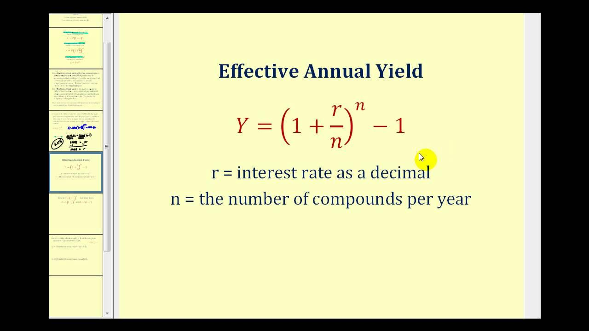

## Table of Contents

## What is effective yield?

Effective yield is a way to measure how much money you earn from an investment over a year. It takes into account things like compound interest, which means you earn interest on the money you already earned. This makes it different from just looking at the simple interest rate, which doesn't consider how often interest is added to your investment.

For example, if you put money in a savings account that pays interest every month, the effective yield will show you the true annual return on your investment. It's useful because it gives you a clearer picture of what you're actually earning, especially when comparing different investments. By understanding the effective yield, you can make better decisions about where to put your money.

## How does effective yield differ from nominal yield?

Effective yield and nominal yield are two ways to look at how much money you earn from an investment, but they show different things. Nominal yield is the simple interest rate that you see on your investment. It's the basic percentage that you're told you'll earn, but it doesn't take into account how often the interest is added to your investment. For example, if a bond says it has a 5% nominal yield, that means you'll earn 5% of your investment every year, but it doesn't consider if that interest is added monthly, quarterly, or yearly.

Effective yield, on the other hand, gives you a more accurate picture of your earnings because it does consider how often the interest is added. This is important because of compound interest, which means you earn interest on the interest you've already earned. So, if you have a savings account that adds interest every month, the effective yield will be higher than the nominal yield because you're earning more over time. Understanding the difference helps you see the true value of your investment and compare different options more accurately.

## Why is effective yield important for investors?

Effective yield is important for investors because it shows them the real amount of money they can earn from an investment over a year. It takes into account how often interest is added, which can make a big difference. When you know the effective yield, you can see if an investment is really as good as it looks on the surface. This helps investors make better choices about where to put their money.

For example, if two investments have the same nominal yield but one adds interest more often, the effective yield will be higher for the one that compounds more frequently. By understanding effective yield, investors can compare different investments more accurately and choose the ones that will give them the best return. This is especially useful when looking at things like bonds or savings accounts, where the way interest is added can change how much money you make.

## What is the formula for calculating effective yield?

The formula for calculating effective yield is: Effective Yield = (1 + Nominal Rate / n)^n - 1, where 'n' is the number of compounding periods per year. This formula helps you find out how much money you'll really earn from an investment when interest is added more than once a year. For example, if you have a savings account with a 5% nominal rate and the interest is added monthly, you would use 'n' as 12 because there are 12 months in a year.

Let's say you want to know the effective yield of a bond with a 6% nominal rate that compounds quarterly. You would use 'n' as 4 because there are four quarters in a year. Plugging the numbers into the formula, you get Effective Yield = (1 + 0.06 / 4)^4 - 1. This calculation will give you a more accurate idea of your investment's return, helping you make better financial decisions.

## Can you provide a simple example of calculating effective yield?

Imagine you have a savings account with a nominal interest rate of 5% per year, and the bank adds interest to your account every month. To find out the effective yield, you need to know that there are 12 months in a year, so you'll use 12 as the number of compounding periods. The formula for effective yield is (1 + Nominal Rate / n)^n - 1. Plugging in the numbers, it looks like this: (1 + 0.05 / 12)^12 - 1.

When you do the math, you get (1 + 0.004167)^12 - 1, which equals about 0.05116 or 5.116%. So, even though the nominal rate is 5%, the effective yield is a bit higher at 5.116% because the interest is added every month. This means you're actually earning a little more money than you might have thought, which can help you decide if this savings account is a good choice for your money.

## How does compounding frequency affect effective yield?

Compounding frequency is how often the interest gets added to your investment. The more often interest is added, the higher the effective yield will be. This happens because when interest is added more often, you start earning interest on the interest you've already earned, which is called compound interest. For example, if you have a savings account with a 5% nominal rate, the effective yield will be higher if the interest is added monthly instead of yearly.

To understand why, think about a savings account that adds interest every month compared to one that adds it once a year. With monthly compounding, you're earning interest on the money you've earned each month, so it grows faster over time. If you start with $1,000 at a 5% nominal rate, with monthly compounding, you'll have a bit more at the end of the year than if the interest was added just once at the end. This difference might seem small at first, but over many years, it can add up to a lot more money.

## What are the steps to calculate effective yield for a bond?

To calculate the effective yield for a bond, you need to know the bond's nominal yield and how often the interest is added, which is called the compounding frequency. The nominal yield is the basic interest rate the bond pays each year. The compounding frequency could be yearly, semi-annually, quarterly, or even monthly. For example, if a bond has a nominal yield of 6% and pays interest twice a year, you would use 2 as the number of compounding periods in your calculation.

The formula to find the effective yield is (1 + Nominal Rate / n)^n - 1, where 'n' is the number of compounding periods per year. Let's say you have a bond with a 6% nominal yield that pays interest semi-annually. You would plug in the numbers like this: (1 + 0.06 / 2)^2 - 1. When you do the math, you get (1 + 0.03)^2 - 1, which equals about 0.0609 or 6.09%. This means the effective yield of the bond is slightly higher than the nominal yield because of the semi-annual compounding. Understanding this can help you see how much money you'll really earn from the bond and compare it to other investments.

## How can effective yield be used to compare different investment options?

Effective yield is really helpful when you want to compare different investments like savings accounts, bonds, or even certificates of deposit. It tells you the true amount of money you'll earn in a year, considering how often the interest is added. For example, if you're looking at two savings accounts, one with a 4% nominal rate that adds interest monthly and another with a 4.5% nominal rate that adds it yearly, the effective yield will show which one is better. Even though the second account has a higher nominal rate, the first one might give you a higher effective yield because of the monthly compounding.

This helps you make smarter choices about where to put your money. By knowing the effective yield, you can see past the simple interest rates and understand the real growth of your investment. It's like having a clearer picture of what you'll actually earn, which is super important when you're trying to decide between different options. Whether you're saving for a big goal or just looking to grow your money, effective yield is a key tool that can guide you to the best investment for your needs.

## What are common mistakes to avoid when calculating effective yield?

One common mistake people make when calculating effective yield is using the wrong number of compounding periods. For example, if a bond pays interest twice a year, you need to use 2 as the number of compounding periods, not 1. Using the wrong number can make your effective yield calculation way off, so it's important to check this carefully.

Another mistake is mixing up nominal yield and effective yield. Nominal yield is just the basic interest rate, but effective yield takes into account how often that interest is added. If you use the nominal yield to compare investments without calculating the effective yield, you might pick an investment that looks good but doesn't actually give you the best return. Always remember to calculate the effective yield to see the true value of your investment.

## How does inflation impact the effective yield of an investment?

Inflation can make the effective yield of an investment seem less valuable. Imagine you have a savings account that gives you a 3% effective yield. If inflation is at 2%, your money is growing, but not as much as it seems. That's because inflation means prices are going up, so the money you earn doesn't buy as much as it used to. If inflation is higher than your effective yield, you're actually losing buying power, even though your account balance is going up.

To really understand how good an investment is, you need to look at the effective yield after inflation. This is called the real yield. If your investment has a 3% effective yield and inflation is 2%, your real yield is only 1%. This means your money is only growing by 1% in terms of what it can buy. Knowing the real yield helps you see if an investment is keeping up with the cost of living, which is important for planning your financial future.

## Can effective yield be negative, and under what circumstances?

Yes, effective yield can be negative, but it's not common. This happens when the costs or fees you pay on an investment are more than the interest or earnings you get. Imagine you put money in a savings account, but the bank charges you a lot of fees. If those fees are more than the interest you earn, your effective yield would be negative because you're losing money instead of making it.

Another way effective yield can be negative is when you're dealing with inflation. If the inflation rate is higher than the interest rate on your investment, your money is losing value even if you're earning interest. For example, if your savings account gives you a 2% effective yield but inflation is at 3%, your effective yield after inflation (or real yield) would be -1%. This means your money can buy less over time, even though the number in your account is going up.

## How do advanced investors use effective yield in portfolio management?

Advanced investors use effective yield to make smarter choices about their investments. They look at the effective yield to see how much money they'll really earn from different options, like bonds or savings accounts. This helps them compare investments that might look the same on the surface but have different compounding frequencies. For example, if they're choosing between two bonds with the same nominal yield, they'll pick the one with the higher effective yield because it means they'll earn more money over time. By understanding effective yield, advanced investors can build a portfolio that grows faster and gives them the best return on their money.

They also use effective yield to manage risk and keep up with inflation. If inflation is high, advanced investors will look for investments with an effective yield that's higher than the inflation rate. This way, their money keeps its value and even grows in terms of what it can buy. They might also use effective yield to see if an investment is worth the fees or costs involved. If the effective yield is negative after accounting for fees, they'll know to avoid that investment. By focusing on effective yield, advanced investors can make their money work harder and protect it from losing value over time.

## What is Understanding Effective Yield?

Effective yield is a critical measure that captures the annual return on an investment by accounting for the compounding of returns over time. It provides a comprehensive view of an investment's profitability as it considers the reinvestment of interest payments. This contrasts with the nominal yield, which only reflects the stated interest rate or coupon payment, ignoring the effects of compounding.

The effective yield is particularly useful for comparing investments with different compounding intervals. It reflects the true rate of return on an investment by incorporating the frequency of interest payments. This feature makes it a preferred metric for evaluating the performance of bonds and similar fixed-income securities.

Key concepts related to effective yield include yield-to-maturity (YTM) and yield spreads. Yield-to-maturity is a measure that estimates the total return of a bond if held to its maturity, assuming all payments are reinvested at the same rate. This metric provides investors an all-encompassing perspective on potential returns, integrating all cash flow timings and amounts. Yield spreads, on the other hand, represent the difference in yields between different types of bonds or across different maturities. They offer insights into the risk-premium and economic conditions expected over the bond's period.

To calculate the effective yield, one can use the formula:

$$

i = \left(1 + \frac{r}{n}\right)^n - 1 
$$

where $i$ is the effective yield, $r$ is the nominal rate, and $n$ is the number of compounding periods per year. This formula illustrates that effective yield not only provides a more accurate reflection of investment returns compared to its nominal counterpart but also accounts for the impact of different compounding frequencies.

The understanding of effective yield is essential for investors seeking to make informed decisions, ensuring that portfolio choices align with their expected return and risk profiles. It emphasizes the necessity of considering both the rate of interest and its compounding frequency when assessing an investment's true [earning](/wiki/earning-announcement) potential.

## How do you calculate effective yield?

Effective yield is a crucial metric in finance, providing a more comprehensive understanding of the annual return on an investment by incorporating the effects of compounding. The standard formula to calculate effective yield is:

$$
i = \left(1 + \frac{r}{n}\right)^n - 1
$$

where:
- $i$ represents the effective yield,
- $r$ is the nominal interest rate,
- $n$ is the number of compounding periods per year.

The effective yield calculation allows investors to assess the true return on a bond by taking into account how frequently interest is compounded. This is essential because compounding at different intervals can significantly affect the outcome of the yield. For example, a bond with a nominal annual [interest rate](/wiki/interest-rate-trading-strategies) of 5% compounded quarterly will have a different effective yield compared to the same bond compounded annually.

### Example Calculation

Consider an investment with a nominal interest rate $r$ of 5% compounded quarterly ($n = 4$). Plugging these values into the formula, we can compute the effective yield:

$$
i = \left(1 + \frac{0.05}{4}\right)^4 - 1
$$

$$
i = \left(1 + 0.0125\right)^4 - 1
$$

$$
i = 1.0125^4 - 1
$$

$$
i \approx 1.050945 - 1
$$

$$
i \approx 0.050945
$$

The effective yield in this case is approximately 5.0945%, which is slightly higher than the nominal rate due to the effect of quarterly compounding.

### Python Code Example

Investors can use Python to easily calculate the effective yield for different scenarios:

```python
def calculate_effective_yield(nominal_rate, compounding_periods):
    return (1 + nominal_rate / compounding_periods) ** compounding_periods - 1

nominal_rate = 0.05  # 5% nominal rate
compounding_periods = 4  # Quarterly compounding

effective_yield = calculate_effective_yield(nominal_rate, compounding_periods)
print(f"Effective Yield: {effective_yield:.4%}")
```

This Python code provides a straightforward approach to determining effective yield, allowing investors to experiment with various compounding intervals and rates to understand their impact on investment returns. This understanding is vital for making informed decisions, especially in bond investments, where the timing and frequency of interest payments play a significant role in total returns.

## What is the Effective Yield in Algorithmic Trading?

Algorithmic trading leverages sophisticated computer programs to execute trades at unparalleled speed and [volume](/wiki/volume-trading-strategy), guided by pre-established parameters. Effective yield, a crucial metric for assessing the annual return on an investment with compounding, can be pivotal within this framework. By integrating effective yield calculations, trading algorithms can offer a more nuanced modeling of potential returns and, importantly, account for the compounding effects that might not be evident with simpler yield metrics.

Incorporating effective yield into [algorithmic trading](/wiki/algorithmic-trading) algorithms enables traders to model and predict returns with greater accuracy. This enhancement is essential in markets where even minor differences in yield can translate into significant gains or losses when compounded across large volumes or multiple transactions. Algorithms that integrate these calculations can optimize bid and ask prices, manage risk more proficiently, and predict price movements with increased precision.

For instance, consider an algorithm designed to trade bonds based on effective yield differentials. The algorithm assesses various bonds by calculating their effective yields using the formula:

$$
i = \left(1 + \frac{r}{n}\right)^n - 1
$$

where $i$ represents the effective yield, $r$ is the nominal rate, and $n$ is the number of compounding intervals per year. By evaluating these effective yields, the algorithm can identify bonds with underpriced yields or potential trading opportunities led by discrepancies between market price and calculated yield.

The real-time adaptability of algorithmic trading programs is enhanced by incorporating effective yield. Algorithms equipped with these calculations can quickly adjust trading strategies in response to fluctuating market conditions. This adaptability is crucial, especially during periods of [volatility](/wiki/volatility-trading-strategies), where the traditional nominal yield may fail to provide an accurate reflection of an investment's potential return. Effective yield-driven algorithms can recognize shifts in market conditions and recalibrate trading positions swiftly, maintaining an optimal balance between risk and return.

Python, with its rich ecosystem of libraries like pandas and numpy, can be particularly effective for developing such algorithms. For example, a basic illustration of computing effective yield using Python might look like this:

```python
def calculate_effective_yield(nominal_rate, compounding_periods):
    effective_yield = (1 + nominal_rate / compounding_periods) ** compounding_periods - 1
    return effective_yield

# Example calculation
nominal_rate = 0.05  # 5% nominal interest rate
compounding_periods = 4  # Quarterly compounding
ey = calculate_effective_yield(nominal_rate, compounding_periods)
print(f"Effective Yield: {ey:.4f}")
```

Incorporating effective yield calculations in algorithmic trading not only enhances the accuracy of return estimations but also empowers traders to navigate the complexities of modern financial markets. By responding dynamically to market changes, algorithms can maximize potential gains and systematically mitigate risks associated with investment decisions.

## References & Further Reading

[1]: Bodie, Z., Kane, A., & Marcus, A. J. (2014). ["Investments"](https://books.google.com/books/about/EBOOK_Investments_Global_edition.html?id=BMsvEAAAQBAJ) (10th Edition). McGraw-Hill Education.

[2]: Fabozzi, F. J. (2018). ["Bond Markets, Analysis, and Strategies"](https://books.google.com/books/about/Bond_Markets_Analysis_and_Strategies_ten.html?id=bQpNEAAAQBAJ) (9th Edition). Pearson.

[3]: ["Fixed Income Securities: Tools for Today's Markets"](https://www.amazon.com/Fixed-Income-Securities-Markets-Finance/dp/1119835550) by Bruce Tuckman and Angel Serrat

[4]: Lopez de Prado, M. (2018). ["Advances in Financial Machine Learning"](https://www.amazon.com/Advances-Financial-Machine-Learning-Marcos/dp/1119482089). Wiley.

[5]: Chan, E. (2009). ["Quantitative Trading: How to Build Your Own Algorithmic Trading Business"](https://github.com/ftvision/quant_trading_echan_book). Wiley.

[6]: "Understanding the Yield to Maturity (YTM)" - Investopedia. Retrieved from [https://www.investopedia.com/terms/y/yieldtomaturity.asp](https://www.investopedia.com/terms/y/yieldtomaturity.asp)