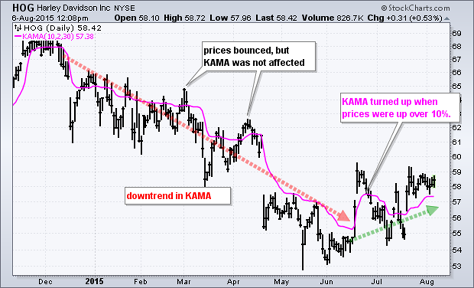

In today's fast-paced financial markets, algorithmic trading strategies are crucial for enhancing decision-making and operational efficiency. One technique that stands out is adaptive moving averages (AMAs), particularly Kaufman’s Adaptive Moving Average (KAMA). KAMA adjusts its calculations based on market volatility, allowing traders to differentiate between true market trends and noise. By using AMAs, traders can potentially refine their trading decisions, optimize entry and exit points, and adapt to the constant shifts in market dynamics. This article will provide insights on integrating AMAs, particularly KAMA, into trading systems, examining their benefits, implementation challenges, and their application in financial analysis. By employing adaptive moving averages, traders aim to mitigate market noise, thereby generating more reliable trading signals and achieving more precise outcomes.

## Table of Contents



## Understanding Moving Averages in Trading

Moving averages are pivotal tools in technical analysis, frequently used by traders to filter out short-term fluctuations in price data and to identify trends within the market. By smoothing price data, moving averages enable traders to better visualize the direction in which an asset's price is heading, serving as a foundational element in crafting trading strategies.

Traditional moving averages, such as the Simple Moving Average (SMA) and the Exponential Moving Average (EMA), are widely used in the trading community. The SMA is calculated by summing the closing prices of a security over a specific number of periods and then dividing by the number of periods. Mathematically, the SMA for price series $P$ over $n$ periods is represented as:
$$
\text{SMA} = \frac{P_1 + P_2 + \cdots + P_n}{n}
$$
where $P_i$ denotes the price at time $i$.

The EMA, on the other hand, applies different weightings to prices, giving greater significance to more recent data points. This is achieved through a smoothing factor $\alpha$, which is calculated as:
$$
\alpha = \frac{2}{n + 1}
$$
and the EMA is recursively calculated as:
$$
\text{EMA}_t = \alpha \times P_t + (1 - \alpha) \times \text{EMA}_{t-1}
$$
where $P_t$ is the current price, and $\text{EMA}_{t-1}$ is the EMA of the previous period.

However, both SMA and EMA come with limitations, particularly the lag effect that results in delayed responses to price changes. This lag can lead to the generation of false signals, making it difficult for traders to promptly react to market dynamics.

Adaptive moving averages (AMAs) aim to overcome these limitations by automatically adjusting their parameters based on current market conditions. Rather than applying fixed weightings, AMAs modify their sensitivity in reaction to market [volatility](/wiki/volatility-trading-strategies), thereby providing more agile and reliable signals. This adaptive quality makes AMAs exceptionally suited to rapidly changing market conditions, as they can more effectively differentiate between genuine trend shifts and short-lived price movements. 

By incorporating adaptability into their calculation, AMAs offer traders a refined tool to enhance decision-making and reduce noise from irrelevant market fluctuations. These characteristics position adaptive moving averages as powerful enhancements to traditional moving averages, fostering improved trading outcomes.

## The Concept of Adaptive Moving Averages

Adaptive Moving Averages (AMAs) are advanced technical analysis tools designed to adjust their level of sensitivity based on market volatility. Unlike traditional moving averages, which apply a fixed smoothing [factor](/wiki/factor-investing), AMAs modify their parameters to align with the prevailing market dynamics, allowing for more timely and accurate reflection of price movements. This adaptability makes them particularly useful for traders seeking to reduce lag and improve signal reliability, especially in volatile markets.

One prominent example of an AMA is the Kaufman's Adaptive Moving Average (KAMA). Developed by Perry J. Kaufman in 1998, KAMA is distinguished by its ability to filter out market noise and highlight significant price changes. This is achieved through the use of an Efficiency Ratio (ER), which measures market directionality. The ER is calculated by comparing the absolute change in price over a specific period to the sum of the absolute price changes in that period. Mathematically, this can be expressed as:

$$

ER = \frac{\text{Change in price}}{\text{Sum of absolute changes in price}}
$$

The value of ER ranges between 0 and 1. A higher ER indicates a strong trend, while a lower ER suggests a more erratic market. By incorporating ER, KAMA is able to adjust its smoothing constant dynamically. This smoothing constant or factor (SC) varies between two extremes, reflecting how the moving average will respond to new price information. 

The smoothing constant is determined using two predefined values, a minimum (fast) and a maximum (slow) smoothing constant, typically set based on trader preferences or testing. The formula for the SC can be outlined as follows:

$$

SC = ER \times (SC_{\text{fast}} - SC_{\text{slow}}) + SC_{\text{slow}}
$$

Once the smoothing constant is established, KAMA is computed iteratively. The formula involves applying the smoothing constant to the previous KAMA value and the current price, allowing the moving average to adjust naturally over time:

$$

KAMA_t = KAMA_{t-1} + SC \times (Price_t - KAMA_{t-1})
$$

Through its innovative use of adaptability, KAMA effectively filters out transient fluctuations, thus providing traders with signals that are more in tune with genuine price trends. This capacity to modulate its response to market conditions not only sets KAMA apart from traditional moving averages but also enhances the precision of [algorithmic trading](/wiki/algorithmic-trading) strategies.

## Benefits of Using KAMA in Algorithmic Trading

Kaufman's Adaptive Moving Average (KAMA) offers several advantages for traders seeking to enhance the efficiency and accuracy of their algorithmic trading systems. One of the primary benefits of KAMA is its ability to reduce false signals by distinguishing between genuine trend shifts and temporary market fluctuations. This capability is particularly important in fast-paced trading environments where traditional moving averages might lag or offer unreliable signals.

Incorporating KAMA into trading strategies can optimize entry and [exit](/wiki/exit-strategy) points, particularly in commonly used strategies such as mean-reversion and trend-following. By adjusting its smoothing constant according to market conditions, KAMA provides a more responsive measure that aligns closely with the underlying price dynamics. This alignment is crucial in scenarios where quick and accurate decision-making is paramount to capitalize on market opportunities.

The adaptive nature of KAMA can significantly improve the effectiveness of algorithmic trading systems. Unlike fixed moving averages, KAMA dynamically responds to changes in price volatility, modifying its sensitivity to price movements in real-time. This adaptability is achieved through Kaufman's introduction of the Efficiency Ratio (ER) which helps in modifying the smoothing constant to either react quickly or slowly to price changes depending on the market environment. Mathematically, the smoothing constant is calculated as:

$$
SC_{t} = \text{ER} \times (2/(n+1)) + (1 - \text{ER}) \times (2/(n+1))^2
$$

where $SC_{t}$ is the smoothing constant for the current period, and $n$ is a user-defined period that determines the degree of smoothing. This approach ensures that KAMA remains sensitive during periods of significant price action while reducing noise when market activity is minimal.

Consequently, KAMA's design helps to enhance decision-making processes by aligning trading signals with prevailing market dynamics. Traders employing KAMA within their algorithmic frameworks can achieve a refined focus on significant trends while mitigating the impact of market noise, leading to potentially improved trading outcomes and reduced risk.

## Implementing Adaptive Moving Averages in Trading Platforms

Platforms like Zerodha play a crucial role in the practical implementation of Kaufman’s Adaptive Moving Average (KAMA) by offering accessible APIs and robust technical analysis tools. These platforms enable traders to seamlessly calculate KAMA values using historical price data and integrate these values within automated trading algorithms.

To implement KAMA on such platforms, traders typically start by gathering historical price data, which serves as the foundational input for KAMA calculations. Python, a widely used programming language in financial analysis, offers numerous libraries that can simplify and automate this process. Libraries such as Pandas provide efficient data manipulation capabilities, while NumPy can handle numerical computations involved in calculating KAMA.

The process of calculating KAMA involves several steps:

1. **Efficiency Ratio (ER) Calculation**: This measures the price movement efficiency by comparing the absolute price changes to cumulative price changes over a specified period.
$$
   ER = \frac{|\text{Price}(n) - \text{Price}(0)|}{\sum_{i=1}^{n} |\text{Price}(i) - \text{Price}(i-1)|}

$$
   where $n$ represents the number of periods considered.

2. **Smoothing Constant Calculation**: The smoothing constant (SC), which ranges from a minimum to maximum value, adjusts the sensitivity of KAMA. It is calculated as:
$$
   SC = \left(ER \cdot (\text{FastEMA} - \text{SlowEMA}) + \text{SlowEMA}\right)^2

$$

3. **Iterative KAMA Calculation**: Using the ER and SC, KAMA values are computed iteratively:
$$
   \text{KAMA}(t) = \text{KAMA}(t-1) + SC(t) \cdot (\text{Price}(t) - \text{KAMA}(t-1))

$$
   This formula emphasizes adapting the moving average based on the efficiency of price movements.

Here's a simplified Python implementation example:

```python
import numpy as np
import pandas as pd

def calculate_kama(prices, n=10, fast=2, slow=30):
    er = np.zeros(len(prices))
    sum_abs_change = np.sum(np.abs(np.diff(prices[:n+1])))
    direction = np.abs(prices[n] - prices[0])
    er[n] = direction / sum_abs_change

    for i in range(n+1, len(prices)):
        direction = np.abs(prices[i] - prices[i-n])
        vol_sum = np.sum(np.abs(np.diff(prices[i-n:i+1])))
        er[i] = direction / vol_sum if vol_sum != 0 else 0

    fast_ema = 2 / (fast + 1)
    slow_ema = 2 / (slow + 1)

    sc = (er * (fast_ema - slow_ema) + slow_ema) ** 2
    kama = np.zeros(len(prices))
    kama[:n] = prices[:n]

    for i in range(n, len(prices)):
        kama[i] = kama[i-1] + sc[i] * (prices[i] - kama[i-1])

    return kama

# Example usage
price_data = pd.Series([/*... historical price data ...*/])
kama_values = calculate_kama(price_data)
```

Through integration into trading platforms like Zerodha, these calculated KAMA values can then be operationalized within trading algorithms, allowing for automated execution and actionable trading decisions aligned with market dynamics.

## Calculating KAMA: A Step-by-Step Guide

Kaufman's Adaptive Moving Average (KAMA) calculation is a systematic process involving three primary components: the Efficiency Ratio (ER), the Smoothing Constant (SC), and the iterative computation of the KAMA values. This section outlines the essential steps to effectively compute KAMA, leveraging Python to automate and integrate this calculated moving average into trading strategies.

### Step 1: Calculate the Efficiency Ratio (ER)

The Efficiency Ratio quantifies market efficiency by analyzing the price changes over a specified period. It is defined as:

$$

ER = \frac{\text{Change}}{\text{Volatility}}
$$

- **Change** is computed as the absolute difference between the current price and the price n periods ago.
- **Volatility** is the sum of absolute differences between each consecutive price over the same n periods.

### Step 2: Determine the Smoothing Constant (SC)

The Smoothing Constant adjusts the responsiveness of the moving average. It is computed using the Efficiency Ratio, with configurable fast and slow constants (traditionally set to 2 and 30, respectively):

$$
SC = [ER \times (\text{fastest} - \text{slowest}) + \text{slowest}]^2
$$

- **Fastest** is the smallest possible smoothing constant corresponding to maximum market efficiency.
- **Slowest** is the largest smoothing constant representing minimal market efficiency.

### Step 3: Iterative Calculation of KAMA

With the ER and SC computed, the KAMA for each period is iteratively calculated using the formula:

$$
\text{KAMA}_{i} = \text{KAMA}_{i-1} + SC \times (\text{Price}_{i} - \text{KAMA}_{i-1})
$$

Where:
- $\text{KAMA}_{i}$ is the current period's KAMA value.
- $\text{KAMA}_{i-1}$ is the previous period's KAMA value.
- $\text{Price}_{i}$ is the current price.

### Implementation in Python

Here's a simple Python script demonstrating how to compute the KAMA:

```python
def calculate_kama(prices, n, fastest=2, slowest=30):
    change = abs(prices[-1] - prices[-n])
    volatility = sum(abs(prices[i] - prices[i-1]) for i in range(-n+1, 0))
    efficiency_ratio = change / volatility if volatility != 0 else 0

    sc = ((efficiency_ratio * (fastest - slowest) + slowest) ** 2)

    kama = [0] * len(prices)
    kama[n] = prices[n]
    for i in range(n+1, len(prices)):
        kama[i] = kama[i-1] + sc * (prices[i] - kama[i-1])

    return kama

# Example usage:
prices = [1.1, 1.2, 1.15, 1.3, ...]  # Sample price data
n = 10  # Lookback period
kama_values = calculate_kama(prices, n)
```

This code calculates KAMA values using historical price data, accommodating the efficiencies and volatilities of market movement to adaptively reflect true price trends. Remember to adjust the parameters for `fastest` and `slowest` constants based on [backtesting](/wiki/backtesting) and strategy alignment.

## Integrating KAMA with Other Trading Strategies

Kaufman's Adaptive Moving Average (KAMA) is a versatile technical analysis tool that can be effectively integrated with other trading strategies to enhance performance and reliability. By combining KAMA with complementary indicators, traders can develop more robust frameworks for decision-making and risk management.

One effective integration of KAMA is with the Relative Strength Index (RSI). The RSI is a [momentum](/wiki/momentum) oscillator that measures the speed and change of price movements, typically oscillating between 0 and 100. By using KAMA to filter out market noise and identify genuine trends, traders can use RSI to confirm overbought or oversold conditions. For example, a trading strategy might be to enter a long position when KAMA indicates a bullish trend and the RSI falls below 30, suggesting an oversold market. This combination helps in refining entry and exit points, ultimately reducing risk and improving signal reliability.

Another integration involves using KAMA with momentum indicators such as the Moving Average Convergence Divergence (MACD). The MACD is used to identify changes in the strength, direction, momentum, and duration of a trend in a stock’s price. By combining KAMA’s ability to adjust to market volatility with MACD’s momentum gauging capability, traders can gain insights into trend reversals and continuations. This approach allows for a more dynamic adjustment to trades based on evolving market conditions.

Candlestick patterns, which visually represent price movements during a specific time period, can also benefit from the inclusion of KAMA. Incorporating KAMA helps in distinguishing between significant price actions represented by candlesticks and mere market noise. For instance, a bullish engulfing candlestick pattern confirmed by an upward-trending KAMA could provide stronger evidence for a potential upward movement, increasing the trader's confidence in executing a buy order.

These integrations not only help in improving the precision of trade signals but also contribute to minimizing the risk of false signals. By leveraging KAMA's adaptability alongside other technical analysis tools, traders enhance their overall strategy efficacy, allowing for optimized trading performance in various market scenarios.

## Challenges and Limitations

Kaufman's Adaptive Moving Average (KAMA) is a sophisticated technical indicator, yet it is not without challenges and limitations. During periods of extreme volatility, KAMA is prone to generating false signals. This occurs because the dynamic nature of KAMA, which adjusts its sensitivity based on market conditions, can sometimes misinterpret rapid price fluctuations as significant trends, leading to erroneous trade signals.

Implementing KAMA effectively requires substantial expertise in algorithmic trading and technical analysis methods. Its adaptability, which is a strength, also demands rigorous backtesting to ensure its parameters are fine-tuned to the specific trading environment and objectives. Without thorough backtesting, traders may find KAMA improperly aligned with market conditions, resulting in suboptimal performance.

To address this, traders must continuously adjust KAMA's parameters, such as the Efficiency Ratio (ER) and smoothing constants, to harmonize the indicator with their trading strategies. The following is a Python example demonstrating how one might implement and adjust KAMA parameters:

```python
import numpy as np

def calculate_kama(prices, n=10, er_period=10):
    change = np.abs(prices - np.roll(prices, 1))
    volatility = np.sum(np.abs(np.diff(prices[:er_period])))
    er = change / volatility

    fastest = 2 / (2 + 1)
    slowest = 2 / (30 + 1)
    sc = (er * (fastest - slowest) + slowest) ** 2

    kama = [np.mean(prices[:n])]
    for price in prices[n:]:
        kama.append(kama[-1] + sc * (price - kama[-1]))

    return np.array(kama)

# Parameters should be adjusted to fit the trader's strategy and market conditions
prices = np.random.random(100)  # Example price data
kama_values = calculate_kama(prices)
```

This example uses an efficiency ratio calculation to adjust the smoothing constant dynamically, allowing the KAMA to adapt to changing market conditions. Traders should continue testing various parameter settings to optimize the KAMA's responsiveness to different market scenarios.

Ultimately, while KAMA offers refined insights compared to traditional moving averages, it requires ongoing attention to detail. Aligning KAMA with specific trading strategies demands a proactive approach to parameter tuning and strategic integration, ensuring that it supports traders in achieving their financial goals effectively within the dynamic landscape of financial markets.

## Conclusion

Kaufman’s Adaptive Moving Average (KAMA) represents a sophisticated advancement in trading strategy tools, offering nuanced market insights that are not easily captured by traditional moving averages. Its ability to adapt to varying market conditions makes it an invaluable asset for traders seeking precise, data-driven insights and improved trading outcomes. By distinguishing genuine market trends from noise, KAMA empowers traders to make informed decisions, enhancing both entry and exit strategies in diverse market scenarios. 

Leveraging KAMA's adaptability, traders can potentially optimize their trading performance by achieving a balance between responsiveness and stability. KAMA's unique approach, utilizing the Efficiency Ratio (ER) and a variable smoothing constant, allows the moving average to dynamically adjust based on market volatility. This adaptability reduces the probability of false signals and helps to align trading strategies more closely with prevailing market dynamics.

Despite its beneficial characteristics, harnessing the full potential of KAMA requires thorough diligence in backtesting and strategy refinement. Traders must carefully backtest their systems to ensure that KAMA performs well under the specific conditions of their trading strategy. Continuous adjustments and optimizations are necessary to tailor the parameters to fit evolving market conditions. Such rigorous evaluation and refinement not only help in maximizing the benefits of KAMA but also mitigate the risks associated with unexpected market behaviors. By maintaining a disciplined approach to testing and adaptation, traders can fully capitalize on KAMA’s potential, ensuring robust performance in the dynamic landscape of financial markets.

## References and Further Reading

For a comprehensive understanding of Kaufman’s Adaptive Moving Average (KAMA) and its application in trading strategies, "Trading Systems and Methods" by Perry J. Kaufman is an essential text. This resource provides detailed insights into various trading systems and methodologies, including those involving adaptive moving averages.

To effectively implement KAMA within trading systems, platforms such as Zerodha offer valuable resources. These platforms provide accessible APIs and extensive technical analysis tools, aiding traders in incorporating KAMA into their trading algorithms. Zerodha, for instance, is known for facilitating algorithmic trading for both beginners and experienced professionals, offering detailed guides and community support for traders seeking to optimize their strategies using adaptive moving averages.

Algorithmic trading necessitates a commitment to continuous learning and strategy refinement. The dynamic nature of financial markets requires traders to stay informed about the latest developments and techniques. Keeping up with the most recent advancements in trading strategies can be achieved through online courses, webinars, and professional forums. Engaging with these resources allows traders to modify their approaches and leverage tools like KAMA effectively.

Additionally, traders can expand their knowledge through online platforms such as Investopedia and financial blogs, which cover a wide range of topics related to algorithmic trading and technical analysis. Reading research papers and case studies on adaptive moving averages can also provide deeper insights into their practical applications and limitations.

In summary, combining foundational texts like Kaufman’s with hands-on tools from trading platforms and remaining actively engaged in ongoing education are key strategies for mastering the use of KAMA and achieving success in the evolving landscape of financial markets.

## References & Further Reading

[1]: Kaufman, P. J. (2013). ["Trading Systems and Methods"](https://www.amazon.com/Trading-Systems-Methods-Website-Wiley/dp/1118043561). Wiley.

[2]: Perry J. Kaufman. (1998). ["The New Trading Systems and Methods"](https://archive.org/details/tradingsystemsme00kauf). Wiley.

[3]: Ed Ponsi. (2007). ["Forex Patterns and Probabilities: Trading Strategies for Trending and Range-Bound Markets"](https://archive.org/details/forexpatternspro0000pons). Wiley.

[4]: Appel, G. (2005). ["Technical Analysis: Power Tools for Active Investors"](https://www.amazon.com/Technical-Analysis-Power-Active-Investors/dp/0132930048). Financial Times Press.

[5]: Sebastian Jaimungal, Enrico G. G. Feron & Mario Lucente (eds.). (2017). ["Algorithmic and High-Frequency Trading"](https://assets.cambridge.org/97811070/91146/frontmatter/9781107091146_frontmatter.pdf). Cambridge University Press.