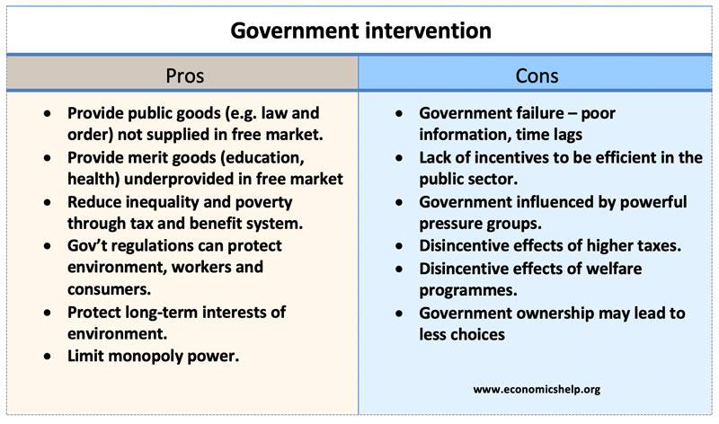

## Table of Contents

## What is a government intervention in companies?

Government intervention in companies happens when the government steps in to control or influence how businesses work. This can happen in many ways, like setting rules that companies must follow, giving money to help certain businesses grow, or even taking over a company if it's in big trouble. The main goal is often to make sure that businesses act fairly and don't harm people or the environment.

Sometimes, the government might step in to help the economy. For example, if many people are losing their jobs, the government might give money to companies to keep them running and keep people employed. Other times, the government might want to stop companies from becoming too powerful or from working together to raise prices. By doing this, the government tries to keep the market fair for everyone.

## Why do governments intervene in companies?

Governments step into companies to make sure they follow rules and treat people fairly. They want to stop businesses from doing things that could hurt people or the environment. For example, the government might make laws about how much pollution a factory can make, or they might check that companies pay their workers fairly. This helps keep everyone safe and makes sure companies don't just focus on making money without thinking about others.

Another reason is to help the economy. If a lot of people are losing their jobs, the government might give money to companies to keep them open and keep people working. They might also step in if a company is about to fail and could cause big problems for the economy. By doing this, the government tries to keep the economy stable and help people have jobs.

Sometimes, governments also want to stop companies from becoming too powerful. If a few big companies control everything, they might raise prices or treat customers badly. The government might break up big companies or stop them from working together in ways that hurt smaller businesses or consumers. This helps keep the market fair and gives everyone a chance to compete.

## What are common types of government interventions in companies?

Governments often set rules that companies must follow. These rules can be about safety, like making sure factories aren't too dangerous for workers. They can also be about the environment, like limiting how much pollution a company can make. Another common rule is about how companies treat their workers, making sure they get paid fairly and work in good conditions. These rules help keep people safe and make sure companies act responsibly.

Sometimes, governments give money to companies to help them grow or stay open. This can happen if a company is important for the economy and is struggling. By giving money, the government can save jobs and keep the economy strong. Governments might also take over a company if it's failing and could cause big problems. This is called nationalization, and it's done to protect the economy and the people who work at the company.

Governments also step in to stop companies from becoming too powerful. If a few big companies control everything, they might raise prices or treat customers badly. To prevent this, the government might break up big companies or stop them from working together in ways that hurt smaller businesses or consumers. This helps keep the market fair and gives everyone a chance to compete.

## How do government interventions impact company operations?

When the government steps in, it can change how a company works in big ways. For example, if the government makes new rules about safety or the environment, a company might have to spend more money to follow these rules. They might need to buy new equipment or change how they do things to make sure they are safe and not harming the environment. This can make things more expensive for the company, but it also helps keep everyone safe and the environment clean.

Sometimes, the government gives money to companies to help them grow or stay open. This can be good for the company because it helps them keep their workers and keep making things. But, it can also mean the company has to follow certain rules to get the money. If a company is struggling and the government takes it over, this can change everything about how the company works. The government might decide who runs the company and how it does things, which can be very different from before.

Government interventions can also stop companies from becoming too powerful. If a few big companies control everything, they might raise prices or treat customers badly. The government might break up big companies or stop them from working together in ways that hurt smaller businesses or consumers. This helps keep the market fair and gives everyone a chance to compete. It can make it harder for big companies to do whatever they want, but it's good for keeping things fair for everyone.

## What metrics are used to evaluate the effectiveness of government interventions?

To figure out if government interventions are working, people look at different numbers and signs. One big thing they check is the economy. They see if more people have jobs after the government helps companies. They also look at how much money people are making and if prices are going up or down. If the economy is doing better, it might mean the government's help is working.

Another thing they check is if companies are following the new rules. They see if factories are safer and if the air and water are cleaner. They also look at if workers are being paid fairly and treated well. If companies are doing these things better, it means the government's rules are making a difference.

Sometimes, they also look at how fair the market is. They check if big companies are still too powerful or if smaller businesses have a better chance now. If the market is more fair and everyone can compete, it shows that breaking up big companies or stopping them from working together is helping.

## Can you provide examples of successful government interventions in companies?

One good example of successful government intervention is the bailout of General Motors (GM) in 2009. The U.S. government gave GM money to help them stay open during a tough time when they were losing a lot of money. This help saved many jobs and helped the car industry get back on its feet. After the bailout, GM paid back the money and started making profits again, showing that the government's help worked.

Another example is the breakup of AT&T in 1984. The U.S. government thought AT&T was too powerful and was not letting other phone companies compete fairly. So, they made AT&T split into smaller companies. This made the phone market more competitive, which led to better services and lower prices for customers. It showed that breaking up big companies can make things better for everyone.

In the UK, the government set strict rules for the tobacco industry to reduce smoking. They made companies put big warnings on cigarette packs and banned advertising. These rules helped lower the number of people smoking, especially young people. This shows that government rules can make a big difference in public health and safety.

## What are the potential negative effects of government interventions on companies?

Sometimes, government interventions can make things harder for companies. When the government makes new rules, companies might have to spend a lot of money to follow them. For example, if they have to buy new equipment to reduce pollution or make their factories safer, it can be expensive. This can make it tough for companies, especially small ones, to stay open and make money. They might even have to let some workers go because they can't afford to pay them.

Another problem is that government help can sometimes make companies lazy. If a company knows the government will give them money when they're in trouble, they might not try as hard to fix their problems on their own. This can make them depend too much on government help, which isn't good for the long run. Also, if the government takes over a company, it can change how the company works in ways that might not be the best for making money or serving customers.

## How do government interventions vary by industry?

Government interventions can be different for each industry because each one has its own special problems and needs. For example, in the car industry, the government might give money to help big companies like General Motors stay open and save jobs. They might also make rules about how safe cars need to be and how much they can pollute. In the tobacco industry, the government might focus on making rules to stop people from smoking, like putting warnings on cigarette packs and banning ads. Each industry has different rules and help from the government because they affect people and the environment in different ways.

In the energy industry, the government might help companies that make clean energy, like solar or wind power, to fight climate change. They might give these companies money or tax breaks to help them grow. On the other hand, they might make strict rules for oil and gas companies to reduce pollution. In the banking industry, the government might step in to stop banks from taking too many risks with people's money. They might make rules about how much money banks need to keep and how they can lend it out. Each industry gets different kinds of help and rules from the government, depending on what's important for the economy, the environment, and people's safety.

## What role does economic theory play in assessing the effectiveness of government interventions?

Economic theory helps us understand how government interventions affect companies and the economy. It gives us ideas about how markets work and what happens when the government steps in. For example, economic theories like supply and demand help us see how government rules might change prices and how much stuff companies make. Theories about competition show us how breaking up big companies can help smaller ones and make things better for customers. By using these theories, we can figure out if a government intervention is working well or if it's causing problems.

When we look at government interventions, economic theory helps us measure their success. We can use things like GDP growth, unemployment rates, and inflation to see if the economy is doing better after the government steps in. Economic theories also help us understand if companies are following new rules and if those rules are making a difference. For example, if a rule makes companies pollute less, we can use economic theory to see if it's helping the environment without hurting the economy too much. By looking at these things through the lens of economic theory, we can tell if the government's actions are helping or hurting.

## How do international regulations influence government interventions in companies?

International regulations can change how governments step in with companies. These rules come from groups like the United Nations or the World Trade Organization. They make countries work together on things like protecting the environment or making sure workers are treated fairly. If a country wants to be part of these groups, they have to follow the rules. This means their government might have to make new rules for companies to follow, like limiting how much pollution they can make or making sure they pay workers enough.

Sometimes, international regulations can make things harder for companies. If a country has to follow strict rules from an international group, their companies might have to spend more money to meet these rules. This can make it tough for them to compete with companies from countries that don't have to follow the same rules. But, these regulations can also help make things fairer and safer for everyone. By working together, countries can stop companies from doing things that hurt people or the environment, no matter where they are.

## What are the long-term effects of government interventions on market competition?

Government interventions can change how companies compete in the long run. If the government breaks up big companies or stops them from working together too much, it can make the market more fair. This helps smaller companies have a better chance to grow and compete. Over time, this can lead to more choices for customers and lower prices because companies have to work harder to get people to buy their stuff. But, if the government keeps helping the same companies over and over, it might make it harder for new companies to start up. This can make the market less competitive because only a few big companies stay in control.

On the other hand, government rules about safety and the environment can also affect competition. If companies have to spend a lot of money to follow these rules, it might be harder for smaller companies to keep up. Big companies might have an easier time paying for new equipment or changing how they work. This could make it harder for smaller companies to compete. But, if all companies have to follow the same rules, it can make the market more fair in the long run. Everyone has to play by the same rules, which can help stop big companies from taking advantage of others.

## How can companies prepare for and adapt to government interventions?

Companies can get ready for government interventions by keeping an eye on what the government is doing. They should read news and reports to know about new rules that might affect them. It's also smart for companies to talk to government people and join groups that talk about these rules. By doing this, they can understand what might happen and get ready for changes. Companies can also make plans to follow new rules, like setting aside money to buy new equipment or training their workers to do things differently.

When a new rule comes, companies need to change how they work to follow it. They might need to spend money on new things or change how they make their products to be safer or less harmful to the environment. It's important for companies to be flexible and ready to try new ways of doing things. Sometimes, they might need to work with other companies or experts to figure out the best way to follow the new rules. By being ready and willing to change, companies can handle government interventions better and keep running smoothly.

## References & Further Reading

[1]: Mishkin, F. S. (2009). ["Monetary Policy Strategy."](https://www.imf.org/external/np/seminars/eng/2011/res2/pdf/fm.pdf) The MIT Press.

[2]: Brunnermeier, M. K., Crocket, A., Goodhart, C., Persaud, A. D., & Shin, H. S. (2009). ["The Fundamental Principles of Financial Regulation."](https://www.princeton.edu/~markus/research/papers/Geneva11.pdf) International Center for Monetary and Banking Studies.

[3]: Geithner, T. F. (2015). ["Stress Test: Reflections on Financial Crises."](https://www.amazon.com/Stress-Test-Reflections-Financial-Crises/dp/0804138613) Broadway Books.

[4]: [U.S. Securities and Exchange Commission. (n.d.). "SEC Rule 15c3-5."](https://www.ecfr.gov/current/title-17/chapter-II/part-240/subpart-A/subject-group-ECFR541343e5c1fa459/section-240.15c3-5) Risk Management Controls for Brokers or Dealers with Market Access.

[5]: Haldane, A. G. (2011). ["The Race to Zero."](https://www.bankofengland.co.uk/speech/2011/the-race-to-zero-speech-by-andy-haldane) Bank of England.

[6]: Dodd, R. (2007). ["Subprime: Tentacles of a Crisis."](https://papers.ssrn.com/sol3/papers.cfm?abstract_id=1652497) Council on Foreign Relations.

[7]: Aldridge, I. (2013). ["High-Frequency Trading: A Practical Guide to Algorithmic Strategies and Trading Systems."](https://www.wiley.com/en-us/High+Frequency+Trading%3A+A+Practical+Guide+to+Algorithmic+Strategies+and+Trading+Systems%2C+2nd+Edition-p-9781118343500) Wiley.

[8]: Peiris, S., & Rajan, S. (2008). ["Algorithms and the Financial Markets."](https://www.aeaweb.org/articles?id=10.1257/jep.22.3.149) Palgrave Macmillan.