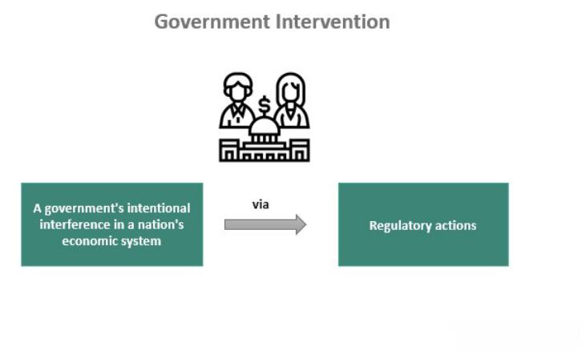

In today's complex financial landscape, government interventions and corporate assistance programs are critical tools used to stabilize economies during crises. These tools aim to shield the economy from volatility and ensure a swift recovery. Historically, government interventions have included monetary policy adjustments, fiscal stimulus packages, and regulatory reforms. Each of these measures plays a pivotal role in managing economic stability, particularly during periods of financial instability.

Algorithmic trading has concurrently emerged as a formidable force in financial markets, characterized by its rapid execution and ability to capitalize on market inefficiencies. This sophisticated trading approach uses complex algorithms to make high-frequency trades, significantly impacting market dynamics.

This article seeks to explore the complex relationship between government interventions, corporate assistance, and policy effectiveness, particularly in the context of algorithmic trading. By understanding these interactions, we can appreciate how policy decisions influence financial market operations and broader economic conditions.

We will examine past instances of government intervention, assessing their impacts on critical sectors such as finance and manufacturing. Historical examples, such as the responses to the Great Depression and the 2008 financial crisis, provide valuable insights into the effectiveness of these interventions and their long-term economic implications.

Additionally, we'll explore regulatory frameworks surrounding algorithmic trading. These regulations are essential for maintaining market stability and preventing systemic risks, ensuring that trading innovation does not compromise economic integrity.

Assessing the effectiveness of these policies in achieving their intended outcomes will yield insights into the future of financial and economic governance. This analysis is crucial for developing strategies to manage future crises effectively, underscoring the importance of transparency, regulation, and ethical practices in the increasingly complex world of financial markets.

## Table of Contents

## Understanding Government Interventions

Government interventions are crucial mechanisms employed by authorities to navigate and stabilize economies, particularly amidst financial turbulence. These strategies can manifest in various forms, each tailored to address specific economic challenges and goals.

### Forms of Government Interventions

1. **Monetary Policy Adjustments**: Central banks, such as the Federal Reserve in the United States, adjust interest rates and engage in open market operations to influence money supply and demand. Lowering interest rates typically aims to stimulate borrowing and investment, while increasing rates can help control inflation.

2. **Fiscal Policies**: Governments alter taxation and public spending to influence economic conditions. During economic downturns, increased government spending and tax cuts are often used to boost demand, a principle grounded in Keynesian economics.

3. **Bailouts**: Financial assistance is provided to ailing sectors or companies to prevent broader economic disruptions. These can restore confidence in financial markets, as evidenced by the bailouts during the 2008 Global Financial Crisis.

4. **Regulatory Changes**: Policymakers may introduce regulations to ensure market stability and protect consumers. This can include tightening lending standards or implementing oversight on financial instruments.

### Historical Examples of Interventions

**The New Deal**: During the Great Depression, U.S. President Franklin D. Roosevelt implemented the New Deal, a series of programs, public work projects, and financial reforms aimed at economic recovery. The approach combined both fiscal stimulus through direct government spending and regulatory reforms to stabilize financial markets.

**2008 Global Financial Crisis**: A more recent example is the coordinated response to the 2008 financial crisis. Governments worldwide injected liquidity into banks, guaranteed bank debts, and enacted fiscal stimuli. The U.S., for instance, launched the Troubled Asset Relief Program (TARP) to purchase toxic assets and equity from financial institutions.

### Rationale and Effects of Government Interventions

Governments intervene in markets for several reasons, often to stabilize the economy, protect jobs, and restore consumer and investor confidence. The immediate effects usually aim to reverse economic contractions, while long-term impacts focus on sustainable growth and structural reforms.

**Immediate Effects**: By injecting liquidity and lowering interest rates, interventions can halt a downward economic spiral, prevent bank runs, and stabilize currency. For example, the swift policy actions during the 2008 crisis were credited with averting a deeper recession.

**Long-term Effects**: While interventions can catalyze recovery, they may also lead to increased public debt and potential market distortions. For instance, prolonged low-interest rates can inflate asset bubbles, and large-scale bailouts might encourage risk-taking behavior among financial institutions, known as moral hazard.

### Role in Stimulating Recovery and Preventing Crises

Government interventions not only address current economic woes but also aim to lay foundations for future resilience. Well-crafted policies can stimulate recovery by:

- Enhancing **consumer spending** through tax incentives and subsidies
- Promoting **investment in infrastructure** and innovation
- **Regulating financial markets** to prevent excessive risk-taking and ensure transparency

However, the effectiveness of these interventions depends on their design, timing, and implementation. Delays or miscalculations, such as overreliance on specific sectors, can exacerbate rather than alleviate crises.

In conclusion, while government interventions are indispensable tools for managing economic stability, their successful implementation requires careful evaluation and adaptation to changing circumstances, ensuring long-term economic health and preventing future crises.

## Impact of Corporate Assistance Programs

Corporate assistance programs are government-led initiatives aimed at providing financial aid to private corporations, mitigating economic shocks and avoiding widespread economic failure. These interventions, typically deployed during periods of financial distress, often include bailouts and subsidies. Prominent examples of corporate assistance can be seen in the automotive and airline industries during times of crisis.

Notably, during the 2008 Global Financial Crisis, governments around the world engaged in significant corporate bailouts to stabilize their economies. The U.S. government's intervention was particularly significant, with the bailout of major financial institutions and companies like General Motors and Chrysler, which were on the brink of bankruptcy. This decision was taken to prevent the cascading effects on the economy that would result from these large firms collapsing, which would likely lead to massive job losses and further economic destabilization.

The effectiveness of corporate assistance programs is a matter of ongoing debate, touching upon both the immediate benefits and long-term ramifications. In the short term, these interventions can preserve jobs, stabilize markets, and prevent the collapse of vital industries, which are integral to economic recovery during a crisis. However, the ethical considerations and potential long-term market disruptions arising from such programs often spark controversy. Critics argue that bailouts can create moral hazard, where businesses take on excessive risks under the assumption that they would receive government support if they fail. This behavior could distort competitive dynamics and lead to inefficient market outcomes.

Successful corporate assistance is contingent upon several criteria. The timing and scale of the intervention are crucial; aid must be sufficient to stabilize the company without encouraging reckless behavior. Moreover, conditions often accompany such assistance to ensure that companies implement necessary reforms and governance changes. For instance, the 2008 bailouts came with demands for restructuring and improved management practices to ensure future viability and accountability.

Furthermore, the impact of these interventions extends to competition and consumer welfare in affected industries. While they can prevent monopolistic collapses that would harm consumer choice, they also raise concerns about fair competition. Subsidizing certain companies could give them an undue market advantage, potentially stifling innovation and competition from smaller firms without such support.

In conclusion, corporate assistance programs are critical tools for safeguarding economic stability. However, they necessitate a balanced approach, considering both the immediate need to avert economic catastrophes and the long-term goals of fostering competitive, sustainable markets. The lessons learned from past interventions, such as the 2008 financial bailouts, continue to shape how policymakers structure these programs, aiming to protect both economic systems and consumer welfare.

## Policy Effectiveness in Economic Interventions

Evaluating the effectiveness of economic interventions is essential to understanding their impact on an economy's well-being. The primary criteria for assessing the success of these policies include economic stability, job creation, growth in targeted sectors, and improved market confidence. By focusing on these parameters, policymakers can gauge whether strategies achieve their desired outcomes.

Economic stability is crucial as it reflects a country's ability to maintain steady growth and control inflation. Stability is often measured by examining GDP growth rates, inflation rates, and employment levels. An effective policy will foster a stable environment where businesses can thrive, and individuals can find employment. Job creation is directly linked to this stability, aiming to reduce unemployment and increase the labor force participation rate. Successful policies typically result in tangible improvements in job markets.

Growth in key sectors is another indicator of policy effectiveness. Targeted interventions in industries such as manufacturing, technology, and finance can lead to advancements that ripple through the economy. The expansion of these sectors often results in increased productivity and innovation, contributing to the overall economic health.

Improved market confidence reflects the public's trust in the economic system and its future prospects. Confidence is often measured by consumer sentiment indices and business investment levels. When economic policies succeed, they typically instill a sense of reliability, prompting both individuals and businesses to invest and spend more freely.

However, unintended consequences can undermine these goals. Moral hazard, where entities take on riskier behaviors expecting government bailouts, can become a significant issue. Inflation may rise if policies inject too much [liquidity](/wiki/liquidity-risk-premium) into the economy. Moreover, market dependencies can develop, where sectors rely too heavily on continuous intervention, stifling competition and innovation.

Learning from past interventions, policymakers can draw insights from case studies of both successes and failures. Effective interventions, such as the fiscal stimulus employed during the 2008 financial crisis, demonstrate the importance of timely and well-targeted approaches. Conversely, ineffective measures highlight pitfalls, such as delays in response or misallocation of resources.

Timeliness and targeting are crucial in policy implementation. Quick action often reduces the severity of an economic downturn, while targeted measures ensure resources reach the most affected areas. Continuous monitoring and adaptation are also vital, as they allow for policy adjustments in response to changing conditions, avoiding prolonged negative impacts or unintended outcomes.

Policymakers must carefully balance these considerations to craft interventions that not only address current economic challenges but also lay the groundwork for sustainable long-term growth. Understanding and improving the efficacy of economic policies will remain central to navigating future economic uncertainties and technological advancements.

## Algorithmic Trading and Market Interventions

Algorithmic trading, characterized by the use of automated strategies and high-frequency trades, has profoundly impacted financial markets by increasing the speed and efficiency of order execution. The development of advanced algorithms has enabled traders to analyze vast datasets and execute trades in mere milliseconds, leading to a paradigm shift in how financial markets operate.

The significant influence of [algorithmic trading](/wiki/algorithmic-trading) has prompted the development of regulatory frameworks aimed at overseeing its functions and averting systemic risks that could arise from its use. In the United States, the Securities and Exchange Commission (SEC) and the Commodity Futures Trading Commission (CFTC) have implemented a range of regulations. These include the requirement for algorithmic traders to register and maintain detailed logs of their trades. Moreover, the deployment of Risk Control Frameworks ensures that algorithmic trading does not contribute to market instability.

In the United Kingdom, regulatory oversight is primarily conducted by the Financial Conduct Authority (FCA), which emphasizes transparency and the management of risks associated with algorithmic trading. The UK's regulatory framework mandates firms to implement appropriate testing of algorithms and maintain comprehensive records, ensuring accountability and the ability to trace algorithmic decisions.

The European Union has established the MiFID II (Markets in Financial Instruments Directive II) framework, which introduces stringent requirements on algorithmic trading firms, including the need for pre-trade and post-trade transparency, as well as risk control measures. MiFID II places a strong emphasis on preventing market abuse and ensuring market integrity, requiring trading firms to submit algorithmic trading strategies for regulatory approval.

One effective tool implemented by regulators to address the rapid market movements characteristic of algorithmic trading is the introduction of circuit breakers. These mechanisms act as temporary halts in trading when extreme [volatility](/wiki/volatility-trading-strategies) is detected, thereby preventing market crashes and providing a cooling-off period for traders and regulators to assess the situation. Circuit breakers are seen as essential in curbing potential market disruptions that can arise from algorithmic trading.

Navigating the balance between fostering innovation and imposing regulation in algorithmic trading is a delicate task for regulators. On one hand, technological advancements in algorithmic trading contribute to enhanced market efficiency and liquidity. On the other hand, inadequate regulation or oversight can lead to significant risks, including flash crashes and market manipulation.

Understanding the role of algorithmic trading in modern markets requires an appreciation of the regulatory environment that governs it. Effective regulation strives to mitigate risks while allowing for technological advancements that improve market operations. Going forward, continuous collaboration between regulators, trading firms, and technology developers will be essential to ensure that algorithmic trading serves its intended purpose without compromising market integrity.

## Conclusion and Future Outlook

Government interventions and corporate assistance programs are indispensable in ensuring economic stability and assisting recovery efforts during periods of financial distress. Their significance, however, necessitates careful and strategic crafting to avoid unintended consequences and to achieve enduring benefits. As recent instances of economic turbulence have shown, poorly designed interventions can lead to moral hazards, market inefficiencies, and ultimately, greater economic instability in the long-run.

Algorithmic trading highlights the dual challenge of harnessing technological advancements while preserving market integrity and stability. The rise of automated trading systems calls for a regulatory environment that not only promotes innovation but also guards against systemic risks and potential market abuses. Balancing these aspects requires comprehensive policies that address both the technological and ethical dimensions of trading practices.

Looking ahead, future policy directions should emphasize enhancing transparency in financial markets. This involves setting clear rules for algorithmic trading, ensuring market participants adhere to ethical standards, and implementing robust monitoring systems. For instance, regulatory measures like mandatory algorithm audits and real-time monitoring could be effective in mitigating risks.

Additionally, the enforcement of regulations should be coupled with promoting a culture of ethical trading practice. Educating market participants about the broader impacts of their strategies on market stability can foster a more responsible trading environment. Embedding ethics into the financial industry curriculum could be one approach to achieving this objective.

Continuous evaluation of the effectiveness of economic interventions is crucial for sustaining resilient economies, especially amidst rapid technological progress. This involves not only assessing the direct outcomes of specific policies but also understanding their long-term implications on market structures and economic health. Employing advanced data analytics and [machine learning](/wiki/machine-learning) techniques can enhance the accuracy and granularity of policy impact assessments.

In conclusion, while government interventions and corporate assistance programs have proven their essential roles in economic stabilization, their future success will largely depend on thoughtful design and execution. This, combined with a forward-looking approach to regulation and ethical considerations in algorithmic trading, will be key to navigating the complexities of modern financial systems and ensuring sustainable economic growth.

## References & Further Reading

[1]: Mishkin, F. S. (2009). ["Monetary Policy Strategy."](https://www.imf.org/external/np/seminars/eng/2011/res2/pdf/fm.pdf) The MIT Press.

[2]: Brunnermeier, M. K., Crocket, A., Goodhart, C., Persaud, A. D., & Shin, H. S. (2009). ["The Fundamental Principles of Financial Regulation."](https://www.princeton.edu/~markus/research/papers/Geneva11.pdf) International Center for Monetary and Banking Studies.

[3]: Geithner, T. F. (2015). ["Stress Test: Reflections on Financial Crises."](https://www.amazon.com/Stress-Test-Reflections-Financial-Crises/dp/0804138613) Broadway Books.

[4]: [U.S. Securities and Exchange Commission. (n.d.). "SEC Rule 15c3-5."](https://www.ecfr.gov/current/title-17/chapter-II/part-240/subpart-A/subject-group-ECFR541343e5c1fa459/section-240.15c3-5) Risk Management Controls for Brokers or Dealers with Market Access.

[5]: Haldane, A. G. (2011). ["The Race to Zero."](https://www.bankofengland.co.uk/speech/2011/the-race-to-zero-speech-by-andy-haldane) Bank of England.

[6]: Dodd, R. (2007). ["Subprime: Tentacles of a Crisis."](https://papers.ssrn.com/sol3/papers.cfm?abstract_id=1652497) Council on Foreign Relations.

[7]: Aldridge, I. (2013). ["High-Frequency Trading: A Practical Guide to Algorithmic Strategies and Trading Systems."](https://www.wiley.com/en-us/High+Frequency+Trading%3A+A+Practical+Guide+to+Algorithmic+Strategies+and+Trading+Systems%2C+2nd+Edition-p-9781118343500) Wiley.

[8]: Peiris, S., & Rajan, S. (2008). ["Algorithms and the Financial Markets."](https://www.aeaweb.org/articles?id=10.1257/jep.22.3.149) Palgrave Macmillan.