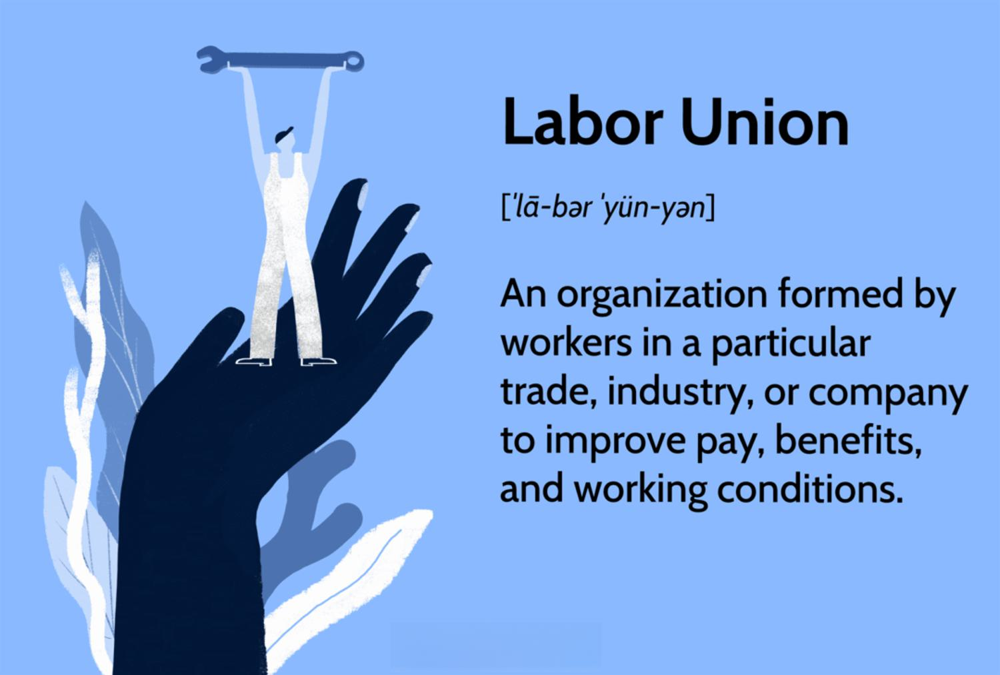

The landscape of workers' rights is undergoing a significant transformation as traditional labor unions face new challenges brought on by advancements in technology. At the forefront of these technological changes are algorithmic trading and automation, which are increasingly playing pivotal roles in reshaping workplace dynamics and impacting the effectiveness of unions. These developments pose complex questions about the traditional modes of union operations and their ability to protect worker rights in an era characterized by digital management systems. 

Historically, labor unions have been instrumental in advocating for workers' rights. With roots tracing back to the Industrial Revolution, unions emerged as powerful entities capable of negotiating for improved wages, working conditions, and benefits on behalf of their members. Despite their longstanding influence, unions are now confronted with emerging challenges that demand innovative strategies to maintain their relevance. As technological advancements continue to pervade industries worldwide, unions must navigate the intricacies of algorithmic management that often prioritize efficiency over worker welfare.

This article aims to explore the complexities surrounding labor unions' effectiveness in safeguarding worker rights amidst the rise of algorithmic management and trading. We will examine the historical context of unions, the current challenges they face, and the opportunities for improving their impact in our rapidly changing economy. In doing so, we aim to provide a comprehensive overview of how unions can continue to be a formidable force for securing fair labor practices and promoting worker welfare in the digital age. Understanding these dynamics is crucial for establishing equitable labor standards that benefit both employees and employers in the modern workforce.

## Table of Contents

## Historical Role of Labor Unions

Labor unions have played a pivotal role in the protection and advancement of workers' rights since their emergence, predominantly marked by their rise during the Industrial Revolution. This period, characterized by extraordinary advancements in manufacturing and technology, also witnessed extreme working conditions that sparked the need for organized labor movements. Workers faced long hours, low wages, and unsafe environments, prompting the formation of unions to collectively bargain for improved conditions and protections.

Historically, unions have successfully negotiated for a range of benefits that have become standard in many workplaces today. This includes the establishment of fair wages that align with the cost of living, thereby ensuring economic security for workers. Unions have been instrumental in reducing excessive working hours and implementing standards for safe working conditions, mitigating the risks associated with industrial work. Additionally, they have secured benefits such as healthcare, retirement plans, and paid vacations, enhancing overall quality of life for their members.

A key victory of labor unions in history has been their role in abolishing child labor. In advocating for minimum age laws and compulsory education, unions helped to shift the societal norms that previously allowed children to be employed in dangerous and exploitative conditions. Their advocacy led to legislative changes that prioritized education and safety over child labor.

Despite these successes, union membership has experienced a decline in recent decades, particularly in sectors that have evolved due to globalization and technological advancements. However, this decline does not equate to obsolescence. Unions remain potent forces within various industries, retaining the ability to influence labor standards and policies. Sectors such as public education, healthcare, and transportation still witness strong union presence and impact, as these areas grapple with challenges that make collective representation essential.

In conclusion, the historical significance of labor unions is evident through their enduring impact on workplace regulations and standards. While changing economic landscapes present challenges, the legacy of unions in championing workers' rights remains a testament to their crucial role in shaping equitable labor environments.

## Union Effectiveness in Advancing Worker Rights

Labor unions have long served as influential entities in advocating for worker rights through collective bargaining, a process by which unions negotiate with employers to secure advantageous conditions for their members. This collective approach often translates into higher wages and improved benefits, a claim supported by a significant body of research. According to studies, union members typically enjoy higher average earnings compared to their non-unionized counterparts. In particular, the U.S. Bureau of Labor Statistics reported that in 2020, unionized workers had median weekly earnings of $1,144, compared to $958 for non-union workers, signifying a 19% wage premium often attributed to union negotiations (Bureau of Labor Statistics, 2021).

Unions also play a critical role in setting industry standards that often benefit the broader labor market, including non-union workers. By establishing benchmarks for wages, working conditions, and employee benefits, unions can create ripple effects that improve job standards across the industry. This influence can be seen in sectors such as construction and healthcare, where union-negotiated agreements have led to higher safety standards and comprehensive health benefits that are not limited solely to unionized employees.

The COVID-19 pandemic, coupled with shifting economic landscapes, has spurred a resurgence of interest in union membership, particularly among younger workers. This trend can be attributed to several factors, including heightened job insecurity, deteriorating workplace conditions, and increased awareness of workers' rights. Younger generations, more attuned to social justice issues and the gig economy's challenges, see unionization as a viable pathway to enhance job security and advocate for better working environments.

Recent surveys indicate that there is growing support for unions among millennials and Gen Z workers, reflecting a shift in attitudes towards organized labor. This demographic change represents a potential opportunity for unions to expand their reach and reinforce their relevance in the modern economy, as they harness the enthusiasm of younger members to drive forward new initiatives for worker advocacy.

Statistics and anecdotes from various industries illustrate unions' ongoing impact and underscore their potential to shape a fairer labor market in an age where work dynamics are rapidly changing. By continuing to secure favorable conditions through negotiation and collective actions, labor unions remain essential components in advancing worker rights and fostering equitable labor practices.

## Challenges Facing Labor Unions Today

Labor unions today face a myriad of challenges that impact their ability to effectively represent and protect workers. One significant issue is the perception that union contracts produce inflexibility within the labor market. These contracts often include stringent job security measures, which can make it difficult for employers to dismiss employees who are underperforming. This rigidity can limit an organization's ability to adapt to changing market demands and can potentially hinder overall productivity.

Global competition coupled with rapid technological advancements has put additional pressure on unionized industries. As companies strive to remain competitive, they often resort to outsourcing or shifting production to countries with lower labor costs and fewer regulations, reducing the influence of labor unions in developed nations. The push towards automation and the utilization of advanced technologies can render certain jobs obsolete, challenging unions to protect the roles of workers in sectors susceptible to these changes.

Moreover, unions continue to confront skepticism stemming from historical instances of corruption and mismanagement. Past corruption cases have led to diminished trust among workers and the public, which can weaken a union's influence and effectiveness. Ensuring transparency and accountability within union operations is crucial to maintaining their credibility.

The advent of algorithmically-driven workplace management systems also poses new challenges. These systems can optimize workforce deployment and productivity, but they can also lead to an impersonal and opaque work environment. Decisions traditionally made by human managers, such as shift assignments, performance evaluations, and even termination decisions, are increasingly being guided by algorithms. This transition exacerbates concerns over biases inherent in algorithmic systems, which can perpetuate inequalities or discrimination in the workplace. Labor unions are thus tasked with advocating for algorithmic transparency and fairness, ensuring that workers' rights are safeguarded in environments dominated by digital decision-making systems.

Overall, the ability of labor unions to navigate these complex challenges is essential for sustaining their role as protectors of worker rights in an ever-evolving economic landscape.

## Algorithmic Trading and Automation: Impacts on Labor

Algorithmic trading and automation are transforming the landscape of various industries by introducing efficiencies and presenting new challenges. The integration of automated systems in workplaces can lead to significant improvements in speed and accuracy but also raises concerns regarding job security and employment conditions. Workers often express apprehensions that algorithm-driven decision-making could result in unfair practices, including wrongful terminations or biased performance evaluations.

Trade unions are increasingly recognizing the importance of monitoring and influencing the deployment of algorithmic systems to safeguard worker interests. Unions are striving to ensure transparency and accountability in automated decision-making processes. This involves advocating for clear criteria and documentation on how algorithms assess performance and make employment-related decisions. To achieve this, unions are collaborating with technologists and policymakers to establish standards that protect workers' rights while allowing businesses to innovate.

Efforts to empower workers in the face of automation are gaining [momentum](/wiki/momentum). Unions are working towards developing guidelines and tools that can help workers better understand and interact with automated systems. For instance, educational programs are being designed to equip workers with the skills necessary to navigate an increasingly automated environment. Furthermore, unions are advocating for the inclusion of human oversight in algorithmic processes to mitigate risks associated with fully autonomous systems.

These initiatives reflect a proactive approach by trade unions to adapt to the evolving work environment. By focusing on transparency, accountability, and worker empowerment, unions aim to balance the benefits of technological advancement with the protection of fair labor standards. As [algorithmic trading](/wiki/algorithmic-trading) and automation continue to shape workplaces, the role of unions in ensuring ethical usage and equitable treatment becomes increasingly vital.

## Opportunities for Unions in the Digital Age

In the digital age, labor unions have the opportunity to harness digital tools to enhance their organizational capacity and improve communication with their members. The integration of technology into union activities can facilitate real-time dialogue, disseminate important information swiftly, and ensure a more engaged membership base. Digital platforms such as mobile applications and social media can serve as powerful instruments for maintaining robust connections between union leaders and members, enabling quick mobilization and participatory decision-making processes.

Engagement with technological advancements is crucial for unions to remain relevant and effective. By actively participating in technological discourse, unions can ensure they are at the forefront of advocating for workers' interests in a rapidly evolving digital landscape. This proactive engagement involves understanding new technologies, advocating for the ethical deployment of automation and [artificial intelligence](/wiki/ai-artificial-intelligence) (AI), and addressing the implications these technologies have on employment conditions. By doing so, unions can position themselves as essential stakeholders in discussions around technology policy and workplace automation.

Promoting transparency and ethical guidelines in the use of technology is another avenue through which unions can exert influence. Unions can champion the development and implementation of ethical standards that govern the use of algorithms and AI in the workplace, ensuring that these technologies are used to augment human work rather than replace it indiscriminately. They can advocate for algorithms that are transparent and accountable, with clear mechanisms to address any biases or unfair labor practices that may arise.

Furthermore, unions can benefit from inter-union collaborations, which can facilitate the sharing of effective strategies and best practices across different industries. These collaborations can lead to a unified approach to common challenges faced due to technological advancements, fostering a collective bargaining power that is greater than the sum of its parts. By pooling resources and expertise, unions can better navigate the complexities of the digital economy and sustain their influence across sectors.

By embracing these opportunities, labor unions can not only adapt to the challenges posed by technological changes but also strengthen their roles as advocates for workers' rights. Through strategic implementation of digital tools and proactive engagement with new technologies, unions can continue to be pivotal in shaping fair labor practices in the modern economy.

## Conclusion

Labor unions remain pivotal in safeguarding and enhancing worker rights, a role that retains significance even amid rapid technological and global shifts. These organizations have historically been instrumental in negotiating better wages, benefits, and working conditions for their members. However, the landscape they operate in is changing, presenting both challenges and opportunities for adaptation and growth.

Technological advancements, particularly algorithmic management and automation, pose complex challenges to traditional labor structures. These technologies can undermine job security and alter working conditions without transparent and accountable mechanisms in place. However, unions can leverage these very advancements to enhance their organizational capacity and influence. By embracing digital tools for better communication and coordination, unions can increase member engagement and optimize their advocacy efforts.

Moreover, unions have the opportunity to champion the ethical use of technology in workplaces. By working collaboratively with other unions and industry stakeholders, they can establish guidelines that ensure technology enhances, rather than diminishes, worker welfare. This involves promoting transparency and setting standards that regulate the integration of technology into labor processes.

Engaging with technological evolution also involves developing new strategies tailored to modern economic realities. For example, unions might focus on sectors where digital platforms and gig work are prevalent, ensuring that these workers receive comparable protections and benefits as those in more traditional sectors. By doing so, they can broaden their influence and relevance in today's diverse labor market.

Ultimately, maintaining fair labor standards is vital for both employees and employers in today's economy. Workers benefit from security and improved conditions, while employers enjoy a motivated and stable workforce. Labor unions, by adapting to present challenges and proactively engaging with new opportunities, can continue to fulfill this critical role, ensuring equitable labor practices in the modern workplace.

## References & Further Reading

[1]: Bureau of Labor Statistics. (2021). ["Union Members Summary."](https://www.bls.gov/news.release/union2.nr0.htm) U.S. Department of Labor.

[2]: Lopez, S.H., & Lichtenstein, N. (2020). ["How Labor Slowly Rebuilt Its Power."](https://www.ncbi.nlm.nih.gov/pmc/articles/PMC7135284/) Dissent, 67(4), 110-120.

[3]: Korinek, A., & Stiglitz, J.E. (2017). ["Artificial Intelligence and Its Implications for Income Distribution and Unemployment."](https://www.nber.org/papers/w24174) National Bureau of Economic Research Working Paper No. 24174.

[4]: Frey, C. B., & Osborne, M. A. (2017). ["The future of employment: How susceptible are jobs to computerisation?"](https://www.sciencedirect.com/science/article/pii/S0040162516302244) Technological forecasting and social change, 114, 254-280.

[5]: Brynjolfsson, E., & McAfee, A. (2014). ["The Second Machine Age: Work, Progress, and Prosperity in a Time of Brilliant Technologies."](https://psycnet.apa.org/record/2014-07087-000) W. W. Norton & Company.