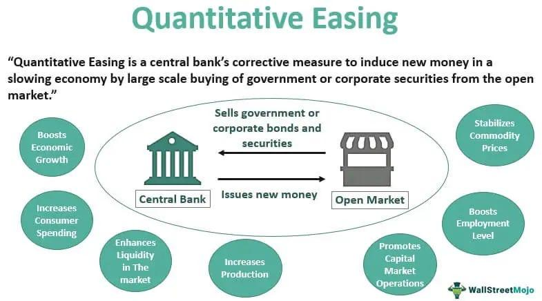

## Table of Contents

## What is quantitative easing?

Quantitative easing is a tool used by central banks to help boost the economy when traditional methods aren't working well. It involves the central bank creating new money electronically and using it to buy financial assets, like government bonds, from banks and other financial institutions. This process increases the amount of money in the economy and aims to encourage spending and investment.

When central banks buy these assets, it can lower interest rates because there's more money available for lending. Lower interest rates make it cheaper for people and businesses to borrow money, which can lead to more spending on things like homes, cars, and business expansions. This increased spending can help stimulate economic growth and reduce unemployment.

## How does quantitative easing work?

Quantitative easing is a way for central banks to help the economy when things are not going well. They do this by making new money on a computer and using it to buy things like government bonds from banks. This puts more money into the economy. The idea is to get people and businesses to spend and invest more.

When the central bank buys these bonds, it can make interest rates go down. Lower interest rates mean it's cheaper for people to borrow money. If borrowing is cheaper, people might take out loans to buy houses or cars, and businesses might borrow to grow. This can help the economy grow and create more jobs.

## What are the goals of quantitative easing?

The main goal of quantitative easing is to help the economy grow when it's not doing well. When traditional ways of boosting the economy, like lowering interest rates, don't work, central banks use quantitative easing. They create new money and buy financial assets, like government bonds, to put more money into the economy. This extra money can help businesses and people spend and invest more, which can lead to more jobs and a stronger economy.

Another goal is to keep prices from falling too much, which is called deflation. When prices fall, people might wait to buy things, hoping they'll be even cheaper later. This can slow down the economy. By putting more money into the economy, quantitative easing can help keep prices stable and prevent deflation. This stability can make people feel more confident about spending and investing, which is good for the economy.

## When was quantitative easing first used?

Quantitative easing was first used by the Bank of Japan in 2001. They did this because their economy was not growing well, and they wanted to help it. The Bank of Japan started buying government bonds to put more money into the economy. This was a new way to help the economy when usual methods were not working.

The idea of quantitative easing spread to other countries later. The United States used it for the first time in 2008, during the financial crisis. The Federal Reserve, which is the U.S. central bank, started buying bonds to help the economy. Other countries like the United Kingdom and the European Union also used quantitative easing in the years that followed.

## What are the immediate effects of quantitative easing on the economy?

When a central bank starts using quantitative easing, one of the first things that happens is that more money gets into the economy. This happens because the central bank buys things like government bonds from banks and other places. With more money around, banks can lend more easily to people and businesses. This can make interest rates go down, which means it's cheaper for people to borrow money for things like buying a house or starting a business.

The immediate effect of lower interest rates is that people and businesses might decide to spend and invest more. When people feel like it's a good time to spend money, they might buy things they've been waiting for, like a new car or a home. Businesses might borrow money to grow or hire more workers. All this extra spending and investing can help the economy start to grow faster right away.

## How does quantitative easing affect inflation?

Quantitative easing can affect inflation by putting more money into the economy. When the central bank buys things like government bonds, it gives banks more money to lend. This extra money can make people and businesses spend more, which can push prices up. If there's too much money chasing the same amount of goods and services, prices can rise, leading to inflation.

But the effect on inflation isn't always clear right away. Sometimes, even with more money in the economy, prices might not go up much if people are still not spending a lot. This can happen if people are worried about the future and decide to save their money instead of spending it. So, while quantitative easing can lead to higher inflation over time, it depends on how people and businesses react to having more money to spend.

## What are the long-term impacts of quantitative easing on economic growth?

Quantitative easing can help the economy grow in the long run by making more money available for people and businesses to spend and invest. When the central bank buys things like government bonds, it gives banks more money to lend. This can make interest rates stay low for a long time, which means it's cheaper for people to borrow money to buy homes, cars, or start businesses. If more people and businesses are spending and investing, it can lead to more jobs and a stronger economy over time.

But there can also be some problems with quantitative easing in the long run. If there's too much money in the economy, it can make prices go up a lot, which is called inflation. If inflation gets too high, it can make it hard for people to afford things, and it can slow down the economy. Also, if people get used to low interest rates, they might take on too much debt, thinking it will always be cheap to borrow. This can be risky if interest rates go up later, because it might be harder for people to pay back what they owe. So, while quantitative easing can help the economy grow, it's important for central banks to watch out for these long-term risks.

## Can quantitative easing lead to asset bubbles?

Yes, quantitative easing can lead to asset bubbles. When central banks put more money into the economy, it can make interest rates go down. This means it's cheaper for people to borrow money. With more money to spend, people might start buying things like houses or stocks. If a lot of people are buying the same thing, the price can go up a lot. If prices go up too fast and too high, it can create an asset bubble, where the price of something is much higher than it should be.

If an asset bubble gets too big, it can be dangerous for the economy. When people realize the price is too high, they might start selling, which can make the price drop fast. This can hurt people who bought the asset at a high price, and it can also make the whole economy slow down. So, while quantitative easing can help the economy, it's important for central banks to be careful and watch for signs of asset bubbles.

## How does quantitative easing influence interest rates?

When a central bank uses quantitative easing, it makes more money available in the economy. This happens because the central bank buys things like government bonds from banks. When banks have more money, they can lend more easily to people and businesses. This extra money can make interest rates go down. Lower interest rates mean it's cheaper for people to borrow money for things like buying a house or starting a business.

Lower interest rates can also affect other kinds of interest rates, like those on savings accounts or bonds. When interest rates are low, people might not want to keep their money in savings accounts because they won't earn much. Instead, they might look for other ways to use their money, like investing in stocks or buying things they've been wanting. This can help the economy grow, but it's important for central banks to watch out for problems like too much borrowing or asset bubbles.

## What are the potential risks and drawbacks of quantitative easing?

One big risk of quantitative easing is that it can lead to too much inflation. When the central bank puts more money into the economy, it can make prices go up a lot. If prices keep going up, it can make it hard for people to afford things they need. This can slow down the economy and make people unhappy. Another problem is that if people get used to low interest rates, they might borrow too much money. If interest rates go up later, it can be hard for people to pay back what they owe, and this can cause problems.

Quantitative easing can also lead to asset bubbles. When people have more money to spend because of low interest rates, they might start buying things like houses or stocks. If a lot of people are buying the same thing, the price can go up too fast and get too high. If the bubble bursts, it can hurt people who bought the asset at a high price and make the whole economy slow down. So, while quantitative easing can help the economy, it's important for central banks to be careful and watch out for these risks.

## How does quantitative easing differ from other monetary policy tools?

Quantitative easing is different from other monetary policy tools because it involves creating new money to buy financial assets like government bonds. Other tools, like changing interest rates, don't create new money. When a central bank changes interest rates, it's trying to make borrowing more or less expensive. If they lower interest rates, it's cheaper to borrow, which can help the economy grow. If they raise interest rates, it's more expensive to borrow, which can slow down the economy to keep inflation in check.

Another way quantitative easing is different is that it's used when other tools aren't working well. Sometimes, even if interest rates are already very low, the economy might still need help. That's when central banks might use quantitative easing to put more money into the economy. This can help when the usual ways of helping the economy aren't enough. So, while other tools focus on adjusting interest rates, quantitative easing directly adds money to the economy to encourage spending and investment.

## What empirical evidence exists on the effectiveness of quantitative easing in different economies?

There's a lot of research about how well quantitative easing works in different countries. In the United States, studies show that the Federal Reserve's quantitative easing programs helped a lot during the 2008 financial crisis. They made interest rates go down and got people and businesses to spend more, which helped the economy grow. In the United Kingdom, the Bank of England's use of quantitative easing also seemed to help. It made borrowing cheaper and encouraged more spending, which helped the economy recover.

In Japan, where quantitative easing was first used, the results have been mixed. Some studies say it helped a little by keeping interest rates low and making it easier for businesses to borrow. But it didn't fix all the problems with the economy, like slow growth and low inflation. In the European Union, the European Central Bank's quantitative easing program also had some success. It helped lower interest rates and made it easier for countries with struggling economies to borrow money. But like in Japan, it didn't solve all the economic problems. Overall, quantitative easing can help, but it's not a perfect solution and works differently in different places.

## References & Further Reading

[1]: Bernanke, B. S., & Reinhart, V. R. (2004). ["Conducting Monetary Policy at Very Low Short-Term Interest Rates."](https://www.aeaweb.org/articles?id=10.1257/0002828041302118) The American Economic Review, 94(2), 85-90.

[2]: Gagnon, J., Raskin, M., Remache, J., & Sack, B. (2011). ["The Financial Market Effects of the Federal Reserve’s Large-Scale Asset Purchases."](https://www.ijcb.org/journal/ijcb11q1a1.pdf) International Journal of Central Banking, 7, 3-43.

[3]: Haldane, A. G. (2015). ["Stuck: Inertia, Incentives, and Human Behaviour."](https://www.bankofengland.co.uk/-/media/boe/files/speech/2015/stuck) Speech given at the Federal Reserve Bank of Kansas City Economic Policy Symposium, Jackson Hole, Wyoming.

[4]: Narang, R. K. (2009). ["Inside the Black Box: The Simple Truth About Quantitative Trading."](https://onlinelibrary.wiley.com/doi/book/10.1002/9781118267738) Wiley.

[5]: Aldridge, I. (2013). ["High-Frequency Trading: A Practical Guide to Algorithmic Strategies and Trading Systems."](https://www.amazon.com/High-Frequency-Trading-Practical-Algorithmic-Strategies/dp/1118343506) Wiley.

[6]: Borio, C., & Disyatat, P. (2009). ["Unconventional Monetary Policies: An Appraisal."](https://www.bis.org/publ/work292.htm) BIS Working Papers, No 292, Bank for International Settlements.