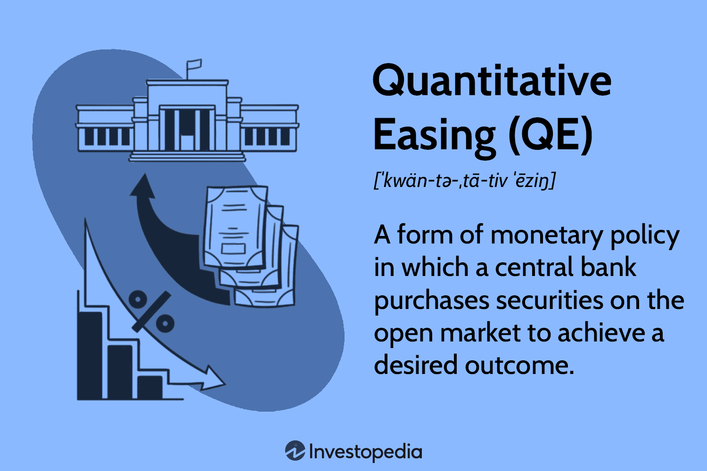

The economic landscape is influenced by numerous factors, with monetary policy playing a pivotal role in shaping financial systems. This article examines the relationships between monetary policy, quantitative easing (QE), and algorithmic trading. These elements are crucial in understanding their collective impact on global economies and financial markets, making them essential knowledge for investors, policymakers, and anyone interested in economics.

Monetary policy, implemented by central banks, involves the use of tools like interest rates to regulate the money supply, with goals such as controlling inflation and stabilizing the economy. It serves as a foundation for understanding economic trends and growth prospects. Quantitative easing, an extension of monetary policy, is a technique used when traditional methods become insufficient. It involves the large-scale purchase of financial assets to inject liquidity into the economy, aiming to boost investment and spending.



Algorithmic trading represents a technological advancement in the financial sector. It involves the use of computer algorithms to automatically make and execute trading decisions, enhancing the speed and efficiency of transactions. This technology has revolutionized how markets operate, but also introduces concerns regarding market volatility and fairness.

Understanding the interactions between these components is vital for predicting economic shifts and designing effective policies. As the article progresses, definitions, applications, and the impacts of these factors will be explored in detail, offering a thorough overview of their significance in contemporary economics.

## Table of Contents

## Understanding Monetary Policy

Monetary policy refers to the strategic actions undertaken by a nation's central bank to regulate the money supply, thereby influencing economic growth and stability. It plays a pivotal role in achieving macroeconomic objectives, with the primary focus on controlling inflation, managing employment levels, and stabilizing currency exchange rates. Through the manipulation of interest rates and various monetary tools, central banks attempt to navigate complex economic landscapes.

Interest rates, a fundamental component of monetary policy, are adjusted to either encourage spending and investment or to temper economic overheating. When a central bank lowers interest rates, borrowing becomes less expensive, which can stimulate economic activity. Conversely, raising interest rates generally aims to curb excessive spending and bring down inflation. This delicate balance requires constant monitoring and adjustment to align with the overarching economic goals.

Central banks also utilize open market operations, which involve the buying and selling of government securities to expand or contract the amount of money in the banking system. For instance, purchasing securities injects [liquidity](/wiki/liquidity-risk-premium) into the financial system, promoting lending and investment.

Key players in global monetary policy include major central banks such as the Federal Reserve (Fed) in the United States, the European Central Bank (ECB), and the Bank of England (BoE). The decisions made by these institutions have far-reaching implications, not only within their national borders but also globally, given the interconnected nature of modern economies. Each central bank operates within its unique economic context, yet they share common objectives of sustainable economic growth, price stability, and employment maximization.

In recent years, unconventional monetary policy measures, such as quantitative easing, have been employed when traditional tools reach their limits, particularly during economic downturns. These measures further illustrate the evolving role of central banks in navigating complex and dynamic economic environments.

## Quantitative Easing: An Economic Stimulus

Quantitative easing (QE) is an unconventional monetary policy implemented by central banks to stimulate economic activity when traditional monetary policies, such as lowering interest rates, become ineffective. QE involves the purchase of long-term securities, such as government bonds and sometimes other financial assets, to increase the money supply in the economy. By doing so, central banks aim to lower interest rates on these securities, which encourages banks to lend more readily and increases the cash flow available for businesses and consumers to invest and spend.

In practice, QE has been widely used by several major economies. The U.S. Federal Reserve notably adopted QE following the financial crisis of 2008, purchasing large amounts of mortgage-backed securities and U.S. Treasuries to bolster financial markets and promote economic recovery. Similarly, the Bank of England undertook QE to support the U.K. economy amid global downturns. In Japan, the Bank of Japan has repeatedly used QE as a tool to combat decades of deflationary pressures and stagnation.

While QE can be effective in providing the necessary stimulus to avoid deflation and promote economic recovery, it is not without its criticisms and potential drawbacks. One significant concern is the potential for inflation. By significantly increasing the money supply, QE could lead to higher prices over time if not carefully managed. However, this risk has been less pronounced in recent years, as many economies have remained below their inflation targets despite extensive QE efforts.

Another concern surrounding QE is the creation of asset bubbles. With lower interest rates, investors might seek higher returns in riskier assets, leading to inflated asset prices. This can distort market dynamics and may have long-term repercussions if these bubbles burst.

Despite these challenges, QE remains an essential tool in the central bank toolkit, particularly when traditional methods are exhausted. Its implementation requires careful monitoring and adjustment to balance economic stimulation with the risks of inflation and financial instability. As such, QE continues to be a topic of analysis and debate among economists and policymakers globally.

## Algorithmic Trading: Technology in Finance

Algorithmic trading, often referred to as "algo trading," employs computer algorithms to automate trading decisions and execute orders with minimal human intervention. These trading algorithms analyze vast datasets at speeds and frequencies unattainable by human traders. Typically, algo trading involves high-frequency trading ([HFT](/wiki/high-frequency-trading-strategies)), which can process numerous trades in fractions of a second. The efficiency and speed of [algorithmic trading](/wiki/algorithmic-trading) have revolutionized global financial markets, contributing to increased trading volumes and enhanced liquidity.

One significant advantage of algorithmic trading is its ability to identify patterns and trends in market data. By employing techniques such as statistical [arbitrage](/wiki/arbitrage) or exploiting time-series analysis, algorithms can detect market inefficiencies and capitalize on arbitrage opportunities. For instance, algorithms can employ [machine learning](/wiki/machine-learning) techniques to refine trading strategies based on historical data, adapting them to changing market conditions.

```python
# Example of a simple algorithmic trading strategy using a moving average crossover

import pandas as pd

# Load market data
data = pd.read_csv('market_data.csv')

# Calculate moving averages
data['short_mavg'] = data['close'].rolling(window=40, min_periods=1).mean()
data['long_mavg'] = data['close'].rolling(window=100, min_periods=1).mean()

# Signal generation
data['signal'] = 0
data.loc[data['short_mavg'] > data['long_mavg'], 'signal'] = 1
data.loc[data['short_mavg'] <= data['long_mavg'], 'signal'] = -1

print(data[['close', 'short_mavg', 'long_mavg', 'signal']])
```

Despite the benefits, the rise of algorithmic trading introduces several challenges. One of the primary concerns is market [volatility](/wiki/volatility-trading-strategies). The speed and [volume](/wiki/volume-trading-strategy) of trades executed by algorithms can lead to increased short-term market fluctuations. This was notably highlighted during the Flash Crash of 2010 when the U.S. stock market experienced a sudden, severe drop within minutes, partially attributed to high-frequency trading activities.

Moreover, fairness is a significant issue in markets dominated by algo trading. Many believe that firms with advanced technological infrastructure gain an undue advantage over traditional traders, leading to an uneven playing field. Additionally, complex algorithms can obfuscate market transparency, making it challenging for regulators to monitor and ensure fair trading practices.

In conclusion, while algorithmic trading brings improved efficiency and liquidity to financial markets, it necessitates stringent oversight to mitigate risks associated with market volatility and unfair trading practices. Technology advances continuously reshape this sector, making it an essential focus area for regulators and market participants alike.

## The Economic Impact of QE and Algo Trading

Quantitative easing (QE) and algorithmic trading are pivotal forces in shaping financial markets and the broader global economy. QE is a strategy employed by central banks to lower interest rates and boost economic growth by purchasing securities, thereby increasing the money supply. This policy aims to make borrowing cheaper, which can stimulate spending and investment. By contrast, algorithmic trading leverages computer algorithms to execute trades with speed and precision. This method enhances market liquidity and promotes efficiency by analyzing vast datasets to identify trading opportunities.

The interaction between QE and algorithmic trading can significantly amplify market movements. For instance, the increased liquidity and lower interest rates fostered by QE create an environment where algorithmic trading can thrive. Algorithms respond quickly to changes in market conditions, which can magnify the impact of central bank policies on stock prices, bond yields, and other financial instruments.

The influence of these tools on financial markets extends beyond immediate price adjustments. For economists and policymakers, understanding the dynamics between QE and algorithmic trading is crucial for predicting economic trends. The interplay between these elements can lead to shifts in investor behavior, affecting asset allocation and capital flows. This, in turn, has implications for monetary policy and economic stability.

When QE is implemented, the anticipation of reduced interest rates can lead algorithms to execute trades that capitalize on expected movements in asset prices. These trading activities can accentuate market trends, contributing to sharper increases or decreases in asset values. Consequently, this feedback loop—where QE influences market liquidity and efficiency, which in turn affect market reactions—poses unique challenges for economic forecasting and policy decisions.

In summary, QE and algorithmic trading are integral to the modern financial ecosystem. They not only affect financial markets individually but also interact to create complex economic patterns. Their combined impact necessitates a nuanced understanding to effectively navigate the interconnected global economic landscape.

## Challenges and Criticisms

While quantitative easing (QE) and algorithmic trading have become integral components of modern financial systems, their application presents several challenges and criticisms that merit careful analysis.

Quantitative easing, as a policy tool, is designed to inject liquidity into the economy to stimulate growth during periods of economic stagnation. However, its implementation can be fraught with risks, particularly with the potential for inflation. As central banks purchase large amounts of securities, particularly government bonds, the increased money supply can lead to upward pressure on prices if not carefully monitored. This inflationary pressure is especially concerning if QE is prolonged or not effectively scaled back as economic conditions improve. The central challenge is ensuring that the [exit](/wiki/exit-strategy) strategies from QE do not destabilize financial markets or the real economy. 

Moreover, QE’s impact on asset prices often benefits those with significant investments, potentially exacerbating wealth inequality. As asset prices rise, the wealth created is disproportionately allocated to investors and financial institutions, thus widening the gap between the affluent and the economically disadvantaged.

Algorithmic trading, on the other hand, has transformed market operations by enabling rapid, data-driven trading decisions. Despite its benefits in enhancing market efficiency and liquidity, algorithmic trading can amplify market volatility, notably during "flash crashes." These are abrupt, severe market downturns where prices plummet and recover in quick succession, often triggered by algorithms responding to minor market changes or incorrect signals. The speed and automation that characterize algo trading mean that human traders are often too slow to react, raising concerns about fairness and stability in financial markets.

Critics further contend that both QE and algorithmic trading contribute to a disconnect between financial markets and the underlying real economy. While financial markets may exhibit strong performance, these tools can sometimes obscure the actual economic health, which might be marked by unemployment or stagnant wages, leading to an imbalanced economic outlook.

Policymakers and regulators are increasingly tasked with finding a balance between utilizing these powerful tools and mitigating their potential risks. While QE remains an essential mechanism in the central bank arsenal, there is a growing emphasis on developing robust frameworks to ensure that the inflationary pressures and wealth distribution effects are managed effectively. Similarly, ongoing dialogues about enhancing transparency in algorithmic trading aim to alleviate concerns surrounding market fairness and volatility. Regulatory interventions, such as circuit breakers and trade monitoring, are continuously explored to safeguard market integrity and stability. 

In summary, while QE and algorithmic trading have profoundly influenced the financial landscape, their challenges underscore the necessity for vigilant oversight and adaptive regulatory strategies to ensure they serve broader economic objectives.

## The Future of Monetary Policy and Financial Markets

The future of monetary policy and financial markets is poised to integrate traditional methods with cutting-edge innovations, offering a unique blend of strategies that can enhance economic stability and market efficiency. As technology rapidly evolves, algorithmic trading is expected to advance significantly. This development may introduce both opportunities and new risks for market participants. Algorithmic trading, which relies on sophisticated algorithms to automate trading decisions, will likely become more refined, processing greater volumes of data with increased speed and precision. This could enhance market liquidity, reduce transaction costs, and improve price discovery, but it also raises potential challenges related to market volatility and regulatory oversight.

Central banks, traditionally reliant on [interest rate](/wiki/interest-rate-trading-strategies) adjustments and asset purchases to influence macroeconomic conditions, may refine existing quantitative easing (QE) strategies or innovate new tools. As QE has been central in countering economic downturns, its future iterations could involve more targeted asset purchases or coordination with fiscal policy measures to amplify its effectiveness. Developing digital currencies, such as central bank digital currencies (CBDCs), is an example of how central banks might leverage technology to manage economic stability and control money supply more precisely.

The dialogue between policy, technology, and economics will be crucial in shaping the trajectory of global financial systems. As policymakers and financial institutions navigate this dynamic landscape, they must balance innovation with stability, ensuring that regulatory frameworks evolve in tandem with technological advancements. This interaction could lead to the establishment of new standards and best practices that bolster market resilience.

Additionally, as financial technology evolves, there is potential for increased inclusivity in financial markets. Technology can democratize access to financial services, reducing barriers for individuals and smaller entities to participate in the global economy. However, this democratization must be accompanied by adequate safeguards to protect against systemic risks and ensure equitable outcomes.

In summary, the intersection of traditional monetary policy, innovative financial technologies, and adaptive regulatory frameworks will define the future landscape of monetary policy and financial markets, necessitating ongoing collaboration and adaptation among all stakeholders involved.

## Conclusion

The interconnected nature of monetary policy, quantitative easing (QE), and algorithmic trading highlights the complexity inherent in modern economies. These instruments, while immensely powerful, necessitate meticulous consideration and management to maximize their benefits and minimize adverse effects. Understanding their intricacies empowers stakeholders, including investors and policymakers, to make informed decisions within an ever-evolving economic landscape.

Monetary policy, through central bank interventions, aims to maintain economic stability and growth. However, the unpredictable global economic environment requires constant adaptation and reevaluation of traditional methods. Quantitative easing, as an unconventional tool, expands the scope of monetary policy, offering solutions when standard measures fall short. Yet, it is not without risks. If improperly monitored, QE can potentially lead to inflationary pressures and asset bubbles, necessitating judicious application and timely withdrawal.

Algorithmic trading introduces further complexity by transforming market dynamics. Its ability to process vast datasets and execute trades at unprecedented speeds enhances market efficiency and liquidity. However, it also raises concerns about increased market volatility and the fairness of trading practices. The potential for algorithmic trading to amplify rapid market movements calls for robust regulations to mitigate associated risks.

As the landscape of monetary policy and financial markets continues to evolve, continuous analysis and adaptation are vital. Stakeholders must engage in proactive monitoring and policy innovation to harness these tools effectively. By advancing the dialogue between policy frameworks, technological advances, and economic strategies, the design of future financial systems can be both resilient and responsive to global changes.

Ultimately, the strategic use of monetary policy, quantitative easing, and algorithmic trading requires a delicate balance. By acknowledging their complexities and interdependencies, stakeholders can craft approaches that not only stabilize and spur economic growth but also anticipate and counter potential disruptions. This balanced approach is crucial for optimizing the benefits of these economic tools in a rapidly changing world.

## References & Further Reading

[1]: Bernanke, B. S., & Reinhart, V. R. (2004). ["Conducting Monetary Policy at Very Low Short-Term Interest Rates."](https://www.aeaweb.org/articles?id=10.1257/0002828041302118) The American Economic Review, 94(2), 85-90.

[2]: Gagnon, J., Raskin, M., Remache, J., & Sack, B. (2011). ["The Financial Market Effects of the Federal Reserve’s Large-Scale Asset Purchases."](https://www.ijcb.org/journal/ijcb11q1a1.pdf) International Journal of Central Banking, 7, 3-43.

[3]: Haldane, A. G. (2015). ["Stuck: Inertia, Incentives, and Human Behaviour."](https://www.bankofengland.co.uk/-/media/boe/files/speech/2015/stuck) Speech given at the Federal Reserve Bank of Kansas City Economic Policy Symposium, Jackson Hole, Wyoming.

[4]: Narang, R. K. (2009). ["Inside the Black Box: The Simple Truth About Quantitative Trading."](https://onlinelibrary.wiley.com/doi/book/10.1002/9781118267738) Wiley.

[5]: Aldridge, I. (2013). ["High-Frequency Trading: A Practical Guide to Algorithmic Strategies and Trading Systems."](https://www.amazon.com/High-Frequency-Trading-Practical-Algorithmic-Strategies/dp/1118343506) Wiley.

[6]: Borio, C., & Disyatat, P. (2009). ["Unconventional Monetary Policies: An Appraisal."](https://www.bis.org/publ/work292.htm) BIS Working Papers, No 292, Bank for International Settlements.